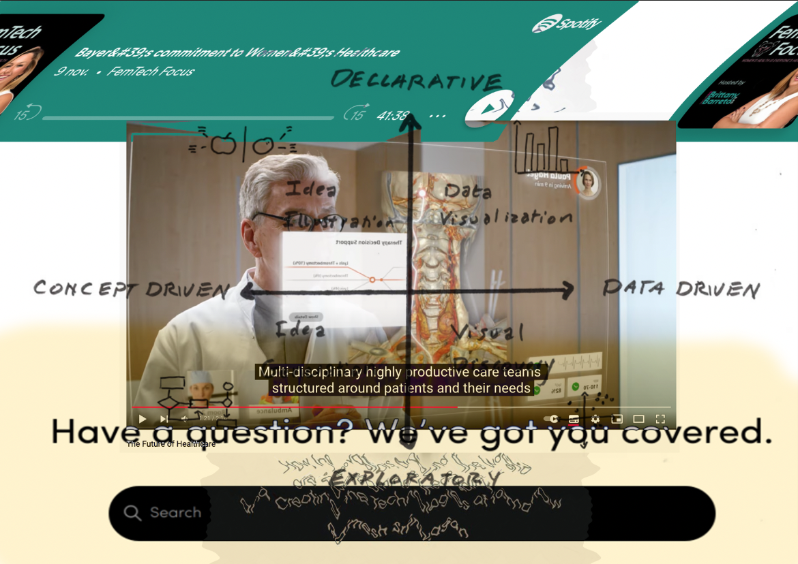
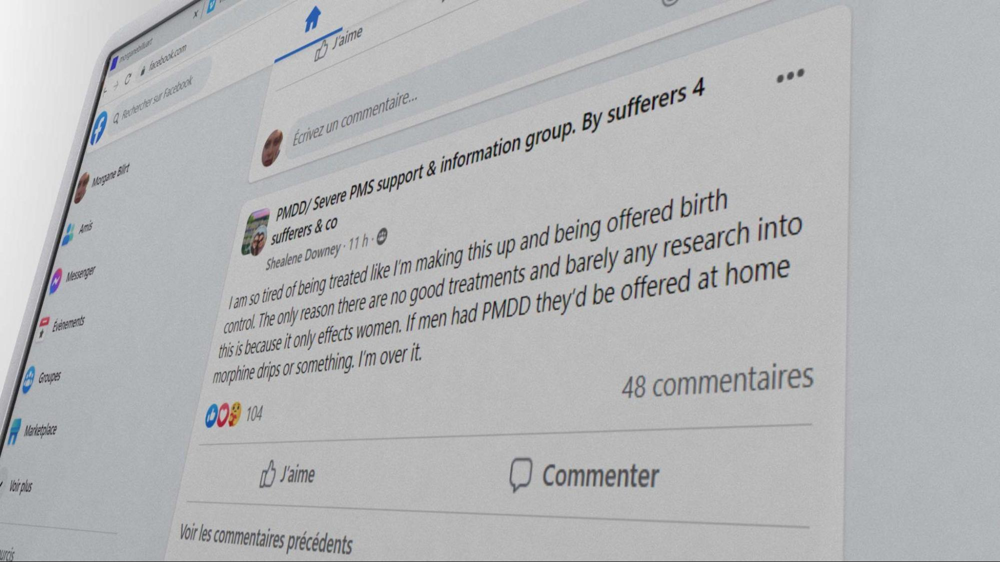
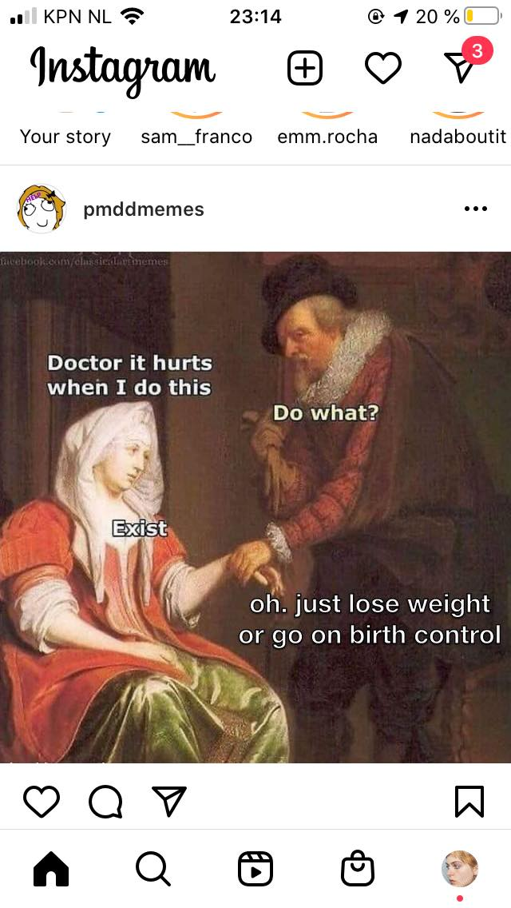
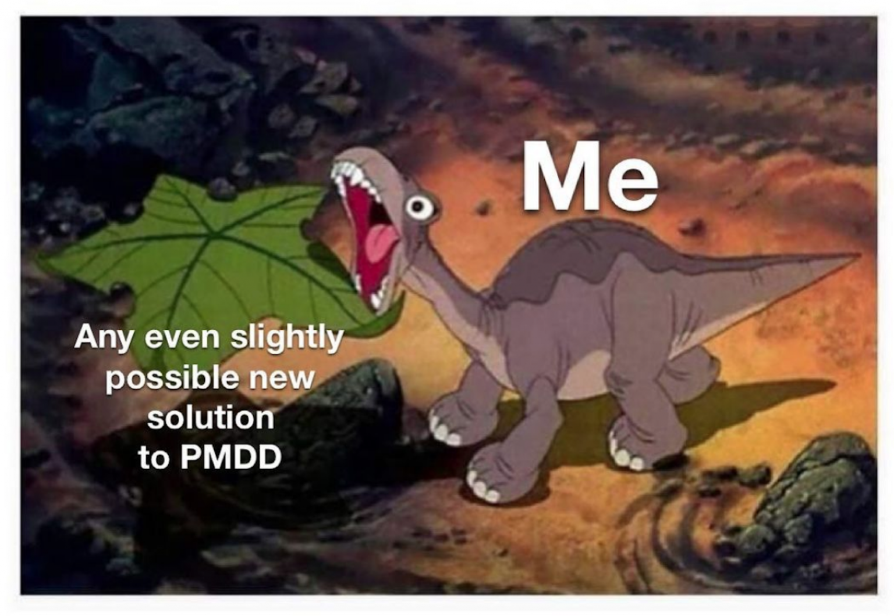

---
Pr-id: MoneyLab
P-id: INC Reader
A-id: 10
Type: article
Book-type: anthology
Anthology item: article
Item-id: unique no.
Article-title: title of the article
Article-status: accepted
Author: name(s) of author(s)
Author-email:   corresponding address
Author-bio:  about the author
Abstract:   short description of the article (100 words)
Keywords:   50 keywords for search and indexing
Rights: CC BY-NC 4.0
...

#Cycles: the Sacred and the Doomed, On Optimization, PMDD and its Metaphors.

##Morgane Billuart

###Originally published on December 13th, 2021

 

> We must know whether we want to change the world to experience it with
> the same sensorial system like the one we already possess, or whether
> we’d rather modify our body, the somatic filter through which it
> passes.
>
> Testo Junkie, Paul Preciado[^09chapter6_1]

###Day 15 - The Number One Enemy

I woke up earlier than Juli. It’s day 15. The fog is slowly appearing
around me. I don’t see it, but I feel and hear it. It is this silent
cynical voice within my head telling me that every attempt is worthless.
It is the slowly escalating anxiety rushing through my veins when I
start focusing on what could go wrong. The sun’s rays are piercing
through the mosquito net. Juli is still sleeping.

How do people do it? How can they do it?

The image of my parents rises in my head; the stupid idea of their
monogamy and the concept of sleeping in the same bed every night. I
remember thinking that doing something else would be the ultimate proof
of being unloved. This thought on endless continuity and consistency
feels like a weight, a terrible pressure. I sense it pouring all over
me, laying in bed, covered by a light blanket and the sleeping arms of
Juli.

In her book *Illness as a Metaphor*, Susan Sontag investigates the
cultural and aesthetic representations of disease in society. She
explains how they are often displayed as images and meanings, instead of
being seen as what they fundamentally are: a burden and a condition to
be treated.

When I started researching Premenstrual Dysphoric Disorder, I read the
list of symptoms first, to see what the condition entailed and to see
how a diagnosis would be made. It was a surprise and a relief when I
realized that the diagnosis was not purely a scientific one, but rather
an empirical one. Still, I wondered, how does one treat a condition as a
disease, when it is, in essence, seen as a fundamental component of our
lives? How to approach an experience that has been understood and
studied for so long as an unavoidable and fatal component of our
bodies?

Before it was even categorized as a disease, PMDD existed as a metaphor.
Nowadays, it is the symbol of our bodies’ treatment and the prejudices
around it. More than a disease, it is the result of our limited
understanding of the influence of hormones on our body, psyche, and our
social life. PMDD is the impact on how one’s body is reflected in
society. It is only once we understand the role that this metaphor
plays, and how it limits the possibilities for treatment, that we can
understand what is at stake behind the acknowledgment of such
conditions.

Irritability, Nervousness, Lack of control, Agitation, Anger, Insomnia,
Difficulty in concentrating, Depression, Severe fatigue, Anxiety,
Confusion, Forgetfulness, Poor self-image, Paranoia, Emotional
sensitivity, Crying spells, Moodiness, Trouble sleeping, Abdominal
cramps, Bloating, Constipation, Nausea, Vomiting, Pelvic heaviness or
pressure, Backache, Decreased coordination, Painful menstruation,
Diminished sex drive, Appetite changes, Food cravings, Hot flashes.

One of the first questions that come to mind when reading this list is
“Whose menstruating bodies do not suffer from those symptoms?”. Surely,
the severity of those and their frequency may vary from one individual
to another. PMDD is a floating cloud that englobes an entire field of
*dysfunctional* behavior and physical *incapabilities*. If you
menstruate and feel terrible two weeks out of four, it’s quite likely
that you have this condition too. It is difficult to diagnose and treat
it, specifically because the symptoms can be so diverse. As far as
scientific knowledge goes, it is generally understood as a dysfunctional
reaction of the body from the changes of hormones throughout the month.
These symptoms usually disappear at the beginning of each cycle, when
menstruation starts.

It is complex to study PMDD as a real condition because it regroups all
of the symptoms that, individually, can be dealt with, but as a whole,
can make it impossible for any human being to function[^09chapter6_2]. It is too
complex to understand the severity of the problem in a society where
menstruating bodies have been conditioned to think that pain is normal,
and that menstruating is a curse that we have to learn how to deal with
in silence. A body suffering from this condition can hardly express its
feeling to a society that has digested that it is a normal narrative to
suffer when you’ve been cursed and born with a uterus for centuries. The
data collected demonstrated that 20% of menstruating bodies deal with
PMDD; approximately 600 000 000 bodies[^09chapter6_3]. PMDD is a fluctuation that,
perhaps, one could deal with if we existed in a society that did not
value endless efficiency or competition If we lived in a world that did
not see our uteruses as constantly available objects, if fair rates in
the working environment were a thing and if generic medicine tried to
look into the causes and not the symptoms. PMDD is one of the many
diseases which is not understood (yet) because there's no interest, no
lobby (yet). It is one more phenomenon, one demonstration that our world
and systems have not been designed by other than men.

Those who suffer from this condition are moralized not only by the
medical field but also by the people surrounding them. Perhaps their
mental confusion is understood as hysteria, their low libido is seen as
a lack of love, and their frigidity is a mystery. Perhaps their
fluctuations are seen as bipolarity and their emotional unsustainability
as craziness. There should be no confusion about the fact that PMDD is a
condition, a disease, and a dysfunction. Like for many other diseases,
its effects are highly enhanced by its unrecognition, by the absence of
knowledge on the subject, and by its confrontation with society’s norms.
While it is still hard to know and tell where the condition comes from,
what triggers, and what exacerbates it, using PMDD as a metaphoric
condition enables a lens to look into the technologies of menstruating
bodies and the advancements designed for them.

Over the course of the past century, enormous breakthroughs and progress
have been made in the research field of menstruating bodies and female
conditions. The era of the mystery of blood and burnt witches is,
thankfully, is long gone. Although this does not mean that the gender
bias in medicine and in research has been resolved. The majority of
studies look into conditions from a male perspective and generally,
women’s studies remain poorly funded. Luckily, multiple books about
menstruation and female reproductive organs are currently being
published and the knowledge produced on these matters is ever-expanding.
As we now have the chance to look into the depth of, the history of and
functioning of our bodies, we are presently given the chance to better
understand the mechanisms of power and oppression behind this
technological progression.

##The Insufficient Technology of the Body

Menstruating bodies and technologies have an ambiguous relationship.
Firstly, the ability to be fertile and give life remains one of the
biggest possibilities of our existence. Menstruation, the absence of
menstruation, as well as the many fluctuations coming throughout our
cycle, are technologies that enable us to be aware of the self and of
our environment. This very specific aspect of our bodies is a
fundamentally political tool, and because of that exact same reason, we
have been offered many assets, pills, supplements and devices, under the
concept of progress, to help our bodies function better.

As a human-lived technology, the body fluctuates and sometimes does not
offer the best living experiences. Not all menstruating bodies
menstruate or have a regular cycle. Not all of them ovulate or can
conceive. Some struggle with intense pain, some never experience
pleasure. To live with your biological condition does not mean living a
better life. The technology of our bodies can sometimes affect various
areas of life in quite unpleasant ways. In regards to female bodies,
recent progress and discoveries have offered the possibility to offer us
advancements and technologies to overcome pain, obstacles, failures, and
many other conditions.

For the body's Accessibility, we’ve been given birth control. For the
body's Reproductivity, FIV. For the body’s Longevity, hormones
replacement. Body’s Mental Instability, SSR. Body’s Fluctuations,
Health/Menstruating Apps… this list goes on and on.

While these technologies used to bring along a lot of enthusiasm in
female and menstruating communities, perceived as tools for emancipation
and freedom, they are now questioned and put in perspective with
ethical, political, and ecological implications.

These rising communities, mainly perceived online, emphasize their
indignations in regards to the consequences of these technologies and
the remarks are generally about the lack of knowledge on the causes or
implications of certain the conditions. This is particularly the case of
communities of individuals suffering from Polycystic Ovarian Syndrome or
Premenstrual Dysphoric Syndrome. Although these two illnesses are very
much different, they both reflect a similar issue; the body suffers from
its own technology, and to which the solutions provided are quite often
not adequate. As a result of their feeling of being misunderstood, these
communities meet and exchange their knowledge on alternative digital
platforms.

 

Yes, science and generic medicine offered more comfort than pain in our
lives. Although it would be too easy to pretend that the technological
advances in the last century were only liberating and emancipating. By
moving away from our biological conditionings, perhaps we were freeing
the body from deterministic features and political constraints, however,
the menstrual and medical revolution that we are now facing seems to
demonstrate more complex dynamics. With or without the pill, with or
without these conditions, our bodies are gradually realizing that the
environments in which we evolve are not, by definition, designed for us.
A problem that neither the pill, anti-depressants, nor this false
political promise can hide anymore.

If these conditions are indeed a representation of our failed
technology, recent studies which looked into the hormonal and social
roots of PMS, universally known or experienced as premenstrual syndrome,
demonstrated that its symptoms are highly impacted by the social
environment one exists in. Researchers investigated how its effects
changed depending on the social environment, demonstrating how
menstruating bodies, when failing to be super-efficient and adequate,
often failed into self-pathologization:

*“When women were able to be alone, they reported that their
premenstrual symptoms were reduced; the ‘PMS’ effectively disappeared,
and they felt ‘better’. However, many of the women we interviewed never
took time out for themselves in the whole month, and spent little time
engaged in leisure activities, focusing instead on the needs of others,
common to women who present with ‘PMS’ clinically .”*[^09chapter6_4]

These perspectives on the subject matter invite us to wonder: what is
it that makes these bodies inadequate in the first place? What is the
reference we’re looking into to determine how one should function? While
the conditions we mentioned earlier (PCOS, PMDD, and others) are often
grounded in physical and hormonal dysfunction, they seem to offer us a
critical lens to look into how our technological bodies are perceived
and function, what assets and advancements are being offered to us, and
if these new technologies help menstruating bodies feeling better and
heal within society at all.

In her thesis, The Genesis of Premenstrual Syndrome, Bianca Zietal
reinforces the idea of PMS as a social construct by illustrating “how
the concept of PMS was developed and informed by the discovery of
hormones and the resulting field of endocrinology that provided a
framework for conceptualizing PMS.”[^09chapter6_5] The researcher expands her
theory and demonstrates that the metaphor of PMS illustrates its
unrecognition: “This variety of uses suggests that popular culture
understands PMS as something that makes for a good joke or serves to
explain a negative change in a woman’s behavior. However, relatively few
people know that PMS has an official place as a medical diagnosis.” It
is specifically because we have integrated that mood swings, pain, or
mental disability are a fundamental component of menstruating bodies'
life so well, that, as a result, this universally known disabling
phenomenon isn’t still properly addressed and taken seriously. By
limiting the urgency and despair in those experiences, those bodies’
needs are repressed and they repress themselves in return.

Science alone won’t help us. To only call out hormones and biological
dysfunction for being the entire cause of our displacement would be to
refuse to see how societal constructs still play a big role in this
issue. Through the lens of the condition of Premenstrual Dysphoric
Disorder, manifesting as an intense collection of PMS, we can ask, how
this condition can help us reconfigure the technologies of our bodies
and question the way that they are being taken care of in society? More
than a chemical or hormonal imbalance, isn’t PMDD a metaphor for our
body’s inadequacy? Could it also be the externalization of our
incapacity to fit in the design of ideal efficiency, in the template of
society at all?

Contemporary literature addressing the topics of women and mental
illnesses is scarce. It is often written by women themselves, who, based
on their own understanding and experience of their bodies and minds
within society, started to ask questions. In her book, The Madness of
Women: Myth and Experience, Jane Ussher expands on how her mother’s
condition drove her to study psychology and investigates the dynamic of
the pathologization of women’s dysfunctionality. In this book, Ussher
makes the following statement: “In an official announcement nearly half
of all American's experience a psychiatric disorder. Does that mean no
one is normal? Or do we live in such a crazy-making, sick, impersonal
society that it does serious psychological damage to half of us? Should
we be calling women the mentally ill or society's wounded?”[^09chapter6_6] While
this realization is a question that could be applied to a broad range of
conditions and diseases, it is specifically urgent to look into how the
criteria and expectations of our cultures can lead to the aggravation of
those.

##Upgraded and Updated: on Hormone Replacement and Alleviation

 

As previously mentioned, it is difficult and tedious to diagnose PMDD.
Even though the condition seems to have been named for more than 20
years, institutes and research in its regard remain succinct. As a
result, the production of knowledge and treatments are scarce and often
reductive. PMDD being a disease with hormonal and psychological impacts,
two fields of action are proposed. First: the pill, in order to suppress
hormonal fluctuations and consequently, these impacts on the body, or
second: anti-depressants, in order to alleviate the mental burden of the
condition in everyday life. While these treatments might help some
individuals and bodies by lessening the symptoms generated by the
condition, it does not seem to change anything in regard to the urgency
of the topic, as well as lack of knowledge around it. While our bodies
are being offered pills and assets to cope with such conditions and what
society made of them, there exists a risk of these conditions being
under looked, perhaps even remaining unstudied.

In the article *Fake periods, side effects, and other things you need to
know about the pill* naturopath Lara Briden explains how the number of
solutions given to those bodies reflects the scope of knowledge around
it. “At the moment, the pill is one of the only women’s health
treatments available to doctors,” Briden says. “So, of course, they have
no choice but to prescribe it for all manner of period problems.”[^09chapter6_7] It
would not be the first moment in history that these bodies and the
technology within are dismissed, put aside rather than questioned and
supported. Therefore, it is urgent and necessary to wonder what will
happen to our bodies and to these conditions if they remain hidden,
unspoken. Are they veiled by the designed cure? What are the
technologies proposed, and what are the implications behind these
choices?

###Day 14 - Memories of Diane 35

The perfect cycle’s length is 28 days. So are the number of these pills
that I had to swallow. They say ovulation happens two weeks before
menstruation, therefore, I should be ovulating by now. I used to feel it
more intensely before. I noticed in the past how my behavior changed
around that time. The texture of my discharges. The smell of my body.
The look I give to men. Ovulation is, primitively, the key moment where
one should conceive to have a higher chance to reproduce. My body knows
that by now, but it was not always the case.

Summer 2016. I got prescribed Diane 35 to deal with skin problems and
non-existent periods. I am pretty sure that my body is trying to tell me
something, but I am 19 years old and I have no time to wait for my skin
to be perfect and my cycle to function. These are early teens, or
elderly’s people problems, not mine.

I remember walking in the street of Sicily with A. He gets mad because
men look at me as if I was an object. Am I not? Diane 35 cleared my
skin, made my boobs grow enormous and my hair grew thicker. It’s all I
ever wanted, all of this potential in a small, ridiculously tiny
package. I am youth and elasticity in a box. I can decide or not if I
want to bleed, by the simple act of renewing my pills every month. I am
ready to be used, consumed, taken, and everyone around me senses that.
The utopia of my body and this relationship with A does not last very
long: I soon realize that the pill cuts off my appetite, my desire, and
my libido. I suddenly become this desirable object which can’t be
consumed.

A and I seemed to exist in perfect disharmony, a body hooked on natural
testosterone, another one sedated on artificial estrogens. I hate how
cliche it sounds and how grounded it feels. I now see our
dysfunctionality clearer. Being on Diane35 is similar to getting a free
ticket to the buffet when you just lost your taste or appetite. A
luxurious hotel without a swimming pool. A reminder that it is
impossible to win at everything in life.

As for many other conditions, an interesting dilemma operates between
the researchers in the healthcare field and the ones who experience the
condition. Is it not the perfect timing to either, create a technology
that would completely free us from our biological conditioning and its
complications, or on the contrary enable us to connect to the core issue
and fundamentals of our bodies and their functioning by rejecting
technology? Although these two separate movements do have a correlated
goal (to emancipate) they seem to look into two separated notions of
technology. The first one belongs within, is more ancestral, holistic,
and so-called “natural”, while the other one bets on technological
assets and medical advancements to free us from the condition. While
these two battles and research fields are worth looking into, it is
necessary to emphasize a third question that needs to be examined and
criticized: the effect that the environment and its design around us
have on us.

In the article of the Atlantic, Why to Menstruate If You Don't Have To?,
journalist Marion Renault illustrates the dilemma which operates in a
society where many menstruating bodies would rather not experience the
bleed of their biological body. While the reasons for such choices are
sometimes linked to intense or unbearable pain, body dysphoria, or the
lack of access to product/resources for menstruation, it is also
emphasized that the underlying need and desire is to be optimal and
functioning, or rather, compete better with other individuals which are
not menstruating. “*I want them to be competitive against those who
don’t have uteruses,*” Yen said. “*Teenage years are so turbulent and
horrific as is. I don’t want them to suffer unnecessarily—and I can
alleviate this for my child.*”[^09chapter6_8] This thought exists or has probably
existed in many of our minds. It is a valid and understandable idea,
given the conditions in which our bodies evolve. A society where the
conditions related to our reproductive systems are little or poorly
studied and where paid leaves due to pain or disability are extremely
rare. Not to menstruate, and therefore to not have these conditions, is
the newest efficiency dream. It is an idyll because, in this space, our
body would not be limited by its biological condition and is not judged
for it. A world where we could be functional, optimal and where our body
would not be an obstacle to our activities and ambitions. But who sold
us this dream? Why should we be optimal, and for whom?

In these artificial attempts to cure and hide, nothing more is being
investigated. Coming back to the testimony of Lara Briden in the article
Fake periods, side effects, and other things you need to know about the
pill, the naturopath unpacks how “*Pill bleeds are pharmaceutically
induced bleeds … to reassure you that your body is doing something
natural,*” says Briden. “*Many doctors continue to prescribe birth
control to ‘normalize periods’ and ‘regulate hormones’, as though the
pill’s steroids are somehow equal to, or better than, your own hormones.
The fact is, nothing could be further than the truth. Pill steroids are
not better than your hormones. They’re not even real hormones.*”[^09chapter6_9] So,
is that it? Will we resolve these conditions and treatments by simply
eradicating and replacing natural hormones? Is that all we know? When
looking at these artificial technologies of emancipation and
transformation, we observe how they simulate the real, the biological,
as to convince the “naturality” of their essence. As if our distinction
with “nature” and the choices of some individuals to alter their biology
wasn’t accepted yet. But it’s already there.

In regards to the second-most administered treatment offered to PMDD
sufferers, SSRIs, the positive results of these medications seem to
underline the psychological and mental consequences of the condition.
While the body seems to correctly react to the presence of estrogen, the
main hormone-induced within the first two weeks of each month,
progesterone, arriving right after ovulation, seems to be the culprit of
the sudden change in mood, embodiment, and perception.

 

While the studies of PMDD and its impact on mental and social life were
rendered public forty years ago[^09chapter6_10], it does appear that the medical
field still has not targeted the exact cause of the sensitivity of what
aggravates it. As a result, to this day, SSRIs are the main and only
option offered to patients and it should be emphasized that it has shown
great results. Still, as for PMS, PMDD is the result of a change that
operates hormonally and chemically, therefore its experience and
perception are also highly emphasized by the environment in which one
finds themselves. If it is indeed hard for an individual to sense their
body and mind changing so drastically within such a short period of
time, this experience might as well be aggravated by the social pressure
which women and menstruating bodies have suffered from for centuries. If
SSRIs can help one’s mental capacities and soften their experience, it
does demonstrate that the mental burden of those conditions is
consequent. If those treatments can ease one’s experience of their body,
we should not forget to question what the changes are which need to
happen within society for those bodies not to feel sick and oppressed in
the first place.

In her book, *The Madness of Women: Myth and Experience*, Ussher expands
her question to a broader range of conditions attributed to female and
menstruating bodies: “*I thus turn my gaze onto three other
manifestations of madness ascribed to significant proportions of the
female population: borderline personality disorder (BPD), post-traumatic
stress disorder (PTSD), and premenstrual dysphoric disorder (PMDD).
While my arguments can be generalized to other \`female maladies' (such
as anorexia or anxiety disorders), these three psychiatric disorders are
ideal examples of the pathologization of women's reasonable response to
restricted and repressive lives*”[^09chapter6_11]. I insist throughout this text on
the necessity to understand the social component of these issues because
a greater design of technology and cures should not only hide or
disguise the external reality of the patient but also aim to change and
redefine the context in which one exists.

Although it is also emphasized that PMDD can be inherited, studies
demonstrate the correlation of discrimination, poverty, pressures to
assimilate, etc with the appearance of PMDD or its aggravation[^09chapter6_12]. It
would be tempting, although hypocritical, not to see a direct link
between these conditions and the standards of society in the era of
capitalism, in between society’s mechanism, patriarchy, and psychiatry.
While PMS and PMDD are now universally known and understood as limiting
and hurtful conditions, their existence as metaphors has not stopped
existing. In their everyday life, menstruating bodies might still try
their best to perform and hide their physical or psychological pain, as
a way to counteract the cliche and stigmas which accompany women and
anger. Those hide their day-to-day experience as a way not to be
discriminated against. Not to be judged. While many fights for these
conditions’ visibility and the importance of its study field, it is
still a vigorous battle to claim the recognition of the incapacity to
perform and live optimally in society.

In 2002, almost twenty years ago, Joan C Chrisler and Paula Caplan
published *The strange case of Dr. Jekyll and Ms. Hyde: How PMS became a
cultural phenomenon and a psychiatric disorder.* In this paper, they
both investigate how and if social context influenced PMS, and what were
the solutions given to those who were highly suffering from the
condition. As a result of their findings, they conclude:

> “It is certainly easier to take medication to restore serenity or
> create emotional detachment (an often reported effect of
> Prozac/Sarafem) than it is to take steps to make changes in one’s life
> circumstances, and women are getting the message from advertising and
> other forms of media that taking medication is what they should do.
> And psychotherapists may find it easier to help a woman try to change
> herself in order to fit the feminine ideal; than to figure out how to
> help her resist the social and cultural pressure to be an ideal woman.
> Taking medication may provide apparent serenity to individual women,
> but it does nothing to alleviate the oppressive conditions that
> contributed to the stress and tension that caused them to report
> severe PMS. PMS is a form of social control and victim blame that
> masquerades as value-free.”[^09chapter6_13]

Still, here we are, twenty years later, and it does not seem that these
considerations have shaped or changed much in the generic medical field.
Thankfully, throughout the years, an army of enraged and disappointed
bodies gathered to discuss and collect information and experiences which
could not be found or mentioned in the earlier times.

##Femtech, in Between Holistic and Transhuman Perspectives

 

###Day 29 - Still a week to go

In moments like these, I feel the urgent need to alter my body or alter
my perception. My detachment from people and from physicality has been
rather intense these past days. Humans feel strange to me. I’d like to
smoke a joint, although I never craved weed. I bought truffles to
micro-dose but the prescribed amount isn’t strong enough. I don’t feel
anything. When thoughts about past events and urges pop up in my mind,
these tiny balls of thoughts either explode to become turmoil and
anxiety, or they simply disappear in the overall fog that floats in my
head. I am numb.

The perspective of the relief feels quite far and aggravates its
urgency. A part of me tries to see despair as fertile ground for
experimentation, for change. But how dangerous is that?

It has become nearly impossible for me to write these days. Now, with
more theory backed up in my brain, I can’t help but always judge the
social construct of these experiences. I am numb.

The feeling I initially wanted to start working with, anger, feels often
too long gone. Anger is the energy of beginners, amateurs. It’s the fuel
of the ones who want to throw out. And I just don’t know where the
battlefield is anymore. Perhaps I can’t write next to anger at the
moment. But if not this, then what? It’s too easy for me to call out on
this condition and blame it for the state of my mind. It could be a
thousand other things adding to my flow of hormones. It could be that
normativity also includes numbness. Where’s the line that one draws to
call themselves sick?

Why am I not choosing to feel something? Why am I not choosing drugs?
Not choosing the pill, not choosing the SRRI’s? Who am I trying to be a
fierce warrior for?

 

The isolation generated by the knowledge gaps led those who suffer from
the condition to find alternative ways to connect through the internet.
YouTube, Tik Tok, and Reddit became the site of experiences and
testimonials that those bodies would refer to. On these platforms, one
can find moving testimonies, cries for help, and success stories of
patients who have found their ideal combination to alleviate their
symptoms. There, different paths seem to appear, in between the ones
referring to holistic fixes and natural flows, and the others, aiming
for a neo-human or trans perspective of emancipation and liberation.
While these ideologies share similar ideals, they seem to differ on some
notions; some aspire to slow down technological processes and their
artificial changes, meanwhile, others support the futuristic ideal of
biological liberation through science and medicine. Simultaneously, they
both question more fundamentally the standards and designs of society
that lead to these conditions and treatments.

While these internet groups and communities allowed patients to collect
and gather information, share their knowledge and support each other
mentally, awareness and actions, something else emerged. From these
online gatherings and testimonies in the age of the internet and
fast-online-shipping, a new and exponential market appeared - a market
much bigger than the PMDD or PCOS market alone. A market whose mission
it is to change society, science, the condition of women and to vary the
treatments and their accessibility: the world of FemTech.

As we started to face the sudden deterministic realization of our bodies
and their conditioning, researchers and tech experts started to
assemble, aiming to develop new tools and concepts which would help our
bodies and their technologies in everyday life. This new industry
appears to be born from a new generation of individuals, an army of
strong and ambitious warriors determined to offer wellness and a sense
of conformity to women and menstruating bodies. Instead of separating
the two previous names ideologies - returning to nature, or emancipating
from it - Femtech aspires to exist in between. It aspires to become an
alliance of ancestral knowledge and forms of rituals mixed up with
digital devices and high-tech tools to enhance our experience and
knowledge. Femtech is a thermal ring you’ll put in your vagina to track
your temperature. Femtech is a menstrual app that predicts the worst
moment of your cycle to make a business deal – girlboss at its finest.
Femtech is a DIY kit to try out your fertility and its expiration date.
Femtech is when your phone became your very personal gynecologist.
Fluids are the issue, digital is the recipe. It is the world that
perhaps Donna Haraway dreamt of mixed with nuances of Silicon Valley.
FemTech is what technology for menstruating bodies looks like in the
21st century. Within this new ideology, more than often directed and
designed by individuals who are other-than-man, it is an interesting
moment to reflect on these technologies, their promises, and the
obstacles one might encounter when trying to design new technology and a
new philosophy for inclusion and care.

 

The Elvie pelvic floor trainer is
just one of a number of products from ‘femtech’ startups which have
raised almost $50m in recent months.
As mentioned earlier, we should not only focus on fixes for our bodies
in society and ways to optimize pain or time, but rather think of
objects and interfaces which offer care and understanding of our
conditioning. The world of Femtech gives a chance for health and care to
be designed and understood by a more diverse body of thinkers,
designers, and engineers. It could become a revolution if we make sure
it does not take the path of an optimization that takes men as the norm
and gravitates towards efficiency or productivity. Even more than
finding and designing cures, Femtech also has the main challenge to help
our bodies fight society’s standards defined by men. This revolution
holds a huge potential, one that has been banned, or hidden before: the
possibility to target not only the symptoms but also the research, the
gender gaps, as well as society’s standards, so far deeply imprinted in
patriarchy and capitalism. Within this new field, many questions arise.
What can science and technology do to our bodies? Through which aim? For
who’s interest? Should we even try to understand these phenomena? Or
shall we, as Preciado suggested, live in a world of “molecular
excitation”?

While this research field grows and while waiting for more discoveries
and fixes to appear, self-diagnosis and medication seem to be one of the
ways that patients learn to deal with the condition of PMDD. At this
stage, the internet sometimes feels like a safer space to talk and
investigate cures. While I wait for changes to appear, and dream of a
speculative database where our bodies and conditions could be studied
and rendered real, our society keeps on evolving at a fast pace,
designed by patriarchy with endless feelings of inadequacy as a result.
This battlefield isn’t located at one spot only, it is multiple and
intertwined. It is a call for care, for a change in health systems, it
is a reminder to not always judge our bodily responses to the world, but
also to question the world itself. On the good days, in the first two
weeks, I am optimistic and fearless of the obstacles coming in the way
of this revolution. On the last two, it becomes harder to stay positive,
but at least anger and inadequacy drive me to write. Until the next
cycle.

###Day 3 - The Dream Girl

Still not at my cutest because my hair is still kind of greasy from the
hormones. I always love to shower around the 7th day. I am finally clean
and renewed. In the evening, I grab my phone to log in to Field. I don’t
know what I am looking for but I NEED attention. I have a partner and
great friends but I DEMAND care. There is something in the way I carry
myself and walk around the world. My stomach is now flat, my cravings
are gone.

I am the dream girl. I feel hot and smart. I desire and I am desired, I
stare back because I am a young flesh, young blood, and because it feels
so rare, so intense to feel adequate. There is something in the smell of
others, in their moves, I could suddenly hug the entire planet, perhaps
even make out with it. I wish I could be that girl all of the time,
could live on estrogens and serotonin, never get old and always want to
fuck. Twenty-four years old, in my luteal phase: I am optimal, and it
will never again get better than this. I wake up in the morning
acknowledging the time that has already passed and won’t come back, I
look at what I already possess. It’s not much, but they all say that at
least I have time, I have youth. Youth is not much when understood in
the frame of fertility. I have been ovulating for over ten years already
and still did not procreate. Something in my mind tells me that I have
approximately ten years left. Ten years left, as they say, to find the
perfect partner, to assure my back, to carefully think of and act upon,
because it is youth and I because I am a woman.

The memory of the fogginess from the follicular phase is already long
gone, forgotten, forgiven. I can take the world back, chase whatever I
intended to do, but I have to remember: my time is limited. Soon enough,
something bigger, stronger, wiser than me will limit my thinking and
actions. It is because the time is so short that I choose not to think
of the evil anymore. I would rather focus on what functions, look at the
bleach of my hair, the hydration of my peachy skin, happily notice the
lubrication of my genitals, all of this while I still can.

I have no hate, no. I feel no repression, I go out like a trophy, I am
above what is dictated because I am exactly what I was intended to
become. I will happily smile at strangers and perhaps fantasize for a
second, patriarchy feels like a distant battle which I won because I am
optimal. I could choose to love or hate, ride or die, date or break but
still, time is running and I should focus on what needs to be achieved,
succeed while I still can.

***Morgane Billuart** is a writer, researcher, and storyteller whose
practice unfolds at the intersection of critical research and art
direction. She is currently an affiliated researcher at the Institute of
Network Cultures and the New Center for Research and Practice, and she
co-hosts the podcast GirlEmployee with Carmen Lael Hines. Working across
writing, visual media, and collaborative formats, she traces how
technology shapes contemporary ways of imagining and relating to the
world. Morgane has developed and shared work in collaboration with
institutions such as the Institute of Network Cultures, Do Not Research,
the Stedelijk Museum, Current Obsession, Blank Magazine, and Bianje
Systems.*

[^09chapter6_1]: Paul Preciado, *Testo Junkie*, Editions Points, 2021

[^09chapter6_2]: Kate Lucy, “PMDD is the condition that means your period can make
    you suicidal”, *Metro*, October 5, 2019,
    https://metro.co.uk/2019/10/05/pmdd-condition-means-period-can-make-suicidal-10865751/.

[^09chapter6_3]: The Recovery Village, “Premenstrual Dysphoric Disorder
    Statistics”, ed. Megan Hull, April 19, 2021,
    https://www.therecoveryvillage.com/mental-health/pmdd/pmdd-statistics/.

[^09chapter6_4]: Jane M. Ussher, “The ongoing silencing of women in families: an
    analysis and rethinking of premenstrual syndrome and therapy”,
    *Journal of Family Therapy* vol. 24, issue 4, November 2003,
    388-405, https://doi.org/10.1111/1467-6427.00257.

[^09chapter6_5]: Bianca Zietal, "Thesis: The Genesis of Premenstrual Syndrome
    (PMS)". *Embryo Project Encyclopedia*, 2021. ISSN: 1940-5030
    http://embryo.asu.edu/handle/10776/13216.

[^09chapter6_6]: Jane M. Ussher, *The Madness of Women: Myth and Experience,*
    (Taylor & Francis, 2011).

[^09chapter6_7]: Laura Briden, “Fake periods, side effects and other things you
    need to know about the pill”, *Vogue Australia,* August 10, 2018,
    https://www.vogue.com.au/beauty/wellbeing/fake-periods-side-effects-and-other-things-you-need-to-know-about-the-pill/news-story/006e70f2afb4fd78c4616bcd1417add2.

[^09chapter6_8]: Marion Renault, “No One Has to Get Their Period Anymore”, *The
    Atlantic*, July 17, 2020,
    https://www.theatlantic.com/science/archive/2020/07/why-menstruate-if-you-dont-have/614350/.

[^09chapter6_9]: Briden, “Fake periods, side effects and other things you need to
    know about the pill”

[^09chapter6_10]: *Sex hormone-sensitive gene complex linked to premenstrual mood.*
    (2017, January 3). National Institutes of Health (NIH).
    https://www.nih.gov/news-events/news-releases/sex-hormone-sensitive-gene-complex-linked-premenstrual-mood-disorder

[^09chapter6_11]: Ussher, *The Madness of Women: Myth and Experience*

[^09chapter6_12]: Cory E Pliver et al., Exposure to American Culture is associated
    with Premenstrual Dysphoric Disorder among ethnic minority women,
    Journal of affective disorders vol. 130, (November, 2011),
    doi:10.1016/j.jad.2010.10.013.

[^09chapter6_13]: Joan C Chrisler and Paula Caplan, “The strange case of Dr. Jekyll
    and Ms. Hyde: how PMS became a cultural phenomenon and a psychiatric
    disorder”, Annual review of sex research vol. 13, (February, 2002),
    https://pubmed.ncbi.nlm.nih.gov/12836734/.
