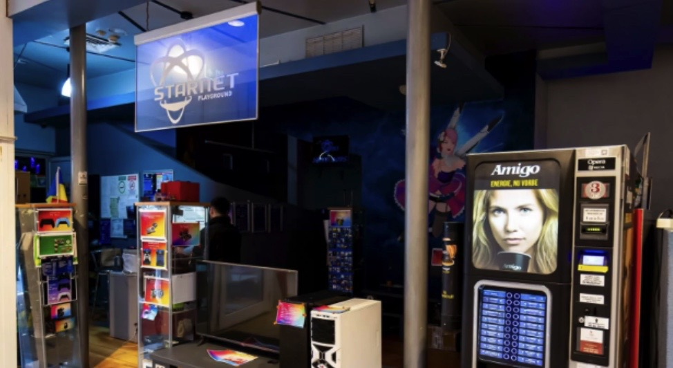
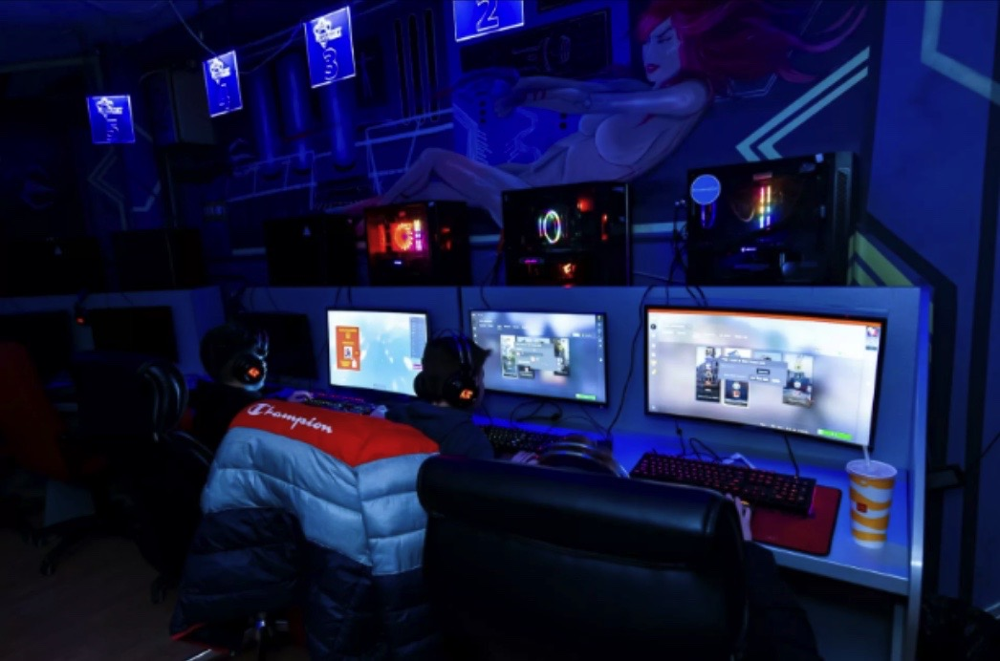
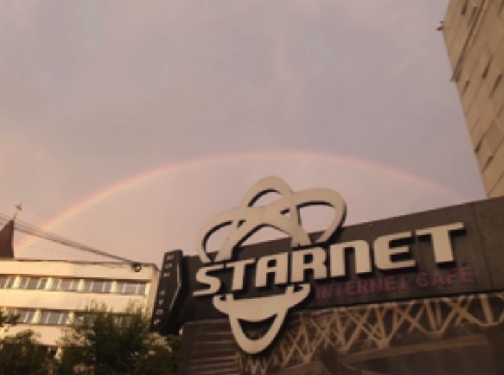
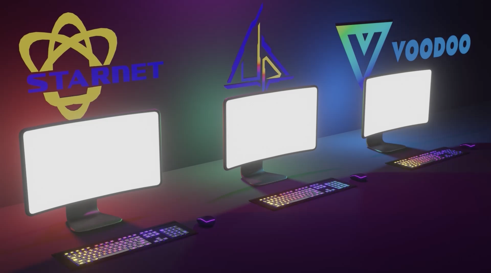
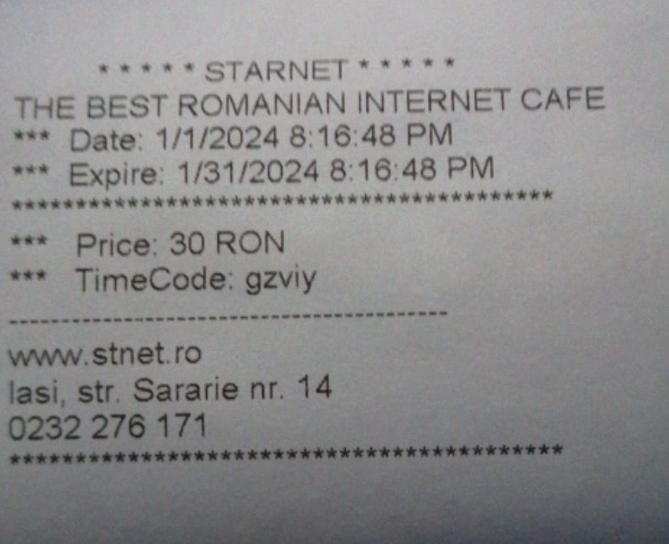
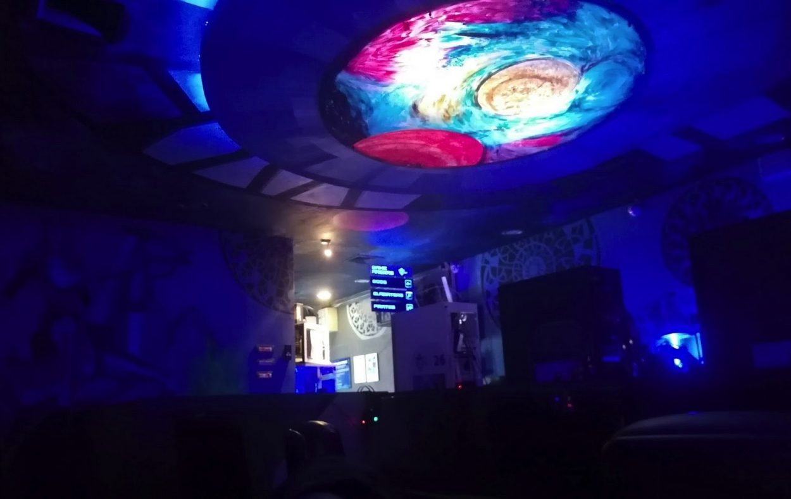
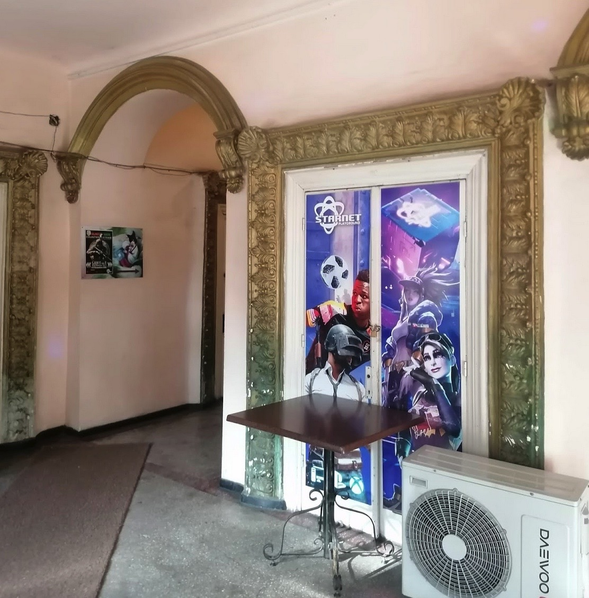

---
Pr-id: MoneyLab
P-id: INC Reader
A-id: 10
Type: article
Book-type: anthology
Anthology item: article
Item-id: unique no.
Article-title: title of the article
Article-status: accepted
Author: name(s) of author(s)
Author-email:   corresponding address
Author-bio:  about the author
Abstract:   short description of the article (100 words)
Keywords:   50 keywords for search and indexing
Rights: CC BY-NC 4.0
...

# Starnet: A History of Internet Cafes in Iași (Romania)

## Ruxandra Mărgineanu & Radu-Mihai Tănasă

### Originally Published June 21st, 2024

*It’s around 3 or 4 in the morning - and my priority right now is to
make sure I open, and then close the apartment door quietly enough so
that my parents won’t get woken up by my sudden appearance in the house.
Although it might seem like it, I didn’t go out with my friends in the
club or at the bar that night; I was coming back from a “Full Night” at
the most popular internet cafe chain in town. *

As common in post-communist countries, Western trends reach us 10 years
later. After the fall of the Iron Curtain and the brutal transition to
the free market, Romania was late with the 90’s trend of internet/cyber
cafes. Thus the 2000’s were its golden age.[^25chapter22_1] For a good decade, every
teenager had cheap and reliable access to the World Wide Web - and
especially to the beast that was Counter Strike 1.6. But after ten
strong years, almost overnight, internet cafes became extinct.
Redditors[^25chapter22_2] along with old[^25chapter22_3] and new[^25chapter22_4] bloggers alike are now
collectively grieving and reminiscing about the good old days of the
2000s, when the grass was greener and the internet cafes were the place
to be. Yet somehow, somewhere, in the north-east side of Romania, in the
city of Iași (where we grew up), bordering the Republic of Moldova, the
internet cafe became a living fossil - thriving and surviving, even
today.

Although the second city of Romania in terms of population, size and
development, Iași remains the embodiment of the underdog. While neither
as cool as the capital Bucharest nor as flashy as Cluj, Iași was blessed
with a constant growth in all its sectors - including internet cafes. At
its peak, Iași was home to three internet cafe franchises along with
smaller establishments when most cities in the country could only host
at most two or three locales. No one knows what the right ingredients
were for such a miracle to happen. But what’s known is that since 2003 a
new generation of internet cafes started popping up throughout the city.
Slowly but surely they became a catalyst for a subculture that would
eventually define entire generations of local millennial and Gen Z
gamers.

## What is an Internet Cafe?

Internet cafes are somewhat of a misnomer. The term is used in Romania
to refer to a place that houses a specific community of gamers.
According to Wikipedia, the term internet cafe refers to an
establishment whose main form of revenue is made through the provision
of affordable access to the World Wide Web, using high-speed internet
and dedicated hardware (usually gaming computers). As with any other
private endeavors, variants can pop up through mixing and matching
different businesses: some internet cafes offer food/beverages, others
might do some print jobs, and so on. The uniqueness of each internet
cafe is not limited to the novelty of the business idea, as much as its
associated community, which defines its unique purpose.

 

Internet cafes were originally called cyber cafes, after London’s own
Cyberia Cafe (according to the Brits), although early variants of it
have been documented ever since the 1980’s in Hong Kong.[^25chapter22_5] In the
early days these places were frequented by everyday people whose needs
and wants were to connect with others virtually using telnet, IRC, ftp
and to surf the Web. The writers cannot go into more detail about the
specifics and the vibes of that time as both of them were too young and
too much into gaming to relate to specific 1990s Internet experiences.

What we do know is that these normal people with their normal needs for
virtual communication would eventually be replaced by the gamers, whose
appetite for new hardware, newer games and ever-shrinking wallets made
these places the perfect middle, and perfect meeting ground. And
business owners were eager to welcome and adapt their locales for them.
Office chairs were replaced with gaming chairs, webcams became gaming
headphones, and light bulbs turned into gaming neons. Take Nexusclub:
anything to make a gamer feel at home.[^25chapter22_6]

The World Wide Web and its avatar, the personal computer, that laid the
foundation for what was to become the internet cafe. In June of 1991,
SFnet was the first entity to put together the exact building blocks for
one by installing 25 computer terminals throughout the San Francisco Bay
Area. It thus managed to establish a working coffeehouse network.
Following SFnet’s success, businesses around the area started to imitate
and improve upon the original recipe, creating cybercafes and finally,
the internet cafes. In the beginning, these establishments were marketed
as places that gave you access to web communication services for an
affordable price. It’s best to think of these places as an upgraded
version of the payphone.[^25chapter22_7] Users would typically frequent cybercafes
to send emails, browse IRC channels and do light research of current
news. This is what gamers typically call “normie” behavior.

As technology, and more specifically hardware, evolved in the 2000’s, so
did the scope and the clientele of some of these cybercafes. Personal
Computers could now reliably run not just offline single-player games,
but giants like Starcraft, Defense of the Ancients and World of Warcraft
quickly became virtual staples in many hard-drives around the globe. LAN
parties were just becoming popular, and innovative cybercafe owners
quickly realized that they could grow big by facilitating a dedicated
place for not just a LAN party, but LAN party-parties.

Why go through the trouble of creating a timetable, setting up a
dedicated server and cleaning your gamer cave, when someone else could
do that for you? And for cheap too. The shift from just offering access
to virtual communication to including gaming in their repertoire of
services is what transformed the then 'cyber cafes' into the 2000’s
'internet cafes'.

To understand how big the Internet Cafe craze became, one must look no
further than to Basshunter’s hit *DOTA*, released in 2006 - marking the
exact turning point of this mentality shift. The music video presents
three main environments considered, at the time, the three epicenters of
ideal Gamer life: the Bedroom, the Club and the Internet Cafe, with the
last being turned into a concert-tournament hybrid.

Viewers are presented in the beginning with the imagery of the classic
LAN party, with all its ups (girlfriends) and downs (moms); to be then
hit with a perplexing club scene, in which no computer is seen in sight,
as the focus is on the social interactions. The glue that binds it all
is eventually presented in the aforementioned Concert-Tournament
Internet Cafe Hybrid - the ideal marriage between the highs and lows of
competitive gaming and the social adrenaline of late-night clubbing. It
is the sea of computer screens, the jungle of jumbled cables and the
comfort within the concrete walls of this Mega LAN Party that many
gamers consider the great Internet Cafe Utopia. But how accurate was
this admittedly very idealistic depiction in different parts of the
world, especially in the land of Dracula? As we, the writers, were too
young to experience the birth and the early life of internet cafes in
Romania, we have to resort to second-hand reports. Luckily, we can get a
very small but relevant overview of internet cafes in Romania straight
out of 2004, in a study on Internet access in the country at the
time.[^25chapter22_8]

 

It seems that 2004 had quite the downer vibe, as the writers were not so
sure about the future prospects of the internet cafe. But even from
their language, we can gather that they are still using the word to
reference the business model as it was operating in the West. We can
therefore make an assumption that the iconic gamer identity of the
Romanian internet cafe came sometime later in the Y2Ks.

With the advent of the personal (home) computer, access to the World
Wide Web slowly started to democratize. While in the West this started
in the late 80’s, in Eastern Europe this happened in the new
millennium.[^25chapter22_9] Because of the abrupt  jump to capitalism, internet
infrastructure developed very quickly as there wasn’t much older tech to
replace it. At the same time, access was disproportionately
over-represented in urban centers. Even today on the countryside,
internet access is still almost exclusively done via smart phones.[^25chapter22_10]

Having a (recent) Communist past that has now transitioned to a
free-market democracy, Romania has seen a rapid increase in consumer
goods spending and in technological advancements. Unlike the
Netherlands, Romania only has had a few decades of experience to deal
with this mentality shift in creating subcultures around consumer
products. Yet, similar to China, Romania has a bigger sense of social
cohesion. Social activities are still a much bigger part of the everyday
person’s life than in NL (the weather helps a lot too). Hanging out on
the street is much more common in these countries than in the West,
where such behavior is more associated with (dangerous) teenagers and
their unsuccessful helicopter parents.

Comparing liberal Western countries (what Romania aspired to be since
2008) to still existing Communist countries such as China (what Romania
once was), democratic access to rapidly developing and affordable
technology seems to accelerate the shift to gaming as a more
individualistic hobby while on the other hand having a higher barrier of
entry to certain hardware and using a middleman (or middle-space) seems
to paradoxically create a stronger sense of community amongst
gamers.[^25chapter22_11] Using this axis we can better understand where Romania can
be placed with regards to internet cafe culture.

Internet cafes offered this unique situation where a private entity can
create the ideal third place for young people who are interested in
gaming to hang out through a relaxed barrier of entry, non-stop hours
and affordable pricing by using recently built reliable and high speed
internet infrastructure. As a newcomer to the capitalist game, Romania
has made numerous enthusiastic changes to laissez-faire economic
policies to contrast with its dictatorial past. Thus, the strategy of
running an internet cafe had to follow this new mentality. Combine it
with people’s generally more social predisposition and their love for
nightlife, and you got yourself the perfect business.

Everyone was welcome, regardless of social status, ethnicity, gender or
technical skill. The internet cafe was where competitive MOBA
girl-gamers met with casual FIFA-enjoyer highschoolers and
CS:GO-obsessed gang members. All internet cafes were populated not just
during the night, but more often than not, during school hours.[^25chapter22_12]

## Starnet

Let's focus on  internet cafes in Iași and zoom in on Starnet, which was
-and still is-the biggest internet cafe annex franchise in the city and
a general point of reference in terms of organization, pricing and
diversity of services. The choice for Starnet was made to honor our
shared community and lived experience, making sure that we speak as a
community member and not as a detached, cold observer. This comes with
certain disadvantages, mainly the difficulties we have faced in trying
to go deeper into the inner workings of Starnet as a private endeavor.
Business owners in Romania are notoriously paranoid and opaque about
their practices, not eager to collaborate or give details into how they
run their business or what their motivations are. We had to resort to
interviews with Starnet customers in an effort to still adhere to a
vague sense of objectivity or integrity. What Iași offered in terms of
quality, such as service, products and community, was indeed of higher
quality than the country’s average.

On their website Starnet proudly claims that in 2023 they celebrated
their twenty years anniversary. We were unable to find any relevant
information of Starnet’s inception or anything dating earlier than 2014
through unorthodox online archives such as browsing locale review sites.
And knowing how private the Owner is in regards to additional details
meant that it would be quite hard to assemble a complete timeline for
now. Business owners in Romania are in general quite reluctant to
sharing too much information, as they always risk either getting
questioned by the Government (which already eats up a lot of the profits
through high VAT, income taxes and much more); or they might
accidentally overshare unethical business practices, which is still
(unfortunately) the norm.

We estimate that the establishment indeed started in 2003 but the
registration name would have been different and the address might as
well just be someone’s apartment rather than something akin to a cafe.
We looked into Google Maps as a last resort concerning the localities.
Since the gaps in time are quite big, Maps only gave us only vague time
intervals of activity. Through this we can confirm that the oldest
Starnet was (already?) a thing by 2011, 3 years earlier than its other
digital footprints. But then again, 2011 was also the first year of the
Google car visiting Iași. Other online sources might point as far back
as to 2008 as a legitimate period of Starnet activity, but this can only
be implied by looking up Stargrill’s opening year, which was a
restaurant sharing both the location and the name with Starnet.

 

Beyond the respectable humble beginnings and perhaps some (possible)
loopholes at play, we suspect that it took quite the time to eventually
set up such a locale, as equipment was very expensive for the time, it
needed to be upgraded quite frequently - and not to mention the
egregious prices software companies demanded for commercial use. What
type of small business owner would be thrilled to pay for Windows,
Winrar and other such expensive expenses? For now, this is the amount of
gossip we are able to entertain.

For honesty’s sake, we have to admit that our introduction to internet
cafes was linked directly with high school, thus around 2015-2016.
Around this time is when it felt as if the internet cafe phenomena was
gaining rapid momentum. Their positioning and identity was also quite
clear: this was not your grandma’s internet cafe where you log in to
yahoo to check your business email or Nigerian prince scams. This was a
place for hip, *dank* gamers who no-scope everyday while listening to
Skrillex and 420 blazing it. Internet cafe owners knew what gamers, and
especially teenagers, wanted.

Looking at older 1990’s localities in Western Europe and the US such as
Easy Internet Cafe, we were shocked by the clean, corporate look that
these cafes sported. Starnet and it’s competitors could not be any more
different: rooms were dark, only lit by neon bands; the computers were
slim, edgy and dark; and the walls were all decorated in gamer
references, usually paintings of characters from different video games,
with different rooms inside of the cafe having very thematic names like
Gods, Gladiators, or Pirates.

If there was one thing that Starnet focused strongly on from the very
beginning, it was organization, structure and economy. The moment you
stepped in as a newcomer, you were required to sign in and join their
database. You were asked for your ID, fill in paperwork with basic
contact information and pose for a picture. Some might consider this
draconian measures, but this initiation ritual was spiritually meant to
show how intertwined the virtual and physical are. On a more practical
level though, knowing that every customer had a personal account, unique
username and an overview of recent activities inside the establishment
put a lot more weight on individual actions and responsibilities.

## The Starnet Business Model

If you behaved poorly, which was frequently the case in many internet
cafes, the staff could immediately intercept and penalize you. If you
were a good customer and a team player, the community or staff could
reward you with (sometimes under-the-hand) perks or discounts. Such
manners of dealing with gaming-based communities have been also
implemented in countries like Korea, where attaching limited personal
information to League of Legends accounts and/or internet cafe customers
has resulted in less overall toxicity and misbehavior - no wonder it
also worked in Iași..

But the initial screening wasn’t done just for security’s sake. If it
were just for that, Starnet would have been seen not as a successful
internet cafe, but as a prison. Instead, they coated this safety measure
with a UI and quality-of-life improvement virtual service. Every
computer in Starnet was locked behind a log-in screen. This meant that
unintended use by strangers was kept at a minimum. And more than that,
every Starnet computer had a custom navigation screen, slightly
different from a normal Windows configuration, so that anyone,
regardless of their IT skills or experience, could access whatever
virtual service they wanted at a moment’s notice. Users also had a whole
internal economy they could manage through this UI and that really
reinforced the idea that you are not using a regular computer, you are
using Starnet’s curated version of it.

 

After you logged in to your account, one last thing to do before playing
was to, of course, buy hours. Buying hours was the main Starnet product.
Customers had the option of buying different amounts of hours that
allowed them unrestricted access to the computers. You could either get
a standard fee of per hour spent in front of the screen, or you could
buy hours in bulk for a discount. One, three and five hour packages were
usually the standard, but for dedicated gamers, even 24 hours packages
could be bought.

Starnet had their own currency called “stars”. *Stars* could be obtained
either from unused purchased hours, or through codes that were usually
handed by starnet staff directly - or by simply buying them. *Stars*
acted as readymade discounts, every Starnet product had 2 prices: in
RON, or in RON + Stars, with the latter always costing less real-life
currency provided you collected enough *stars*. Starnets’ own user
interface also kept track of your money and stars through your own
dedicated wallet. Users could not just hoard or keep the spare change
for future sessions, but could also show some generosity by transferring
money or stars to other players, further fostering a sense of
beyond-virtual community.

Along with virtual products, Starnet offered real-life products in the
shape of drinks, food, and more recently, even shisha (for a good price
too). Bringing food from outside was considered against the rules,
although it was hard to reinforce, as even the employees themselves
would bring in or order food for their impossibly long 10/20 hrs shifts.
In its golden days, Starnet had a dedicated, non-stop, in-house
restaurant called Stargrill, a kind of gamer cantine. Customers would
usually ask Starnet staff for a Stargrill menu and after making up their
mind, would walk a few meters to the restaurant desk and kitchen, shout
their order and go back to their game. After 30 to 40 mins, Starnet
staff would graciously visit their computer desk with a freshly cooked
dish, and the customer would in turn quickly and carelessly toss the
money so as to not lose the focus on their match. Stargrill offered a
variety of finger foods perfectly crafted to be eaten in short,
seconds-long bursts, when you were either in a match lobby, going to
lane, or respawning.

*Everytime you bought something from Starnet, a small receipt would be
printed and handed to you. Each one started with a small message that
read: “The best Internet Cafe in Romania”*

 

## The "Full Night" Experience

Beginning with 2015, Starnet attempted to differentiate itself from the
other Internet cafes by creating a stronger community with its customer
base, those being mostly middle and high school teenagers. The in-house
UI always presented customers with different choices of products, like
the previously-mentioned bulk hours. But now they would upgrade to
contain dedicated packages based on the time of day most customers would
be most active.

One such product was the now-classic “Full Night” package. This item
single-handedly turned Starnet from a small local establishment to a
local business giant. For the very low price of approx. 30 RON (less
than 8 EUR at the time), you could sit in front of the computer for 8
uninterrupted hours starting anywhere from 20 to 2 o’clock. Internet
cafes in Romania were different from its Western counterparts for having
similar working hours, and being under similar jurisdiction to casinos,
which were open non-stop. With this “Full Night” product, Starnet was no
longer offering a better deal just compared to other internet cafes.
They were now directly competing with hostels for quick and cheap
overnight accommodation; and clubs for cheap and safe social
entertainment. This decision inevitably transformed the Internet Cafe
into the dominant alternative night scene in Iași.

Starnet employees never did background checks. Neither were they paid
enough to do that. The owner could not be bothered either. Contrary to a
(night) club, the bar for entry was nonexistent. This meant that for a
minor, the internet cafe was their first introduction to nightlife. The
laissez faire business strategy that Starnet pushed, of having a main
consumer-group composed of minors, should have been a PR disaster. That
was, if the authorities had been notified, or if parents were made aware
of this. Luckily, most parents had no idea what an internet cafe was.
The more helicopter types assumed that it was a casino, as the Romanian
term for games (jocuri) was usually associated more with gambling than
MOBAs.

Surprisingly, the mix of ages, backgrounds, and later on even genders,
made internet cafes both the most inclusive and one of the more toxic
spaces of Iași. The best way to picture oneself inside Starnet is to
think of a place like 4chan or perhaps more aptly, a League of Legends
/all chat, where everyone sits in the same room. Among the cacophony of
mouse and keyboard clicks, curses, slurs and broken English was the
norm. The occasional encouragement or sincere congratulations for
carrying a match felt ten times more rewarding in this sea of intensity.
Yet, no matter the frequency of f-, c-, g- and other one-letter slurs,
when it came time to have a siggy break, everyone came outside the
locale in good spirits, reminiscing about the crazy experience that was
the previous match, regardless if it was a loss or a win.

 

In its *golden days*, a Starnet establishment would usually be
frequented by high schoolers skipping class, young professionals who
could not afford either the Microsoft or Adobe Suite, unemployed people
that would use the Internet to apply for vacancies, and sometimes by the
rare homeless person who had nowhere else to stay during the long and
cold winter nights.

Similar to internet cafes in Japan, Starnet acted as a temporary shelter
solution for the jobless, homeless and in general, the less privileged.
For them, the internet cafe was everything a hotel could *actually*
provide in this new era of digitalization. Starnet graciously offered
not just a great selection of video games, but (questionably) legal
licenses for the MS and Adobe Suites, Yahoo Mail and Google Drive, food
through Stargrill, and even limited printing services in some cases.

*Overnight, thousands of nerdy teenagers now had to create the most
elaborate excuses to get to spend the night in what their parents
thought was an elaborate casino establishmen*

## Portrait of a Starnet “Operator”

Starnet seemed to have a very simple hierarchical structure. There was
the *Owner*, and immediately underneath him, the Starnet employee. The
heart and soul of every Starnet location was its *Operator*, a person
whose job was, on paper, to provide technical help when the PCs would
act up. But that was just the job title. In reality, the Operator would
do everything: helping people with IT problems, being a good host to the
newcomers, acting as a guard when unwelcome guests would show up, doing
the regular clean up, selling snacks and keeping the tab. And all of
this on a 10, to even 20-hour shift (counting ciggy breaks only btw) on
(less than) minimum wage. A Starnet location would usually have one to
maybe two *Operators* active at a time, and no one else.

Though the job prospects were awful, the *Operator* was perhaps the best
person you could befriend in a Starnet. The *Operator* was in many
regards just like you; either a nerdy League player, or a more
street-smarts guy who enjoyed his CS 1.6. Throughout your “Full Night”
set (and thus, during his shift), the *Operator* would be right next to
you, playing a round of CS:GO to slack off; bringing you a Cola while
talking about how to better play your jungle main; or telling you about
his break-up on a cigarette break. The *Operator’s* mix of slight sense
of authority and relatability made him the perfect pillar for the
internet cafe community, as many people likened him to the Bartender of
an RPG, who introduces you to all sorts of people, stories, gossip (and
quests).

To add to the persona, most of Starnet’s *Operators* were an important
part of the community even outside of their working hours as most of
them would finish their shift only to start playing as customers
themselves, in turn passing the authority to the next person in charge.
This shifting between employee and customer meant that every Starnet
locale was deeply in touch with the wants and needs of the community -
and though Starnet was a business at the end of the day, it managed to
organically create a sense of community that many enterprises today
could only dream of.

*The man next to the cash register always seemed bored or phased out.
But the moment I say the magic words: “Operator!” - his face switches
with either interest, or perplexion.*

Around 2016, Starnet started getting an influx of new visitors and
veteran customers constantly, regardless of season, month, week or time
of day. The previously mentioned laissez-faire mentality that the owner
pushed for had finally paid off. So much so that new Starnet locations
popped up almost overnight, in sync. The owner had also planned for each
location to have a certain specialization, or niche:

*Starnet Târgu Cucu* is by far the oldest and the most popular location,
situated in an old, slowly dilapidating building. If the outside of the
building gives off a slightly pessimistic atmosphere, the interior tells
another story: old interwar architecture fuses with neon lights and
slick gaming stations, painted walls depict different video game
characters and the same 2hr club gaming playlist plays nonstop.

The location has 3 rooms filled with computers, with the central room
providing an additional Playstation station, therefore it was seen as a
less casual-friendly location and more as the place where you go to
grind out ranked matches. This Starnet’s highlight was by far the
StarGrill business which was operating in the same building. Instead of
having to order and then wait up to two hours for some gamer grub,
customers only had to talk to Starnet personnel and they would get their
dish of choice within half an hour guaranteed.

The (previously) third in size and second in popularity, *Starnet
Iulius* was an instant hit with the local gamer community and eventually
proved itself to be a successful investment for the long run. Found on
the ground floor of Iulius Mall, a symbolic location where the
first-ever Mall was constructed in Iași after the 1989 Revolution.
Spanning over a few different rooms and even having its own entrance,
outside of the Mall’s working hours, Starnet Iulius Mall was especially
a hit with younger audiences. As overworked parents came to the Mall for
their weekly grocery shopping, leaving their kid/ teenager sitting for 2
hours in front of a computer or a PlayStation console for the low price
of 10 RON (approx. 3 Euros) seemed like the logical and safest choice.
Perhaps this choice is what ultimately led to the closing of KidsLand,
the Mall’s own playground, which was itself on the brink of celebrating
ten years of activity.

A more successful out of the new generation of franchises, the *Starnet
Podu Roș* branch proved to be extremely profitable with its
unconventional yet somehow intimate location. Hiding in plain sight
right in front of one of the main city roads, Starnet Podu Roș boasted a
giant “PUBG or Fortnite” banner in its glory days, no doubt an ingenious
trick to get people’s attention and thus, new customers.

Perhaps this was also the reason why all Fortnite and PUBG competitions
started happening there almost exclusively. Unfortunately the unorthodox
location that was neighboring a very popular casino in the area would
eventually prophesize its demise. As teenagers would begin their gaming
journey by buying CS:GO skins, the allure of gambling inherent in loot
boxes translated perfectly to slot machines.

The smallest branch, *Starnet Unirii*, was strategically placed right in
the middle of the bustling city center. Although at first it seemed like
it was the main player, and the one to hopefully bring the most revenue,
Starnet Unirii was the first branch to close permanently. Being known
for its polarizing effect, customers thought prices were exorbitant for
the high-end machines while cheaper tickets gave you access to subpar
computers. These days Starnet Unirii is remembered to have managed to
pull in the casual market, with the main money makers being the
Playstation and Xbox consoles. That money, however, was not enough to
keep the establishment afloat.

The notorious one of the bunch, *Starnet Hala Centrală,* was an example
in resilience, managing to outlive its Unirii counterpart despite its
drawbacks. Not being known either for high-performing tech or memorable
staff, and being placed in an awkward location on the first floor of
Hala Centrală commercial center, this location felt more like an
afterthought rather than a focused, strategic business decision. Sharing
a location with a mall or commercial center can be both a blessing and a
curse; Starnet Iulius Mall, with its ground-floor entrance, proved to be
the first option. But Starnet Hala Centrală’s position on the first
floor in an establishment with a 12 hr opening hours schedule made it
challenging to access the nonstop Internet Cafe inside; especially in
the weekend, and at night, when most people were most eager to gather.

## The Dark Ages (Covid)

The rise of Starnet seemed more and more exponential, but during 2019,
things seemed to mellow - locations got closed permanently and fewer
people were coming. You could feel it in the prices that were growing,
and in the avalanche of spur-of-the-moment limited offers, discounts and
packages Starnet would send on your phone. The breaking point however
proved to be March of 2020 and the worldwide lockdowns that followed
afterwards. Every business got hit, but Internet Cafes were hit the
hardest, as the bulk of their customers saw themselves locked inside the
house for almost three consecutive months - only to be followed by more
random week-long interdictions sprinkled in throughout the whole year.

To curb the huge amount of losses the business had suffered, the Owner
had resorted to some drastic measures. Firstly, Starnet started
operating according to casino regulations during 2021 (and 2022). This
meant that the Internet Cafe was allowed to operate from morning until
midnight on non-lockdown weeks and to be fully closed on lockdown weeks.
This rule gave both casinos and Internet Cafes an edge against other
establishments like museums, clubs or restaurants, which had very strict
opening schedules, with exact visiting days being planned and announced
weeks or even months ahead of time; whereas the former would just open
immediately after a lockdown - at least that is what the documents said.

 

According to official documents and the vigilant eyes of the police,
Starnet was conducting business as usual. Within an old historical
building, Tg. Cucu Starnet was as lively as ever, although customers and
staff alike were more vigilant than ever before. Some precautions had to
be taken, in order for the money to come in: gamers had to sit one chair
apart from each other, effectively cutting the maximum capacity in half;
masks were encouraged, but not mandatory; smoking either inside or
outside was strictly prohibited, so as to not draw the attention of the
police; and exiting the building during a “Full Night” was the worst
crime one could commit.

But by far the most interesting addition was the voice alerts that every
computer now possessed: when staff learned that planned police
inspections would take place throughout the lockdown months, they
installed a customized voice announcement in each computer to alert the
customers of incoming government checks. A few hours or minutes
preceding the inspection, a gamer would hear mid-match a voice that
would recommend customers engage in mask-wearing and social distancing
while being outside their homes. The previous quick briefing by the
Operator made the gamer understand that this was not a kind request by
Starnet staff to conform to basic lockdown rules, but a warning call
that police inspections might happen in as little as 5 minutes. They
knew that by the moment they heard that voice, they had to either leave
the location immediately or to wear a mask for the next few hours.

This is how Starnet managed to not only stay afloat during the worst of
times, but to be more successful than even casinos, Romania’s most
thriving industry; subtly managing to evade the watchful eye of the Law.
Subtlety was the way to go when the government called for drastic
measures.

## Starnet Today

As of 2023, the wave of bad luck continues to hit Starnet. The inflation
that followed the pandemic made regular customers think twice about
whether or not to spend the night in Tg. Cucu or the Iulius Mall. Prices
kept rising, to the unbelievable 13 RON/hr (approx. 2.5 Euros) compared
to the 5 RON/hr (approx. 1 Euro) that used to be the golden standard.

Even so, Starnet is proving time and again that resilience is what wins
the fight. Even with higher prices, fewer locations and a diminished
customer base, the internet cafe chain still seems to stay afloat.
Locations appear to be continuously populated at a third or quarter of
their capacity. While the era of Starnet championships is gone, they
still proudly sponsor up-and-coming pro teams to hold their title of
“Best Internet Cafe in Romania”. To prove that 2023 is nothing like
2015, they have adapted to the times and are now giving extra discounts
and offers to female customers to combat sexism and to hopefully reach a
previously untapped demographic. Their recent acquisition of a brand new
PS5 also suggests that perhaps casual players are slowly coming back
too.

The second half of 2023 proved to be of help to Starnet, as Iași was
nominated almost overnight as the Esports Capital of the World.
Thousands of esports fans, streamers and even professional teams all met
up to battle it out on the territory that Starnet called home. For a few
weeks, Starnet was no longer just a successful albeit small local
attraction, it was a worldwide superstar enjoying its short but
well-deserved 15 minutes of fame.

Perhaps a new Golden Age era will arise for Starnet? In a few decades or
centuries, Iași will be known not only for being the city of linden
trees, great ideas and seven hills but for being Starnet City, an
evergreen protector and living museum of the Romanian Internet Cafe
Spirit. However, during a recent trip to photographically document the
location, the writers were informed by the photographer that the Starnet
Iulius Mall was no longer active. In its place, a VR-focused
establishment was built, perhaps signaling to us the beginning of an
entirely new era.

During August 2023 Iași was designated International Esports Capital.
Our (not so) small city was finally put on the international map of
gamers. Teams of competitive players from all around the world played
their finals in Romania’s City of Culture, and, of course, Best Internet
Cafes. Behind the multitude of events like championships and celebrity
concerts, news of the darker motivations behind this event appeared in
the public discourse.[^25chapter22_13] According to some of his colleagues, the
mayor had been planning the Esports publicity stunt intending of
laundering money for his (alleged) real estate mafia deals. As the
gossip goes, the Mayor tried to cash in the 1 million Euro funds that
were allocated to the event production by transferring the money to a
(fictitious) foreign third-party entity responsible for event
management. As is the case with European Union funds, a lot of
politicians use loopholes such as third-party government companies as
“partners” in production projects, and the latter’s offers and services
are always mysteriously charging two to even ten times the usual market
rate.

Not only was the mayor thus accused of fraud through public funds - but
it seems that the third party itself, which ended up being registered
under one Macedonian individual, was able to get all of the money it was
transferred without a trace and suffering no consequences. A classic
story of a thief being out-thieved. We were interested in recent
developments of this drama and how the public at large perceives gamer
culture. The decision to organize mass public events catered around
gaming marks a shift in mainstream society’s now more accepting view of
gamer culture and its branches, like the Internet Cafe Will the memory
of Iași as 2023 World Esport Capital help propagate an active community
for its internet cafes? Or will the behind-the-scenes politics tarnish
their reputation and make the public skeptical as to the validity of
such a subculture?

***Ruxandra Mărgineanu & Radu-Mihai Tănasă ****are both members of
the Iași-based artistic collective Apartament 6 (AP.6). The Startnet
project is done as part of AP.6’s overarching artistic research on
authentic Balkan spaces. On a local level, AP.6 is one of Iași’s only
professionally active artistic collective, developing community-based
projects and organizing public exhibitions aimed at questioning the
status quo of the local art scene. AP.6 has been hosting so-called
“Living Room Exhibitions” meant to challenge the inherent power
structures of the local art scene while still adhering to its personal
roots of sincerity, childhood and private community. On an international
level, AP.6 has been making concentrated efforts into building an online
community/ network of fellow (migrant) artists predominately with a
Eastern European or Balkan background. To this end, we have been, and
continue to organize online events (exhibitions/ screenings) where we
collectively explore our commonalities and differences as a geographical
region that historically has had a very complicated and often overlooked
history both with itself, and its neighbors.*

[^25chapter22_1]: *Afacerea Internet-cafe Buna Ziua Iasi.* 2001.
    <https://arhiva.bzi.ro/afacerea-internet-cafe-21902>

[^25chapter22_2]: ablkholewlksintoabar. *Va mai aduceti aminte de Internet
    Cafe-urile anilor 90?.* 2019. Reddit.
    <https://www.reddit.com/r/Romania/comments/3exiba/va_mai_aduceti_aminte_de_internet_cafeurile/>

[^25chapter22_3]: Dumitru, Radu. “Mai functioneaza Internet Cafe-urile?” 2011.
    Nwradu Blog.
    <https://www.nwradu.ro/2011/12/mai-functioneaza-internet-cafe-urile/>

[^25chapter22_4]: Arhi. “Mai există internet cafeuri?” Blogul lui Arhi. 2023.
    https://arhiblog.ro/exista-internet-cafeuri/

[^25chapter22_5]: Sonia Liff and Anne Sofie Laegran. “Cybercafés: Debating the
    Meaning and Significance of Internet Access in a Café Environment.”
    New Media & Society 5, no. 3 (2003):
    307–312.<https://journals.sagepub.com/doi/pdf/10.1177/14614448030053001>

[^25chapter22_6]: Nexus Club. (n.d.). \#1 Internet Cafe Bucuresti Non Stop | Nexus
    Club | Gamers Pub – \#1 Internet Cafe Din Bucuresti . Retrieved May
    13, 2024, from https://nexusclub.ro/

[^25chapter22_7]: Reuters. “New York’s Latest Virtual Trend: Hip Cybercafés on the
    Infobahn.” Los Angeles Times, June 29, 1995.
    https://www.latimes.com/archives/la-xpm-1995-06-29-fi-18601-story.html.

[^25chapter22_8]: Sorin Gudea and Terry Ryan. “Internet Access in Romania.” January
    2005.
    https://www.researchgate.net/publication/237341632\_INTERNET\_ACCESS\_IN\_ROMANIA.

[^25chapter22_9]: Ofer Malamud and Cristian Pop-Elecheș. “Home Computer Use and the
    Development of Human Capital.” June 18, 2011.
    https://www.ncbi.nlm.nih.gov/pmc/articles/PMC3377478/.

[^25chapter22_10]: E. Beserman et al., *Digital Inclusion and Exclusion in Romania
    2022: A National Study*, Institutul de Cercetare Făgăraș,
    December 13, 2022,
    https://icf‑fri.org/digital‑inclusion‑and‑exclusion‑in‑romania‑2022‑a‑national‑study/

[^25chapter22_11]: Junhao Hong and Li Huang, “A Split and Swaying Approach to
    Building Information Society: The Case of Internet Cafes in China,”
    *Telematics and Informatics* (March 7, 2005),
    <https://www.sciencedirect.com/science/article/abs/pii/S0736585305000201>

[^25chapter22_12]: Iasi, Z. *Elevi de primară, găsiţi de poliţişti prin Internet
    Cafe-uri*. 2013. <https://www.youtube.com/watch?v=xRwdXKzwJSo>

[^25chapter22_13]: C. Moraru, “Campionatul mondial de ESports de la Iași: datorii de
    2,6 milioane de euro și suspiciuni uriașe legate de cheltuirea
    banilor,” *ReporterIS*, 2024,
    https://reporteris.ro/exclusiv/anchete/item/129862‑campionatul‑mondial‑de‑esports‑de‑la‑iasi‑datorii‑de‑2‑6‑milioane‑de‑euro‑si‑suspiciuni‑uriase‑legate‑de‑cheltuirea‑banilor.html
