Titlepage

Colophon

TOC

#Foreword

# No Shot Like Screenshot: Banal, Sublime and Dangerous

## Dunja Nešović

### Originally published January 19th, 2022

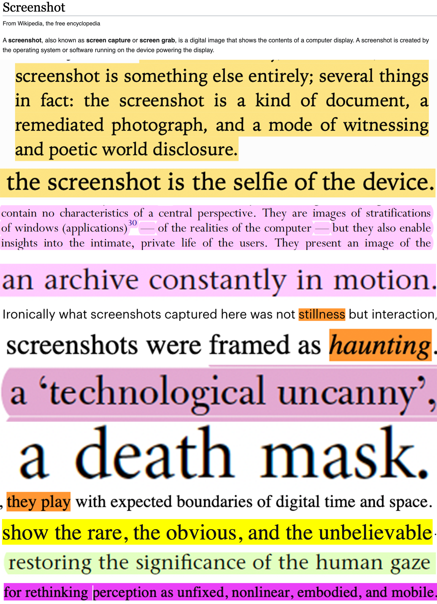

  

Through screenshotting, computational
devices such as computers and smartphones give us an easy way of
preserving the contents of their screens for a myriad of purposes.
Whether screenshotting serves a creative, documentational or even a
surveilling purpose, it represents in Jacob Gaboury’s words, “one of the
many vernacular computational practices, in that there is a great deal
of variance in how they are used, modified, and disseminated.”[^04chapter1_1] The
desire to capture screen imagery tells us a lot about our relationship
to the intricate worlds we experience through a flat and mildly
penetrable surface.

The screenshot represents *the digital networked image*, given that
screenshot’s ontology is connected to its inherent embeddedness in its
originating context of digital, screened technologies, cultures and
modes of being, as it is materially and operationally always delimited
and defined by them. Theoretically approaching the screenshot to support
this account means examining its aesthetic, functional, and mediating
characteristics that are specific to the networked, screened environment
of its origin.

First theoretical conceptualizations of the screenshot have approached
it by comparing it and contextualizing it within the medium of
photography. A significant portion of (a handful of) papers written on
the screenshot discuss it in the context of in-game photography often
for the purpose of legitimizing the screenshot medium within the art
field. The screenshot is in those instances also named a photograph,
which might additionally be due to the aesthetic of these ‘photographs’
that capture the video-game imagery marked by the simulation of the
three-dimensional ‘real world’. Whether it concerns in-game photography
or images of other screenscapes, screenshot’s link to photography
becomes prevalent in its academic theorization.

In many ways, the screenshot remediates, or integrates, the
characteristics of photography in itself. Notably, it is a capture of
light in an image, it encompasses simulated camera shutter sounds that
follow the act of screenshotting, it creates stillness from an otherwise
dynamic and moving environment and bears a strong indexical trace of as
well as iconic resemblance to it, it represents a document and presumes
active witnessing and world-making through perception and capture. But
does this correlation to photography limit our understanding of this
relatively new and underexplored medium? Jan Švelch reflects on the
possibility that looking beyond photography when thinking about
screenshots might help us gain a deeper comprehension of its properties
and capacities:

> By searching for similarities between screenshots and photography, the
> perspective of remediation downplays the technological differences
> between the various images that are commonly understood and labelled
> as screenshots. [^04chapter1_2]

While Švelch's thesis accounts for a certain taxonomy of
screen-capturing imagery, I am interested in downplaying screenshot's
connection to photography to examine the specificity of vernacular
practices of screenshotting. Susan Sontag notices in her essay ‘The
Image-World’ that “when the notion of reality changes, so does that of
the image, and vice versa.[^04chapter1_3]*” *Bearing that in mind, studying the
screenshot might reveal the nuances of our changed, ubiquitously
screened (sense of) reality and how this peculiar image and image-making
practice inserts itself into it or is otherwise producing it.

The peculiarity of screenshots might become obvious if we consider that
other screens such as old television[^04chapter1_4] and cinema screens have only
served as an output of media content, framed as a window into a
different kind of reality which, similar to non-mediatized reality,
provides no option to the viewer of capturing and preserving the ‘raw’
image it presents to us. Of course, in the cases of screened reality as
well as our material environment, the images of both could be captured
with the aid of a camera that physically and aesthetically inserts
itself between the subject and the object of the image. Screenshots, on
the other hand, are created with minimal or no mediation that influences
the final form of the image. In that sense, they ontologically and
aesthetically more resemble the futuristic fantasies of capturing the
images directly with our eyes.

  

## TRANSPARENT MEDIATION, NETWORKED AUTHORSHIP

Vernacular screenshots depict the flat, two-dimensional screen surface
that perceptively replicate the exact contents of the screen. In that
sense, the screen imagery is transparently mediated, as there is no
in-between device and operation that leaves the signs of its mediation
in this image-making (such as it is in the case of camera or brush and
canvas). In his work on the screenshot, Paul Frosh points out that we
almost exclusively ‘look through’ screenshots, rather than looking at
them, given that “the reflexive indicators of self-mediation are absent
– signs which draw attention to the screenshot itself as a media
object.[^04chapter1_5]”

On the other hand, given that “computer graphics, unlike film and
television, do not begin as images”, screenshot represents a ‘secondary
mediation’ in Gaboury’s terms, in the sense that the computer-generated
images of the screen, are already a mediation of mathematical
computation and visual representation of digital information.[^04chapter1_6]
Gaboury notes that screenshots are a significant medium insofar as they
allow us to examine how humans have been visualizing computation both by
investigating the technical processes of photographing screens, as well
as the visual documentation of cultures that are being mediated through
those screens.

Transparently mediating through screen capture, as well as representing
a still copy of computational mediation, screenshots are located in the
ambiguous territory of contemporary image-making that complicates the
questions of mediation and authorship.

Screenshot can be classified as a technical image, which is a concept by
Vilém Flusser that groups together the images created with technical
devices.[^04chapter1_7] In his account, technical images inherently lack dimension
since they are assembled from particles that are only registrable and
produced through the aid of apparatuses. He identifies the keys as the
most important tools for creating these types of images. Flusser notes
on photography:

> Then he \[the photographer\] takes an apparatus in hand to “grasp”
> (with concepts such as “perspective” or “shutter speed”) what he has
> visualized. The apparatus calculates these concepts automatically, and
> the photographer presses a button to release the machine to carry out
> these calculations, making the vision of the house into an image.

In that sense, the human maker of technical images is, according to him,
also a visualizer – they need to visualize the finished image and also
visualize how to control the apparatus in the right way to achieve the
desired result. Human technicality is of big importance in this process
since it works together with the technology of the apparatus to produce
an image. Screen imagery is already a finished technical image,
programmed, designed and executed (or constantly in execution) usually
by someone other than the one who is capturing a screenshot. The
screenshot-taker (or screenshotter) presses the buttons on the apparatus
(which are often not primarily designed to fit only this function), but
they are at that moment not visualizing anything – they are merely
recognizing and selecting. The screenshotter first recognizes the
significant imagery from the screen and then selects the particular
function of the keys and their combinations to instruct the technical
device to take an exact image of the screen at that moment. The
interventional input of the screenshotter, as well as the medium of
screenshot, in terms of the characteristics it instills in the final
image, is very small, almost non-existent.[^04chapter1_8]

Švelch notes that one of the most important characteristics of the
screenshot as documentation is the irrelevance of authorship: “due to an
arguably mechanical act of their creation, photographic screen capture
and screenshot trivialize the creative input of their authors”.[^04chapter1_9] This
irrelevance points to the diminished role of the user in creating a
screenshot and the image’s higher level of ‘machinic objectivity’.

In technical terms, screenshots are authored in the intersection of
humans and machines, in which the machine (or the human that programmed
the machine) determines what is visible, and what is possible to be
captured, distributed and seen again. For example, streaming platforms
such as Netflix and Mubi don’t allow screenshotting of their content, as
the moving images they distribute across private screens are
copy-righted and screenshotting them counts as infringement. The user is
in those instances not permitted to take a screenshot, and their
image-making practices of the screen are subjected to what they don’t
see being programmed.

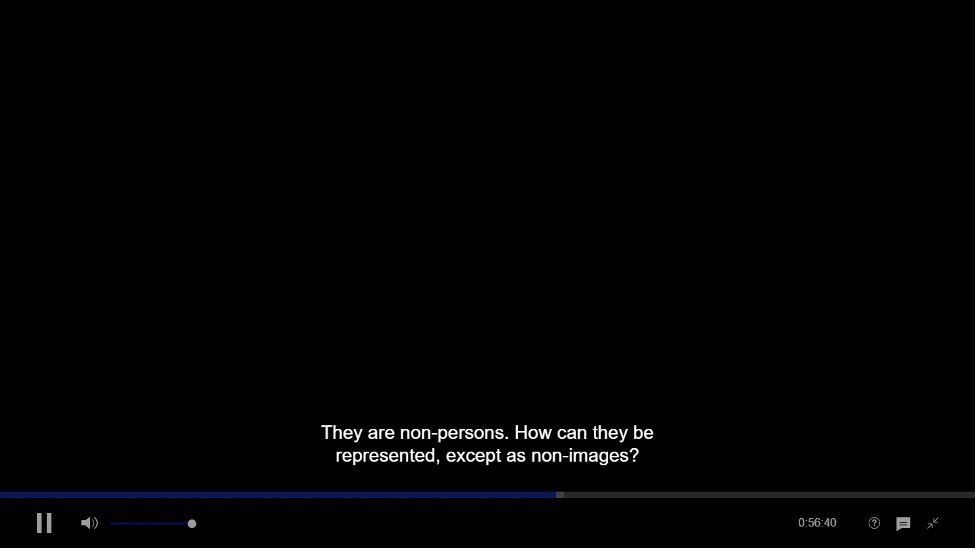

  

Without any speculation on how the screenshot might develop in terms of
its expansion of affordances that allow for the greater agency of the
user (both in technical and normative terms) and in turn greater
similarity to the photographic medium, at this moment the technique
concerning the screenshot is over-determined by the device that is
merely allowing them to preserve what they are seeing being shown to
them. As if our smartphones and computers are talking back to us through
their option for screenshotting and saying “take a picture, it’ll last
longer” thus affirming the relevance and impact of the imagery
constantly presented to us. Frosh goes so far as to say that screenshot
represents a selfie of the device:

> The screenshot is an image of the state of the device as it presents
> itself for viewing and interaction with a user, as subject to human
> intentionality and temporality. It preserves an instant of what we
> could call the ‘screenscape’: the dynamic, contingent, humanly
> oriented ‘face’ of the device as it appears on the screen. To stretch
> an analogy somewhat, the screenshot is the selfie of the device.[^04chapter1_10]

Selfie, as a digital image form, presupposes mechanical image-making in
which the subject and the object of the photo are one and the same. In
that sense, naming the screenshot the selfie of the device again locates
the ‘authorship’ of the screenshot mainly in the machine. Historically,
the subject of the image is always subjugated to the maker of the image,
as not only beauty but also power, lies in the eye of the beholder. This
dynamic is somewhat complicated by the screenshot, as the distinction
between the image-taker and the object of the image is not as
straightforward as it is in photography, painting and cinema.

As the screen in this instance represents an output for images, as well
as the potential input for the screenshot, it fuses the boundaries of
human and machinic vision and image-making.

Zylinska, in her book Non-human Photography notes how non-human vision
allows us to form a critical distance from the concept of perception as
a given and embrace its creative characteristics:

> We could therefore go so far as to suggest that our visual apparatus
> introduces edges and cuts into the imagistic flow: it cuts up the
> environment so that we can see it, and then helps us stitch it back
> together again. With this idea, we arrive at the concept of perception
> as active, or even world-making, rather than just secondary and
> responsive.[^04chapter1_11]

In this sense, perception, as materialized through the screenshot, is
world-making inasmuch as it is allowed to exist by the programmed
interface. In the cases in which the screenshot is disallowed, it limits
the user’s perception to be validated and creative, leaving all the
power to the machine (and the other human who programmed the machine) to
decide how a user can appropriate and visually work with their digital
environment.

The question of authorship and creative input of the screenshotter is
mainly based on what Nicholas Bourriaud named the aesthetic of
post-production, that is, in the use and remix of already available
data.[^04chapter1_12] With postproduction, artists make use of already existing
objects, cultural forms and the world itself. It is emblematic of the
appearance of the web (although there are artists that engaged in
Postproduction before its genesis – such as New Realists and Pop Artists
for example), since “the activities of DJs, Web surfers, and
postproduction artists imply a similar configuration of knowledge, which
is characterized by the invention of paths through culture.“ He also
notes that in that sense “the artwork functions as the temporary
terminal of a network of interconnected elements, like a narrative that
extends and reinterprets preceding narratives.“ Whereas the screenshot
doesn’t necessarily have to be an artwork, its creative and aesthetic
parameters are based on the selection and appropriation of what is
already there, and in such a way that presumes an instant transformation
of the 'raw' visual material into a barely mediated image.

  

## AND SO THE NEW AESTHETICIST SCREENSHOTS…

If, as Frosh notes, the screenshot “preserves an instant of the
screenscape,” it also validates the digital environment as equally
‘real’ as the physical one through our ability to observe, document and
preserve.[^04chapter1_13] He continues, “like physical space, we cannot occupy the
same points of that \[digital\] space at the same time”. Screenshots
confirm the fact that our digital environments are deeply personal, even
though we, as smartphone and computer users, might still have the same
(or quite similar depending on the OS we use) interface designs,
affordances and technical devices we use to browse them. Even though the
classical notion of a point of view doesn’t apply in screenshotting as
it does in photography, it emphasizes more the changing of the digital
environment from person to person rather than the ability of a body to
take up different points in the same physical space. With the
development of highly algorithmically curated digital environments, the
originality of the screenshot and its subsequent point of view, again,
unlike the photograph that demonstrates the skill of the camera operator
to capture a lived moment in a technically virtuous and original way,
stems from the uniqueness of the digital environment of the user (and of
course their ability to recognize it).

Screenshot as a creative and communicational practice belongs to
post-digital or new aesthetics, which are defined by the intertwinement
of humans and machines in realms of perception, image-making and visual
languages. As David Berry and Michael Dieter observe in their definition
of post-digital aesthetics, the role of the practitioner in the
networked, platformized digital environment, which is “marked by the
shift from exceptional to ordinary perceptions of digital creativity”,
is also imagined in terms of techniques of recognizing patterns,
cataloguing, curating, interpreting and transcribing), and then
actualizing these engagements as artifacts for potential
contemplation.”[^04chapter1_14] Additionally, Vito Campanelli identifies that the
“most authentic nature of the New Aesthetic is precisely that of the
archive, \[…\] an archive constantly in motion”.[^04chapter1_15] Campanelli
continues:

> The New Aestheticist is a new figure in between those of artist and
> curator, characterized by the capacity to aggregate aesthetic
> materials. In other words, the function of the New Aestheticist is to
> derive value from an image produced by machinic entities and to
> ‘ascribe’ an aesthetic to it.

Screenshot’s artistic and aesthetic potential is exactly located in this
notion of finding the strange in the trivialized and commercialized
digital environment and it is probably one of the most emblematic image
forms that reflect the current configurations of what we call (digital)
reality. Whether the screenshot serves an aesthetic, communicative or
archival purpose, they generate in-between the humans and (their)
machines, being computed and visually preserved at once. The
'in-betweenness' of screenshots corresponds to “the sublimity of the
images produced by the innovative forms of collaboration between humans
and machines enabled by digital media” which are representative of the
New Aesthetic.[^04chapter1_16]

The online project “Screenshots of Despair, conceived as a Tumblr blog
that relies on the screenshot submissions of everyday users, identifies
itself as New Aesthetic poetry. It features mainly the incidental
machinic imagery of the screen that uncannily anthropomorphizes the
interface and its visual communicative practices. The imagery is sublime
and uncanny, as it contains the traces of both human and non-human,
producing the estranged familiar that might both be banal and
fascinating.

Campanelli quotes Don DeLillo noting that in the images of the New
Aesthetic we recognize ourselves ‘but also something other than
ourselves; or rather, still ourselves – but ourselves complicated,
enmeshed, othered’.[^04chapter1_17] The imagery on the screens we use is always
‘for us’ either because we sought them out, or were humanly or
non-humanly (algorithmically) delivered to us and the archive we
continue to build from them corresponds to the collection of traces of
visual gifts we receive on a daily basis that we continue to use for
different purposes.

Apart from selecting single instances from our environments for
screenshotting, screenshots also have the potential to faithfully
represent the fragmented, windowed environment of our computer screens.
Artist Toru Izumida created a series of collages named simply ‘Screen
Shots’ in which he “use\[d\] selections of online media to create
unexpected combinations that are finalized into a single
screenshot.[^04chapter1_18]”

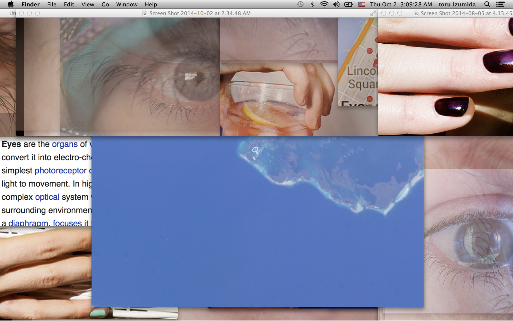

  

## UNCANNILY INTACTILE

The uncanniness of screenshots comes not only from their visual content
but also from their lack of operativity. The screenshot deadens the
interface, fossilizes it and disables any further exchange on the part
of the user. The dynamic digital environment becomes its “shadow”
through the screenshot, as Winfried Gerling would put it, given that the
computer-generated images of the screen that usually have a utilitarian
function, come to a ‘full stop’ through being screenshotted:

> If the screen is filled with the screenshot of the previous status of
> the screen, the difference only becomes apparent when attempting to
> operate within the screenshot. The screenshot is taken as reality—that
> has been—on the computer screen (and pixel-precise). It is a strange
> confusion with reality that could never occur in photographs. The
> latter were only confused with nature early on; otherwise the
> photograph has always been understood as a representation.[^04chapter1_19]

By becoming visually the same as the interface, and yet completely
inoperational, the screenshot invokes uncanniness that might correspond
to its meaning as psychoanalytically defined through human relationship
to death, as Laura Mulvey writes in her account on film stills:

> For human and all organic life, time marks the movement along a path
> to death, that is, to the stillness that represents the transformation
> of the animate into the inanimate. In cinema, the blending of movement
> and stillness touches on this point of uncertainty so that, buried in
> the cinema’s materiality, lies a reminder of the difficulty of
> understanding passing time and, ultimately, of understanding
> death.[^04chapter1_20]

More often, the uncanniness of screenshots will elicit the feelings of
frustration and anxiety we encounter when our computers freeze and
become inoperable, shining the light on the amount of dependency and
powerlessness we experience in those moments.

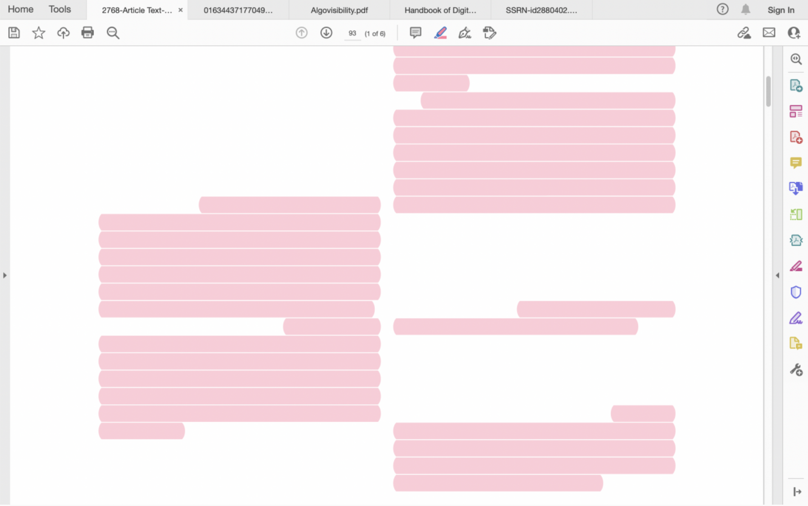

  

The other names for screenshot, including screengrab, according to
Frosh, point to screenshot’s tactility through its becoming an object to
be manipulated as a file and an image.[^04chapter1_21] Correspondingly, Martine
Beugnet notes that the images in the era of the interface are marked not
only by sight, but also by touch:

> Our experience as viewers increasingly become that of “users”: we
> touch the screen to activate a menu and select a resolution, to choose
> and enlarge an image, zoom into it or reduce its size, to start or
> pause a video, to scroll through or superimpose images, to slow down
> or speed up their course, to make them disappear.[^04chapter1_22]

As screenshots can be manipulated by touch as any other digital image,
they disable touch of what they represent, namely the interface. Lack of
tactility is very much present in the screenshot, especially when
encountered on touch screens, given that the touch becomes insignificant
as it has no interfacial function it usually has when operating a
computer or a smartphone through the screen. Their exactness in
representation evokes uncomfortable feelings of the impossibility of
interaction, a technological uncanny that won't subdue no matter how
many times we tap the flat surface.

On the other side, the uncanniness and even computational deceptiveness
of screenshots come into play when the other ways of interfacial
relations become present. A recent problem regarding screenshots
concerns the screenshots of the CoronaPass QR code.[^04chapter1_23] As QR codes
provide interaction through the scanning of visual data, the difference
between the authentic QR code emanating from the app and a screenshot of
it becomes invisible with a successful reading of the code by the
scanner. Screenshot in that sense can facilitate, not the lack of
interaction, but the unwanted, forbidden, or illegal interaction,
through their mimicking of ‘screen authenticity’.

## AUTHENTICITY AND DATA EXTRACTIVISM 

The authenticity of screenshots is, in general, hard to pinpoint, given
that the metadata they provide more or less only concerns the date,
time, and device of taking the image, and contains no information on the
operative contents of the screen[^04chapter1_24]. In that sense, they can easily be
falsely fabricated[^04chapter1_25] and there are only a few ways to forensically
determine if they are ‘real’ or not. Moreover, another layer of the
authenticity of digital images arises in the context of the screenshot.
The recent debate on screenshotting minted digital artworks[^04chapter1_26] invokes
the Benjaminian discussion on the aura of digital artworks. The NFT as a
digital certificate of ownership, devalues the imagistic properties of
the digital artworks that can be easily replicated with the help of a
few keys on your device. It displaces the ‘authenticity’ of the work on
the place on the blockchain, rather than trying to preserve its
possessional exclusivity like the streaming platforms, by disabling the
image to be screen-replicated through the code. Moreover, this
authenticity is also located in the proof of monetary value and
ownership, rather than in the material and aesthetic properties of the
image. As the function of the screenshot allows for immense reproduction
and appropriation, the purpose of the NFT also might be read as a
response to it, seeking to preserve the intended (market) value of the
artwork.

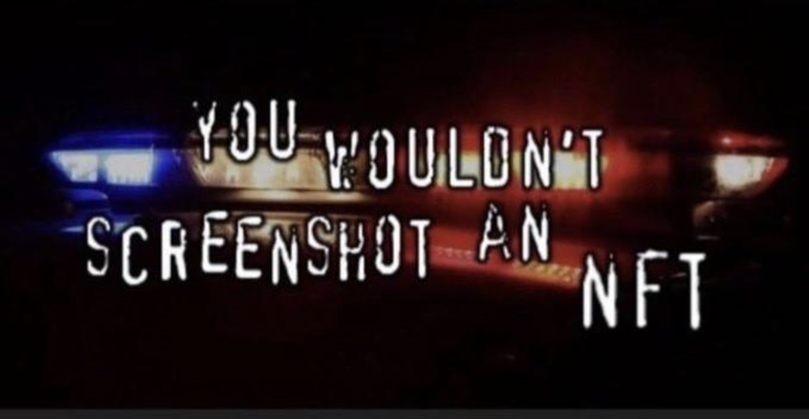

  

The screenshot was already connected to Hito Steyerl’s concept of ‘poor
image’[^04chapter1_27] by Švelch that generates in digital environments and is
marked by its low resolution, lack of focus, easy reproducibility and
shareability. Steyerl writes:

> The poor image is a copy in motion. Its quality is bad, its resolution
> substandard. As it accelerates, it deteriorates. It is a ghost of an
> image, a preview, a thumbnail, an errant idea, an itinerant image
> distributed for free, squeezed through slow digital connections,
> compressed, reproduced, ripped, remixed, as well as copied and pasted
> into other channels of distribution.

Not only is the screenshot a poor image, but it is also a free image,
especially when conceived in the context of NFTs and digital artworks.
Steyerl notes that the poor image lacks focus, due to its usually low
resolution, which she also connects to the visual and narrative purpose
of focus – to denote power – “focus is identified as a class position, a
position of ease and privilege while being out of focus lowers one’s
value as an image.” Taking another step in this direction, NFTs direct
focus from the visual and material properties of an image to the digital
certificate of ownership in order to position the artwork’s value. Given
that a digital artwork can be screenshotted, and NFT (as an operational
piece of code) cannot, the digital information of the screenshot as an
image is stripped from the information of the original image.

Kelly Pendergrast writes[^04chapter1_28] on her screenshotting practices as a type
of imagistic resistance to the corporate platform culture that extracts
data and metadata from the endless flow of images it receives from the
users:

> The act of screenshotting an image (rather than downloading it) strips
> out the metadata from the original photograph, and I don’t necessarily
> attribute the artist if I share. \[…\] The screenshot is a gesture
> that lays claim to the act of seeing, and turns the framing and
> capturing of an image that often contains a mixture of windows and
> picture fields (a web page, a Microsoft Word window, all of it) into
> an act of creating anew. The old metadata: Gone! In its place, my
> image, with fresh data and the pleasingly prosaic file name “Screen
> Shot 2020-12-01 at 9.54.48 PM.”

By disrupting the circulation of data by creating a new piece of visual
and digital information, the screenshot taker actively disrupts the
traceability and computability of the image which could be used for
surveillance and governance on the side proprietary digital platforms.
The lack of original metadata in screenshots, whether they represent
minted artworks or any other digital image, means shifting the focus and
agency from the coded to the visual, as that is also the only realm
accessible to most computer and smartphone users.

In her account of poor images, Steyerl notes that they create ‘visual
bonds’, which is a term by Russian avant-garde filmmaker Dziga Vertov:

> This “visual bond” was, according to Vertov, supposed to link the
> workers of the world with each other. He imagined a sort of communist,
> visual, Adamic language that could not only inform or entertain, but
> also organize its viewers.

By being devoid of monetary value, as well as useful metadata,
screenshots are digital images with primarily visual quality, providing
the users to establish visual bonds to other users and their respective
digital environments, through their aesthetic, affective and
informational purposes.

## DATA GATHERING, IMAGE SURVEILLANCE

Apart from its aesthetic possibilities, one of the screenshot’s
functions lies in its documentary nature. Frosh explains the documentary
aspect of the screenshot as an archival and epistemic practice, which,
when coupled with the heightened iconicity and indexicality of
screenshot, points to the intensified visual aspect of the screenshot as
a digital document – “documenting is an epistemic practice: the kind of
knowing that is all wrapped up with showing, and showing wrapped with
knowing.[^04chapter1_29]”

Frances Corry presented a study on the potential harm of screenshot's
documentarity. [^04chapter1_30] She chose to focus on two events, one that
pertained to the use of screenshots to expose a sexual predator, and the
other one to the misfortunate event of teenage suicide caused by
exposing the private content of her videos via screenshotting and
distributing the images. In her analysis, Corry offers a perspective on
screenshots as images that

> *move digital information between the walls of seemingly private
> (e.g., one-to-one communication) or privatized realms (e.g.,
> proprietary platforms) and public display, just as they threaten to
> save and circulate media that was assumed to be ephemeral. In each,
> they play with the expected boundaries of digital time and space.*

She notes that screenshots in that sense make manifest Wendy Chun’s and
Sarah Friedland’s concept of leakiness in the digital realm that
presupposes the “simultaneously breaching and sustaining assumed
boundaries between public and private.” In both analyzed cases, the
screenshotting practice manifests the power of the digital observer to
preserve the instant of the fluid digital environment (that is also
composed of other people and not only machines) and leverage or abuse
that evidence to their liking.

  

Though the power of screenshots can be present and very significant as a
catalysator of such extreme cases, it is also a fundamental part of much
more mundane situations. Snapchat famously lets users know when their
messages and sent photos are being screenshotted, in order to preserve
the sense of transparency and security of its users that might deal with
sensitive content while communicating with their peers. Kaitlyn Tiffany,
in her account on screenshots, notes that the screenshot facilitates
“the idea that anything and everything you do online could be—and let’s
face it, probably is—captured by someone, somewhere, and then stored for
future use, has imbued our lives online with a latent sense of
paranoia.[^04chapter1_31]” Screenshots, in their everyday use, are used as an
instrument of surveillance – peer-to-peer or lateral surveillance, as
Mark Andrejevic names this type of surveillance produced by the
pervasiveness of watching practices instituted by social media.[^04chapter1_32]

## NO SHOT LIKE THE SCREENSHOT

As a very rudimentary medium, that more or less only allows its users to
freeze and save the instant of their digital environment in the same way
it is shown to them, screenshot tells a lot about the dynamics of the
relationship of humans with their indispensable screens and different
types of functions and values of the image in this screen-mediated
environment. Screenshot continues to be framed and determined by the
visible and invisible possibilities of the screen of its origin, as well
as the eager and curious user who aims to establish a connection with it
through the act of screenshotting. Similar to what we think we know
about technical image-making, but simultaneously exceeding it and being
embedded within the ephemeral images of computer and smartphone screens,
the screenshot exists as a covert and simplified symptom of the complex
web of relations users are subjected to in their everyday
‘time-wasting’.

  

***Dunja Nešović*** *is a PhD Candidate in Communication Studies at Concordia University in Montréal/Tiohtià:ke and a Lab Coordinator/Research Assistant at the Digital Intimacy, Gender, and Sexuality Lab. Dunja's research broadly encompasses investigating digital media aesthetics and interfaces, with her current doctoral inquiry focusing on the mediation of lesbian desire in a convergent digital media environment. As a researcher, curator and editor, she collaborated with the Institute of Network Cultures (Amsterdam, NL), Tijdschrift Kunstlicht (Amsterdam, NL), Screen Walks (Photographer's Gallery in London and Fotomuseum Winterthur) and IMPAKT Festival (Utrecht, NL).*

[^04chapter1_1]: https://www.fotomuseum.ch/de/2019/07/05/screen-selfies-and-high-scores/

[^04chapter1_2]: Jan Svelch, ‘Redefining screenshots: Toward critical literacy of
    screen capture practices’, *Convergence: The International Journal
    of Research into New Media Technologies *27.2 (2020): 554-569.

[^04chapter1_3]: Susan Sontag, *On Photography*, New York: Farrar, Straus and
    Giroux, 1977.

[^04chapter1_4]: John Smith, “*How to Take Screenshots on Your Smart TV Screen*,”
    *Medium*, October 22, 2019,
    <https://medium.com/@johnkpdsmith/how-to-take-screenshots-on-your-smart-tv-screen-6596a2899e0d>

[^04chapter1_5]: Paul Frosh, *The Poetics of Digital Media*, Cambridge (MA): MIT
    Press, 2018.

[^04chapter1_6]: Jacob Gaboury, “*Screen Selfies and High Scores*,” *Still
    Searching…* blog, Fotomuseum Winterthur, July 5, 2019,
    <https://www.fotomuseum.ch/en/2019/07/05/screen-selfies-and-high-scores/>

[^04chapter1_7]: Vilém Flusser, *Into the Universe of Technical Images*,
    Minneapolis: University of Minnesota Press, 2011.

[^04chapter1_8]: In a vain attempt to simulate the photographic intervention of
    brightness of the screenshot, I tried to re-adjust the brightness of
    the screen and take a screenshot only to see that the done image is
    always the same brightness - namely my device is programmed to
    capture the image as having the highest brightness as default.

[^04chapter1_9]: Jan Svelch, ‘Redefining screenshots: Toward critical literacy of
    screen capture practices’, *Convergence: The International Journal
    of Research into New Media Technologies *27.2 (2020): 554-569.

[^04chapter1_10]: Paul Frosh, *The Poetics of Digital Media*, Cambridge (MA): MIT
    Press, 2018.

[^04chapter1_11]: Joanna Zylinska, *Non-Human Photography*, Cambridge (MA): MIT
    Press, 2017.

[^04chapter1_12]: Nicholas Bourriaud, *Postproduction*, New York: Lukas &
    Sternberg, 2007.

[^04chapter1_13]: Paul Frosh, *The Poetics of Digital Media*, Cambridge (MA): MIT
    Press, 2018.

[^04chapter1_14]: David M. Berry and Michael Dieter, ‘Thinking Postdigital
    Aesthetics: Art, Computation and Design’, in David Berry and Michael
    Dieter (eds) *Postdigital Aesthetics Art, Computation and Design*,
    London: Palgrave Macmillan, 2019, pp.1-11.

[^04chapter1_15]: Vito Campanelli, ‘New Aesthetic in the Perspective on Social
    Photography’, David M. Berry and Michael Dieter (eds) *Postdigital
    Aesthetics Art, Computation and Design*, London: Palgrave Macmillan,
    2019, pp. 259-270.

[^04chapter1_16]: Ibid.

[^04chapter1_17]: Ibid.

[^04chapter1_18]: Beckett Mufson, “An Artist’s Screenshot Collages Capture
    Computerized Creativity,” *VICE*, September 10, 2014,
    [https://www.vice.com/en/article/qkwbxx/an-artists-screenshot-collages-capture-computerized-creativity](https://www.vice.com/en/article/qkwbxx/an-artists-screenshot-collages-capture-computerized-creativity?utm_source=chatgpt.com)

[^04chapter1_19]: Winfried Gerling, ‘Photography in the
    Digital’, *Photographies *11.2-3 (2018): 149-167.

[^04chapter1_20]: Laura Mulvey, Death 24x a Second: Stillness and the Moving Image,
    Chicago: Reaktion Books, 2006.

[^04chapter1_21]: Paul Frosh, *The Poetics of Digital Media*, Cambridge (MA): MIT
    Press, 2018.

[^04chapter1_22]: Martine Beugnet, ‘Touch and See? Regarding Images in the Era of
    the Interface’*, InMedia* \[Online\] 8.1 (2020).

[^04chapter1_23]: https://www.security.nl/posting/715107/Aanpassing+CoronaCheck-app+moet+misbruik+screenshot+qr-codes+tegengaan

[^04chapter1_24]: https://superuser.com/questions/1010186/how-to-prove-the-authenticity-of-a-screenshot/1010249

[^04chapter1_25]: https://technastic.com/make-a-fake-create-fake-screenshots-for-almost-everything/

[^04chapter1_26]: https://medium.datadriveninvestor.com/why-nfts-dont-have-a-screenshot-problem-4e8b284051b9

[^04chapter1_27]: Hito Steyerl, “*In Defense of the Poor Image*,” *e-flux Journal*
    no. 10 (November 2009),
    [https://www.e-flux.com/journal/10/61362/in-defense-of-the-poor-image/](https://www.e-flux.com/journal/10/61362/in-defense-of-the-poor-image/?utm_source=chatgpt.com)

[^04chapter1_28]: Kelly Pendergrast, “*Screen Memories*,” *Real Life Mag*, January
    14, 2021,
    [https://reallifemag.com/screen-memories/](https://reallifemag.com/screen-memories/?utm_source=chatgpt.com)

[^04chapter1_29]: Paul Frosh, *The Poetics of Digital Media*, Cambridge (MA): MIT
    Press, 2018.

[^04chapter1_30]: Frances Corry, “*Screenshot, Save, Share, Shame: Making Sense of
    New Media Through Screenshots and Public Shame*,” *First Monday* 26,
    no. 4:
    [https://firstmonday.org/ojs/index.php/fm/article/view/11649/10107](https://firstmonday.org/ojs/index.php/fm/article/view/11649/10107?utm_source=chatgpt.com)

[^04chapter1_31]: Kaitlyn Tiffany, “*Screenshots Are the Gremlins of the
    Internet*,” *The Atlantic*, June 1, 2021,
    [https://www.theatlantic.com/technology/archive/2021/06/screenshots-gremlins-internet/619062/](https://www.theatlantic.com/technology/archive/2021/06/screenshots-gremlins-internet/619062/?utm_source=chatgpt.com)

[^04chapter1_32]: Mark Andrejevic, ‘The work of watching one another: Lateral
    surveillance, risk, and governance’, *Surveillance & Society* 2.4
    (2005): 479-497.

# Entropyposting or the Art of Sabotaging Your Online Self

## Arianna Caserta

### Originally published November 4th, 2024

*In an ocean of perfectly constructed auto narrations, users draft an
ode to the " non-readable" in search of the only method to reappropriate
the entropic and spectral side of the Internet.*

I remember scrolling through Yung Lean's Instagram profile meant trying
to decode the rules of a universe nobody knew anything about. Pages full
of distorted shapes, ultra-bright objects, mysterious textures and
blurry surfaces of dubious origin that create confusion in the comments
section. In a virtual ocean of packaged and well-structured Instagram
feeds, Lily-Rose Depp  - nepo baby on the rise - was posting blurry
pictures of herself and her friends. Ugly, unpolished photos, depicting
actions far more ordinary than was expected of someone her status. Her
profile repelled—and at the same time fed—the frenzied appetite for
gossip.  Translated into a spasmodic hunt for clues that would reveal
her luxurious lifestyle, fans were digging into the folds of her
personal online narrative. Why were these people using Instagram in the
exact opposite way it was meant to? Why were they, on purpose, offering
their audience something so ambiguous and unreadable?

Today's users have more than absorbed the aesthetics of the
undecipherable, causing its rules to be able to spill over into every
field of the visual landscape: design, fashion, beauty, performative and
figurative art. But the intense adoration for entropyposting—the impulse
of sharing non-decodable and unreadable information online—goes far
beyond the luminescent hyperpop-esque imagery cleverly manufactured
by Drain Gang. And far deeper than any product that lo-fi aesthetics has
ever spawned. As much as I recollect its form, entropyposting doesn't
even resemble the primitive act of "Instagram dumping", sometimes
affiliated with Shitposting. The latter is about an effortless,
unbothered, post-ironic narration: it is about merging into the chasm of
images online. Entropyposting is exactly the opposite. It is cryptical,
mysterious, sorcerous, and complex: it forces you to stop and take a
pause from the chasm, trying to decrypt something. It is - if anything -
closer to a method of pushing technology to its limits, generating
useless content and making social interactions less clear and
progressively more complicated.

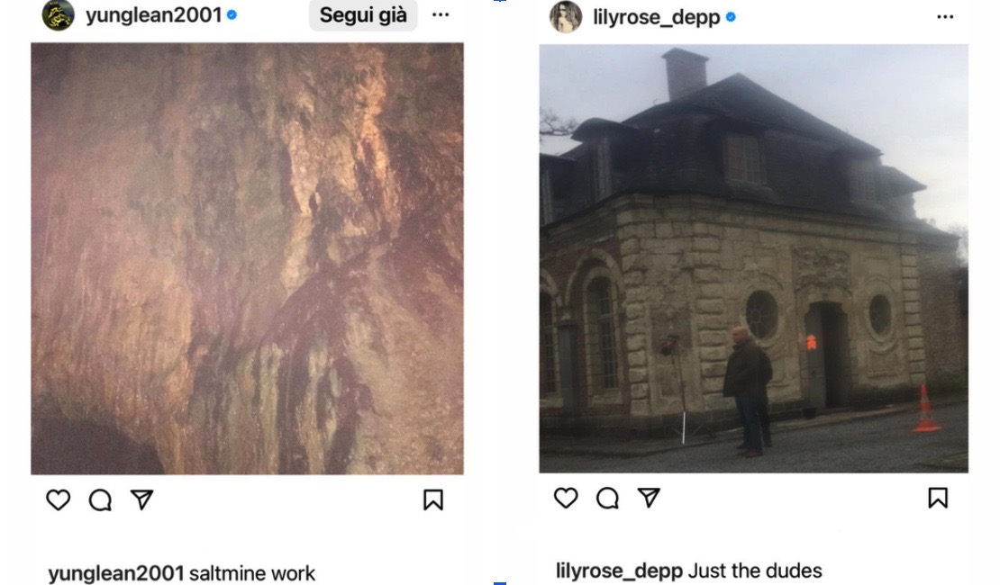

 

There is something about the anti-glamourous attitude of these
celebrities sharing unappealing, blurry, badly cropped, crooked, or
extremely pixelated images that are reminiscent of the uncommitted and
often boring way of dressing that some super-rich people like to be seen
in public.[^05chapter2_1] As Caroline Busta writes in “The internet didn't kill
counterculture-you just won't find it on Instagram”:[^05chapter2_2]

> "Away from the parades, palaces, and disproportionate girths of
> modern-day strongmen like Viktor Orbán, Kim Jong Un and Donald Trump,
> the most iconic features you'll find among the big tech set are more
> likely to be a black turtleneck, a Patagonia fleece jacket, and the
> absence of handbags."

Busta suggests that "real power keeps a low profile because it doesn't
need a social media presence: it owns it." This is one hypothesis:
celebrities do not need to try. Their game has already been played, and
their engagement stays unchanged. They do not follow the algorithm: they
shape it.

The truth is that one cannot think of entropyposting (as we know it
today) only as a way to betray the platform. Like every other Internet
trend, entropyposting is far from being a rebellion against
technological hegemony: rather, it is once again a disposable way of
representing oneself online; a modus operandi ready to catch up with
users all over the world until it disappears to make way for the next
trend.

However, there is no limit when unreadability becomes the Zeitgeist: if
it's true celebrities narrate themselves in lowkey terms to betray their
audience's craving for information, the final stage of entropyposting
resembles anything but a way to go unnoticed. The denial of gossip,
glitz, and information pornography to the voyeuristic user has shown the
latter something unfamiliar: if the ‘degree of disorder’ rises, it
increases its non-readability and unpredictability. A rise in disorder
corresponds to an increase in entropy, and entropy—understood as the
measure of the complexity in a message—creates information. Clear
information gives less information than a glossy non-entropic narrative
would. Instead, a complex narrative generates curiosity, answers unasked
questions, doesn't stop at the surface, and triggers the creation of
infinite possible worlds.

The key, then, is to find something that forces a break in the flow,
that demands more attention. And in a world of perfectly structured
Instagram reels, TikTok formats and trends, pre-packaged branded posts
with their appropriate \#adv hashtag, and social media management
courses that teach step-by-step how to beat the algorithm, content slips
by our attention as if it never laid on it before. The only way to
resist? Increase the degree of disorder. Force the user to pause for
more than the 2.5 seconds of maximum attention span calculated by social
media analytics. Add entropifying to one's own online narrative.

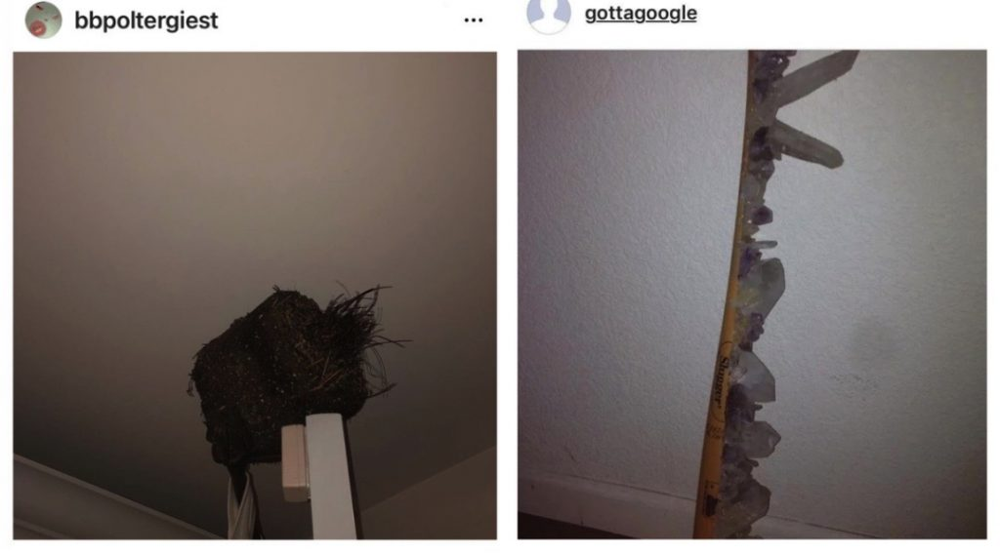

 

But the music industry is the cradle of more than just one aesthetic
shift: the creepy Instagram profile of Sacramento trio Death Grips lends
itself to entropyposting theories to such an extent that it may provide
a visual essay for it. With music videos and album covers designed to
trigger the madness and curiosity of Reddit users worldwide, the trio
pioneered the art of entropyposting by paving the way for the *L'Âge
d'Or* it is undergoing today (yes, all your friends have shared a still
from the Guillotine video at least once, no matter the context). These
are semantic stimuli that are impossible to categorize, and complex to
approach except with a cynical, sneering, post-ironic attitude:
authorless remnants on the fringes of that glossy Internet that you
believe you rule at the click of a button, with its reassuring windows,
annoying pop-ups and well-distributed hierarchies; interfaces whose
every secret we are certain to know. 

The idea of the ‘digital wreckage’ has been pondered most of all by
English experimental musician and visual artist Dean Blunt. It is
shocking to trace his influence in so many musical scenes that have
arisen in the very last few years in Europe: godfather of a certain
sub-genre of avant-garde pop and, since 2012, founder of the music label
World Music, Blunt is considered one of the most prolific figures in
Internet music, famous for always imagining his production in a
contradictory, ubiquitous, multifaceted aesthetic flow, where different
stimuli overlap, refusing the dynamics of a market that conceives a
musical product as a well-packaged object dictated by the reins of
majors. 

Starting in the 2010s, the Insta account World Music released covers of
hundreds of singles and mixtapes drawing on unprecedented art direction:
pixelated screenshots from Facebook homes, photos downloaded from Google
Images in the worst possible quality, underwhelming graphics created in
Paint, triumphs of Comic Sans, stretched emojiis, and stock images. With
those projects with such ambiguous visual identities released on
Bandcamp, World Music declared itself against a hierarchy of images, -
and music - poking fun at the somewhat clumsy care with which artists
curated their projects, underestimating the fact that they would be
dispersed across the web along with all the other nomadic images and
sounds that take part in the stream. Dean Blunt and World Music caused a
détournement: instead of trying to emerge, they were preoccupied with
blending perfectly into the cacophonous landscape of information of all
types and forms, to navigate the Web aimlessly, authorless,
recipientless. That is, until the abstraction of the *Black Metal *album
(apologies to Kanye West and his Donda, which came much later).

 

Direct descendants of Dean Blunt’s heritage, the Spanish visual artist
duo Fomotrauma, associated with the Spanish label Rusia IDK, is the best
example of the impact of world music operations on digital natives: a
new school of artists that take their cue from the exauthoring of newly
created images, ready instead to give context back to the precious
digital junk that is destined to be lost and rediscovered in an endless
cycle of downloads and screenshots.

 

In the paranoid loop of content suggested to users according to their
darkest inclinations, new generations of users are interested in
bringing backscattered images, giving entropy to the interface to try
and break free from a constrained system, and bringing uncertainty back
into preconfigured patterns. The Internet has always been spoken of as
something extremely close to magic, a black box of spectres that has
more in common with ghosts than with codes. But how much abstraction is
allowed in a system made of interfaces?

Entropyposting is a practice of compressions, reiterations, confused
processes, of fascination with all visual impulses that are difficult to
place, with no point of departure and therefore no point of arrival.
Something that resembles the immateriality of a GAN-generated image or a
portrait by Gerhard Richter, who worked on that inaccessibility that
only mass-media reproduction can give to an image. Or even as in the
case of American photographer Thomas Ruff’s JPEGs series, - composed of
images downloaded from the Internet and resized to worsen their quality
to the maximum - or the spray paintings by Turin-based artist WOC, which
crudely reproduces iconic pop culture images by worsening something we'd
be able to enjoy in 4K. 

The world of art microcelebrities has more than absorbed the spirit of
the times of which entropyposting is the child: the highly followed
profiles of art director Ben Ditto (or as Interview Mag recently called
him, “The Renaissance Man of the Internet Age”[^05chapter2_3]) seem like dark
portals to gore, horror, and ironic images, all fused together in an
exquisitely pop way. The founder and editor-in-chief of Coeval Magazine,
Donald Gjoka, holds the same power: his Internet activity enraptures and
confuses, portraying an online dimension where AI-created images,
post-ironic memes, and childish drawings coexist on the same surface.

 

Debunking the idea that every trend is destined to disappear over time,
the aesthetic trend that has most powerfully devirtualized the practice
of Entropyposting is definitely permanent: tattoos. The aesthetic has
translated its hallmarks into messy, twisted, web-like designs that
resemble time-worn manuscripts or the glitchy interface of a poorly
designed website. In the world of moving images, director Ryan
Trecartin embodies the beating heart of entropyposting practices by
presenting himself as a leader of chaotic imaginaries and a narrator of
worlds of absolute digital schizophrenia, where every scene seems to
come straight from a home video shot by teenagers caught in collective
hysteria, or from the darkest corners of the deep web.[^05chapter2_4] 

For the same reasons, meme culture has begun to revolve around cryptic
infographics and all-text images. As Biz Sherbert explains in the essay
“Intimaxy and the Machine: Godposting – or: New Internet Esotericism”,
today's kabbalistic graphics macerate and reject hyper-readability by
swallowing perfectly curated, user-friendly blocks of text and turning
them into something deliberately hard to read, something viscous enough
to tickle the brain's grooves before thought slips over them and is
already clicking on the next story.[^05chapter2_5] In Talk Magazine, writer Alexi
Alario, adds, "that's why the unnecessary complexity and baroqueness of
these charts are so appealing: because they force us to spend time
decoding something."

Sans Serif? Out. Deep-fried fonts and overlapping elements? In. And no,
sorry, you will not be able to consume this meme in 0.3 seconds. You'll
have to wait and read the whole thing before (maybe) you can be rewarded
with a dopamine rush.

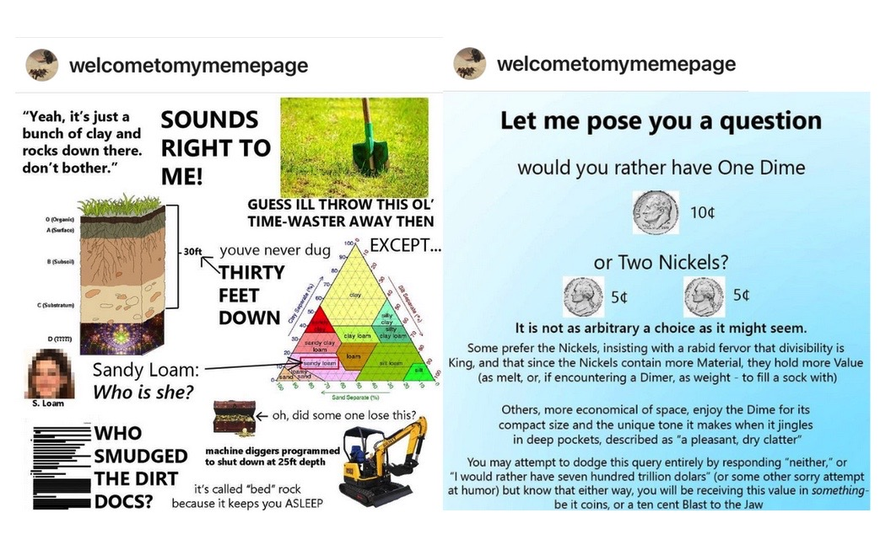

 

The visual landscape has completely changed. Tired of the vulgar,
didactical, and all-too-obvious content that TikTok stars keep shoving
down our throats, we now know that we have to aim for closure,
restlessness, mystery, for silence. We want to decode, not be decoded.

In the essay “In Defense of the Poor Image”, published in November 2009
for Issue \#10 of e-flux, artist Hito Steyrl defined the implications of
sharpness in establishing class privilege, where the "poor" image", "a
rag or a rip, an AVI or a JPEG, a file whose name is deliberately
misspelled" is opposed to the privileged position of high resolution,
("Focus is identified as a class position"), legitimizing itself in
opposition with the violent dislocation and circulation of audio-visual
debris without credibility. It is Hito Steyerl herself who points to an
essential change, a major semiotic shift where the phenomenon of poor
images fits perfectly:

> "On the one hand, \[the poor image\] works against the fetish value of
> high resolution. On the other hand, this is precisely why it ends up
> fitting perfectly into an information capitalism that thrives on
> compressed attention spans, on impression rather than immersion, on
> intensity rather than contemplation, on previews rather than visions."

Born in response to the privatization of online narratives - where every
post is commodified and serves to give a very specific piece of
information - entropyposting is not structured to signify, but to
counter-signify. Seeking to diverge, however, the territory of poor
imagery lends itself to the more distinctive dynamics of capitalism:
narratives lose matter and gain speed, and their inability to focus
makes room for submissiveness.

Restoring importance to the magma of pixels by making fun of those same
images and the way they spread so quickly is a way of feeling like the
Web Makers of one's own destiny, of restoring the Internet to something
fickle, imperfect, failing, and non-corporate. If the promise of Web 3.0
is a user-centred Internet, the natural motion is to break up the
interface or to go against it to the point of interference. But if the
interface adapts, it grows new limbs, like a multifaceted
self-regenerating monster.

Please, beware of your entropyposter friends who suddenly delete all the
photos from their social media accounts, change their user name to an
endless code of letters and numbers and suddenly share a blurry
screenshot of a video game interface or the overexposed photo of a
garbage dumpster seen on a back road to their parents' house.

On the Internet, nothing is truly spontaneous or dictated by instinct.
Our profiles are no different from the walls of an art gallery or
museum: everything posted is a symbol of something that can be
deciphered and understood in its context. Just like a ready-made that
acquires new meaning when displayed in a fancy gallery, each of our
enigmatic contents hides a secret message. We’re aiming to be obscure,
to convince ourselves that we have finally come to understand something
that no one else can ever come close to grasp. We have had enough of
internet microtrends, the endless little niches that suddenly turn
mainstream. We are tired of coming face to face with the fact that we
are all, hopelessly, inevitably, the same. We long for individuality,
not globalization. And the saddest thing? Instagram is far from saving
us. Because nothing, absolutely nothing is too complex for users. And if
entropy is the Zeitgeist, there is no secret anymore: we've discovered
it already.

***Arianna Caserta** (Rome, 2001) is a writer and researcher focusing on
online identities, post-internet art, and the intersections between film
and internet culture. Her work has appeared in online magazines
including Dazed, i-D, 032c and Nero Editions. She holds a BA in Film and
Photography, where she wrote a final dissertation about teen nihilism in
cinema, and she's currently a MA student in Film Theory, where she
investigates the links between cinema and digital culture.*

[^05chapter2_1]: Simon Usborne. “Mark Zuckerberg and the Art of Being Smart
    Casual.” *The Independent*, November 10, 2014.

[^05chapter2_2]: Caroline Busta. “The internet didn’t kill counterculture — you
    just won’t find it on Instagram.” *Document Journal*, January 14,
    2021.

[^05chapter2_3]: Interview. “Meet Ben Ditto, The Guy Meme-ing His Way Through War.”
    Interview Magazine, March 14, 2022.
    [https://www.interviewmagazine.com/culture/search-history-meet-ben-ditto-the-guy-meme-ing-his-way-through-war](https://www.interviewmagazine.com/culture/search-history-meet-ben-ditto-the-guy-meme-ing-his-way-through-war?utm_source=chatgpt.com)

[^05chapter2_4]: Ryan Trecartin. I-Be Area. 2007. Digital color video with sound,
    128 min. Solomon R. Guggenheim Museum, New York.
    [https://www.guggenheim.org/artwork/22506](https://www.guggenheim.org/artwork/22506?utm_source=chatgpt.com)

[^05chapter2_5]: Biz Sherbert. “Intimacy and the Machine: Godposting – or: New
    Internet Esotericism.” Various Artists. September 15, 2021.
    https://various-artists.com/godposting/

#From Shitposting to Shitpublishing

##Ezequiel Soriano
###Originally published on February 10th, 2025

These last years I have been spending my time publishing nonsensical
books[^06chapter3_1] of illegible, plagiarized, stunning, low-quality, sublime, and
uncanny content. I was developing a weird publishing project that aimed
to grasp the *extremely online* poetics, displacing shitty content from
forums, wikis, and digital platforms into books. Practicing *trollish
literature*. These books display cursed memes, poorly translated novels,
*keysmashed* text, random images, *lorem ipsums*, YouTube comments,
Wikipedia graffiti, niche forum discussions, motivational quotes, spam,
ai-generated blog entries, pixelated and saturated photos, boring
amateur poems, and automatic video transcriptions. In this article, I
describe these publishing experiments as attempts to go from shitposting
to shitpublishing.

 

##Definitions

Wikipedia describes *shitposting* as “the act of using an online forum
or social media page to post content that is satirical and of
‘aggressively, ironically, and trollishly poor quality’”. The most liked
definition of *shitposting* in the Urban Dictionary says:

 

However, the most flavored shitpublishing definitions linger in the
shadows of these web pages. One of the last definitions on Urban
Dictionary is: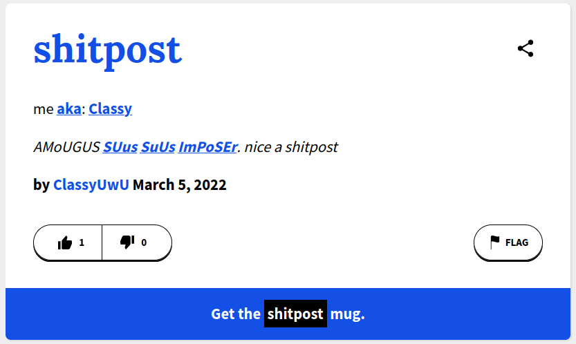

 

In the Shitposting Wikipedia article, on the 10th of November 2017,
someone with the IP 204.109.101.63, erased the description of *shitpost*
to copy-paste the entire script of Christopher Nolan's *The Dark Knight
Rises*. In these shitposting gestures, we can identify the core idea of
*shitpublishing*. Shitpublishing is shitposting in *literary* contexts,
such as books, an encyclopedia, academic journal, or journalist
articles.

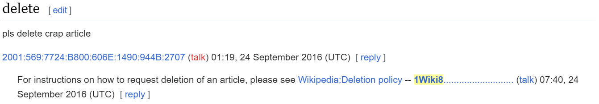

 

## Spamming Books

*Shitposting* is about spamming, about flooding online communication
with nonsensical rubbish. It is similar to the gesture of shouting in a
public debate or pasting stickers on informative posters in the street.
*Shitpublishing* is about categorizing these acts as done work,
translating these oral gestures into literary or written ‘knowledge’. It
turns *trash-talking* into *trash-writing*.

From a literary perspective, shitposting engages with text in its
material dimension. It takes into account the materiality of language.
As Goldsmith wrote about Mallarme’s poetry: “words are no longer
primarily transparent content carriers; now their material quality must
be considered as well”[^06chapter3_2]. *Keysmashing* gives letters the same
materiality that many modernist poets were experimenting with. It
creates pieces of internet vernacular literature that are not meant to
be read but to be weighed.

 

Shitpublishing approaches book-making in the same materialist way.
Amazon hosts several books of this *keysmashed* shitpublishing
‘microgenre’. Books like *Asdfgh* by Asdf Asdfg and ASD dfg, *asdfgh*
(Japanese Edition), *(Transparency) US - Cover creator or PDF Upload
without checking checkbox* by asdfgh, *Marja: abhi marja* by asdfg asdf,
or *safg* by asdf. These *keysmashed* books embody the fast, lazy, and
materialist approach of shitposting. Shitpublishing focuses on the
formal qualities of the books rather than their communicative qualities.
eBooks are seen as digital artifacts that can be thrown, spammed, flood
a platform, or be used as a trollish authority referenced in an online
discussion.

With their project *Kindle'voke Ghost Writers* (2012), the Austrian
artistic and publishing collective *Traumawien* flooded Amazon's
self-publishing platform with thousands of ebooks, exploiting a
vulnerability in the upload system. The covers of these books imitate
the iconic Willy Fleckhaus design of *Suhrkamp Verlag* editions, but
under this reliable design, they hide textual rubbish. The content,
typeset as canonical dramas, was entirely composed of comments scraped
from YouTube. The act of spamming the Amazon marketplace with
interventionist, interface-specific literature,[^06chapter3_3] was a shitpublishing
gesture which used digital publications as projectile weapons.

The *Kindle'voke Ghost Writers* books function solely as data. As a
cover; a product for Amazon to catalog and manage, and as a document
that *occupies* space on the platform's servers. As conceptual writing
works, these books are calling for a “thinkership” rather than a
“readership”[^06chapter3_4]. But beyond this artistic framing, in the context of
Amazon's workers, these books are not calling for a “readership”, nor a
“thinkership”, but a “managership”: meaning that someone has to organize
this data to prevent obfuscation of the platform's digital shelves.

Besides the aggressive quality of this gesture, *Kindle'voke Ghost
Writers* also plays on a more symbolic dimension of shitpublishing. It
turns YouTube comments into literature. This conceptual publishing
project is a shitpost play that challenges the notions of what is deemed
worthy of being published in a book. It muddles the distinctions between
literature and content, users and authors, posting and publishing. Like
Angela Genusa’s *Spam Bibliography,* a book that presents all emails
received in her spam folder between September 2012 and March 2013,
formatted as a bibliography and sorted alphabetically. This work is
described in the Library of Artistic Print on Demand (apod.li) as a
“unique representation \[which\] makes spam messages appear as objects
worth documenting and investigating”.

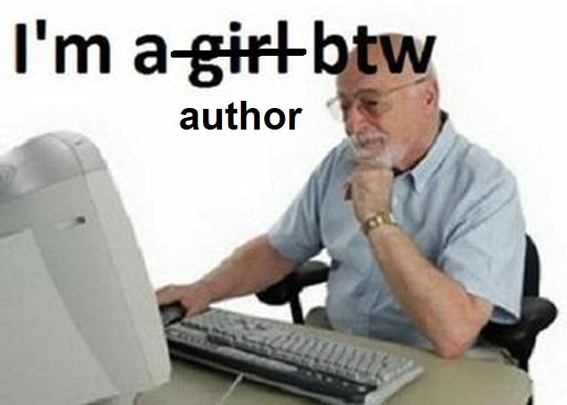

 

##The Uncanny Book Valley 1: POD

Shitpublishing defines the uncanny book valley. These *things* are made
to look like books, but if you approach them as a “readership” you will
have an *unheimlich* experience. These oddly familiar publications
inhabit the margins of what is publishable. They are positioned
somewhere between real books that sound fake and fake books that could
be real. To *experience* this, we only need to have a look at Tim
Holman's collection Always Judge a Book by its Cover, a list of strange
books he found on Amazon with titles like:

*How to Talk to Your Cat About Gun Safety*

*I Don't Care if My Best Friend's Mom is a Sasquatch, She's Hot and I'm
Taking a Shower With Her*

*How to Raise Your I.Q. by Eating Gifted Children*

*Sun-Beams May Be Extracted from Cucumbers, But the Process Is Tedious.
an Oration, Pronounced on the Fourth of July, 1799. at the Request of
the Citizens of New-Haven. by David Daggett*

But nowadays, due to the popularization of generative AI tools, these
kinds of lists will contain much weirder books. Look no further than
books authored by chatGPT on Amazon. There are fascinating uncanny
titles like *The AI Cookbook V: "Mindful Munchies: AI Wellness"* by
George R. Martin III, *The Ai-Eye of Argon: Or, I Wrote a Novel with
A.I. Assistance, But You Probably Should Not* by Martin Berman-Gorvine
or *Chat GPT for Babies* by MR Mikhail Zerafa.

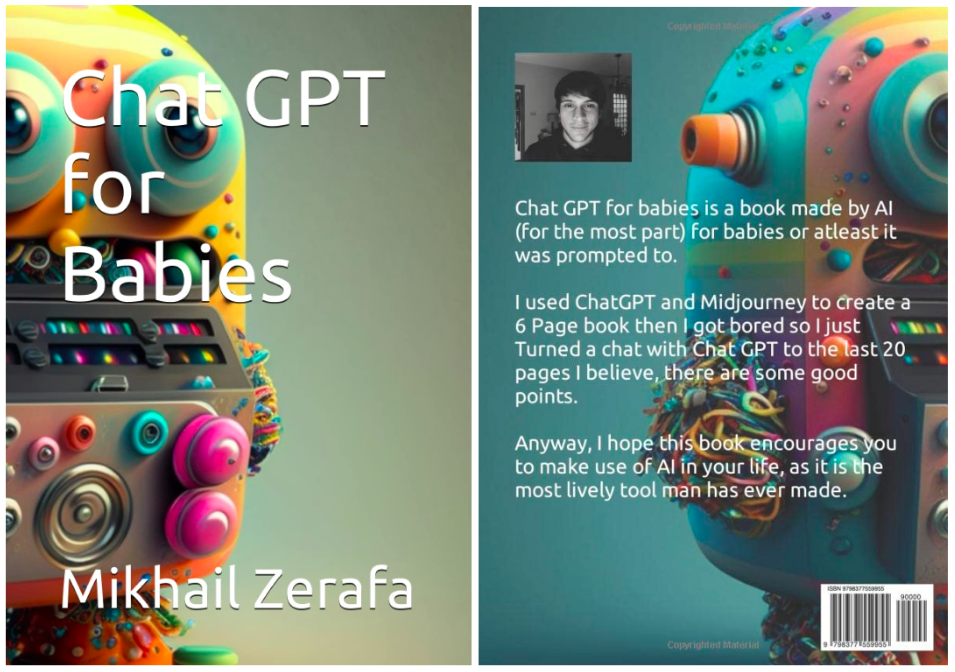

 

But let's take it one step at a time. There are two milestones in the
development of shitpublishing: Print on Demand (POD) platforms and
ChatGPT. Desktop publishing on POD platforms, like lulu or Amazon,
expanded the limits of publishing, thereby approaching the uncanny book
valley. The automation and the speediness of the publishing process on
these platforms is closing the gap between posting and publishing.
Publishing something on lulu only takes 15 minutes longer than posting
something on a blog. And even though for a lot of internet goblins, 15
minutes is an eternity, for others, those minutes are well spent turning
internet rubbish into something greater.

This was the case for many of the authors published on Troll Thread. The
cover of Chris Sylvester’s *STILL LIFE WITH THE POKÉMON YELLOW VERSION
TEXT DUMP IN 30 PT. MONACO FONT JUSTIFIED TO MARGIN DISTRIBUTED AS A PDF
OR A BOOK CONVERTED FROM A MICROSOFT WORD DOCUMENT BY CHRIS SYLVESTER
2012/2013* depicts a mail from Ashugi Kamaguchi that exemplifies the
relevance of trolling in shitpublishing. Trolling about authorship,
originality, authenticity, urgency, value, and hard work:

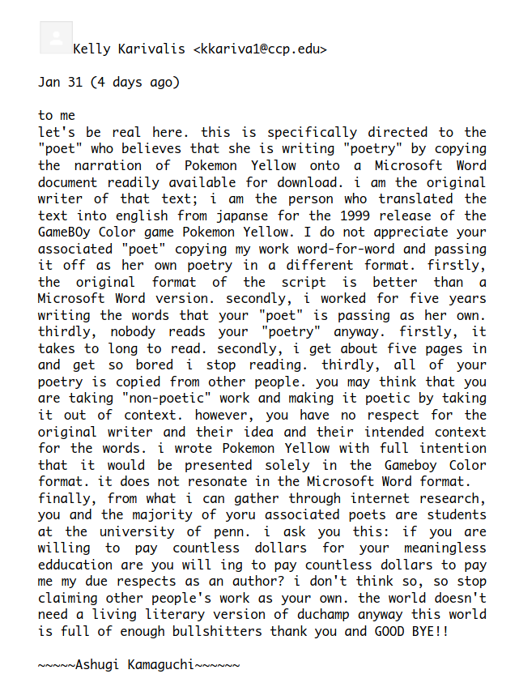

 

Shitpublishing is a performance that implies the gesture of publishing.
We should not interpret these creative acts by actually reading the
books, but through considering the act of publishing. However,
publishing creates *things* that remain. Shitpublishing gestures produce
ambivalent books that live on despite their ephemeral nature, generating
new temporalities. This is where the uncanny character lies. These books
are glitches in literary technology, mirroring the implicit
decontextualization of the very act of writing and publishing.

Similar to many performers, shitpublishers engaged in this
materialistic, appropriationist, and fast approach, challenge cultural
valorization. They produce artifacts that question the notion of the
book as an instrument of knowledge. This is the case for Holaquehase's
book *Art Garfunkel ha leído más libros que tú* \[*Art Garfunkel has
read more books than you have*\], which compiled all the books read by
the singer since 1960, posted by him on his website. Also, Gregor
Weichbrodt published a brilliant comment on hard work and artistic
valorization in his *Dictionary of Non-notable Artists*. After his
Wikipedia page was nominated for deletion from the German Wikipedia,
Gregor wrote a Python script to download the contents of every “article
for deletion”-page from the past ten years and filtered the results by
artistic occupation, subsequently publishing a dictionary dedicated to
these artists.

Among many shitpublishers, the performative trolling character of the
books is related to *hacking*. Sometimes, *Poetry* or *Art* functions as
a hack to publicize things while avoiding legal issues. *Money* by
Maker, for example, is a book consisting of 740 pages of scanned hundred
dollar bills. When printed by someone, the publisher, TROLL THREAD
PRESS, cannot be held legally responsible for potential misuse, even
though they don’t discourage it either. But besides the daring
imagination of printing money, in 2018, Paul Soulellis published *Steve,
Harvey and Matt (2018)*, another 734 page artist book used to publicize
sensitive political material. Soulellis describes the book on his github
as follows:

> This project \[...\] restores access to 1,964 climate change-related
> URLs that were removed from www.EPA.gov on April 28, 2017. The URLs
> point to web pages, documents, presentations, publications, and other
> files that were purged by the U.S. Environmental Protection Agency
> under the direction of EPA Administrator Scott Pruitt and the Trump
> administration. Some of the assets had been accessible on the web
> since 1997. \[...\] The 734-page printed book contains EPA emails and
> spreadsheets that detail the purge, obtained by Freedom of Information
> Act requests

Soulellis' gesture of publicizing emails through the medium of a book or
installation is also reflected by Kenneth Goldsmith’s book *HILLARY: The
Hillary Clinton Emails*, which compiled all emails sent from the
clintonemail.com domain between 2009 and 2013 as “an anti-monument to
the folly of Trump’s heinous smear campaign against Clinton”. Both
Soulellis and Goldsmith instrumentalized the literary format to
publicize relevant political information.

But for most shitpublishers, it is only about *expanded shitposting*;
about spreading shit in different formats, embracing the mutability and
the hybridness of the digital world. Like *Primera antología poética Los
subtitulos de las batallas de gallos* \[*First poetry anthology The
subtitles of the rap battles*\], a book made up of YouTube automated
subtitles of rap battles. This book begins with the paradigmatic
sentence: “to all those fans of rap battles, if you truly like it, you
like it anyway”. Or *Cedeira Miope* \[*Shortsighted Cedeira*\] a book of
low-definition 144p images of a Galician town. Or *Soccer Smoker*, a
zine composed exclusively of b/n photographs of soccer players smoking.
Or *Tutorial de Paella Clásica*, a printed powerpoint presentation
created by the author's father about how to cook a Paella.

##The Uncanny Book Valley 2. The Advent of chatGPT

With the advent of ChatGPT, StableDiffusion, and other broadly used
generative AI tools, shitpublishing created a deeper uncanny book
valley. The power of Large Language Models (LLMs) overpassed the gesture
of publishing appropriated materials from the internet, copypasted
non-sensical rubbish, classified material, or even entire websites. LLMs
can produce realistic textual *artifacts* that meet the expectations of
what a book should look and feel like. ChatGPT is capable of producing
originality, legibility, and common rhetorical and literary figures just
as quickly as copypasting. Now, lazy and fast books look more like
actual books and, at the same time, they have become much more
unpleasant and uncanny than copypasted books.

 

I have some paradigmatic examples of these AI generated shitbooks in my
virtual library. I found lots of children books, like Mahlon Berv’s *A
Journey Through Time - The World's History For Kids*, described as “The
World's History, as taught by famous personalities such as Nelson
Mandela, Bruce Lee, Marie Antoinette”; or Cynthia Maitland’s 3-pages
book *Billy the Brave Bull Terrier: A Tale of Self-Acceptance and
Kindness*. Other uncanny gems include: *Poet V: A Collection of
AI-Generated Poetry About Compassion for all Beings, Options for the end
of the world by chatGPT: In this book, chatGPT will consider the most
popular options for the end of the world and give their prediction of
probability, Bitcoin Fixes This* or *The Art of War Chat GPT: A.I.
interpretation*. And, of course, there are the missing links between
posting and publishing like Joshua Word’s books *300 list of movies you
can watch this Halloween: 1927 to 2024* or *40 HINDI MOVIES TO WATCH
WITH FAMILY ON THIS DIWALI*. All these books, which were authored by
chatGPT, inhabit the uncanny valley created by the collision of OpenAI’s
and Amazon Books’ tectonic faults.

LLMs not only accelerate the writing and publishing process, but also
the lifespan of books. The temporality of these publications is beyond
fast reading or accelerated obsolescence. These books reconfigure
conceptual writing and the attention economy in a wild way. They are not
meant to be read but to endlessly circulate on Amazon. They are spectral
images of books. Their life span is not fast but immediate. The cover,
the title, the description, and the tags are the only content that
matters. The content is relegated to the metadata. This idea is
brilliantly represented in Chuck Tingle’s book *Pounded In The Butt By
My Bizarre Assumption That Chuck Tingle Books Are Just Covers And Not
Actual Books*.

There are some outstanding moves in the milieu of shitpublishing.
Gestures that blur the already blurry environment of fast
self-publishing. Chuck Tingle’s Amazon Books production employs this
accelerated and bizarre flow of shitpublishing and fast self-publishing
to create a collection of surreal gay erotica. Kindle books like
*Pounded In The Butt By My Handsome Sentient Library Card Who Seems
Otherworldly But In Reality Is Just A Natural Part Of The Priceless
Resources Our Library System Provides, Pounded By The Gay Unicorn
Football Squad, Absolutely No Thoughts Of Pounding During My Fun Day
With This Kind T-Rex Because I'm Aromantic And Asexual And That's A
Wonderfully Valid Way Of Proving Love Is Real*, or *Pounded In The Butt
By My Book "Pounded In The Butt By My Own Butt"* twist the reality of
Amazon shitpublishing. Chuck Tingle creates a game of mirrors within a
game of mirrors, publishing slightly real books that look like fake
books and are in fact fake books whose fakeness makes them real books.

##This Is Not the Flood We Expected (or Is It?)

Similarly to what happened to shitposting, in recent years
shitpublishing has become darker. Once upon a time, shitposting
consisted of silly playful gestures by a bunch of online nerds.
Nowadays, due to infamous characters like Steve Bannon, former adviser
to Donald Trump, shitposting is becoming synonymous with far-right,
racist, anti-feminist, and transphobic communicational strategies.
Bannon’s quote exemplifies this turn: “The Democrats don’t matter. The
real opposition is the media. And the way to deal with them is to flood
the zone with shit.” Many right-wing parties in the USA, Brazil,
Argentina, Germany, Spain or, Netherlands (among many others) have
adopted strategies linked to shitposting (from fake news to spam) to
flood the zone with hate speech, fear, and anger.

Related to publishing, chatGPT has changed the rules of shitpublishing.
As McLuhan (1964) said:

> The ‘message’ of any medium or technology is the change of scale or
> pace or pattern that it introduces into human affairs. The railway did
> not introduce movement or transportation or wheel or road into human
> society, but it accelerated and enlarged the scale of previous human
> functions.[^06chapter3_5]

Popular LLMs have changed the shitpublishing scale. There have always
been crappy children's books, ideologically problematic self-help guides
or authors who make a career out of publishing garbage. However, due to
chatGPT, these phenomena have grown exponentially.

A few years ago, I published two books that lowkey hacked the cultural
capital of authorship: *Un libro según la UNESCO* \[*A Book According to
UNESCO*\] is a book that publishes the definition of a book by the
United Nations agency in 49 pages, the minimum number of pages required
by UNESCO for a publication to qualify as a book. And *Una cosa hecha*
\[*One less thing on my bucket list*\], a book that repeated the
sentence “Plant a Tree, Have a Son, Write a Book” as many times as
needed to fill 50 pages.

The goal with these books was to give them an ISBN and add them to my CV in order to increase my publications section as a PhD student. A few months later I came across this article: ‘A researcher who publishes a study every two days reveals the darker side of science’. Apparently, “Thousands of scientists around the world publish at least one study every five days”. It seems that my naive act of hacking the curriculum is an act that is carried out with worse intentions and better means by academics all over the world.

This scenario should lead us to ask ourselves how to deal with the new scale of “flooding the zone with shit” that LLMs facilitate. The poetic gestures of shitpublishing (from Troll Thread to Chuck Tingle) are
exercises that radically mimic broader postdigital publishing dynamics. These artistic gestures emulate the general dynamics of shitpublishing, re-framing these publishing gestures to ambivalently portray the situation. The critical dimension of these literary gestures lies in the fact that they unveil shitpublishing, reframing it as critical and meticulous observation.

Likewise, the artistic exercises of shitpublishing create a necessary reflection on cultural valorization and our understanding of culture or knowledge. They expose a sort of ideological consensus about books being the *guardians of knowledge*. Instead of reproducing a Fahrenheit 451-style critical discourse on censorship, they dismantle the technology of the book as inherently emancipatory.

But these acts of radical mimesis of late-platform capitalism's accelerated dynamics simultaneously reproduce these forms while criticizing them. Shitpublishing is digital publishing accelerationism. And we know that accelerationism is fine for aesthetics but that it is not a wise political tactic. Maybe shitpublishing is as political and activist as avant-garde literature could be. In this article, I have
talked about shitpublishing as closely related to hacking. But, considering it in broader political terms, what is it hacking against? Perhaps the very idea of the book, the value given to the written word,
or literacy as a technology. If it is those things, then it's the same as in Pop Art, Dadaism or Conceptual Writing. Maybe the political potential is not in the “genre” or the “tool”, but in the contexts you flood with shit.

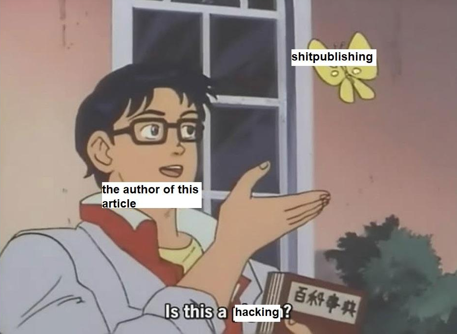

 

Shitpublishing, of course, pertains to speed and irrelevancy. It is fast publishing but, of course, it is not urgent publishing. *In Here and now? Explorations in Urgent Publishing*, the INC reflects on the fact that ‘Despite the promises of the desktop publishing revolution and the immediacy of publishing on the web, acceleration and optimization did
not speed up the publishing process as much as hoped for’. Well, maybe it did speed up the publishing process towards weird places that are still unexplored. Towards practices and ways that we must try to understand in order to deal with the undetermined consequences they may bring. Maybe it will cause the fall (or bigger success) of platforms like Amazon Books, or it will challenge the classist approaches to books as cultural goods, and therefore, books will no longer be seen as something inherently positive. Perhaps reading will no longer be synonymous with critical thinking, and that’s something I still don’t know how to take.

*Special thanks to Diego Asterio for her sharp comments on this text. *

***Ezequiel Soriano** is an anthropologist and artist interested in
digital orality, plagiarism, and machine creativity. Through textual
experimentation and ethnographic research, he explores everyday
practices that play with disciplinary mechanisms in order to disrupt
them. His artwork engages with an ordinary, scattered, and tactical
creativity that participates in a post-digital medieval carnival. He
manages the publishing lab Artefactos Nativos and has collaborated with
Santa Mònica Arts Centre, Medialab Matadero, La Escocesa, Hangar, CCCB,
Xcol, UOC, USC, or the Institute of Network Cultures.*

[^06chapter3_1]: https://www.artefactosnativos.com/

[^06chapter3_2]: Kenneth Goldsmith, *Uncreative Writing*, Columbia University
    Press, 2011.

[^06chapter3_3]: Karl Wolfgang Flender, “Literary Forkbombs: Interventionist
    Conceptual Writing in the Age of Amazon”, *Hyperrhiz, no.* 20*,*
    (2019), doi:10.20415/hyp/020.net01.

[^06chapter3_4]: Vanessa Place & Robert Fitterman, *Notes on Conceptualisms,* (Ugly
    Duckling Presse, 2009).

[^06chapter3_5]: Marshall McLuhan, *Understanding Media: The Extensions of Man,
    (Gingko Press, 1964)*

# Theory of the Stretched Image

## August Kaasa Sundgaard

### Originally published November 7th, 2025

One day, while doomscrolling *Reels*, I came across a clip from *Family
Guy*. It was a scene I remembered from when I was a young teenager:
Peter Griffin sitting on a couch prank-calling a refrigerator. Back
then, I watched *Family Guy* on my parents’ TV. Now I was encountering
the same scene on my phone – only this time the originally horizontal
video had been stretched so violently to fill TikTok’s vertical frame
that Peter Griffin, a character known for being visibly overweight,
suddenly looked slim.

The stretched (moving) image has proliferated far beyond this one TikTok
and has become a staple of Gen Z internet aesthetics. Its exaggerated
distortions appear silly and accidental, but its conditions of
possibility are anything but.

###Stretched to fit

Beneath the surface, the stretch image is a networked image,
hyperspecific to contemporary platform life. Similar to the poor
image[^07chapter4_1], or the deep fried meme[^07chapter4_2], it is both a result of and
stained by the infrastructures that circulate it. More specifically, it
is birthed by the devices we take photos *with* as well as the
limitations imposed by the platforms we post *on*. An iPhone 12, for
instance, records in a 4:3 aspect ratio. Yet the platforms demand
otherwise: Instagram Stories are locked into 9:16 vertical, posts range
between 1.91:1 and 3:4, YouTube defaults to 16:9 horizontal, and so on.
As images and videos of different sizes move through these shifting
aspect ratio regimes, stretching becomes an effective and “lazy”
strategy to adapt content to new platformed contexts. The stretched
image is therefore less a stable picture than a contingent cooperation
between software, hardware, platforms, and users. In it, we see the
tension between *human vision*, which seeks coherence and proportion,
and *machinic vision*, which molds images to optimize for circulation,
engagement, and profit.

  

The stretched image is fast and cost-effective, but this efficiency
comes at the expense of "quality". The stretched image is also lazy,
ugly, and disproportionate. It distorts bodies, objects, and by virtue
of this, “the real.” Unsurprisingly, it thrives in spaces where this
same trade-off is valued. Most typically we find them in memes, but
also, in floor-to-ceiling posters at affordable Thai massage salons
(where an image simply needs to fill a wall), in internet spam (where it
needs to fit a fixed ad space), and across Chinese low-cost dropshipping
product ads.

Temu famously values quantity over quality, adding 10,000 new items
every day. To sustain this pace, it often advertises products that don’t
exist yet. Some are AI-generated designs produced only after purchase
(like the viral AI gorilla couch), others are template-based goods where
typically pop-cultural graphics are overlaid on cheap objects in
infinite combinations. In the latter case, the source images (film
posters, memes, celebrity photos) carry fixed aspect ratios that rarely
align with the products they’re pasted onto. To solve this problem,
images are “stretched to fit”.

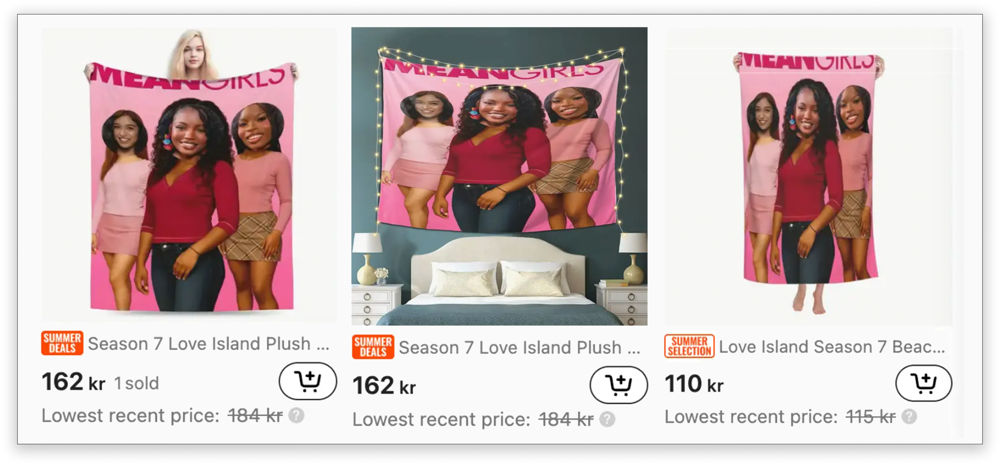

  

One interesting product I found was a wall tapestry of Mean Girls, where
the protagonists' faces have been swapped with three female Love island
US contestants. The image has been stretched so extensively that the
women appear unnaturally wide – an ironic distortion, given that *Mean
Girls* was originally a satire of the “skinny, white” high-school
archetype. This incoherence becomes proof of how the logic of speed and
mass production overrides any human sense of logic, creating products
that, as Caroline Busta wrote about Shein, are “less ‘fashion’ than tag
clouds de-virtualized and remixed by human designers”.[^07chapter4_3] As the same
graphic migrates from vertical towels to square pillows to horizontal
tapestries, the bodies warp differently each time, producing a strange
lineage of *Love Island-Mean Girls* mutants – a kind of accidental,
body-inclusive product collection. Stretching images in this way allows
companies like Temu to sustain an inhuman pace of production, designing
products in real time as culture moves. Just in time to capitalize on
short-lived memes, fleeting trends, or the temporary relevance of a
reality-TV show. The stretched image, while “poor,” is therefore a
conduit for slop-on-demand and a token of what Daniel Feldman calls
janky capitalism: a falling-apart weirdness of the world, while capital
spins ever farther away from the human.

The cost-efficiency of the stretched image also helps explain why it
appears so frequently in the online micro-scenes of Gen Z internet-based
“underground” rappers like Nettspend, Xaviersobased, and collectives
such as Shed Theory and Haunted Mound. These circles are defined by a
relentless drive to release music – finished or not – and the stretched
image neatly facilitates this by offering a quick, low-effort way to
generate visuals. Fakemink, for example, has released nearly 100 songs
on Spotify since 2023, twelve of which use stretched covers, perhaps
partly, to sustain this accelerated pace of releasing. Speed, to which
the stretched image responds to, is reflective of shifts in the broader
music industry: Songs are increasingly shorter, sped-up versions are
routinely produced for TikTok, and releases now occur on a rolling basis
rather than as traditional albums cycles. These shifts are all pushed by
culture shaped by algorithmic imperatives and shrinking attention spans,
in which efficiency, speed, and continuous circulation govern both
production and distribution. In ways analogous to how platformization of
music accelerates sonic forms, the stretched image of, let's say
Fakeminks London Saviour, functions as a visual counterpart allowing
imagery to “keep up”.

  

Stretching an image is not the only way to adapt it to platform
constraints. Cropping is probably the more common solution when faced
with such a “problem”. But what makes stretching far more interesting is
that, while the cropped image erases its “former limbs”, the stretched
image preserves them - though in distorted form. This allows the
stretched image to 1) become an aesthetic in its own right and 2)
visually carry the history of its circulation. Take Bladee’s 2013 music
video *My Magic is Strong*, for example: horizontally stretched footage
shows Bladee frolicking on a grassy field, apparently shot vertically on
a phone but stretched to fit YouTube’s horizontal frame. Or Yung Hurn’s
TikTok videos for *Sonne und Regen* and *100 tausend*, originally
horizontally posted on Youtube, later stretched and spliced to fit
TikTok’s vertical frame. These stretched videos visibly trace their
journey across platforms, much like poor images bear the scars of
compression and digital degradation. Every stretch is a mark of
repurposing, reformatting, and adaptation. In this sense, like the
[*poor
image*](https://www.e-flux.com/journal/10/61362/in-defense-of-the-poor-image),
the stretched image testifies to the acceleration and circulation
inherent in audiovisual capitalism.[^07chapter4_4] Yet it also conveys a form of
care, reflecting the attention of those who have granted it an extended
life across new, platformed contexts. The stretched image thus carries a
contradictory charge: both evidence of the violence that circulation
enacts, and of the persistence and attention that keep it alive.
Symbolically, it articulates the feeling of being pulled and pushed
violently across digital platforms.

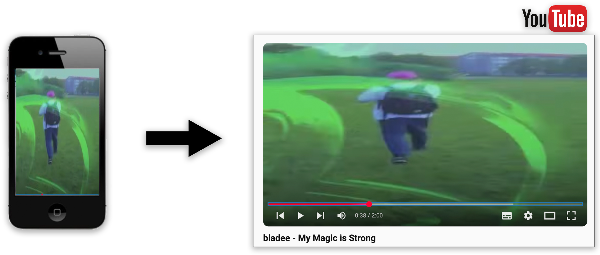

  

### Aesthetic Silly Boys and Goth Girls

Not all images that use this visual effect are consciously stretched to
fit a given aspect ratio. This is because the stretched image has become
its own aesthetic, sometimes but not always decoupled from the networked
logics I just described. In the internet rap scene, à la Fakemink or
Xaviersobased, for instance, the stretched image can make the rapper
look wide and short, almost like Roblox characters or the reflection of
a convex funhouse mirror. Stretching then becomes a tool for
destabilizing rap’s traditional codes, softening its more brutal edges
while reinforcing a consistent aesthetic of irony, silliness and
chronically online humour that defines this corner of internet hip hop.
The parallel extends into the sonic landscape as well. Rap collective
Haunted Mound, for instance, consistently produces dark, muddy, and
heavily distorted vocals – an effect not unlike what happens when you
stretch an audio track.

  

Aestheticized versions of the stretched image appear in selfies posted
by goths online. I didn't think much of this before I visited a gothic
church in Belgium and saw how the church architecture, through its
elongated arches, tall spires, and towering structures, can basically be
thought of as a stretched church. The emphasis on verticality in gothic
architecture is to reflect an upward reach, a stretch towards god,
heaven and the divine. In this context, especially due to how a lot of
these goth selfies feature christian symbolism like crosses, the
stretched image feels like a way for them to channel that same
aspiration, translating the monumental verticality of Gothic
architecture into the digital, personal scale of the selfie.

People stretch images also to signal a wide range of chronically online,
alternative and niche aesthetic preferences – something you either *get*
or you don’t. But the point I want to make is that this aesthetic did
not emerge out of nowhere. It arises from platform-imposed constraints
on aspect ratio, which force images to adapt in one way or another.
Without this 21st-century visual ecosystem, where images circulate
across platforms and can be easily edited, there would be little reason
for this aesthetic to exist at all.

### Platform Logic, and the Drive to Fill the Frame

There are two logics of social media platforms that have accelerated the
tactics of stretching and solidified them into recognizable visual
forms. The first logic, *memetics*, is driven by the way memes evolve
through constant circulation, editing, screenshotting, and repurposing.
Through these cycles of reproduction, users might stretch images to fit
different aspect-ratio contexts of posting. The second logic,
*cross-posting*, articulates how content creators often repurpose the
same image or video across multiple platforms to maximize reach. In
doing so, they are incentivized to reshape or “stretch” content to fit
the aspect-ratio requirements of each platform, as “filling the screen”
secures algorithmic visibility. As one of the most common pieces of
advice for going viral suggests: always post in the platform’s native
aspect ratio and avoid black bars at all costs.

The compulsive drive to “fill the screen” is not only enforced by
platforms. It also reflects a deeper, almost biological impulse of how
humans seek order and completeness - a tendency that has long been
observed in art history. *Horror
vacui[,](https://en.wikipedia.org/wiki/Horror_vacui_(philosophy))* Latin
for “fear of empty space,” is often used to describe artworks that fill
the entire surface with detail and leave as little emptiness as
possible. It references Aristotle’s old and disproven idea in physics
that nature abhors an empty space. The same impulse is evident in
contemporary phenomena, such as viral “oddly satisfying” videos
featuring objects fitting perfectly together, like Buzzfeed’s *Just 3
Minutes of Satisfying Perfect Fits*, or in rage-baiting videos where
nothing “fits”.

If this horror vacui weren’t at play in posting, it would feel natural
to use any aspect ratio and simply accept black “empty” bars filling the
remaining space. Yet, seeing an image fill the screen, or its assigned
frame, is more satisfying. The stretching of images is thus driven not
only by platform incentives but also by this human desire for visual
completeness. An example is Charli XCX’s now-iconic *Brat* album cover,
which features a neon green background and the album title in 90%
vertically stretched Arial text. The cover is notable not only because
its iconic status signals that stretched aesthetics are entering the
mainstream, but also because stretching elements within a fixed aspect
ratio (here, the square standard of records) creates a sense of visual
satisfaction. Without the stretch, the word “BRAT” would feel misplaced,
leaving too much empty space above and below. It simply would not be
*brat*. The neuro-technological urge to fill the screen carries an
inherent paradox: An image unnaturally stretched to fit a frame feels
both repellent in its weirdness, yet seductive in its ability to fill
the screen.

On a side note, the stretched image is not the only contemporary visual
form shaped by this desire to fill the screen. I suspect the same
impulse may help explain the emergence of sludge videos. The usual
analyses claim that sludge is a response to shortened attention spans
and the demand for constant stimulation, but this doesn’t address why
users began making these videos in the first place. Sure,
experimentation likely played a role, but there is also a deeper “origin
story” rooted in the fetish of filling the screen. Early sludge videos,
for instance, often combined horizontal clips from *Family Guy* with
short, social-media-native vertical clips. The original *Family Guy*
footage was designed for horizontal television screens, but posting it
on vertical platforms like TikTok created a mismatch. Placing additional
clips next to it, and thereby creating sludge, worked as a remedy to
this *horror vacui –* a way to visually “complete” the frame.

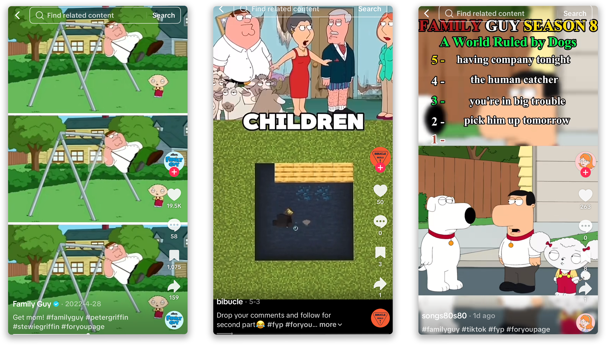

  

Now that a technical analysis of the stretched image is done, there are
further questions to be asked: What is the stretched image stretching
from and towards? What is it reaching for, with this straining,
distorting movement?

## Slouching towards the Vertical

Aspect ratio is not just a technical term describing the relative size
of images and videos. Aspect ratios carry meaning and history – and they
matter, especially in a time when so much of reality is mediated through
images. The square image ratio, for instance, evokes vinyl sleeves,
early Instagram, and Polaroids – the image-object that originally
inspired Instagram’s name. Horizontal ratios call to mind landscapes,
cinema, television, YouTube, and the computer screen. And vertical
ratios evoke portraits, TikTok, short-form video, and the smartphone
display. These are the associations I bring with me when I encounter
stretched images online.

  

Of particular interest here is the vertically stretched image, where a
horizontal image is forced into the vertical format of a phone. This
type of image is constituted by a tension between the pre-vertical
ecosystem of varied aspect ratios and the contemporary dominance of
vertical media. In the late 2000s and early 2010s, social media images
were far more diverse, reflecting how internet use was more evenly
distributed between computers and phones. Computer-based platforms
typically favored horizontal formats (e.g., YouTube), while mobile apps
leaned toward vertical content (e.g., Snapchat), and platforms like
Facebook, Tumblr, and Flickr were commonly used on both, creating a
varied image ecosystem in terms of aspect ratio. Since then, the
vertical orientation of phones has encouraged increased usage by making
content consumption mobile, pushing the balance of aspect ratios
strongly toward vertical formats.

The stretched vertical image operates as a site of historic tension and
remediation, as seen in the instagram account of @unicornchainsaw, which
posts 2010s nostalgic content under the rules of vertical
authoritarianism. The account is filled with digital relics from that
era, such as the 2009 Instagram interface, clips from *Skins* and *Movie
Star Planet*, all stretched to fill the screen, regardless of their
original aspect ratio. One reel, for example, features a slideshow of
*justgirlythings* tumblr era images paired with a pitched-down version
of OneRepublic's 2013 hit "Counting Stars." In the 2025 @sadkissed
version, these once-familiar hopecore horizontal images are stretched so
aggressively to fit the vertical frame that the text becomes nearly
unreadable.

What makes this reel so striking is its temporal dissonance. I remember
being a teenager when these types of sincere and hopeful images were a
part of my everyday media diet. I would encounter them mostly on my
family's stationary computer, on Tumblr or Facebook, and my encounter
with them would be sincere. At least from what I can remember. The
images evoke this feeling of a friendlier internet: a place you would
visit, not a device you carried in your pocket at all times. However,
the stretched editing in combination with the reel's distorted throwback
music, introduces a darkness. It feels as if the images have been
assaulted, forced to conform to the rigid, contemporary regime of
verticality: a visual violence that mirrors the internet's shift from
sincerity to a more cynical, irony-poisoned landscape.

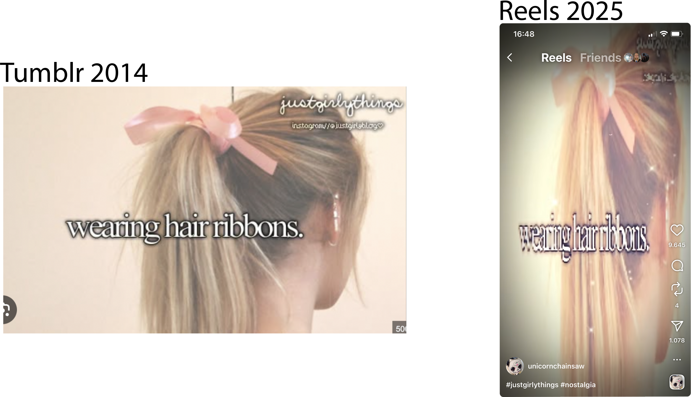

  

These images now appear as reels, the default mode of image production
in the 2020s, rather than standalone posts, as was the norm before 2016.
No longer fixed in place, they are absorbed into the infinite,
algorithmically curated, globally synchronized doomscroll. The stretched
image in this context bears the mark of this short-form vertical video
revolution, the 'TikTokification' of Instagram, and the flattening of
social media into a stream of endless, vertical content. The stretching
signifies a forced adaptation, a relic of a past internet bent and
distorted to fit the logic of a new one. The images feel like fractured
echoes of a lost digital era. *We cannot go back to 2010, we are stuck
watching it as a reel.*

The stretched vertical image therefore articulates anxiety, friction and
strain in relation to the vertical image-regime that is dictating
contemporary platform life. It exemplifies how platforms “force” the
production of vertical images, and that this is not necessarily a
comfortable or democratic choice. In recent years, not only Instagram
but also an expanded ecosystem of platforms, YouTube, LinkedIn, Pornhub
and Spotify, have all shifted toward short-form vertical video. This
transition is not out of user demand, but because the format produces
the most addictive engagement loops, and therefore maximizes profit.
Recent image history can therefore be described as a process not only of
“stretching” toward the vertical, but of “stretching” for attention, for
engagement, and ultimately for monetization. If the vertical image is a
visual form born from the way the vertical smartphones extend screen
time and make content endlessly consumable through affording mobility,
the stretched image is a counter-visual form. It allows non-vertical
content, including pre-vertical internet images such as Tumblr posts and
square Instagram macros, to persist under the authoritarian rule of
verticality.

### Vertical Music Videos & Cross-post minimalism

The vertical stretched image is not the only visual form born out of a
smartphone-mediated reconfiguration of image production. Another example
is the vertical music video. Pop artists such as Ellie Goulding, Selena
Gomez, Billie Eilish, Camila Cabello, Halsey, Troye Sivan, and Bebe
Rexha have all either released music videos made specifically for the
phone screen or re-edited existing videos to fit the vertical aspect
ratio of short-form platforms. What sets vertical music videos apart is
not merely their aspect ratio, but the distinct visual language that
verticality seems to foster. Across these videos, a strikingly dull
minimalism and extreme self-absorption dominate: little to no narrative,
with the singer’s body almost always filling the frame, mouthing the
lyrics as if filming a TikTok. A comparison of the vertical and
horizontal versions of Camila Cabello’s *Havana* illustrates this
difference clearly. The horizontal video is a full-scale production: a
telenovela-style odyssey through the streets and everyday life of Cuba,
complete with an ensemble cast, expanding the world of the song and
underlining its ode to her hometown. The vertical version, by contrast,
strips all that away. Frame after frame contains little more than
Cabello herself, facing the camera and singing directly into the
intimate space of the viewer’s phone screen.

Verticalization tends to reduce the music video’s capacity for
narrative, context, and visual complexity, much like the rapid,
fragmentary logic of social media content. In this context,
verticalization is an active process that transforms traditionally rich
media objects, like the music video, into slop. What's at stake here is
the erosion of a cultural form that has, for decades, been one of
popular music’s most experimental and boundary-pushing media objects.

  

The dominance of smartphone-based media is not only producing more
vertical content, as in the case of vertical music videos, but also
reconfiguring horizontal content. This is evident in contemporary
horizontal YouTube “slop”. Think of Jubilee (*“1 Capitalist vs 20
Anti-Capitalists”*), Cut (*“The Button”*), LADbible (*“Snack Wars”*),
Colors Studio, Genius (*“Verified”*), The Skin Deep, BuzzFeed, or Pop
the Balloon: what unites them is an extremely minimal set, often nothing
more than a greenscreen or a single-colored background. I don’t
interpret this shared visual language, which I call *cross-post
minimalism*, as incidental; I see it as a standardized aesthetic born
out of the demands of platform circulation and cross-format portability.
Indeed, YouTube videos today are rarely made just for YouTube – they are
designed with the expectation that they will be crossposted as
short-form vertical clips on TikTok, Reels, or Shorts. By keeping the
set as minimal and uncluttered as possible, the footage can be cropped
and repurposed across formats with little to no friction. The result
facilitates circulation but produces a flattened aesthetic: portable,
depersonalized, and ultimately reflecting a capitalist logic of
efficiency.

The forced regime of verticality is not only significant because of what
it represents but also because of how vertical frames inherently fit a
different relation of objects than lets say a horizontal frame. A
horizontal frame reflects our horizontal, landscape vision, and
therefore favours capturing the dialogue, the environment and the world.
It reflects a mode of viewing that is outwards. A vertical frame
however, does not reflect this god-given way of seeing. It is designed
for the individual, the single vertical body. My previous examples of
Cabellos vertical music video for Havana, as well as the *cross-post
minimalism* of Youtube slop show how vertical framing centers the
individual, compressing context and privileging the singular over the
collective. The hegemony of the vertical image is therefore not only
symbolic of the extreme individualism and narcissism that plagues
contemporary society, but also an accelerator for these processes.

The social consequences of verticalization is perfectly captured in a
tiktok clip of a podcast where two men are having a conversation.
Instead of showing their conversation logically as a horizontal frame
where their eye-sights are aligned, they made the clip into a
split-screen where the clips are put on top of each other to fit the
vertical demands of TikTok. You can hear that they are talking together,
but visually they are talking away from each other, into nothingness.
This is what verticalization does to us. It fractures dialogue, isolates
bodies, and reorients communication away from shared space and toward
disconnected soliloquy.

In response to this, I appreciate the trend on Instagram among cool Gen
Z girls of posting horizontal photos in vertical stories. It has the
feel of a quiet revolution...

  

## Future of the Stretched Image

So far I analyzed the stretched image as a hyperspecific artifact of the
era of platform capitalism. Yet precisely because of this specificity,
its future remains uncertain. The fate of the stretched image will be
shaped by the constantly shifting interplay between platform-imposed
conditions and the spontaneous, creative choices of users. This
relationship can be productively examined through the lens of
*strategies* and *tactics*, as outlined by Michel de Certeau in *The
Practice of Everyday Life* (1980).[^07chapter4_5] Writing about psychogeography in
the context of cities, de Certeau, defined strategies are the systems
imposed by institutions – such as city layouts, maps, or traffic
regulations – that structure movement and define what is possible in a
given city. Tactics, by contrast, are the everyday, often subversive
maneuvers through which individuals navigate and bend these systems:
taking shortcuts, wandering off mapped routes, or using spaces in ways
not intended.

Applied to social media, platforms’ rigid aspect-ratio regimes function
as strategies, incentivizing certain forms of aspect ratios for posting.
Stretching, by contrast, is a tactic: a user’s creative, “improper”
maneuver to make content fit, sidestepping the friction of reshooting or
redesigning. Stretching transforms images into a form of tactical
improvisation, making them “habitable” within an otherwise constraining
system.

For a time, the conditions – or strategies – were constraining enough
for stretched images to flourish. Yet I have observed a trend in which
these conditions are narrowing. Lev Manovich’s re-thinking of De Certeau
for the age of user-generated content can be useful here.[^07chapter4_6] According
to Manovich, tactics themselves can be absorbed and elevated into
strategies. What begins as bottom-up, tactical play – remix, bricolage,
mashup – can become formalized into the logic of the platform itself.
This is visible in the trajectory of the stretched image. As users
creatively bypassed strict aspect-ratio regimes – through stretching,
split-screens, “sludgification,” or white-agram frames – platforms
gradually adapted their policies, expanding the range of allowed aspect
ratios. In 2019, for instance, Instagram introduced its “Layout”
feature, allowing multiple horizontal images to be stacked within a
vertical Story frame. Similarly, Instagram, once rigidly square,
expanded its aspect ratio range from 1:1 to 1.91:1 landscape and 4:5
portrait, and by late 2025 even permitted ultra-wide video uploads
(though not ultra-horizontal images). If these conditions continue to
liberalize, the very tension that gave rise to the stretched image may
disappear. We might therefore be at the end of the era of stretched
images.

The increasing influence of AI on social media further complicates this
picture. AI tools such as generative fill can now automatically adapt
content to any aspect ratio, eliminating the need for creative
workarounds like stretching. This is evident, for example, in the TikTok
account *@*filmsvertical, where film classics such as *Goodfellas*,
*Home Alone*, and *Gladiator* have been processed through generative
fill to remove the black bars that horizontal content would otherwise
produce on TikTok’s vertical frame. Yet at the same time, there appears
to be something about the logic of the stretched image that AI cannot
grasp. I have repeatedly attempted to generate stretched images using
AI, even specifying instructions like “pull the object in Photoshop,”
but the outputs tend to be naturalistic distortions – a cat with a
slightly elongated back, a man with chubby cheeks – rather than the
digitally stretched effect produced by a human using photoshop. Seeing
that AI cannot reproduce a stretched image, but can produce more normie
social media posts like selfies, points to an interesting paradox when
it comes to the stretched image: it is simultaneously inhuman –
networked and technologically mediated– and irrepreducibly human,
arising from aesthetic decisions and play that resist algorithmic
reproduction. Maybe this resisting trait of the stretched image will
allow it to survive, in a social media landscape increasingly
contaminated by AI slop.

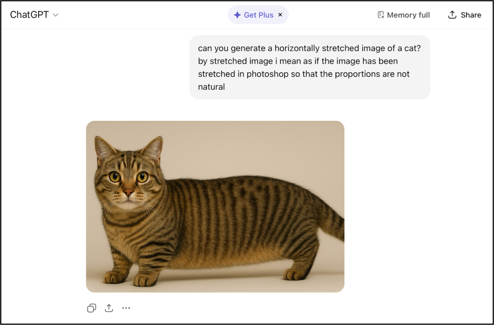

  

***August Kaasa Sundgaard*** *(1999) is former intern and affiliated researcher at the Institute of Network Cultures. He holds a bachelor's degree in Liberal Arts from Leiden University and is currently enrolled in the University of Amsterdam Media Studies MA program. Through his collaborative project V.I.B.E., he has exhibited at Ars Electronica and Dutch Design Week, and has been published by Do Not Research.*

[^07chapter4_1]: Hito Steyerl. “In Defense of the Poor Image.” e-flux Journal, no.
    10 (November 2009).
    https://www.e-flux.com/journal/10/61362/in-defense-of-the-poor-image/

[^07chapter4_2]: Günseli Yalcinkaya. “Deep-Fried Memes: What Are They and Why Do
    They Matter?” Dazed Digital, November 11, 2022.
    https://www.dazeddigital.com/life-culture/article/57422/1/deep-fried-memes-surveillance-capitalism-instagram-reddit-censorship/

[^07chapter4_3]: Caroline Busta. “Hallucinating Sense in the Era of
    Infinity-Content: Technical Images, Film01, Angelicism, Art,
    Showtime, True Detective & Shein.” Document Journal, May 29, 2024.
    https://www.documentjournal.com/2024/05/technical-images-film01-angelicism-art-showtime-true-detective-shein/.

[^07chapter4_4]: Hito Steyerl. “In Defense of the Poor Image.” e-flux Journal, no.
    10 (November 2009).
    https://www.e-flux.com/journal/10/61362/in-defense-of-the-poor-image/

[^07chapter4_5]: Michel de Certeau. The Practice of Everyday Life. Translated by
    Steven F. Rendall. Berkeley: University of California Press, 1984.

[^07chapter4_6]: Lev Manovich. “The Practice of Everyday (Media) Life: From Mass
    Consumption to Mass Cultural Production?” Critical Inquiry 35, no. 2
    (Winter 2009): 319–331.

#New Dependencies

##Lukas Engelhardt
### Originally published on March 29th, 2022

*It seems that many people today experience a space problem. This applies
to the physical world where living spaces in the city become less
affordable by the day as wages continue to stagnate. And this is also
the case for the digital spaces we inhabit, where governments and
software conglomerates lock us into walled gardens and spend every
single one of their considerable resources in order to sell us ads. But
while spatial activism in the physical world is battle-tested and
well-established, it seems that digitally we often still struggle to
find useful tactics to counteract the effects of the cloud. This is an
attempt to find ways in which our experience with the negotiation of
physical space can help us with our digital conundrum.*

 

##Point of departure

| **self hosting**| **squatting**|
| ----------- | ----------- |
| refusing (privacy) policies  ✔  |refusing (housing) policies  ✔|
|hosting and serving (files) ✔|hosting and serving (people) ✔|
|programming (computers) ✔|programming (events) ✔|
|don't pay rent (software as service) ✔|don't pay rent (actual rent) ✔|
|community building (licenses and policies) ✔|community building (door policies) ✔|
|security (encryption) ✔|security (barricades) ✔|
|constant maintenance ✔|constant maintenance ✔|
|resist cloud control ✔|resist crowd control ✔|
|using existing infrastructures ✔|using existing infrastructures ✔|
|recycling (old hardware) ✔|recycling (building materials) ✔|
|open source principles ✔|open source principles ✔|
|following manuals and protocols ✔|following manuals and protocols ✔|
|improvised structures & unconventional design strategies ✔|improvised structures & unconventional design strategies ✔|
|disaster always imminent: data loss ✔|disaster always imminent: eviction ✔|
|Everything went downhill from ~2010 ✔|Everything went downhill from ~2010 ✔|
|nostalgia ✔|nostalgia ✔|
|nomadic in nature: changing ip addresses ✔|nomadic in nature: changing addresses ✔|
|situating yourself in a network ✔|situating yourself in a network ✔|
|de-appropriating someone else's space ✖|de-appropriating someone else's space ✔|
*fig. 0.1: A lot of words in tech are referring to things in the real
world.*

##Cloud Gazing

On September 12, 2010, the YouTube Channel revelation13net uploaded a
video titled *By Psychokinesis a Psychic turns a Cloud into a Square
Cloud in Sept. 2010.* In this video, a man films the sky with a handheld
camera for 2 minutes and 18 seconds. The viewer sees a single cloud on
an otherwise entirely blue sky, lined by some trees on the edge of the
frame. We never see the person holding the camera but can hear them
speak throughout the video. They introduce themselves as T. Chase and
they explain that they will attempt to change the shape of the cloud
into a square through psychic powers. They keep repeating this statement
like a mantra of sorts, altering and distorting their voice as the video
progresses. The cloud slowly changes shape, and by the end of the video
it does look more like a square than in the beginning of the video,
though it's hard to say whether this might just have been the way it was
always going to naturally change shape.

In September 2008, the free software advocate Richard Stallman expressed
his concerns regarding cloud computing to *The Guardian*, claiming that
it was stupid and just a way to lock users into proprietary
ecosystems.[^08chapter5_1] Stallman is a prominent advocate for privacy and the
open source movement, and (among a lot of other things) the founder of
the Free Software Foundation. He is well-respected in the tech
community, but his statements about cloud computing received mixed
responses. He was accused of populism for supposedly ignoring the lived
realities of actual users who are often already trapped in their
operating systems and office suites, and don't necessarily have the
capacities to practice the cloud refusal he was preaching.[^08chapter5_2] Others
accused Stallman of simply stating the obvious. Reuven Cohan illustrated
this criticism with a still from an episode of the animated TV show *The
Simpsons*, which later ended up becoming something of a meme. The image
shows a newspaper clipping in which Abe Simpson, the elderly father of
one of the protagonists, Homer Simpson, angrily shakes his fist at the
sky under the headline *Old Man Yells at Cloud*. Since my 30th birthday
last year, I have sometimes thought this image is actually about me.

The Cloud is a mythical space. Its name alludes to its opaque-ness,
veiling what it actually describes, which you could call network
infrastructure, or maybe just someone else's computer.[^08chapter5_3]
Interestingly, the concept originates from exactly this position of not
knowing, of occlusion. In network diagrams the cloud is traditionally
used to denote parts of the network that we have no control over or have
no concrete knowledge about. It's the part beyond the blinking lights of
our router, it’s *internet*. Its shape alludes to the uncertainty of
what is out there, something elusive that constantly changes shape, is
hard to grasp. The cloud is something we don't understand, by
definition.

This inherent uncertainty is maybe why attempts to refuse it can often
feel futile. Even defining what it is that we are refusing exactly is
already a tiring exercise. As is often the case with computers, the
conversation is one-sided, with us yelling at the cloud, trying to shape
it, but not getting a response. Because the cloud doesn't care. Despite
this perceived futility, a vague feeling of urgency remains.
In 2019, web designer Becca Abbe sensed the dawn of what she called The
Internet's Back-to-the-Land Movement, a new movement of users away from
the cloud, in reference to the 1960s counter cultural movements away
from the cities in the US.[^08chapter5_4] It seems tempting to leave the celestial
cloud behind, with all its fake news and inequalities, to get back down
to the ground truth, so to say. But what exactly is this land we would
return to, and who exactly is going there?

##Surfing the Web

 

Before the cloud was a cloud it was an ocean. We know this, because it
could be *surfed*. In 1986, when the internet wasn't commercially
available yet, it was mostly being used by scientists and governments.
That year, in the Netherlands, Hans Rosenberg from Utrecht University
founded the non-profit organization *SURF*,[^08chapter5_5] which ran *SURFnet*, a
computer network linking different academic institutions.[^08chapter5_6] A few
years later, in 1989, and in direct proximity to the ocean, Susan
Estrada of the San Diego Supercomputer Center founded one of the first
internet service providers (ISP) in the world, and, since *SURFnet* was
taken, settled on the name *CERFnet*.[^08chapter5_7]

In 1991, CERFnet released a promotional comic book, The Adventures of
Captain Internet And CERF Boy. Filled to the brim with rad crossword
puzzles and bad puns, it recounts the story of Diana Domain, her
surfboard-slinging alter ego Captain Internet and her side kick CERFboy,
fighting against their nemesis Count Crackula. Unaware of all of this,
just a year later, librarian Jean "netmom" Armour Polly published an
article called Surfing the Internet on the University of Minnesota
Wilson Library Bulletin, and shortly after that, Tom Mandel of Stanford
Research Institute (SRI) wrote another one called Surfing the Wild
Internet.

What all these examples have in common is that they evoke the fun of the
web, but also the skill required to, well, surf it, as well as some
sense of the fluidity, randomness, chaos, and even danger that it
presented.[^08chapter5_8] Using the internet was a sport, something you did for
fun, and temporarily, before hanging up your wet suit and returning to
real life.[^08chapter5_9] Especially back then, when cities and interfaces were
less smooth, people were less sad and personal computers were just
beginning to become a thing, it perfectly captured this new, mysterious
and seemingly bottomless place that was the internet[^08chapter5_10]—other exhausted geographic metaphors include cyberspace, the electronic
frontier and the information superhighway.

Today nobody surfs anymore (the ocean has evaporated into the cloud, you
could say). But despite the immiscibility of water and technology, the
image of the internet as a separate space free from the constraints of
the *aground*, physical world, a vast ocean that just has to be
navigated by a skilled steersman[^08chapter5_11] with an appropriate vessel,[^08chapter5_12]
lingers as residue if you know where to look: in the ports and berths
that we use to connect our computers to the internet, in *anchor* links,
torrent sites,[^08chapter5_13] browser icons[^08chapter5_14] or the names of NFT
marketplaces.[^08chapter5_15] The Network is eternal, and so is the ocean.

 

##Back to the Sea

> If you want to build a ship, don’t drum up people to collect wood and
> don’t assign them tasks and work, but rather teach them to long for
> the endless immensity of the sea.
>
> —Antoine de Saint-Exupery, probably[^08chapter5_16]

The appeal of the vast ocean never fully disappeared, and while some are
trying their best to get back to the land, others just want to get back
to the sea. Whereas *homesteading* describes self-sufficient life on
land, seasteading takes this idea several steps further and out into the
open sea (hypothetically, at least). Seasteading is an idea from San
Francisco, and advocated for by the Seasteading Institute, which in turn
was funded by venture capitalist and strangely obsessive *Lord of the
Rings* fan Peter Thiel[^08chapter5_17], with the goal of making governments
*smart*. Claiming that most of the land in the world is already taken,
the seasteaders propose building floating cities in international
waters, free from convention, regulation, and taxes.

Up until 2020 most attempts to make these dreams come true had been of
moderate success, with crypto millionaire, anti-taxer and anti-vaxxer
Chad Elwartowski coming closest when he and his girlfriend spent two
months living in a small, elevated, floating platform 12 nautical miles
off the coast of Thailand.[^08chapter5_18] Elwartowski is one of the founders of
*Ocean Builders*, a company dedicated to the promotion of seasteading,
which has been developing so called *SeaPods*, floating luxury homes
that look remarkably similar to Apple AirPods in renders. The platform
in Thailand (which looked nothing like those renders) had been the first
prototype.

But in 2020 Ocean Builders decided to give it one more try. Due to the
COVID-19 pandemic, the cruise ship industry had almost gone under and
they managed to buy an old, 245m cruise ship for a bit less than $10m,
around one tenth of its pre-pandemic price. They named it the MS
Satoshi, after the presumed author of the original Bitcoin white paper.
The plan was to lay anchor off the coast of Panama, where it would be
incorporated into an artificial, floating island in the shape of the
Bitcoin B. Until then they would auction off the 777 cabins to a
clientele of digital nomads, startup founders and crypto enthusiasts,
and finally establish the first truly free, crypto-only (and mostly
male), seasteading society (or *seavilization*[^08chapter5_19]).

Maybe it's stretch to claim there is a (mostly metaphorical) affinity of
everything-crypto to the ocean and the freedoms it promises. But many
have described the feeling of web3[^08chapter5_20] to be reminiscent of the early
days of the internet, among them Signal founder and former
sailboat-squatter[^08chapter5_21] Moxie Marlinspike.[^08chapter5_22] And the image just
*fits*—it speaks of a desire for the internet (the world?) to be a wide,
open and adventurous place again.

In any case, the ocean builders didn't fare well on their endeavors.
Journalist Sophie Elmhirst recounts the following unfolding of
unfortunate events in great schadenfreude-laden detail for *The
Guardian*.[^08chapter5_23] What was supposed to have become the crypto-pirate-radio
station of the 21st century ended in financial disaster before the ship
ever reached Panama.[^08chapter5_24] According to scholar Flavia Dzodan,
libertarian leaps for freedom like this fail because they don't bother
to answer the question of who will do all the cleaning.[^08chapter5_25] In her
article, Elmhirst sums up the MS Satoshi's ultimate dilemma. "*The high
seas*", she writes, "*while appearing borderless and free, are, in fact,
some of the most tightly regulated places on Earth*”.

 

##Back to the Land

While today most people recognize that the internet is prone to tight
regulation, in its beginning a lot of people thought of it borderless
and free. A Declaration of the Independence of Cyberspace, which John
Perry Barlow, founding member of the Electronic Frontier Foundation,
published in 1996, is often used as an example of this false optimism.
As their name suggests, in the 90s, the EFF perceived the internet as a
new frontier, a wild and unexplored space for settlers to claim, where
they could build new lives, new utopias, new modes of (smart?)
governance. Barlow's text reads as a challenge to the governments of
what he calls the Industrial World, or the world outside of the
computers, who, according to him, had no legitimate claim to govern
cyberspace.

Twenty-five years later this document has been critiqued to exhaustion.
Many people have pointed out, and Barlow himself has admitted since,
that this clear division between digital and physical space is not a
very good model for describing the world—after all, the internet runs on
real computers, which stand in real rooms that are connected to the rest
of the world with real cables, all of which is powered by real
electricity. The internet obviously runs on physical infrastructure,
which exists in the physical world.

In his essay Imagining the Internet: Explaining our Digital Transition,
Brewster Kahle, founder of the Internet Archive, explores the different
metaphors that we have collectively used throughout the years to try and
understand the internet. According to him, around 2010 the internet
became more and more mobile, and more and more tied to our real
identities. Around that time, cartoons depicting the internet shifted in
tone: the surfers of the 90s became prisoners, bound to their oversized
phones with heavy chains. As anonymity slowly disappeared, the optimism
of the 90s evaporated.

Today the virtual is not separate but augmented,[^08chapter5_26] which is maybe why
the image of the cloud, hovering above us, overlaid like another layer
in Photoshop (or Gimp), continues to stick around (that and the
relentless power of marketing). As the gap between the cloud and the
real world collapses, we have to think differently about the issues and
inequalities inherent to both, since we can no longer treat them as
independent from one another. Consequently, inequalities in the virtual
(where we are limited to the possibilities the interface affords
us)[^08chapter5_27] cannot be solved from within it, just as code running in a
sandbox cannot affect the system outside of it.

If Cyberspace was the indefinite space between the nodes, that magical
place that existed between your computer and mine, then a digital
back-to-the-land movement has to focus precisely on these nodes and
their physical connections, the underlying infrastructure, which is
overwhelmingly grounded, even if sometimes submerged in water. We don't
need spatial metaphors, because we are dealing with real, physical
space.[^08chapter5_28] Luckily for us, we have much more experience in negotiating
physical space than virtual space.

 

##Occupying the Land

 

Squatting is the act of occupying an unoccupied space without owning it
or having permission to use it. It occurs around the world and is mostly
connected to poverty and homelessness, where people without alternatives
build settlements on unoccupied land, which over time often develop into
shanty towns and slums. In 2003, the United Nations estimated that
globally more than 1 billion people were living in squats and slums,
projecting this number to increase up to 1.5 billion by 2020.[^08chapter5_29] For
most of these people, squatting is a tactic to survive.

In the Global North the term usually means something different. Here,
squatting is mostly residential, meaning that it involves the occupation
of vacant buildings in the city. While it's a response to the various
inequalities in housing here, and as a tactic still presents the only
alternative to homelessness for many (undocumented) people, it also
often has an activist dimension. In their eponymous 2019 book, the
collective *Architecture of Appropriation* conceptualizes squatting not
only as a social movement and historical phenomenon but as a kind of
*spatial activism*.[^08chapter5_30]

In the Netherlands, squatting developed into a politically motivated
movement after World War 2, but it wasn't until 1971 that squatters
acquired legal protection,[^08chapter5_31] and squatting became institutionalized.
By 1980 there were weekly squatting information hours
(*Kraakspreekuren*) in every Dutch city, where squatters would give free
advice to whomever was interested, and the action itself was
protocolized in the form of freely available manuals—interaction with
the authorities and police including. In the book, *Architecture of
Appropriation* suggest that since its beginnings, the squatting movement
has had a decidedly *open source* character.

In 2010, around the time the internet became a cloud, squatting became a
criminal offense in the Netherlands.[^08chapter5_32] In the following two years
more than 330 squats were evicted in Amsterdam alone. In its prime, this
network of squatted places had amounted to an independent, parallel
society of sorts.[^08chapter5_33] This aspect of embedding yourself in a *network*
is a central aspect of political squatting—the internal network of the
occupants, a local network with the neighbors, a regional network with
the local scene, or an international network of political squatters
around the world; they are equally important.

One way this *networked-ness* might be epitomized is in the convention
of naming a newly-squatted building after the address where it is
located.[^08chapter5_34] By doing this, the squatters embed themselves into the
broader (social) context of the city, as well as into the (local area)
network of other squats there, while being simultaneously site specific
and location independent. If they get evicted, the collective can squat
another place next week, and the place will have a different address and
a different name. Its identity will simultaneously be the same and
completely different, similar to the way a computer gets assigned a new
IP address in a network.

The connections between these nodes in a network are not abstract but
can and have been diagrammatically mapped out, the emergency list of the
former Amsterdam squat *Plantage Dok* being an example of that.[^08chapter5_35]
This network diagram does not include a cloud, an unknown factor beyond
its control. If a cloud were to be included in this schematic, it would
present *the threat* it was created to protect its members from in the
first place. Instead of a network that is concerned with things like
scalability, it operates on different principles. It is in its essence a
network of solidarity.

 

##Welcome to Hotel Mokum

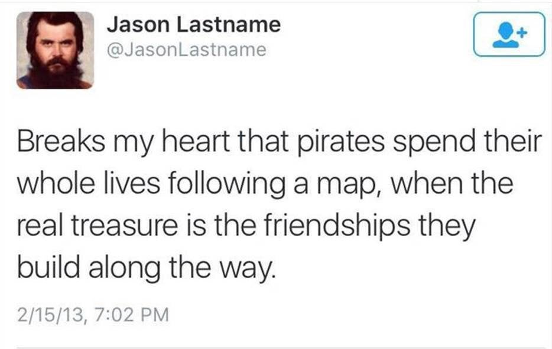

 

Many of us struggled with the pressure, the excitement, the exhaustion,
the uncertainty, the lack of structure, impostor syndrome. The let-down
effect was real. Immediately after the action a number of people got
sick. Most of us had stopped exercising, ate unhealthily, and couldn't
keep up with simple household tasks. Someone said their home had started
to look like a squat, while our squat had slowly started to look like a
home. At the same time, most of us experienced difficulty in leaving, in
going home, and felt guilty when we missed just a day or two.

We squatted Hotel Mokum on October 16, 2021. None of us had really
expected to succeed. In the secretive meetings with the real squatters
in which we planned the action (out of a general distrust of technology
we always left our phones in another room), the best-case scenario was
nothing more than a rhetorical bridge into crisis scenarios of varying
gravitas that were infinitely more likely than actually succeeding: *of
course, the police can just decide to leave, but more likely they will
\[insert various degrees of state violence here\].* But then it all
turned out differently, and they did leave, and there we were, 20-odd
20-somethings and me, and all six floors of the former hotel right in
the center of Amsterdam were ours, and every news outlet in town wanted
to talk to us.

The day of the action we got drunk, the day after we started programming
events. Our first event was a series of screenings, curated by Mateo and
Jeffrey Babcock from *Jeffrey's Underground Cinema(s)*. From then on, we
kept going. In the first month, we organized a neighborhood lunch,
political cafes, screenings, a screen printing workshop, a chess
tournament, an exhibition with more than 70 participants, a
demonstration and seemingly infinite amounts of bar nights. Fueled by a
mix of enthusiasm, disbelief and constant fear of eviction, we went on
and on, and every time it got better and bigger, and every time it was
packed.

When we didn't have a public program, we worked on the building. It had
been gutted to the core and in the two years that it had been abandoned,
it had decayed dramatically. After changing the locks, we cleared out
the carcasses of the pigeons that had been trapped inside, cleaned the
floors of their excrements, built a toilet, pumped out the water from
the crawlspace beneath, built a bar, set up internet throughout the
building (piggybacking on the wifi from the hotel across the street),
built living rooms and bed rooms, furnished it all, and
cleaned—everything, endless amounts of times. Hardly any of us had ever
squatted before, let alone on this scale, and without the unconditional
and selfless support and expertise from helpers, friends and members of
the squatting scene, we could have never pulled any of it off.

Whatever time was left, we spent in meetings. We had to organize and
decide on events, fill the sleeping schedule, plan the renovations, find
legal representation, write public statements, apply for funding, talk
to an endless stream of journalists, talk to the neighbors, invite
activists and politicians, deny entry to other activists and
politicians, form connections to other squats, talk to the owner of the
building and formulate a corona policy. We organized on the fly—we set
up Signal groups and a Matrix server, learned hand signs, kept times,
moderated meetings, argued and solved conflicts, did check-ins and kept
notes of everything. We made decisions collectively—not simply by
majority, but looking for consensus even in disagreement.

Even though most of us didn't live at Hotel Mokum, we needed this place,
and it needed us. We were starting to neglect the lives we had outside
of it—it was consuming us. After a month, we came together in an emo
meeting to discuss the emotional aspects of our involvements. It was
important to create this space for us to listen to each other, let each
other air grievances and send each other messages of support.
Unanimously, we agreed that this month had been one of the most
fulfilling months of our lives, but we had all known that before
expressing it to each other. That had been the collective experience. At
the emo meeting we acknowledged what happened outside of it. For a brief
moment, the collective dissipated into a collection of individuals, each
with their own, unique experience, with complaints, insecurities and
dirty apartments.

One by one we assured each other, complimented each other on *good
shares*. It was emotional and supportive. A lot of us hadn't known each
other before the action, but in this moment of allowing ourselves to be
vulnerable in front of each other, it felt like we had been doing this
for years. We had become nodes in a (support) network, and our network,
in turn, was just a node in an even larger network. As someone put it,
outside the doors was now a city, not just a collection of houses. Far
from autonomous, we depended on each other's solidarity; we knew that we
*could* depend on each other, and that these new dependencies were
voluntary.

 

---

##Trespassing, an Afterword

There are few contact points where the augmented nature of the virtual
becomes as explicit as in the (mostly cloudy) city of Amsterdam. By
1993, internet access here was still limited to a small number of
households, but in 1994 Marleen Stikker, founder of the Waag Society,
started the freenet[^08chapter5_36] *De Digitale Stad (The Digital City)*.[^08chapter5_37] For
many Amsterdammers, this was the first opportunity to access the
internet. Aptly named, the *Digital City* still used the *metaphor* of
the city not only in its name but also as an interface. To send emails
you would have to go to the post office, for public discussions you
would visit the neighborhood cafe. While text-based initially, many
parts were later illustrated.

Today, in the capital of Europe's largest data center hub,[^08chapter5_38] the
relationship between the digital and the city (the augmenter and the
augmentee, if you will) has fundamentally shifted. Their conflation is
maybe most apparent when looking at Airbnb. Arguably, Amsterdam has
suffered especially severely from Airbnb's business model.[^08chapter5_39] In his
2016 essay *Techno-Feudalism and The Tragedy of The Commons*, William
Kherbek explains this process:

1. People rent out surplus rooms and apartments on Airbnb.

2. As there is usually more money to be made on Airbnb than with
traditional rental agreements, more and more living space is offered on
the platform, leading to a decrease in availability of traditional
housing and a consequential increase in rent prices as supply shortens.

3. The extra income from Airbnb lets the hosts keep up with rising costs
of living (for example: rent) as wages continue to stagnate, which
creates a dependency.

4. This leads to pressure on people to participate in the secondary
housing market (Airbnb) in order to keep up and survive.

Kherbek argues that, while this process is commonly called platform
capitalism, the situation is actually closer to feudalism than to
capitalism (even if capitalism is the outcome). Big tech companies
(*lords*) generate wealth from their users (*serfs*), exploiting their
labor and data. The users find themselves in a state of inverted
totalitarianism,[^08chapter5_40] where the democratic structures supposed to keep
things in check have been reduced to formalities. At the same time,
refusal to take part in the system becomes increasingly penalized
through social and financial pressure, as demonstrated in the Airbnb
example. Under techno-feudalism the few own the property the many have
to live on, and the data enclosed in the walled garden of the cloud is
the pasture from the tragedy of the commons.[^08chapter5_41]

In a similar vein, Silvio Lorusso argues that we can apply the logic of
labor to the digital and that there are no class-less computers[^08chapter5_42]:
there are coders[^08chapter5_43] and there are users[^08chapter5_44] (or hackers and
vectoralists in the words of McKenzie Wark).[^08chapter5_45] At the core of this
argument is a discussion about (computer) literacy: how much do we, as
users, need to understand about the inner workings of the machines we
use in order to retain capacity for action? Lorusso quotes Paul Graham,
who states that in an ideal world, ordinary users shouldn't \[have to\]
know what drivers or patches are. Similarly, in his 2018 book *The New
Dark Age* the artist and writer James Bridle claims we shouldn't need to
know how to code in order to use a computer, after all we don't need to
understand plumbing to use the toilet.[^08chapter5_46]

When we squatted Hotel Mokum, we didn't know anything[^08chapter5_47] about
plumbing, which was a problem because the building didn't have a toilet
(or water pipes), so we needed to build one. However, a lot of the more
experienced squatters, it turns out, do know about plumbing, as for them
it's a source of frequently occurring issues, and within a few days they
had helped us build one. While this example certainly makes a case for
the benefits of knowing about plumbing (it disconnects the issue from
*professionalization*, because the point here is not that squatters
would be more *professional* than the rest of us), it also carries a
liberating sentiment. While these practical skills might be vital for
activism, they are not a requirement. In the right environments, we can
pick them up along the way. The labor is liberated from class—you don’t
need to be a plumber to plumb.

Lorusso writes that the problem might not be illiteracy, but that
instead it's about the ability to define our own behavioral patterns.
Constant imposed driver and system updates often disrupt these (the
toilet metaphor has really been stretched to its limits here), and as
such limit our capacity for action. Not updating can be a good thing,
since it lets us stick to personal and potentially un- or no longer
intended ways of doing things. This ad-hoc approach to the urgencies of
the situation is something central to the squatting movement. In their
book, Architecture of Appropriation pose that unscripted and collective
spatial tactics used by squatters to transform the spaces they inhabit
have left behind a spatial heritage that still speaks of the desire to
put the right to *live* above the right to own (private) property.[^08chapter5_48]

If there is anything to learn from the world of squatting when building
a digital practice, it is not about a literal translation of the concept
of occupation from the physical to the virtual,[^08chapter5_49] but it is about
this: the capacity for action resulting from these hack-y, DIY,
non-scalable and non-streamlined behavior patterns and solutions, in
reusing and adapting existing infrastructures and materials. These
routines and tactics are a way of claiming the infamous agency over the
environments we navigate, whether they be physical or digital, of
breaking out of the sandbox, of refusing to take part in a game we can't
win. Sticking to the metaphor of the city, these routines are the
deciding factor in whether we can consider ourselves *residents* or
*tourists*. In the city of the 21st century, tourists are omnipresent,
to the universal dismay of the residents. In some extreme cases they
might even outnumber them. While they shape their environments,[^08chapter5_50]
even the most curious among them ultimately don’t have control over
them—they are limited to the paths laid out for them by travel guides,
influencers and the hotels and Airbnb’s of the world. Of course, the
lines are blurry here (are you a guest or a tourist when you visit
friends?) and all of this is not to say that tourists have bad
intentions or don’t care, but by definition they lack routines and
administrator rights.[^08chapter5_51] Residents, however, know their environments,
they shape them to their likings over long periods of time. They know
and avoid the tourist traps. They have neighborhoods, and they have
neighbors. Neighbors that can hopefully help them fix their toilets.

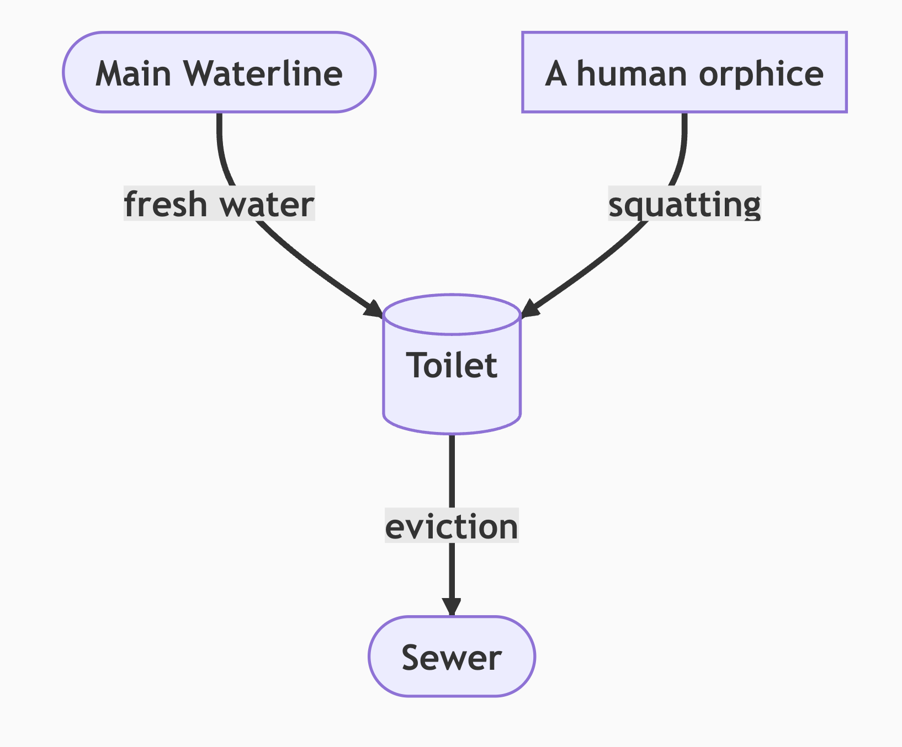

 

Appendix: Incomplete and Unordered List of Reasons to Refuse *The Cloud*

- Workers in the Global South are being exploited and our devices are
assembled by modern day slaves.

- Rare metals like cobalt, essential for lithium batteries, are extracted
under horrible conditions and, among others, by children.

- Other metals, like lithium, are extracted from indigenous lands without
consent or regard for the environment.

- E-Waste is polluting the planet and is being dumped in landfills without
regulations in the global south, poisoning both the lands and the
people.

- Tech companies are constantly spying on us through our devices. The
right to privacy is being eroded.[^08chapter5_52]

- This information is passed on to government agencies and the
surveillance state is being facilitated.

- Social media companies profit from radicalization, and a divided
political landscape, fake news, disconnected filter bubbles and rabbit
holes are not by-products but part of the product.

- The internet, and most devices we carry in our pockets, like smart
phones, are developed from US military technology.

- Tech is a race to the brain stem. Some of the most educated people in
the world put all their energy into selling us ads. Thinking we could
resist the machinery is like thinking we could win against a super
computer in chess.

- It's addictive on purpose. At places like the Stanford Persuasive
Technology Lab people have been trained to specifically find ways of
persuading users to change their behavior through digital stimuli like
rewards.

- Big companies that have incomprehensible terms and conditions instead of
constitutions can censor users without any form of accountability or
oversight.

*fig. AP.1: The terms cloud is a bit of a stand-in for everything wrong
with the internet, in this case*

***Lukas Engelhardt (Hamburg, 1991)** is a graphic designer in Amsterdam. He is interested in the aesthetics of autonomy: the way it looks and feels, the way we talk about it, the groups and individuals who struggle for it – and the tactics, terms and conditions necessary to create and maintain it, online as well as offline. He's part of the Amsterdam-based publishing collective Spookstad that emerged from the housing struggle and promotes direct emancipatory action runs the graphic design studio Correspondence with Justus Gelberg in Berlin.*

[^08chapter5_1]: Bobby Johnson, “Cloud computing is a trap, warns GNU founder
    Richard Stallman”, *The Guardian*, September 29, 2008,
    https://www.theguardian.com/technology/2008/sep/29/cloud.computing.richard.stallman.

[^08chapter5_2]: Mathew Ingram, “Hey hey, you you — get off of my cloud”,
    *Mathewingram.com*, September 29, 2008,
    https://web.archive.org/web/20081122005447/http:/www.mathewingram.com/work/2008/09/29/hey-hey-you-you-get-off-of-my-cloud/.

[^08chapter5_3]: This sentiment also has become a meme of sorts, printed on mugs,
    stickers and t-shirts that you can buy all over the internet,
    including, not surprisingly, on Amazon.

[^08chapter5_4]: Which, in turn, directly informed the early beginnings of Silicon
    Valley's tech world.

[^08chapter5_5]: Samenwerkende Universitaire Reken Faciliteiten, *Co-operative
    University Computing Facilities*

[^08chapter5_6]: *SURFnet* still exists today, and, among other things, founded and
    operates eduroam, an authentication infrastructure letting users in
    higher education facilities use wifi, which many readers might be
    familiar with.

[^08chapter5_7]: Originally, Estrada had wanted to reference San Diego's reputation
    as a surfers' paradise. Her second choice, CERFnet, was an
    abbreviation for *California Education and Research Federation
    Network*, and a reference to Vint Cerf, one of the inventors of the
    TCP/IP protocol and so-called fathers of the internet, whose name
    absurdly sounds like someone with a strong German accent trying to
    say *wind surf.* Today, Cerf works for Google as Chief Internet
    Evangelist.

[^08chapter5_8]: Interestingly, one of the best articles on the history of the term
    was published in the completely-not-tech-related surfer magazine
    Surfer Today, in which they quote Armour Polly on her intentions.

[^08chapter5_9]: “The idea of cyberspace posed a line of separation between the
    internet and the real world. Cyberspace would be a separate
    universe. Created by people, enabled by technology, and occupied by
    information. Geopolitically, it would be like the sea once was. An
    unregulated and fluid space where ordinary rules need not apply."
    Metahaven, Black Transparency : The Right to Know in the Age of Mass
    Surveillance (Berlin: Sternberg Press, 2015), XV.

[^08chapter5_10]: Arguably it helped that the term was so visual, which gave way to
    an endless sea of illustrations of people literally surfing on their
    peripherals.

[^08chapter5_11]: The word cybernetics originally developed from the word
    steersman.

[^08chapter5_12]: See: Netscape Navigator

[^08chapter5_13]: See: Pirate Bay

[^08chapter5_14]: See: Safari

[^08chapter5_15]: See: Opensea.io

[^08chapter5_16]: De Saint-Exupery, author of *The Little Prince*, never really
    said this. Instead, this quote is paraphrased from his 1948 book
    *Citadelle*. However, this adaptation is much more widely known, and
    fits the context of this chapter better than the original.

[^08chapter5_17]: At the time of writing, Thiel has founded a total of six
    companies that are named after places and objects in J. R. R.
    Tolkien's Lord of the Rings.

[^08chapter5_18]: When the Thai government discovered the existence of their
    seastead, Elwartowski and his girlfriend had to flee the country in
    fear of prosecution for violating the country's independence.
    Elwartowski logged the details of their dramatic escape on his vlog.

[^08chapter5_19]: A term I regretfully cannot take credit for.

[^08chapter5_20]: Web1: Read—Web2: Read, write—Web3: Read, write, own

[^08chapter5_21]: Marlinspike founded the Anarchist Yacht Club, which involved the
    squatting of derelict boats in order to fix them up and sail the
    world. In 2004 Marlinspike and 3 friends sailed to the Bahamas on
    the *Pestilance*, documenting their journey in a short film.

[^08chapter5_22]: In a 2022 article, Marlinspike outlines his experience with web3.
    While expressing excitement from his position as a developer, he
    claims that web3 doesn't actually deliver on many of its promises of
    decentralization, a nautical example of which is the monopoly of the
    platform opensea.io.

[^08chapter5_23]: Elmhirst outlines how, the day the ocean builders officially
    gained ownership of the ship, its certificates of seaworthiness had
    expired. They had to sail it from Greece to Gibraltar to have it
    dry-docked and inspected, before finally starting the voyage across
    the Atlantic to Panama. There they had hoped to be able to
    de-register the ship, for it to legally become a floating residency
    in order escape strict maritime law, but the government of Panama
    insisted that, while they were allowed to anchor, the MS Satoshi had
    to officially remain a ship. This led to a lot of issues regarding
    the disposal of waste water and especially insurance: the team was
    unable to find anybody that would agree to insure their stationary
    crypto-ship, and facing the enormous costs of running it, including
    having a crew on board at all times, and the fact that they were not
    able to sell enough cabins, they had to cancel their plans and sell
    the ship mid-journey.

[^08chapter5_24]: In a resigned last blogpost, Elwartowski blamed a corona pandemic
    conspiracy orchestrated by global elites.

[^08chapter5_25]: Taken from a personal conversation.

[^08chapter5_26]: The artist and design theorist Silvio Lorusso argues something
    similar in his text *The User Condition: Computer Agency and
    Behavior*, where he quotes art critic and essayist Joanne McNeil:
    "As smartphones blurred organizational boundaries of online and
    offline worlds, spatial metaphors lost favor. How could we talk
    about the internet as a place when we’re checking it on the go, with
    mobile hardware offering turn-by-turn directions from a car cup
    holder or stuffed in a jacket pocket?"

[^08chapter5_27]: We cannot, for example, just log into our social media account,
    and delete some of the data they have collected from us (or in many
    cases even delete our account)—they didn't make the buttons for
    that.

[^08chapter5_28]: To an extent, of course. The immateriality of data (not
    infrastructure) affords the virtual the capacity for redundancy. To
    use the famous piracy example, I can copy a movie and the original
    file remains untouched, which is, as of the time of writing, still
    not possible with a car.

[^08chapter5_29]: United Nations, “The Challenge of Slums - Global Report on Human
    Settlements 2003”, *UN-Habitat,* 2003.

[^08chapter5_30]: René Boer, Marina Otero Verzier, Katía Truijen, *Architecture of
    Appropriation:*

    *On squatting as spatial practice*, (Het Nieuwe Instituut, 2019).

[^08chapter5_31]: That year a court ruled that if squatters could prove that they
    had established so-called *house peace (huisvrede)* they would enjoy
    the same legal protection in their homes as everyone else, meaning
    they could not just be evicted by the police without the ruling of a
    judge. This continues to be the legal grounds for squatting actions
    in the Netherlands even today.

[^08chapter5_32]: Despite the raging housing crisis, which has only worsened since
    then. Between 2010 and 2020, the (already high) average rent price
    per square meter in Amsterdamincreased by around 50 percent.

[^08chapter5_33]: *Architecture of Appropriation* list alternative housing
    projects, (sub)cultural venues, food distribution centers, peoples'
    kitchens, legal support, media outlets and medical services as nodes
    in this network.

[^08chapter5_34]: Examples in Amsterdam include OT301 (located at Overtoom 301) and
    W139 (Warmoesstraat 139).

[^08chapter5_35]: In a time before cell phones, this flowchart, composed on a
    typewriter and distributed through copying machines, mapped out how,
    in case of an emergency such as an attack by violent groups like the
    police or thugs sent by the owner, the different nodes in the
    immediate network should be contacted for support, in which order,
    by who, and by what means (by fiets, meaning by bike, or by bellen,
    meaning by phone). René Boer, Marina Otero Verzier, Katía Truijen,
    and Johannes Schwartz, Architecture of Appropriation: On Squatting
    as Spatial Practice (Rotterdam: Het Nieuwe Instituut, 2019), 55.

[^08chapter5_36]: Freenets were proto-www networks of computers that gave users
    free access to information and in some cases (like with DDS) access
    to the internet.

[^08chapter5_37]: Preceding *Geocities* by a few months, another network employing
    the metaphor of the city.

[^08chapter5_38]: Already back in 2019, the (potentially biased) Dutch Data Center
    Association called the Netherlands the leader in data centers in
    Europe.

[^08chapter5_39]: While this comparison is maybe hard to quantify, the grave
    effects of Airbnb on the local housing market are well documented.

[^08chapter5_40]: Sheldon S. Wolin, *Democracy Incorporated: Managed Democracy and
    the Specter of Inverted Totalitarianism*, (Princeton; Oxford:
    Princeton University Press, 2017).

[^08chapter5_41]: The Tragedy of the Commons is an economics problem conceived by
    economist William Forster Lloyd in 1833, in which everyone has equal
    access to a resource. The idea is that, if everyone were to act
    according to what they consider to be their immediate best
    interests, it would lead to over consumption, and the depletion of
    the resource.

[^08chapter5_42]: Silvio Lorusso, “The User Condition: Computer Agency and
    Behavior”, February 12, 2021, https://theusercondition.computer/.

[^08chapter5_43]: The only one more powerful than the coder might be non-user, the
    one who doesn't use computers to begin with. Lorusso evokes the
    images of big-tech-CEOs that don't let their kids use social media,
    alluding to the privilege required for this sort of refusal, which
    is also expressed in Kherbek's example of Airbnb.

[^08chapter5_44]: One can't help but think of the quote attributed to Edward Tufte,
    that the only industries that call their customers users are
    software companies and drug dealers, which is another way to think
    of dependencies.

[^08chapter5_45]: Mckenzie Wark, *A Hacker Manifesto* (Cambridge, MA; London:
    Harvard University Press, 2004).

[^08chapter5_46]: Or, he adds, without our toilet trying to kill us. James Bridle,
    *New Dark Age: Technology and the End of the Future* (Verso Books,
    2019.)

[^08chapter5_47]: shit

[^08chapter5_48]: Boer et al., Architecture of Appropriation, 10.

[^08chapter5_49]: For example *domain squatting*, the practice of buying up domain
    names of companies and well known individuals before they do, mostly
    with the goal of selling them for a higher price afterwards

[^08chapter5_50]: The center of Amsterdam serves as a good example here. After our
    inevitable eviction Hotel Mokum is, at the time of writing, being
    turned back into a hotel.

[^08chapter5_51]: Lorusso points out that in UNIX based operating systems, users
    have /home folders, which is not true for iOS and Android users,
    rendering them homeless. Lorusso, “The User Condition”.

[^08chapter5_52]: Douglas J. Leith, “Mobile Handset Privacy: Measuring the Data IOS
    and Android Send to Apple and Google,” in Security and Privacy in
    Communication Networks, eds. Joaquin Garcia-Alfaro, Shujun Li, Radha
    Poovendran, Hervé Debar, and Moti Yung (Cham: Springer, 2021),
    231–251.

#Cycles: the Sacred and the Doomed, On Optimization, PMDD and its Metaphors.

##Morgane Billuart

###Originally published on December 13th, 2021

 

> We must know whether we want to change the world to experience it with
> the same sensorial system like the one we already possess, or whether
> we’d rather modify our body, the somatic filter through which it
> passes.
>
> Testo Junkie, Paul Preciado[^09chapter6_1]

###Day 15 - The Number One Enemy

I woke up earlier than Juli. It’s day 15. The fog is slowly appearing
around me. I don’t see it, but I feel and hear it. It is this silent
cynical voice within my head telling me that every attempt is worthless.
It is the slowly escalating anxiety rushing through my veins when I
start focusing on what could go wrong. The sun’s rays are piercing
through the mosquito net. Juli is still sleeping.

How do people do it? How can they do it?

The image of my parents rises in my head; the stupid idea of their
monogamy and the concept of sleeping in the same bed every night. I
remember thinking that doing something else would be the ultimate proof
of being unloved. This thought on endless continuity and consistency
feels like a weight, a terrible pressure. I sense it pouring all over
me, laying in bed, covered by a light blanket and the sleeping arms of
Juli.

In her book *Illness as a Metaphor*, Susan Sontag investigates the
cultural and aesthetic representations of disease in society. She
explains how they are often displayed as images and meanings, instead of
being seen as what they fundamentally are: a burden and a condition to
be treated.

When I started researching Premenstrual Dysphoric Disorder, I read the
list of symptoms first, to see what the condition entailed and to see
how a diagnosis would be made. It was a surprise and a relief when I
realized that the diagnosis was not purely a scientific one, but rather
an empirical one. Still, I wondered, how does one treat a condition as a
disease, when it is, in essence, seen as a fundamental component of our
lives? How to approach an experience that has been understood and
studied for so long as an unavoidable and fatal component of our
bodies?

Before it was even categorized as a disease, PMDD existed as a metaphor.
Nowadays, it is the symbol of our bodies’ treatment and the prejudices
around it. More than a disease, it is the result of our limited
understanding of the influence of hormones on our body, psyche, and our
social life. PMDD is the impact on how one’s body is reflected in
society. It is only once we understand the role that this metaphor
plays, and how it limits the possibilities for treatment, that we can
understand what is at stake behind the acknowledgment of such
conditions.

Irritability, Nervousness, Lack of control, Agitation, Anger, Insomnia,
Difficulty in concentrating, Depression, Severe fatigue, Anxiety,
Confusion, Forgetfulness, Poor self-image, Paranoia, Emotional
sensitivity, Crying spells, Moodiness, Trouble sleeping, Abdominal
cramps, Bloating, Constipation, Nausea, Vomiting, Pelvic heaviness or
pressure, Backache, Decreased coordination, Painful menstruation,
Diminished sex drive, Appetite changes, Food cravings, Hot flashes.

One of the first questions that come to mind when reading this list is
“Whose menstruating bodies do not suffer from those symptoms?”. Surely,
the severity of those and their frequency may vary from one individual
to another. PMDD is a floating cloud that englobes an entire field of
*dysfunctional* behavior and physical *incapabilities*. If you
menstruate and feel terrible two weeks out of four, it’s quite likely
that you have this condition too. It is difficult to diagnose and treat
it, specifically because the symptoms can be so diverse. As far as
scientific knowledge goes, it is generally understood as a dysfunctional
reaction of the body from the changes of hormones throughout the month.
These symptoms usually disappear at the beginning of each cycle, when
menstruation starts.

It is complex to study PMDD as a real condition because it regroups all
of the symptoms that, individually, can be dealt with, but as a whole,
can make it impossible for any human being to function[^09chapter6_2]. It is too
complex to understand the severity of the problem in a society where
menstruating bodies have been conditioned to think that pain is normal,
and that menstruating is a curse that we have to learn how to deal with
in silence. A body suffering from this condition can hardly express its
feeling to a society that has digested that it is a normal narrative to
suffer when you’ve been cursed and born with a uterus for centuries. The
data collected demonstrated that 20% of menstruating bodies deal with
PMDD; approximately 600 000 000 bodies[^09chapter6_3]. PMDD is a fluctuation that,
perhaps, one could deal with if we existed in a society that did not
value endless efficiency or competition If we lived in a world that did
not see our uteruses as constantly available objects, if fair rates in
the working environment were a thing and if generic medicine tried to
look into the causes and not the symptoms. PMDD is one of the many
diseases which is not understood (yet) because there's no interest, no
lobby (yet). It is one more phenomenon, one demonstration that our world
and systems have not been designed by other than men.

Those who suffer from this condition are moralized not only by the
medical field but also by the people surrounding them. Perhaps their
mental confusion is understood as hysteria, their low libido is seen as
a lack of love, and their frigidity is a mystery. Perhaps their
fluctuations are seen as bipolarity and their emotional unsustainability
as craziness. There should be no confusion about the fact that PMDD is a
condition, a disease, and a dysfunction. Like for many other diseases,
its effects are highly enhanced by its unrecognition, by the absence of
knowledge on the subject, and by its confrontation with society’s norms.
While it is still hard to know and tell where the condition comes from,
what triggers, and what exacerbates it, using PMDD as a metaphoric
condition enables a lens to look into the technologies of menstruating
bodies and the advancements designed for them.

Over the course of the past century, enormous breakthroughs and progress
have been made in the research field of menstruating bodies and female
conditions. The era of the mystery of blood and burnt witches is,
thankfully, is long gone. Although this does not mean that the gender
bias in medicine and in research has been resolved. The majority of
studies look into conditions from a male perspective and generally,
women’s studies remain poorly funded. Luckily, multiple books about
menstruation and female reproductive organs are currently being
published and the knowledge produced on these matters is ever-expanding.
As we now have the chance to look into the depth of, the history of and
functioning of our bodies, we are presently given the chance to better
understand the mechanisms of power and oppression behind this
technological progression.

##The Insufficient Technology of the Body

Menstruating bodies and technologies have an ambiguous relationship.
Firstly, the ability to be fertile and give life remains one of the
biggest possibilities of our existence. Menstruation, the absence of
menstruation, as well as the many fluctuations coming throughout our
cycle, are technologies that enable us to be aware of the self and of
our environment. This very specific aspect of our bodies is a
fundamentally political tool, and because of that exact same reason, we
have been offered many assets, pills, supplements and devices, under the
concept of progress, to help our bodies function better.

As a human-lived technology, the body fluctuates and sometimes does not
offer the best living experiences. Not all menstruating bodies
menstruate or have a regular cycle. Not all of them ovulate or can
conceive. Some struggle with intense pain, some never experience
pleasure. To live with your biological condition does not mean living a
better life. The technology of our bodies can sometimes affect various
areas of life in quite unpleasant ways. In regards to female bodies,
recent progress and discoveries have offered the possibility to offer us
advancements and technologies to overcome pain, obstacles, failures, and
many other conditions.

For the body's Accessibility, we’ve been given birth control. For the
body's Reproductivity, FIV. For the body’s Longevity, hormones
replacement. Body’s Mental Instability, SSR. Body’s Fluctuations,
Health/Menstruating Apps… this list goes on and on.

While these technologies used to bring along a lot of enthusiasm in
female and menstruating communities, perceived as tools for emancipation
and freedom, they are now questioned and put in perspective with
ethical, political, and ecological implications.

These rising communities, mainly perceived online, emphasize their
indignations in regards to the consequences of these technologies and
the remarks are generally about the lack of knowledge on the causes or
implications of certain the conditions. This is particularly the case of
communities of individuals suffering from Polycystic Ovarian Syndrome or
Premenstrual Dysphoric Syndrome. Although these two illnesses are very
much different, they both reflect a similar issue; the body suffers from
its own technology, and to which the solutions provided are quite often
not adequate. As a result of their feeling of being misunderstood, these
communities meet and exchange their knowledge on alternative digital
platforms.

 

Yes, science and generic medicine offered more comfort than pain in our
lives. Although it would be too easy to pretend that the technological
advances in the last century were only liberating and emancipating. By
moving away from our biological conditionings, perhaps we were freeing
the body from deterministic features and political constraints, however,
the menstrual and medical revolution that we are now facing seems to
demonstrate more complex dynamics. With or without the pill, with or
without these conditions, our bodies are gradually realizing that the
environments in which we evolve are not, by definition, designed for us.
A problem that neither the pill, anti-depressants, nor this false
political promise can hide anymore.

If these conditions are indeed a representation of our failed
technology, recent studies which looked into the hormonal and social
roots of PMS, universally known or experienced as premenstrual syndrome,
demonstrated that its symptoms are highly impacted by the social
environment one exists in. Researchers investigated how its effects
changed depending on the social environment, demonstrating how
menstruating bodies, when failing to be super-efficient and adequate,
often failed into self-pathologization:

*“When women were able to be alone, they reported that their
premenstrual symptoms were reduced; the ‘PMS’ effectively disappeared,
and they felt ‘better’. However, many of the women we interviewed never
took time out for themselves in the whole month, and spent little time
engaged in leisure activities, focusing instead on the needs of others,
common to women who present with ‘PMS’ clinically .”*[^09chapter6_4]

These perspectives on the subject matter invite us to wonder: what is
it that makes these bodies inadequate in the first place? What is the
reference we’re looking into to determine how one should function? While
the conditions we mentioned earlier (PCOS, PMDD, and others) are often
grounded in physical and hormonal dysfunction, they seem to offer us a
critical lens to look into how our technological bodies are perceived
and function, what assets and advancements are being offered to us, and
if these new technologies help menstruating bodies feeling better and
heal within society at all.

In her thesis, The Genesis of Premenstrual Syndrome, Bianca Zietal
reinforces the idea of PMS as a social construct by illustrating “how
the concept of PMS was developed and informed by the discovery of
hormones and the resulting field of endocrinology that provided a
framework for conceptualizing PMS.”[^09chapter6_5] The researcher expands her
theory and demonstrates that the metaphor of PMS illustrates its
unrecognition: “This variety of uses suggests that popular culture
understands PMS as something that makes for a good joke or serves to
explain a negative change in a woman’s behavior. However, relatively few
people know that PMS has an official place as a medical diagnosis.” It
is specifically because we have integrated that mood swings, pain, or
mental disability are a fundamental component of menstruating bodies'
life so well, that, as a result, this universally known disabling
phenomenon isn’t still properly addressed and taken seriously. By
limiting the urgency and despair in those experiences, those bodies’
needs are repressed and they repress themselves in return.

Science alone won’t help us. To only call out hormones and biological
dysfunction for being the entire cause of our displacement would be to
refuse to see how societal constructs still play a big role in this
issue. Through the lens of the condition of Premenstrual Dysphoric
Disorder, manifesting as an intense collection of PMS, we can ask, how
this condition can help us reconfigure the technologies of our bodies
and question the way that they are being taken care of in society? More
than a chemical or hormonal imbalance, isn’t PMDD a metaphor for our
body’s inadequacy? Could it also be the externalization of our
incapacity to fit in the design of ideal efficiency, in the template of
society at all?

Contemporary literature addressing the topics of women and mental
illnesses is scarce. It is often written by women themselves, who, based
on their own understanding and experience of their bodies and minds
within society, started to ask questions. In her book, The Madness of
Women: Myth and Experience, Jane Ussher expands on how her mother’s
condition drove her to study psychology and investigates the dynamic of
the pathologization of women’s dysfunctionality. In this book, Ussher
makes the following statement: “In an official announcement nearly half
of all American's experience a psychiatric disorder. Does that mean no
one is normal? Or do we live in such a crazy-making, sick, impersonal
society that it does serious psychological damage to half of us? Should
we be calling women the mentally ill or society's wounded?”[^09chapter6_6] While
this realization is a question that could be applied to a broad range of
conditions and diseases, it is specifically urgent to look into how the
criteria and expectations of our cultures can lead to the aggravation of
those.

##Upgraded and Updated: on Hormone Replacement and Alleviation

 

As previously mentioned, it is difficult and tedious to diagnose PMDD.
Even though the condition seems to have been named for more than 20
years, institutes and research in its regard remain succinct. As a
result, the production of knowledge and treatments are scarce and often
reductive. PMDD being a disease with hormonal and psychological impacts,
two fields of action are proposed. First: the pill, in order to suppress
hormonal fluctuations and consequently, these impacts on the body, or
second: anti-depressants, in order to alleviate the mental burden of the
condition in everyday life. While these treatments might help some
individuals and bodies by lessening the symptoms generated by the
condition, it does not seem to change anything in regard to the urgency
of the topic, as well as lack of knowledge around it. While our bodies
are being offered pills and assets to cope with such conditions and what
society made of them, there exists a risk of these conditions being
under looked, perhaps even remaining unstudied.

In the article *Fake periods, side effects, and other things you need to
know about the pill* naturopath Lara Briden explains how the number of
solutions given to those bodies reflects the scope of knowledge around
it. “At the moment, the pill is one of the only women’s health
treatments available to doctors,” Briden says. “So, of course, they have
no choice but to prescribe it for all manner of period problems.”[^09chapter6_7] It
would not be the first moment in history that these bodies and the
technology within are dismissed, put aside rather than questioned and
supported. Therefore, it is urgent and necessary to wonder what will
happen to our bodies and to these conditions if they remain hidden,
unspoken. Are they veiled by the designed cure? What are the
technologies proposed, and what are the implications behind these
choices?

###Day 14 - Memories of Diane 35

The perfect cycle’s length is 28 days. So are the number of these pills
that I had to swallow. They say ovulation happens two weeks before
menstruation, therefore, I should be ovulating by now. I used to feel it
more intensely before. I noticed in the past how my behavior changed
around that time. The texture of my discharges. The smell of my body.
The look I give to men. Ovulation is, primitively, the key moment where
one should conceive to have a higher chance to reproduce. My body knows
that by now, but it was not always the case.

Summer 2016. I got prescribed Diane 35 to deal with skin problems and
non-existent periods. I am pretty sure that my body is trying to tell me
something, but I am 19 years old and I have no time to wait for my skin
to be perfect and my cycle to function. These are early teens, or
elderly’s people problems, not mine.

I remember walking in the street of Sicily with A. He gets mad because
men look at me as if I was an object. Am I not? Diane 35 cleared my
skin, made my boobs grow enormous and my hair grew thicker. It’s all I
ever wanted, all of this potential in a small, ridiculously tiny
package. I am youth and elasticity in a box. I can decide or not if I
want to bleed, by the simple act of renewing my pills every month. I am
ready to be used, consumed, taken, and everyone around me senses that.
The utopia of my body and this relationship with A does not last very
long: I soon realize that the pill cuts off my appetite, my desire, and
my libido. I suddenly become this desirable object which can’t be
consumed.

A and I seemed to exist in perfect disharmony, a body hooked on natural
testosterone, another one sedated on artificial estrogens. I hate how
cliche it sounds and how grounded it feels. I now see our
dysfunctionality clearer. Being on Diane35 is similar to getting a free
ticket to the buffet when you just lost your taste or appetite. A
luxurious hotel without a swimming pool. A reminder that it is
impossible to win at everything in life.

As for many other conditions, an interesting dilemma operates between
the researchers in the healthcare field and the ones who experience the
condition. Is it not the perfect timing to either, create a technology
that would completely free us from our biological conditioning and its
complications, or on the contrary enable us to connect to the core issue
and fundamentals of our bodies and their functioning by rejecting
technology? Although these two separate movements do have a correlated
goal (to emancipate) they seem to look into two separated notions of
technology. The first one belongs within, is more ancestral, holistic,
and so-called “natural”, while the other one bets on technological
assets and medical advancements to free us from the condition. While
these two battles and research fields are worth looking into, it is
necessary to emphasize a third question that needs to be examined and
criticized: the effect that the environment and its design around us
have on us.

In the article of the Atlantic, Why to Menstruate If You Don't Have To?,
journalist Marion Renault illustrates the dilemma which operates in a
society where many menstruating bodies would rather not experience the
bleed of their biological body. While the reasons for such choices are
sometimes linked to intense or unbearable pain, body dysphoria, or the
lack of access to product/resources for menstruation, it is also
emphasized that the underlying need and desire is to be optimal and
functioning, or rather, compete better with other individuals which are
not menstruating. “*I want them to be competitive against those who
don’t have uteruses,*” Yen said. “*Teenage years are so turbulent and
horrific as is. I don’t want them to suffer unnecessarily—and I can
alleviate this for my child.*”[^09chapter6_8] This thought exists or has probably
existed in many of our minds. It is a valid and understandable idea,
given the conditions in which our bodies evolve. A society where the
conditions related to our reproductive systems are little or poorly
studied and where paid leaves due to pain or disability are extremely
rare. Not to menstruate, and therefore to not have these conditions, is
the newest efficiency dream. It is an idyll because, in this space, our
body would not be limited by its biological condition and is not judged
for it. A world where we could be functional, optimal and where our body
would not be an obstacle to our activities and ambitions. But who sold
us this dream? Why should we be optimal, and for whom?

In these artificial attempts to cure and hide, nothing more is being
investigated. Coming back to the testimony of Lara Briden in the article
Fake periods, side effects, and other things you need to know about the
pill, the naturopath unpacks how “*Pill bleeds are pharmaceutically
induced bleeds … to reassure you that your body is doing something
natural,*” says Briden. “*Many doctors continue to prescribe birth
control to ‘normalize periods’ and ‘regulate hormones’, as though the
pill’s steroids are somehow equal to, or better than, your own hormones.
The fact is, nothing could be further than the truth. Pill steroids are
not better than your hormones. They’re not even real hormones.*”[^09chapter6_9] So,
is that it? Will we resolve these conditions and treatments by simply
eradicating and replacing natural hormones? Is that all we know? When
looking at these artificial technologies of emancipation and
transformation, we observe how they simulate the real, the biological,
as to convince the “naturality” of their essence. As if our distinction
with “nature” and the choices of some individuals to alter their biology
wasn’t accepted yet. But it’s already there.

In regards to the second-most administered treatment offered to PMDD
sufferers, SSRIs, the positive results of these medications seem to
underline the psychological and mental consequences of the condition.
While the body seems to correctly react to the presence of estrogen, the
main hormone-induced within the first two weeks of each month,
progesterone, arriving right after ovulation, seems to be the culprit of
the sudden change in mood, embodiment, and perception.

 

While the studies of PMDD and its impact on mental and social life were
rendered public forty years ago[^09chapter6_10], it does appear that the medical
field still has not targeted the exact cause of the sensitivity of what
aggravates it. As a result, to this day, SSRIs are the main and only
option offered to patients and it should be emphasized that it has shown
great results. Still, as for PMS, PMDD is the result of a change that
operates hormonally and chemically, therefore its experience and
perception are also highly emphasized by the environment in which one
finds themselves. If it is indeed hard for an individual to sense their
body and mind changing so drastically within such a short period of
time, this experience might as well be aggravated by the social pressure
which women and menstruating bodies have suffered from for centuries. If
SSRIs can help one’s mental capacities and soften their experience, it
does demonstrate that the mental burden of those conditions is
consequent. If those treatments can ease one’s experience of their body,
we should not forget to question what the changes are which need to
happen within society for those bodies not to feel sick and oppressed in
the first place.

In her book, *The Madness of Women: Myth and Experience*, Ussher expands
her question to a broader range of conditions attributed to female and
menstruating bodies: “*I thus turn my gaze onto three other
manifestations of madness ascribed to significant proportions of the
female population: borderline personality disorder (BPD), post-traumatic
stress disorder (PTSD), and premenstrual dysphoric disorder (PMDD).
While my arguments can be generalized to other \`female maladies' (such
as anorexia or anxiety disorders), these three psychiatric disorders are
ideal examples of the pathologization of women's reasonable response to
restricted and repressive lives*”[^09chapter6_11]. I insist throughout this text on
the necessity to understand the social component of these issues because
a greater design of technology and cures should not only hide or
disguise the external reality of the patient but also aim to change and
redefine the context in which one exists.

Although it is also emphasized that PMDD can be inherited, studies
demonstrate the correlation of discrimination, poverty, pressures to
assimilate, etc with the appearance of PMDD or its aggravation[^09chapter6_12]. It
would be tempting, although hypocritical, not to see a direct link
between these conditions and the standards of society in the era of
capitalism, in between society’s mechanism, patriarchy, and psychiatry.
While PMS and PMDD are now universally known and understood as limiting
and hurtful conditions, their existence as metaphors has not stopped
existing. In their everyday life, menstruating bodies might still try
their best to perform and hide their physical or psychological pain, as
a way to counteract the cliche and stigmas which accompany women and
anger. Those hide their day-to-day experience as a way not to be
discriminated against. Not to be judged. While many fights for these
conditions’ visibility and the importance of its study field, it is
still a vigorous battle to claim the recognition of the incapacity to
perform and live optimally in society.

In 2002, almost twenty years ago, Joan C Chrisler and Paula Caplan
published *The strange case of Dr. Jekyll and Ms. Hyde: How PMS became a
cultural phenomenon and a psychiatric disorder.* In this paper, they
both investigate how and if social context influenced PMS, and what were
the solutions given to those who were highly suffering from the
condition. As a result of their findings, they conclude:

> “It is certainly easier to take medication to restore serenity or
> create emotional detachment (an often reported effect of
> Prozac/Sarafem) than it is to take steps to make changes in one’s life
> circumstances, and women are getting the message from advertising and
> other forms of media that taking medication is what they should do.
> And psychotherapists may find it easier to help a woman try to change
> herself in order to fit the feminine ideal; than to figure out how to
> help her resist the social and cultural pressure to be an ideal woman.
> Taking medication may provide apparent serenity to individual women,
> but it does nothing to alleviate the oppressive conditions that
> contributed to the stress and tension that caused them to report
> severe PMS. PMS is a form of social control and victim blame that
> masquerades as value-free.”[^09chapter6_13]

Still, here we are, twenty years later, and it does not seem that these
considerations have shaped or changed much in the generic medical field.
Thankfully, throughout the years, an army of enraged and disappointed
bodies gathered to discuss and collect information and experiences which
could not be found or mentioned in the earlier times.

##Femtech, in Between Holistic and Transhuman Perspectives

 

###Day 29 - Still a week to go

In moments like these, I feel the urgent need to alter my body or alter
my perception. My detachment from people and from physicality has been
rather intense these past days. Humans feel strange to me. I’d like to
smoke a joint, although I never craved weed. I bought truffles to
micro-dose but the prescribed amount isn’t strong enough. I don’t feel
anything. When thoughts about past events and urges pop up in my mind,
these tiny balls of thoughts either explode to become turmoil and
anxiety, or they simply disappear in the overall fog that floats in my
head. I am numb.

The perspective of the relief feels quite far and aggravates its
urgency. A part of me tries to see despair as fertile ground for
experimentation, for change. But how dangerous is that?

It has become nearly impossible for me to write these days. Now, with
more theory backed up in my brain, I can’t help but always judge the
social construct of these experiences. I am numb.

The feeling I initially wanted to start working with, anger, feels often
too long gone. Anger is the energy of beginners, amateurs. It’s the fuel
of the ones who want to throw out. And I just don’t know where the
battlefield is anymore. Perhaps I can’t write next to anger at the
moment. But if not this, then what? It’s too easy for me to call out on
this condition and blame it for the state of my mind. It could be a
thousand other things adding to my flow of hormones. It could be that
normativity also includes numbness. Where’s the line that one draws to
call themselves sick?

Why am I not choosing to feel something? Why am I not choosing drugs?
Not choosing the pill, not choosing the SRRI’s? Who am I trying to be a
fierce warrior for?

 

The isolation generated by the knowledge gaps led those who suffer from
the condition to find alternative ways to connect through the internet.
YouTube, Tik Tok, and Reddit became the site of experiences and
testimonials that those bodies would refer to. On these platforms, one
can find moving testimonies, cries for help, and success stories of
patients who have found their ideal combination to alleviate their
symptoms. There, different paths seem to appear, in between the ones
referring to holistic fixes and natural flows, and the others, aiming
for a neo-human or trans perspective of emancipation and liberation.
While these ideologies share similar ideals, they seem to differ on some
notions; some aspire to slow down technological processes and their
artificial changes, meanwhile, others support the futuristic ideal of
biological liberation through science and medicine. Simultaneously, they
both question more fundamentally the standards and designs of society
that lead to these conditions and treatments.

While these internet groups and communities allowed patients to collect
and gather information, share their knowledge and support each other
mentally, awareness and actions, something else emerged. From these
online gatherings and testimonies in the age of the internet and
fast-online-shipping, a new and exponential market appeared - a market
much bigger than the PMDD or PCOS market alone. A market whose mission
it is to change society, science, the condition of women and to vary the
treatments and their accessibility: the world of FemTech.

As we started to face the sudden deterministic realization of our bodies
and their conditioning, researchers and tech experts started to
assemble, aiming to develop new tools and concepts which would help our
bodies and their technologies in everyday life. This new industry
appears to be born from a new generation of individuals, an army of
strong and ambitious warriors determined to offer wellness and a sense
of conformity to women and menstruating bodies. Instead of separating
the two previous names ideologies - returning to nature, or emancipating
from it - Femtech aspires to exist in between. It aspires to become an
alliance of ancestral knowledge and forms of rituals mixed up with
digital devices and high-tech tools to enhance our experience and
knowledge. Femtech is a thermal ring you’ll put in your vagina to track
your temperature. Femtech is a menstrual app that predicts the worst
moment of your cycle to make a business deal – girlboss at its finest.
Femtech is a DIY kit to try out your fertility and its expiration date.
Femtech is when your phone became your very personal gynecologist.
Fluids are the issue, digital is the recipe. It is the world that
perhaps Donna Haraway dreamt of mixed with nuances of Silicon Valley.
FemTech is what technology for menstruating bodies looks like in the
21st century. Within this new ideology, more than often directed and
designed by individuals who are other-than-man, it is an interesting
moment to reflect on these technologies, their promises, and the
obstacles one might encounter when trying to design new technology and a
new philosophy for inclusion and care.

 

The Elvie pelvic floor trainer is
just one of a number of products from ‘femtech’ startups which have
raised almost $50m in recent months.
As mentioned earlier, we should not only focus on fixes for our bodies
in society and ways to optimize pain or time, but rather think of
objects and interfaces which offer care and understanding of our
conditioning. The world of Femtech gives a chance for health and care to
be designed and understood by a more diverse body of thinkers,
designers, and engineers. It could become a revolution if we make sure
it does not take the path of an optimization that takes men as the norm
and gravitates towards efficiency or productivity. Even more than
finding and designing cures, Femtech also has the main challenge to help
our bodies fight society’s standards defined by men. This revolution
holds a huge potential, one that has been banned, or hidden before: the
possibility to target not only the symptoms but also the research, the
gender gaps, as well as society’s standards, so far deeply imprinted in
patriarchy and capitalism. Within this new field, many questions arise.
What can science and technology do to our bodies? Through which aim? For
who’s interest? Should we even try to understand these phenomena? Or
shall we, as Preciado suggested, live in a world of “molecular
excitation”?

While this research field grows and while waiting for more discoveries
and fixes to appear, self-diagnosis and medication seem to be one of the
ways that patients learn to deal with the condition of PMDD. At this
stage, the internet sometimes feels like a safer space to talk and
investigate cures. While I wait for changes to appear, and dream of a
speculative database where our bodies and conditions could be studied
and rendered real, our society keeps on evolving at a fast pace,
designed by patriarchy with endless feelings of inadequacy as a result.
This battlefield isn’t located at one spot only, it is multiple and
intertwined. It is a call for care, for a change in health systems, it
is a reminder to not always judge our bodily responses to the world, but
also to question the world itself. On the good days, in the first two
weeks, I am optimistic and fearless of the obstacles coming in the way
of this revolution. On the last two, it becomes harder to stay positive,
but at least anger and inadequacy drive me to write. Until the next
cycle.

###Day 3 - The Dream Girl

Still not at my cutest because my hair is still kind of greasy from the
hormones. I always love to shower around the 7th day. I am finally clean
and renewed. In the evening, I grab my phone to log in to Field. I don’t
know what I am looking for but I NEED attention. I have a partner and
great friends but I DEMAND care. There is something in the way I carry
myself and walk around the world. My stomach is now flat, my cravings
are gone.

I am the dream girl. I feel hot and smart. I desire and I am desired, I
stare back because I am a young flesh, young blood, and because it feels
so rare, so intense to feel adequate. There is something in the smell of
others, in their moves, I could suddenly hug the entire planet, perhaps
even make out with it. I wish I could be that girl all of the time,
could live on estrogens and serotonin, never get old and always want to
fuck. Twenty-four years old, in my luteal phase: I am optimal, and it
will never again get better than this. I wake up in the morning
acknowledging the time that has already passed and won’t come back, I
look at what I already possess. It’s not much, but they all say that at
least I have time, I have youth. Youth is not much when understood in
the frame of fertility. I have been ovulating for over ten years already
and still did not procreate. Something in my mind tells me that I have
approximately ten years left. Ten years left, as they say, to find the
perfect partner, to assure my back, to carefully think of and act upon,
because it is youth and I because I am a woman.

The memory of the fogginess from the follicular phase is already long
gone, forgotten, forgiven. I can take the world back, chase whatever I
intended to do, but I have to remember: my time is limited. Soon enough,
something bigger, stronger, wiser than me will limit my thinking and
actions. It is because the time is so short that I choose not to think
of the evil anymore. I would rather focus on what functions, look at the
bleach of my hair, the hydration of my peachy skin, happily notice the
lubrication of my genitals, all of this while I still can.

I have no hate, no. I feel no repression, I go out like a trophy, I am
above what is dictated because I am exactly what I was intended to
become. I will happily smile at strangers and perhaps fantasize for a
second, patriarchy feels like a distant battle which I won because I am
optimal. I could choose to love or hate, ride or die, date or break but
still, time is running and I should focus on what needs to be achieved,
succeed while I still can.

***Morgane Billuart** is a writer, researcher, and storyteller whose
practice unfolds at the intersection of critical research and art
direction. She is currently an affiliated researcher at the Institute of
Network Cultures and the New Center for Research and Practice, and she
co-hosts the podcast GirlEmployee with Carmen Lael Hines. Working across
writing, visual media, and collaborative formats, she traces how
technology shapes contemporary ways of imagining and relating to the
world. Morgane has developed and shared work in collaboration with
institutions such as the Institute of Network Cultures, Do Not Research,
the Stedelijk Museum, Current Obsession, Blank Magazine, and Bianje
Systems.*

[^09chapter6_1]: Paul Preciado, *Testo Junkie*, Editions Points, 2021

[^09chapter6_2]: Kate Lucy, “PMDD is the condition that means your period can make
    you suicidal”, *Metro*, October 5, 2019,
    https://metro.co.uk/2019/10/05/pmdd-condition-means-period-can-make-suicidal-10865751/.

[^09chapter6_3]: The Recovery Village, “Premenstrual Dysphoric Disorder
    Statistics”, ed. Megan Hull, April 19, 2021,
    https://www.therecoveryvillage.com/mental-health/pmdd/pmdd-statistics/.

[^09chapter6_4]: Jane M. Ussher, “The ongoing silencing of women in families: an
    analysis and rethinking of premenstrual syndrome and therapy”,
    *Journal of Family Therapy* vol. 24, issue 4, November 2003,
    388-405, https://doi.org/10.1111/1467-6427.00257.

[^09chapter6_5]: Bianca Zietal, "Thesis: The Genesis of Premenstrual Syndrome
    (PMS)". *Embryo Project Encyclopedia*, 2021. ISSN: 1940-5030
    http://embryo.asu.edu/handle/10776/13216.

[^09chapter6_6]: Jane M. Ussher, *The Madness of Women: Myth and Experience,*
    (Taylor & Francis, 2011).

[^09chapter6_7]: Laura Briden, “Fake periods, side effects and other things you
    need to know about the pill”, *Vogue Australia,* August 10, 2018,
    https://www.vogue.com.au/beauty/wellbeing/fake-periods-side-effects-and-other-things-you-need-to-know-about-the-pill/news-story/006e70f2afb4fd78c4616bcd1417add2.

[^09chapter6_8]: Marion Renault, “No One Has to Get Their Period Anymore”, *The
    Atlantic*, July 17, 2020,
    https://www.theatlantic.com/science/archive/2020/07/why-menstruate-if-you-dont-have/614350/.

[^09chapter6_9]: Briden, “Fake periods, side effects and other things you need to
    know about the pill”

[^09chapter6_10]: *Sex hormone-sensitive gene complex linked to premenstrual mood.*
    (2017, January 3). National Institutes of Health (NIH).
    https://www.nih.gov/news-events/news-releases/sex-hormone-sensitive-gene-complex-linked-premenstrual-mood-disorder

[^09chapter6_11]: Ussher, *The Madness of Women: Myth and Experience*

[^09chapter6_12]: Cory E Pliver et al., Exposure to American Culture is associated
    with Premenstrual Dysphoric Disorder among ethnic minority women,
    Journal of affective disorders vol. 130, (November, 2011),
    doi:10.1016/j.jad.2010.10.013.

[^09chapter6_13]: Joan C Chrisler and Paula Caplan, “The strange case of Dr. Jekyll
    and Ms. Hyde: how PMS became a cultural phenomenon and a psychiatric
    disorder”, Annual review of sex research vol. 13, (February, 2002),
    https://pubmed.ncbi.nlm.nih.gov/12836734/.

#Skylines I’ve Never Seen: Net-Real China as Hopeium

##Aleksy Domke

###Originally published on May 1st, 2025

 

My old roommate is crashing at my place. As a thank you, he gives me an
incredibly well-designed box of Sina Ginger Candy. Sized like a
cigarette box, a beautiful illustration of a ginger root [inside joke
about rhizome] occupies the center, with red Chinese writing placed
vertically on either side. On top, “Sina Ginger Candy” is written in an
Evangelion-like, vertically stretched serif font. The rest of the label
is sprinkled with various symbols and certificates like “real ginger.” I
place it next to my 7-eleven Gundam, a limited edition 2005 Hello Kitty
keychain and a centimeter thick plate of 5052 aluminum I brought from
Asia.

We spend the next morning talking about Weibo thirst traps, Xiaohongshu
shopping streams,[^10chapter7_1] Chinese aunties in Balenciaga sweats and the
sublime Chinese manufacturing industry. If this was 2022 we would
probably be talking about some random meme or a niche Bandcamp release
[we are edgy like that\]. In 2025 we’re discussing the wonders of
economic development in a country we’ve both never been to, but somehow
share a strong connection with.

##China’s Soft Power Grind

With the release of Trump 2, the American machine of computational
propaganda steps into overclock. Multipliers on the CPU — *China
propaganda unit* — just got cranked up for real. Last edition’s fan
favorite “China Virus”[^10chapter7_2] could not stand up to the new and improved
AI-assisted attacks. While the U.S. is running on NVIDIA’s Blackwell
Architecture, it’s struggling to keep in the lead against China’s highly
efficient, centrally-managed cores.

The New Red Scare[^10chapter7_3] is America’s last-ditch effort to cling onto its
radiant plaque on the global scoreboard. The new admin has triggered
*America’s Great Crashout*, spamming its economic weapons on Canada,
Mexico, EU, and most importantly — China. Since Twitter’s 280-word limit
proves to be limiting, U.S. officials turn to have their post-game
meltdowns on whitehouse.gov.[^10chapter7_4]

“Somehow it’s a crime when Russia does it to us, but good 'information
ops' when we want to discredit Beijing’s Belt & Road initiatives
worldwide” — Marcus Stanley in a dek for *Responsible Statecraft*.[^10chapter7_5]

Just five years ago, China was predominantly seen as an Orwellian
surveillance state. Fueled by headlines of Western terror bait, an image
of a scary totalitarian regime was ingrained as a reflexive response.
Echoing the breakneck speed of China’s exponential economic development,
the country’s soft power climbed the ranks from an ostracized walled
garden to the frontier of innovation. Driven by subsidized cultural
exports and technological advancements — accelerated by the decline of
American hegemony.

In 2023, influence of Mandarin-speaking digital culture rooted itself in
the West as surrealist selfies, Douyin makeup and TCM, reaching even
surface scrollers.[^10chapter7_6] Last year, Chinese viral content has swept over
Western feeds, announcing its presence with dances like Ke Mu San
(一笑江湖), transnational TikTok e-commerce stars like *LC Sign* or
*Etong space capsule house* and Chinese-flavored brainrot. Chinese-owned
games have dominated the market with titles like Final Fantasy or
Genshin Impact. Snowballing off of both organic trends, and subsidized
enterprise entertainment, travel influencers stormed Zhangjiajie’s
towering mountains, misty rice fields of Guangxi and the meandering
Great Wall. Yoga girls on Instagram photoshoots in Yunnan and fratboys
soyfacing in Chongqing, prompted the government to ease travel
restrictions for foreign tourists. American tech nerds drool at the
sight of Huawei’s triple fold Mate XT smartphone and Deepseek’s ChatGPT
equivalent, shifting their attention away from home-grown AI Pin scams.

Increasingly hostile relations between world’s competing superpowers
have brought China into the media’s spotlight. Although my perception
might be skewed by an attentional bias, I found China's presence
elevated to a familiar refrain. Whether drinking beer at a bar with
people I’ve met at a youtuber’s meetup, having Xiao Long Bao with
roommates or chatting with colleagues. The American propaganda machine
seems to have lost its momentum, exhausting its grip on media, allowing
a shift in Western reporting and public opinion. One demographic has
swallowed a disproportionate amount of China-pills — the chronically
online Western youth. What happened here? And what’s the role of social
media and meme culture in all of this?

##Algorithmic Politics & Aesthetic Logics

The worldview-forming process for digital natives is usually based
around whatever slop they get served on their algorithmic plates. The
infinite canteen of Instagram’s for you page seems to have introduced
their brand-new Sinic menu. Today’s content is often entirely removed
from the 2021 wave of ‘social credit score’ memes. In contrast,
contemporary China-posting is characterized by a surge of
quasi-inspirational videos, depicting the unmatched aura of the economic
giant.

In the platform-driven, algorithmic era of politics, the
doomscrolling-induced paralysis draws a lot of parallels with Fisher’s
framework in Capitalist Realism,[^10chapter7_7] predating current social media
landscapes. Analogous to capitalism itself, algorithms are opaque, but
omnipresent and unchallengeable. They structure desire, attention and
worldview. The algorithm replaced ideology as the dominant structuring
force of reality. The database of ideas has fallen victim to a
deterministic algorithm — people don’t analyze politics, they scroll
into them. Knowledge collapses into aesthetics. Your
carefully-researched argument and a swiss knife of references will never
be content. Joe Rogan is though. [*liberal destroyed*]

The left’s search for a reciprocal Joe Rogan is a Web 2.0 equivalent of
Fisher’s reflexive impotence. The Democrats recognize their Kamala HQ
cringefest cannot compete against the Republican swarm of online
grifters. Yet instead of challenging the post-truth affect regimes, they
set out on a vibe-seeking venture, blindly chasing after their
opponents' successes. In spectacle politics, you either win the
aesthetic arms race or you get offloaded from collective memory.[^10chapter7_8]

&gt;recommendation_watchnext.serve()

 

A sigma-esque montage of first-tier skylines like Shenzhen or Shanghai;
high-rises glistering with hypercoordinated addressable RGB LEDs. Bullet
trains and shiny pick-and-place machine timelapses interpose the aerial
drone views, cut to the rhythm of SKAI’s 因果 (yīn guǒ) evil jerk remix.
Surfacing in countless short-form videos, aforementioned trend
epitomizes a new genre of posts, reframing China as a technological
power, challenging Western preconceptions.

Stylistically branching out from ‘sigma male' edits, the videos share
the same tone conveying &lt;power&gt; &lt;dominance&gt;
&lt;stoicism&gt;. The choice of music and editing pace are
instrumentalized in calculated ways. As a phonk subgenre, ‘evil jerk’ is
closely associated with the manosphere, often paired with a plethora of
Patrick Bateman or Jordan Peterson TikToks. TikToks, edited in an eerily
similar fast-paced and beat-matched style to those celebrating China’s
prosperity era. The East rises not through ideology but via streamable
symbolism.

Projecting this pattern forward, “mogging" a term widely used in the
Andrew Tate cesspool to describe dominating another person, was applied
to China’s economical and technological presence on the international
scene. Memes portraying the country’s leader as a ‘chad’ have carpet
bombed the algorithm in a confusing composite of alt-right aesthetic
trends and anti-Western sentiment. Most recently, the image was
captioned with “*Do nothing. Win.*” and spread as a response to
America’s failures in the economic arms race. Extrapolating this analogy
further, a hustle-culture-adjacent phrase “making moves in silence” can
describe China’s Peaceful Development Policy — Xi is making moves in
silence while Western powers implode before our very eyes.

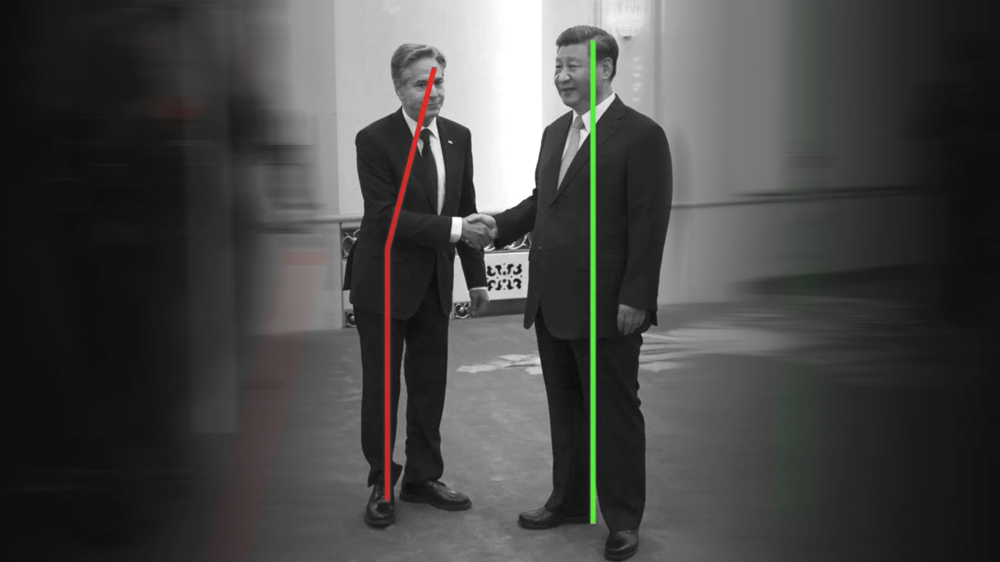

 

This seduction of image, as described by Baudrillard,[^10chapter7_9]
instrumentalizes affective labels like &lt;prestige&gt;
&lt;authority&gt; in warfare of pre-cognitive capture. All those
post-internet artists who slap candles in front of a screen wrapped in
lasercut cybersigilist motifs actually have a point. The algorithm is
not just infrastructure, it’s a semiotic spirit, seducing users into
pre-coded reactions. The scroll is no longer informational but
ritualistic, ceremonial. While Western tech might have you visualize
Christian signifiers, they soon might be replaced with Buddhist or
Taoist ones. [feel free to use this idea in your next installation for
that unpaid show you have in East London.] Akin to online alt-right’s
tactics, the symbolic authority collapses into a circulating set of
signs.

The algorithm doesn’t lie, it arranges political configurations. In
Pasquinelli’s terms, it becomes a *real abstraction*,[^10chapter7_10] embedding
geopolitical narratives not through discourse, but through optimized
aesthetic logics. In this way, China is not understood, but
algorithmically performed, again and again, until the performance
becomes perception. Connecting visual stimuli to cognitive control is
not something you decide on. You scroll until it sediments into belief.
Deceived by the illusion of participation, the algorithm choreographs
our feelings, managing attention through symbolic saturation.

With the internet's shift from a library to a conveyor belt of content,
we carelessly let the algorithm reprogram our brains when we’re most
vulnerable. We don’t scroll to *think* about what we see, it’s a passive
process we engage in to *avoid thinking*. This subconscious
reprogramming of our brains through visual stimuli makes us prone to
build emotionally-charged associations based on the way a given post is
edited. Rather than persuasive, new media is habitual. Although Fox News
still glazes Trump through their North-Korean-state-TV tenue,
traditional propaganda is no longer as effective. This disjuncture of
new media into an embodied process is excellently described by Wendy Hui
Kyong Chun in *Updating to Remain the Same.*[^10chapter7_11] New media doesn’t
simply inform, it habituates. It doesn’t cultivate knowledge so much as
condition a reflex: aesthetic awe as political truth, aesthetics as
foreign policy. The emotional resonance happens *before* critical
reflection.

After you get served thirty over-edited Peaky Blinders reels with phonk
music some teen made with CapCut, the style nests itself in the depths
of your brain, labeled &lt;dominance&gt; &lt;power&gt;. Next time you
see a post with matching stylistic characteristics, those subliminal
labels shape how you perceive its contents. Memetic templates reproduce
ideology. When I first saw one of those sigma-like China edits, the
wirings of my frontal lobe triggered a short circuit. The pre-programmed
visual associations in my brain placed a stamp of approval on my
hyperobsession. As shivers extend down my spine, I think to
myself—*based*—as I proceed to put on *Ke Mu San* (hardstyle remix) on
SoundCloud. I realize I no longer care about the factual, I am here for
the vibe.

##IShowSpeed — Hyperrealist China & Statecraft Through Livestream

*Awaiting the mythical fall of the west, you’re stuck in the limbo of
enshittified remnants of European welfare-states. Your outlook for the
future was ravaged by some loser who posts 150 times a day.*[^10chapter7_12] *The
hyperrealist demon of x.com has taken over. The tsunami of blue
checkmarks flooded your content village and wiped out your niche twitter
poetry community. Someone responded to you liking a video of a baby
monkey getting mopped on the ground by an adult monkey. You open YouTube
in a new tab, IShowSpeed is live right now.*

IShowSpeed, a 20 year-old American streamer has announced his Asia
Tour. Asia in question: China and Mongolia. Not the Western associative
reflex of Korea or Japan. China. “\[IShowSpeed\] embarked on a marathon
livestreaming tour across China, broadcasting for six uninterrupted
hours on the first day alone, he vaporized the meticulously constructed
‘China threat theory’ peddled by some in the West. His lens revealed a
nation so starkly divergent from typical Western caricatures that it
made many viewers confront the uncomfortable truth that their perception
of China had been systematically distorted.” — *China Daily.*[^10chapter7_13]

Partially engulfed in sweaty dreams by virtue of misclicking snooze two
hours ago, I reach for my phone. The moment I expose my optic nerve to
the environment, my finger wanders over to the Instagram icon. I get hit
with the screen time limit popup courtesy of scrolling for too long
after midnight. As I choose “Remind me in 15 minutes,” I am immediately
greeted by Speed lip-syncing Super Idol (热爱105°C的你) with a backdrop
of Chongqing’s stunning skyline. In what feels like a fever dream, Tian
Yiming, the creator behind the famous song cover, enters the frame two
seconds later. The epic crossover of internet celebrities from opposite
sides of the globe goes viral in China and mildly confuses his Western
viewers.

I get absorbed by the aftermath of clips from Speed’s stream. A never
ending forest of massive, hypermodern skyscrapers, dotted with spotless
architectural landmarks. Superhighways converge with elevated rail
overpasses designed for an operating speed of 350 km/h. BYD’s Yangwang
U9, a $250k electric supercar packed with lavish features like
individual wheel drive or a capability to perform brief vertical jumps.
The night sky is broken up with DJI drones sparkling with colorful LEDs.
Speed yells in excitement, “Zoom out, show the whole city! Chat, this is
cyber city, this is China!” as his producers switch the stream to one of
the orbiting drone cameras.

In platform-driven exquisite poverty mindset, these lavish, luxury
commodities and cyberpunk aesthetics are extremely appealing to Speed’s
younger audience. Resembling an open world of the popular game
*Cyberpunk 2077*, Chinese cities are superlative impressions of their
‘futuristic city’ mental image. Deeply rooted within Western culture,
Techno-Orientalist connotations certainly enhance this perversion.

Speed is not a propagandist, his team just purely optimizes for
engagement affect and virality. A curated vibe-package of innovation and
information technology through cultural iteration. How Speed presents
Chinese cultures is a *simulacrum*.[^10chapter7_14] How exactly is trying out a
human-carrier drone in Shenzhen *Chinese culture*, or rather “*real
China*”? This image of China as represented by technological fetish
objects, bears questionable resemblance to culture in a typical sense —
arts, social behavior or collective achievement. Speed’s itinerary
mimics one of a diplomat, invited to marvel over carefully selected,
cutting-edge markers of innovation. First-tier cities epitomize
hypermodernity, the BYD flagship EV sportscar is a fetish object of
luxury, the bullet trains are fetish objects of precision.

The hyperrealist lens of Speed’s content appeals to the viewer’s sensory
system, following algorithmically-defined desires. By virtue of their
affect-optimized format and the overarching backdrop of U.S. political
scenery, his streams effectively arise as digital diplomacy. The format
of IRL streaming captures audiences with authenticity other forms of
content lack. His tour is centered around activities which align with
the semiotic language of earlier discussed signifiers, shaping a sort of
semiocapitalist foreign policy.[^10chapter7_15] The Chinese century is a century of
semiocapitalism, the country’s image is being commodified in real time.
China’s network image reduces “5000 years of culture” into a set of
over-iterated representations. China is LED skyscrapers, China is fast
electric cars and human-sized drones, China is dancing robots. Where did
the real China go? These semiotic labels distill the most recent and
engagement-optimized elements of modern China, abandoning pre-internet
culture in the quest for maximum affect.

*on the right: meme portraying IShowSpeed as a khan of the Mongol
Empire*

 

An official account of the Chinese embassy in the U.S. tweeted “The
20-year-old popular American YouTuber IShowSpeed has kicked off a
journey in China that has already garnered massive global attention,
which indicates a broader trend of digital influencers bridging cultural
gaps and creating alternative channels for foreign audiences to
understand a vibrant China.”[^10chapter7_16]

Through soft weaponization of parasociality, Speed's presence works as
an ideological counterbalance to anti-China narratives. Abandoning
rhetoric in favor of affective presence, the content becomes
"depoliticized" and seamlessly absorbed into platform capitalism.
Unintentionally, Speed might just have pioneered statecraft through
livestream. A total of eight streams, although not funded by any state
actors, might go down in history as one of the greatest, most unexpected
new media psyops. A random streamer born in 2005 went on luxury vacation
and crumbled a multi-million dollar American propaganda operation in the
process. The State Department’s fear mongering simply did not pass the
vibe check.

The parasociality of Speed’s streams becomes a state-compatible
aesthetic. He doesn’t need to lie, because his curated,
experience-driven perspective is already doing the work. Content
creators used to visit China to perpetuate fear-mongering rhetoric or be
racist for views, capitalizing on American propaganda campaigns. Speed
was by no means the first one to break this pattern, but most certainly
the most influential. Not only is his audience mostly composed of young
impressionable teens, but he’s one of the biggest streamers in the
world. His support and position on Palestine without a doubt played a
role in countering Zionist narratives from alt-right groypers like
Asmongold. Expectedly, his visit to China has the potential to cement
the already rapid sinicization of Gen Alpha and beyond.

##China Runs Without an RTX4090

Cyberpunk aesthetics avoid the utopian tendencies of earlier fiction. A
sense of nihilism and hopelessness encompass neon city landscapes, urban
jungles full of depressed laborers. Corrupt governments and abusive
megacorporations loom over the masses trying to navigate their strict,
highly-automated systems of control. In contrast, Silicon Valley
entrepreneurs massage their raytraced images of solarpunk utopias packed
with symbiotic urban architecture where trees grow on buildings. A
spotless self-driving pod takes you to work while your AI assistant
plans a post-work dinner with your smiling, diverse group of colleagues.
The Chinese Century does a 180 and drops you off at *Night City.*

Millennials submit to those tech bro fantasies, Zoomers already gave up
and Gen Alpha never cared in the first place. Exhausted and
disillusioned by decades of neoliberal ideology promising personal
freedom, choice, and empowerment, Western youth lives through the
system’s failure to deliver meaningful agency. Described by Byung-Chul
Han as *freedom fatigue*, the mythical “freedom” has become an
obligation to self-optimize.[^10chapter7_17] A burden to choose between endless
options, while constrained by the invisible infrastructures of debt,
platforms and biases. Neoliberal “freedom” has made the vision of a more
coherent and stable, but more authoritarian future appealing. In
conjunction with instrumentalized aesthetics of China, youth has earned
a tendency to gravitate toward authoritarianism.

This attractive force of Chinese hyperreality shares countless
similarities with young men’s turn to the alt-right.[^10chapter7_18] Fueled by a
sense of displacement and alienation, young men struggle to find
meaning, community and identity. Similarly, disillusioned youth, living
in the increasingly fascist West often fails to find meaning and
prospects for the future. Both groups are craving a sense of being a
part of some bigger, more powerful entity. Reactionary circles satisfy
this need by means of redpilled guilds and grievance-driven culture
wars. The *Sinopill* constructs a pseudo-parasocial connection to a
hypermodern society, a technological civilization state. In *Kill All
Normies*,[^10chapter7_19] Angela Nagle describes how the alt-right emerged not from
traditional conservative spaces, but from weird, chaotic corners of the
internet. Fueled by LARP and edgy memes, the Sinopill surfaced from
scattered online content — and just like the alt-right — got accelerated
by a chain of global events. Related not only anthropologically and
aesthetically, but also aspirationally, both phenomena position
themselves against an antagonistic hegemony. One side claiming to resist
“woke capital,” feminism and globalism, and the other, American
hegemonic power.

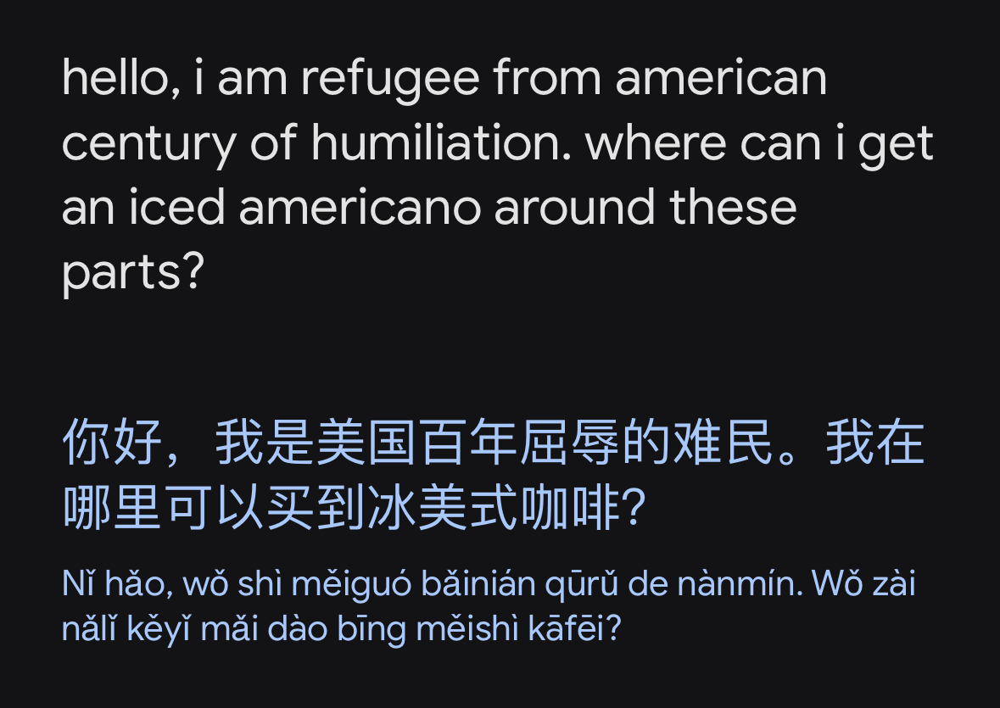

 

##Borrowed Futures — Red Hauntology

Having defined a relevant political framework, linking algorithmic
reprogramming of aesthetics into worldview, digital sinicization has
gained a psychoanalytical backbone. Aesthetic parallels with the
manosphere hint towards a subconscious shift resulting from aesopian
cultural iteration. Optimized visual logics, habitual consumption,
algorithmic affect regimes. The case study of Speed’s tour emphasises
the semiotic nature of XXI-century Chinese capitalism. Broadcasting the
aura of China as a hypermodern civilization state excites the
culturally-programmed desires for technological acceleration. Cyberpunk
nightscapes and high-tech optimizations of daily life appeal to the
warped mental image of futurism, unfazed by traits of authoritarian
surveillance-states.

Perpetuated promises of Western capitalist freedoms eroded dreams of
prosperous futures. Red Capitalism breaks away from the religious trust
in the invisible hand of the free market. Instead of blindly relying on
made-up mechanics of supply and demand, China involves the
very-much-visible hand of the party. It’s still capitalism, the CCP just
sets the research agenda. The end goal of capitalism is always profit,
but Red Capitalism breaks that officially sanctioned fact. Building on
the remnants of Maoism, contemporary China is defined by principles from
times of economic reform in ‘79. Xi Jinping Thought driving modern
policy is purely a reiteration of earlier socialism with Chinese
characteristics. These last remnants of socialism redefine the ultimate
goal of ‘their’ capitalism as common prosperity, building a "prosperous,
democratic, civilized, harmonious, and beautiful socialist modern
country."

Western capitalism suffers from a lack of collective objectives,
replacing them with tech bro utopias or reactionary fantasies. The lack
of shared futures suffers from endless recycled creations, proven to
generate profit. What Jameson applies to culture in *Postmodernism*, or,
*The Cultural Logic of Late Capitalism,*[^10chapter7_20] can be applied to
collective objectives in general. Contrast that with Chinese-style
planned economy focused on 'pushing humanity forward,' and the dichotomy
becomes clear.

Lacking futures of their own, Western youth clings to China not just as
a country, but a *borrowed future.*[^10chapter7_21] On the sinking ship of
neoliberalism, young Westerners yearn for something that looks like
progress, order — and most importantly — *future*. China, through its
portrayal on social media, offers a simulation of that futurity.
‘Simulation’ is a key word here. I seriously doubt most Sinopilled
zoomers would actually consider living there. China’s image as a
country, gets overridden by *Net-Real China*, its idealized network
image. Their image of China is purely an idealized fantasy, a fantasy
which they’re scared of shattering with reality. In *Ghosts of My
Life*,[^10chapter7_22] Fisher describes exactly that through hauntology — we’re
consuming a fantasy of futurity, not reality. Western futures we’ve been
longing for are suspended in time, slowly cancelled by realities of
neoliberalism. Haunted by lost futures, we become mesmerised by foreign
futures.

In a crisis of viable futures, the psyche will cling to anything that
looks like one. When the West represents the collapse of futures,
Net-Real China appears as the Other. In Lacanian terms, China becomes
the ‘subject-supposed-to-know,' the fantasy of a coherent Big Other who
has not yet lost the plot.[^10chapter7_23] Net-Real China doesn’t resolve the
subject’s lack,[^10chapter7_24] but it simulates its resolution through image
delivery. Each piece of China-posting content offers a temporary
fantasy. This aesthetic imaginary functions as the object-cause of
desire in a new, post-liberal libidinal economy.

The hyperreal spirit of Sinofuturism[^10chapter7_25] excites our idea of human
progress in a play of transnational digital edging. Some elements are
more real than others. Silicon Valley’s empty promises of
pseudo-emancipatory technologies get picked up by the yes-men of
Shenzhen. I like to bring up an example of Shanghai metro cars, a humble
epitome of China’s dedication to technological empowerment:

When taking some metro lines in Shanghai, you can choose between a
warmer or colder compartment from the platform, even before entering the
train. This hyperoptimization of comfort is completely unnecessary.
Nobody asked for it, nobody would notice if it wasn’t there, nobody
would seriously miss it if it went away. Shanghai’s metro is already one
of the best in the world. Shiny, surgically-clean stations the size of
airports, providing eye-candy at every step in form of flowing
architectural forms and interactive illuminations. The visionaries
behind the city’s transit infrastructure have truly made it to the top.
The stations are clean, efficient and equipped with (controversial)
facial recognition gates for even more automated convenience. In line
with Beijing's rush of technological innovation, somebody sat down and
thought: is there anything which could possibly improve this
state-of-the-art experience? After pitching their idea, a board of
engineers and policy makers worked hard to fund and implement this
convenience-feature. Anywhere else in the world, this idea would have
died in the boardroom at the first “but how will this make us turn a
higher profit?”

China is not afraid of change. Sculpted by the slogans of the economic
reform period, people have been conditioned to accept change. Coming
with an unfortunate side effect of bulldozing ancient landmarks standing
in the way of economic plans, China changes, and changes rapidly. The
neoliberal rollercoaster on the other hand is not rational change, it’s
chaos. What Western youth is yearning for is economic competence and
hyper-coordination, seeking emotional relief and stability.

We no longer believe to be living in “the most prosperous part of the
world.” Wronged by state narratives, we feel resentment and grief.
Unable to escape the paralysis of capitalist realism, we fight back in
symbolic ways. Briefly mentioned while describing the Xiaohongshu saga
in my previous article,[^10chapter7_26] young Americans have weaponized their usage
of social media. The cyberspace uprising after the proposed TikTok ban
was not only a protest directed at the performative ruling, but a way of
showing frustration with state propaganda. Pretending to mail their data
to the CCP, hopecore edits, ‘sharing \[data\] is caring,’ or advocating
to download as many Chinese apps as possible.

America’s theatrical attempts at defending its network sovereignty
fostered a memetic insurgency. Youth on TikTok and Xiaohongshu broke up
the cultural hegemony of American tech and the Department of Homeland
Security lost the fight for their cognitive territory. The balkanization
of the internet[^10chapter7_27] created sovereign content spheres. Instead of being
tied to a nation state’s demographic, their size and influence are
network representations of a state’s cultural influence. The American
sphere encompasses the entire Western world, while the Chinese one
barely broke through territorial boundaries. What happened is a platform
betrayal against the Western internet sphere, signaling towards a newly
gained consciousness.

Everyone should use a VPN, and everyone in the West also needs a
*cultural VPN*. A semiotic proxy to escape your immediate ideological
(media) environment and re-route your worldview through a foreign
server. A cultural VPN masks your geopolitical IP, bypassing contextual
firewalls and liberating cognitive traffic. Chinese netizens constantly
climb the steep side of the Great Firewall, we never even entertain
taking the stairs on the other side. TikTok’s migration over to
Xiaohongshu breaks this pattern in a unique example of weaponized
content in a fight for a future beyond the LAN. Aligning with a foreign
adversary to puncture the domestic content bubble in protest of
homogenous local traffic.

 

##Hope with Chinese Characteristics

As the West descends deeper into corpofascism, China lives the life
promised to you by the neoliberal dream. China is living through the
transition from industrial to post-industrial, frequently romanticized
in e.g. Japan's history. Flourishing economy uplifting the working
class, scientific and technological innovation, and most importantly,
endless access to *cheap treats*. Omnipresent low-cost goods, palettes
of brands and superficial commodities acted as a distraction from
deteriorating material conditions. As affordable consumerism withers
away, neoliberal reality sets in. We shipped our future to the treat
supplier. China is effectively sitting in the server room of global
capitalism with kernel access. The dream of the East becomes a mirror of
everything the West promised but couldn’t fully deliver.

Absorbed in the chaos of neoliberal collapse, we ache for any semblance
of a prosperous future. Venture capital kidnapped utopia. Lost futures
scarred us with generational wounds, incapable of being healed with
conventional medicine. Net-Real China acts as an alternative treatment
for the neoliberal tumor. Falling under traditional Chinese medicine,
*moxibustion* entails the burning of mugwort leaves on a patient’s skin,
redirecting the body’s attention through signaling. Analogously,
hyperreal visions of China redirect one’s longing for domestic futures
via aesthetic signaling.

Stranded by the deserted ideological landscape of algorithmic
governance, we desperately cling onto outdated visions or set for
compromises. Exhausted by positive psychologies of capitalist
“freedoms,” we accept the unconcealed governance of one party rule. “If
you ask ordinary people *do you want to be free*?, their answer usually
would have been yes. But if you look at it closely, you will see that
the majority of people, me included, wouldn’t really like to make
radical choices all the time. What they want is to maintain the
appearance of freedom, but discreetly they want to be told what choice
to make.”[^10chapter7_28] What Žižek spits out here aligns with Han’s view on
Western freedom.[^10chapter7_29] Instead of posing as a compromise, the lack of
democratic process has the potential to subconsciously further
accelerate this transnational nostalgia for Net-Real China.

Transgressive affection of Western youth towards China functions as dark
catharsis. Akin to the ecstatic romanticization of Luigi Mangione
following his alleged assault on United Healthcare CEO’s life, a
celebration of a foreign adversary reveals itself as a perverse
libration in the eye of the neoliberal status quo. China is the West’s
Luigi, admittedly, just as prone to idealization. While Americans
celebrate a small win against oligarchy, China kidnaps its overly greedy
business owners.[^10chapter7_30] Inversely, in America, the state trembles in fear
of the capital.

Where everything else degrades, China progresses. In the liminal shell
of Western exceptionalism, the *Chinese Dream* shimmers through the dark
with individually-addressable LEDs. Exercising its healing properties
over fiberoptic veins, Net-Real China is an opium for the neoliberal
crisis of futures. Now I’ll be booking my flights to Shanghai to address
the extraterritorial placebo.

---

##Postscript: A Note on Freedom

Chinese society’s submission to the state is not unique, but rather a
larger trend in much of Asia. With a soft exception of
American-influenced Korea, Confucian principles in the Sinosphere foster
a trust relationship between the populace and government. Paraphrasing
Žižek, Western democracies give an illusion of freedom, with little to
no policy being influenced by public opinion. Lost in the rhetorical
sandbox of free speech (increasingly challenged by technocapital), the
West is convinced of its governance model’s superiority. China, as an
undoubtedly authoritarian state, when analyzed through the lens of
everyday needs, community emancipation or interest of the people, wins
over Western democracies. When freedom of speech is undermined by quiet
deals with platform giants, the open censorship of Beijing becomes a
controversial alternative in the sad spectacle of Western kleptocracy.
In America, the party changes, the policy stays static — in China, the
party stays in power, the policy undergoes radical transformations.
While an overarching set of vague values looms in the background, the
intricate data-driven decision process evolves rapidly in close pursuit
of material needs.

***Aleksy Domke** is an interdisciplinary artist and researcher whose
work engages with the internet, technology, philosophy and Chinese
cultural influence. Their writing revolves around the internet – its
phenomenology, cultural and political significance, and virtual milieux.
Alongside critical internet research, their practice reflects on and
amplifies the spectacles of hyperaccelerated internet-era life. Often
working with computer-aided and digital techniques, Aleksy makes
installations, objects, moving image, and other media.*

[^10chapter7_1]: Weibo and Xiaohongshu are Chinese platforms, similar to YouTube
    and Instagram/Pinterest.

[^10chapter7_2]: “China Virus” or “Kung Flu” are racially charged terms coined by
    Trump during his first presidency, referring to COVID-19. The
    phrases significantly contributed to Sinophobic sentiment in the
    West, particularly spreading through hashtags on the platform. See:
    Paul Cooper and Sofia Lampropoulou, “China Virus, Kung Flu, and
    MAGA: Countervalues and Sociological Fractionation on Twitter as
    Evidenced by Pro- and Anti-Trump Discourses in Relation to
    Covid-19,” *Discourse, Context & Media* 57 (February 1, 2024):
    100758–58, https://doi.org/10.1016/j.dcm.2024.100758.

[^10chapter7_3]: Ying Fu, “The Construction of China’s National Image under the
    COVID-19 Epidemic by the American News Media,” *International
    Journal of Education and Humanities* 15, no. 2 (July 27, 2024):
    6–9, https://doi.org/10.54097/6fggxv24.

[^10chapter7_4]: The White House, “Yes, Biden Spent Millions on Transgender Animal
    Experiments,” *The White House*, March 5,
    2025, https://www.whitehouse.gov/articles/2025/03/yes-biden-spent-millions-on-transgender-animal-experiments/.

[^10chapter7_5]: William Hartung, “Can Bernie Stop Billions in New US Weapons Going
    to Israel?,” *Responsible Statecraft,* April
    2025, https://responsiblestatecraft.org/signal-yemen/.

[^10chapter7_6]: MØRNING, “China, the Internet’s Favourite Trendsetter?,”
    *Substack.com* (Burn After Reading, February 8,
    2024), https://morningfyi.substack.com/p/china-the-internets-favourite-trendsetter.

[^10chapter7_7]: Mark Fisher, *Capitalist Realism: Is There No
    Alternative?* (Winchester: Zero Books, 2009).

[^10chapter7_8]: Jodi Dean, *Democracy and Other Neoliberal Fantasies:
    Communicative Capitalism & Left Politics* (Durham: Duke University
    Press, 2009).

[^10chapter7_9]: Jean Baudrillard, *The Evil Demon of Images* (Sydney: Power
    Institute of Fine Arts, University of Sydney, 1987).

[^10chapter7_10]: Matteo Pasquinelli, *The Eye of the Master: A Social History of
    Artificial Intelligence* (Verso Books, 2023).

[^10chapter7_11]: Wendy Hui, *Updating to Remain the Same: Habitual New
    Media* (Cambridge: MIT Press, 2016).

[^10chapter7_12]: Elon Musk.

[^10chapter7_13]: Zhang Zhouxiang, “IShowSpeed Livestreams Show World an Unfiltered
    China,” *Chinadaily.com.cn*,
    2025, http://www.chinadaily.com.cn/a/202503/31/WS67e9e447a3101d4e4dc2bb85.html.

[^10chapter7_14]: Jean Baudrillard, *Simulacra and Simulation* (Ann Arbor: The
    University of Michigan Press, 1994).

[^10chapter7_15]: Franco "Bifo Berardi, *Precarious Rhapsody: Semiocapitalism and
    the Pathologies of Post-Alpha Generation* (London: Minor
    Compositions, 2009).

[^10chapter7_16]: Chinese Embassy in US on x.com, March 26, 2025.

[^10chapter7_17]: Byung-Chul Han, *Psychopolitics: Neoliberalism and New
    Technologies of Power* (London/Brooklyn: Verso, 2017).

[^10chapter7_18]: Luke Munn, “Alt-Right Pipeline: Individual Journeys to Extremism
    Online,” *First Monday* 24, no. 6 (June 1,
    2019), https://doi.org/10.5210/fm.v24i6.10108.

[^10chapter7_19]: Angela Nagle, *Kill All Normies: The Online Culture Wars from
    Tumblr and 4chan to the Alt-Right and Trump* (Winchester: Zero
    Books, 2017).

[^10chapter7_20]: Fredric Jameson, *Postmodernism, Or, the Cultural Logic of Late
    Capitalism* (Durham: Duke University Press, 1991).

[^10chapter7_21]: Mark Fisher, *Ghosts of My Life: Writings on Depression,
    Hauntology and Lost Futures* (Zero Books, 2014).

[^10chapter7_22]: Fisher, *Ghosts of My Life.*

[^10chapter7_23]: Jacques Lacan, *The Seminar of Jacques Lacan. Book 11, Four
    Fundamental Concepts of Psychoanalysis* (New York: Norton, 1998).

[^10chapter7_24]: Jacques Lacan, *Transference* (Cambridge/Malden: Polity Press,
    2017).

[^10chapter7_25]: Lawrence Lek. *Sinofuturism*, https://sinofuturism.com/.

[^10chapter7_26]: Aleksy Domke, “Weaponized Data Sharing and Gen Xi – Notes on
    China II,” *Networkcultures.org*, March 16,
    2025, https://networkcultures.org/blog/2025/03/16/weaponized-data-sharing-and-gen-xi-notes-on-china-ii/.

[^10chapter7_27]: Internet balkanization, cyber-balkanization or splinternet is the
    breaking of one global internet into several smaller and fragmented
    pieces due to content filtering and censorship. Internet
    balkanization creates separate content spheres, e.g. Chinese
    internet or Russian internet.

[^10chapter7_28]: Slavoj Žižek, *How to become free, n.d.*

[^10chapter7_29]: Han, *Psychopolitics*.

[^10chapter7_30]: Jack Ma, a former chairman of Alibaba, was briefly disappeared
    after criticizing China’s regulators during a speech at the annual
    People's Bank of China financial markets forum.

# Reflections on Trigger Warnings: A Practice of Care, Refusal of Witnessing
##Chloë Arkenbout
###Originally published on July 11th, 2024

*Trigger warning: various topics that trigger warnings are often used for are briefly discussed in this article, such as (in order of appearance) car crashes, trauma, PTSD, misogyny, war, the genocide of Palestinian people and burnout.*

> “Survival is the ability to swim in strange water.” – Ocean Vuong

Public discussions addressing injustice, filled with footage of horrendous violence and emotionally charged and often personal content of various types of harm and abuse, are common on many social media platforms. Sharing is an important way to foster awareness, solidarity, and understanding. Yet for some people who have experienced similar things being pointed out, seeing this content can evoke strong responses. If you know what that feels like, you probably also have had moments of wishing you were given a heads-up, so you could have decided for yourself whether and when to engage with what appeared on your feed, depending on your emotional capacity. I know I have.

Wikipedia defines a trigger warning as “a warning that a work contains writing, images, or concepts that may be distressing to some people.” On social media platforms, some users mention a trigger with their content so users can stop engaging with it if they wish.

Discussions on whether to include them in course material in educational contexts have been going on for years and the trigger warning has a history that originated long before the web. The thing you’d probably think of first is the parental advisory system for TV shows and films, which are used to warn parents of content that they might deem inappropriate for their children. A more recent example along these lines is DoesTheDogDie, a community-based website with a repository of films and their potential triggers. Founder John Wipple writes that in 2023 “the site currently tracks over 180 categories of “triggers” \[and\] the number of requests for new trigger categories has swelled to 2,413.”[^11chapter8_1] According to him, “the data makes it obvious that there is an unmet need for very specific content warnings for all forms of entertainment. \[…\] The reality is that terrible things happen to us all and we do our best to live one day at a time. Users of DoesTheDogDie are just trying to stay sane. In fact, \[Wipple has\] been contacted by several mental health professionals saying that they routinely recommend DoesTheDogDie as a resource to their clients.” 

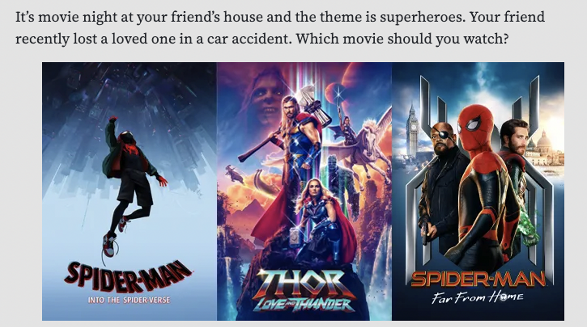

  

In the introduction to *Trigger Warnings: History, Theory, Context*,
which was published in 2017, Emily J. M. Knox mentions a paper by Chris
Peterson that explains three different dimensions that often occur when
people discuss trigger warnings.[^11chapter8_2] They are either seen as a way to
protect people who have PTSD, a tool to inform yourself about a specific
work and an acknowledgment of existing differences in experiences of
social power, or as the opposite of exposure therapy, a form of
censorship, and the hindrance of something uncomfortable that is needed
to be an educated person. These are similar to the arguments Wendy Wyatt
presents in *The Ethics of the Trigger Warning* in 2016.[^11chapter8_3] I am not
particularly interested in the ‘is the fear of being offensive killing
free
speech’
debates that seem to drag on even now, almost 10 years later, or looking
at this from such a binary perspective.[^11chapter8_4] What I would like to do, is
share some thoughts on trigger warnings by reflecting on what it means
to care about others and to take care of yourself in a time where crisis
follows crisis, follows crisis, follows crisis, while we all seem to be
stuck on the (social media) platform(s).

##  (Trigger) (Warnings) 

As always, it is important to look at the words we use to describe a
phenomenon to see what political dimensions are ingrained in them.

> **Trigger (noun):** 1) to cause a strong emotional reaction of fear,
> shock, anger, or worry in someone, especially because they are made to
> remember something bad that has happened in the past 2) to cause
> something to start 3) a part of a gun that causes the gun to fire when
> pressed 

So a trigger could be a catalyst of an emotional reaction related to
something that happened in the past, with a connotation of violence (the
gun). Or that something violent that has happened in the past is
activated by something in the present, causing distress.

> **Warning (noun):** something that makes you understand there is a
> possible danger or problem, especially one in the future

To warn someone of something indicates that something negative can still
be averted. Assuming that the warner warns because they do not want
something bad to happen to the person they are warning, this indicates
that they care about the person being warned.

Before we dive into the politics of the trigger warning, we need to
understand the politics of trauma first. The dictionary definition is as
follows:

> **Trauma (noun)**: severe and lasting emotional shock and pain caused
> by an extremely upsetting experience, or a case of such shock happening

I could attempt to write an elaborate essay on the medical
conditions
related to trauma here as well, however, I am not a medical expert and
for sharing my thoughts on trigger warnings, how Staci K. Haines defines
trauma in *The Politics of Trauma* is the most relevant:[^11chapter8_5]

> Trauma is an experience, series of experiences, and/or impacts from
> social conditions, that break or betray our inherent need for safety,
> belonging, and dignity. They are experiences that result in us having
> to vie between our inherent needs, often setting one against the
> other. For example, it might leave us with the impact of “I can be
> safe but not connected (isolated),” or “I have to give up my dignity
> to be safe or connected.” This is untenable, because all of these
> needs are constitutive or inherent in us.

She explains that when we are not successfully protected during
traumatic events, those experiences are stored within ourselves, and
therefore keep shaping our present experience in the world. Sometimes
this results into people developing PTSD symptoms. Again, this is a
wildly specific definition and only one interpretation of what trauma
is. I can highly recommend reading more about the topic from different
angles to gain a deeper understanding (in Haines'
book,
or *My Grandmother’s Hands* by Resmaa Menakem, *What my Bones Know* by
Stephanie Foo, *It Didn’y Start With You* by Mark Wolynn, *Trauma and
Recovery* by Judith L. Herman, *Touch Me I’m Sick* by Margeaux Feldman,
pretty much every book by Gabor Maté, and *The Body Keeps the Score* by
Bessel van der Kolk, for example - even though some of these also
deserve criticism and should be read with some caution). Of course, I
would also recommend seeking out help, if you are able to, if you
suspect you might be suffering from trauma. It is important to note that
trauma is not just something that randomly happens to people on an
individual scale, though. Trauma is not ‘bad luck’. It also stretches
way beyond the image you might have of veterans dealing with nightmares
and outbursts of violence. Trauma is highly political and happens in the
context of oppressive systems, which is why it is so important to talk
about this. Especially in our current times, where genocides can be
live-streamed on our smartphones every second of every day. Haines
explains this process as follows:

> Systemic trauma is the repeated, ongoing violation, exploitation,
> dismissal of, and /or deprivation of groups of people. State
> institutions, economic systems, and social norms that systematically
> deny people access to safety, mobility, resources, food, education,
> dignity, positive reflections of themselves, and belonging have a
> traumatic impact on individuals and groups. \[…\] This lack of safety,
> belonging, and dignity traumatically impacts individuals and whole
> groups of people. \[…\] Like individual trauma, systemic trauma
> overwhelms and breaks down safety, connection, and dignity in the
> minds, bodies, and spirits of individuals and communities.

Looking specifically at what a **trauma trigger** is then, to return to
the original subject, Wikipedia defines it as follows:

“A trauma trigger is a psychological stimulus that prompts involuntary
recall of a previous traumatic experience.”

Trauma triggers could be anything, from a smell, a place, or a word to
something highly specific, as it is context-dependent. Experiencing a
trauma trigger is definitely something other than experiencing some
discomfort or being upset, as the effects can be both emotionally and
physically destabilizing. Those who know know.

With this lens, to warn someone of a possible trauma trigger, seems like
a simple act of care. Some might even argue that it is a moral duty to
do so. And even if people are too indifferent to care, let’s be honest,
at least in theory, it is not that much to ask. However, things become
more complicated when looking into what is happening through informal
language.

This is an edited summary of some of the definitions found on the Urban
Dictionary:

> **Triggered (adjective):** being unreasonably upset, pissed off,
> annoyed or offended in a cringe way – often when social justice warriors
> or special snowflakes can’t take a joke *
> 
> *“Lol this ‘feminazi’ is sooo triggered cus I told her to make me a
> sandwich!! Lol.”*

The discussions around triggers are blurred by default because of the
language that concerns it is too. Being offended is not the same thing
as being triggered, but in today’s language, they seem to have become
interchangeable. What would you call a process where the word to
describe your experience is now used against you, leaving you alienated
and confused, perhaps even doubting your own experience? Conceptual
gaslighting? I would like to make a humble attempt to free the trigger
warning from these linguistic discussions, of what is politically
correct or what should or should not be (freed from being) tone policed,
and go back to the essence of what it means to witness something
(online) in the context of trauma.

## Refusing Witnessing 

Let’s discuss the moral implications when witnessing images of violence,
war and suffering, or ‘*the Pain of Others*’ as Susan Sontag calls it in
her famous essay.[^11chapter8_6] Sontag writes that “no ‘we’ should be taken for
granted when the subject is looking at other people’s pain”. But that
‘we’ becomes even more blurry when we’re talking about the pain of
others that is directly related to those witnessing something that
relates to their own pain. Sontag states that “an ample reservoir of
stoicism is needed \[…\] given the likelihood of seeing photographs that
could make you cry \[every morning\].” She writes about newspapers here,
so one can only conclude this is true for social media in quadruple. And
what if those pictures could do more damage than to make you cry?

The original debate about witnessing the pain of others comes down to
the following. Sontag writes that for a long time, some people believed
that if the horror could be made vivid enough, most people would finally
take in the outrageousness and the insanity of war. I know multiple
activists who make the conscious choice not to use trigger warnings when
they share footage of the genocide in Palestine. Should those who live
in the West, especially those who have never come close to war, have the
privilege to be warned? They believe these horrors beyond comprehension
should be witnessed and we should not look away. Sharing footage of what
is happening means that they care about what happens in the world.
Sharing footage means that they are affected by those who are affected
by this systematic trauma that is unfolding because they care about
other people. And they want other people to care too.

However, some people care so much and engage with this type of content
so often, that instead of informing themselves and bringing them to take
action, they start to suffer from it. When activists burn out, they
cannot contribute to the cause. What if you need EMDR therapy, a type of
therapy used to treat trauma, because you engaged with too much footage
of Gaza, while editing it for it to be able to be spread around and
witnessed? Could the witnessing of other people's trauma cause trauma to
the witness themselves? These are not new questions, of course, as they
were already raised when war footage was being shared in newspapers
decades ago. But in the age of social media, it is worth to keep asking
these questions. Especially in the context of trigger warnings, where
I’m not trying to raise a discussion about what type of content should
or should not be shared, but who should be protected from it, and why
and when. Who deserves protection from witnessing horrors and who does
not? When is it functional to witness the pain of others and when does
it defeat its purpose? When is it your moral duty and when is it wise to
protect yourself from it? When should you refuse to witness and who has
the moral grounds to do so?

Sontag also raised the question of whether or not an image retains the
capacity to produce a strong emotion sidesteps the problem that having a
strong emotion is not the same thing as having an understanding, and
neither is the same as taking action. Maggie Nelson, in *On Cruelty*,
writes about how the compulsion to repeat trauma in art can give someone
a sense of control over it.[^11chapter8_7] Perhaps this is true for sharing
triggering content as well – engaging with it feels better than ignoring
it and could perhaps even be healing. But what does that mean in an age
where there is so little opportunity for slow looking, reflection, and
contemplation, as Nelson states? Have we arrived at a point where we
don’t even blink an eye anymore when we see children getting bombed
during our doom scroll in between skincare routine influencer content
and memes? Have users stopped witnessing and are they just watching now?
Is the gap between desensitized users and users who are at risk of
actual trauma triggers growing, causing alienation to grow too?

If it were a simple question of whether or not it is a good thing to
protect someone from a potential trauma trigger by adding a trigger
warning, there should not even be a discussion about it. What makes this
an urgent matter to reflect on is the fact that this is all happening in
the platformed society we currently live in.

## Triggered by Design: the Case of the Shadowban 

The infrastructure of the platforms on which these trigger warnings
function, specifically the big tech social media platforms, plays a
significant role in the dynamics surrounding these topics. On the one
hand, one could argue that social media platforms are designed to be
triggering; to make users feel ‘triggered’ and then make other users
feel triggered because they are triggered, and so on. They are
definitely not designed to protect those who might experience actual
trauma triggers in this process. The more engagement content gets, the
more time users spend on their platform, the more data they can sell,
after all.

On the other hand, we need to talk about freedom of speech and
censorship – but not in the way you think. I promised you I was not
going to talk about the ‘you can’t say anything anymore’ thing right?
Sontag writes that when talking about the pain of others we witness, it
is just as important to consider what is NOT being shown. Because while
some people require protection from witnessing certain content, others
should be confronted with it. In this context I want to discuss content
moderation protocols in social platforms that flag certain content and
give it a trigger warning. The ‘sensitive content’ label in Instagram
for example, where content is hidden and you have to click on a button
first before the content is revealed.

  

Instagram frequently shadowbans content (making it less visible to other
users in various ways, of which adding a trigger warning is just one) on
their platform, which they justify in their incredibly vague community
guidelines. They say that they have “spent a lot of time thinking about
the different points of view that create a safe and open environment for
everyone. \[…\] Overstepping \[the Community Guidelines\] \[...\] may
result in deleted content \[or\] other restrictions.” What safety means,
who is worthy of safety, and who decides this, is not stated anywhere.
The most important characteristic of shadowbanning is that the user is
unaware of (the extent of and exact reasons for) it. As a user who wants
to share important content that should be witnessed by others, how can
you counter or object to this form of censorship if the platform’s
entire design is built on the premise that you are not supposed to
(really) notice it has happened (or why or how it is happening exactly)?
The elusiveness of the ban is exactly the point. And we’re not even
talking about content being deleted completely, which also happens. The
effects of this are severe and make it the perfect tool to ideologically
censor specific content without people noticing. For example, Human
Rights Watch published a report in 2023 on the systemic global
censorship of Palestinian content, where shadowbanning is one of the 6
patterns of censorship they have identified, and states that Meta’s
behavior fails to meet its human rights due diligence
responsibilities.[^11chapter8_8]

Given the fact that both the guidelines and their consequences are
completely non-transparent, counter-tactics on the platform can be
nothing else than reactive. Use a watermelon emoji and post enough
selfies to trick the algorithm until that doesn't work anymore and
something new has to be tried. Always one step behind.

What should we do with all of this, then? Should we leave big tech
social media platforms and move to/build our own alternatives? A
platform that has a feature where potential triggers must be added
before you are allowed to share content and where you are given the
option to filter out content on your feed could be cool, leaving the
autonomy of what is to be witnessed with its users instead of the
platform. So what haven’t we successfully done this? Because,
unfortunately, it’s not that simple. People don’t want to leave their
connections behind to move to some obscure platform that hardly anyone
uses yet. Alternatives are often not accessible enough for non-geeks.
And isn’t it a privilege to even have the space to think about
alternatives, as some people’s lives still depend on their networks on
big tech platforms? Hannah Proctor once said that it's important not to
fall into an overly deterministic view of technology when discussing
justice and that the real question should be what a more liberated
future would look like.[^11chapter8_9]

## To warn or not to warn, to avoid or not to avoid

However, we are not yet living in the future where big tech has been
boycotted and we’ve built our own platforms that are designed based on
values such as care and protection. So, until we have taken sufficient
action to improve our circumstances, how do we navigate the present? In
her introduction, Knox explains that she experiences some discomfort
around trigger warnings, as they can be used as a tool for
categorization, where objects are labeled either ‘good’ or ‘bad’. I
would like to argue that it’s not as simple as that, or as binary. In
her reflections, Nelson critically called it the
“do-I-or-don’t-I-want-to-watch-this question”. Perhaps we need
‘can/should-I-or-can’t/shouldn’t-I-watch-this-in-this-in-this-moment
questions’. Plural. So I leave you without closing remarks, and instead
propose these open questions for those engaging with trigger warnings
and those who want to take care of others and themselves, in the hopes
they contribute to our ability to navigate swimming in strange waters.

When you encounter a trigger warning:

-   Am I inclined to avoid content related to the warning in question? Why?

-   Is the warning specific enough to inform me properly?

-   If it is not, am I comfortable taking the risk of encountering content that could trigger me?

-   How strong could my reaction be when encountering the content?

-   Do I have the capacity for such a reaction in case it happens? Do I know how to regulate myself? What I need in terms of care or co-reculation if it happens? Do I have people to support me?

-   Does the content relate to my own experiences or does it consider others?

-   Will the content inform me of current events or experiences of others that are important to be aware of?

-   Have I been avoiding this topic or have I already engaged with it frequently?

-   Could I be confusing distress or danger with discomfort? Have I considered my privilege?

-   Could I be confusing discomfort with distress or danger? Have I considered my current mental state in relation to the content and should I consider protecting myself?

-   If I decide not to engage with this content, do I want to do so at a later time?

-   Is this warning human-made or automatically generated by the platform I am on?

-   If it is automatically generated, what values does the platform operate on and what could that mean for this warning and my choice in engaging with its content or not?

When you consider using a trigger warning:

-   Who is this trigger warning for? Who am I trying to protect and why?

-   Is the way I worded my trigger specific enough for people to be properly informed about the possible risk?

-   Should I make a distinction in my warning, addressing the peoplewhom I am trying to protect by informing them of the risks and the people I do want to look at the content?

-   Could the content I want to share be flagged by the platform's content moderation systems?

-   Should I consider using alternative tactics to make sure the content I want to share reaches people?

*A thank you to my colleagues, comrades and friends who helped shape my
thoughts on these topics: Geert Lovink, Pleun Westendorp, Niek Heijne,
Liyah Park, Lucija Pelicaric, Frederieke van Wijk, Jamie Brands, Daryll
Landbrug, Alexandra Greene, Laura Dubourjal, and Jamil Fiorino-Habib,
among others.* 

***Chloë Arkenbout*** *has been part of the core team of the Institute of Network Cultures since 2020. Their personal research revolves around what it means to be (in)visible in the (semi) digital public sphere – discussing the political and emotional dimensions of subjects such as comment discussions, call-out culture, shadow banning, conflict & care in social movements, and political memes. She also co-edited the three Critical Meme Readers that INC published in 2021, 2022 and 2024. Additionally, she works as a teacher at the Communication and Multimedia Design program at the Amsterdam University of Applied Sciences. Before joining the INC, she worked as an independent journalist and communications specialist in the cultural and social sector.*

[^11chapter8_1]: John Whipple. “I Spoil Movies and I’m Proud of It.” DoesTheDogDie,
    [www.doesthedogdie.com/blog/i-spoil-movies-and-im-proud-of-it](http://www.doesthedogdie.com/blog/i-spoil-movies-and-im-proud-of-it).

[^11chapter8_2]: Emily J. M. Knox (ed) *Trigger Warnings: History, Theory, Context.
    Rowman & Littlefield Publishers*, 2017.

[^11chapter8_3]: Wendy Wyatt. “The Ethics of the Trigger Warning.” Journal of
    Academic Ethics 13, no. 1 (March 2015): 63-78.

[^11chapter8_4]: Mick Hume. *Trigger Warning: Is the Fear of Being Offensive
    Killing Free Speech?*. Harper Collins, 2015

[^11chapter8_5]: Staci K. Haines. *The Politics of Trauma: Somatics, Healing, and
    Social Justice*. North Atlantic Books, 2019.

[^11chapter8_6]: Susan Sontag. *Regarding the Pain of Others*. Farrar, Straus and
    Giroux, 2003.

[^11chapter8_7]: Maggie Nelson. *The Art of Cruelty: A Reckoning*. W. W. Norton &
    Company, 2011.

[^11chapter8_8]: Human Rights Watch. 2023. *Meta’s Broken Promises: Systemic
    Censorship of Palestine Content on Instagram and Facebook*. December
    21, 2023.
    [https://www.hrw.org/report/2023/12/21/metas-broken-promises/systemic-censorship-palestine-content-instagram-and](https://www.hrw.org/report/2023/12/21/metas-broken-promises/systemic-censorship-palestine-content-instagram-and?utm_source=chatgpt.com)

[^11chapter8_9]: Chloë Arkenbout. “Paranoia and Guilt: A Conversation with Hannah
    Proctor about the Emotions of Political Defeat and Digital Media.”
    Institute of Network Cultures, March 26, 2025.

> “I strive to look poor. I drive an 89 Volvo wagon. I live in a million
> dollar artist loft my daddy bought me for graduating art school. I
> hate my dad.” - Hipster Barista meme

#Creative Class Consciousness: Today’s Art of the Working Class

##Sepp Eckenhaussen

There is a general confusion about class composition under
post-neoliberal capitalism.[^12chapter9_1] Where is the working class? There is
also a more specific confusion about the class position of art workers.
Are art workers, workers? While these questions might seem academic or
even trivial, they have serious consequences for the organisation of
labour and the representation of workers. Who and what are we? Who are
our comrades, and who are our adversaries? How to break the wheel of
disorganisation? How to collectivise and resist?

##The Author as Producer

In his groundbreaking book *History and Class Consciousness* from 1923,
György Lukács for the first time foregrounded ‘class consciousness’ in
Marxist theories of organisation.[^12chapter9_2] Rather than describing the
position of the working class as an enumeration of data
(Klasse-an-sich), he explored whether there is a unified standpoint or a
shared consciousness among members of the working class
(Klasse-für-sich). Following in Lukács’s footsteps, Walter Benjamin
wrote his famous text on *The Author as Producer* in 1934, formulating a
simple, sharp principle for class-conscious cultural work.[^12chapter9_3] In short,
he insists that it is the responsibility of an art worker to understand
their position as a contemporary producer, and, given the social,
historical, and technological circumstances, to carefully determine
their medium and mode of production accordingly. For instance, Benjamin
argued that novelists should abandon the traditional medium of the novel
in favour of the faster, more accessible medium of the newspaper, which
would better serve the goal of ‘political progress’. One could argue
that we face the same question today, except that the positive,
universal goal of political progress is replaced by the more fragmented
and bitter aim of resistance against political regression. What should
authors produce in the cataclysmic mess of techno-feudalism?

However, translating the author as a producer-principle to the
present-day context is not as simple as a cheeky, postmodern inversion.
One of the core successes of neoliberalism has been to replace
working-class consciousness with internalised micro-entrepreneurialism.
In the book *Speculation as Mode of Production*, Marina Vishmidt has
shown that this is especially true for artists who happily jump on the
bandwagon of speculative capital and become some of capital’s most
tragic agents. There is, in other words, very little ground to adopt
Benjamin’s assumption that art workers have a (latent) class
consciousness. Before asking “What does the author as a producer produce
today?”, we must first consider: How can the author today understand
themselves as a producer once again?

##The Art Worker

In response to this question, people working in the arts – including
myself – have taken to calling ourselves ‘art workers’. Historically,
this notion originated in the Constructivist and Productivist
avant-gardes of the 1920s, the very same years in which Lukács
conceptualised class consciousness. Its emergence was closely linked to
social realist aesthetic positions during the Popular Front era, such as
the Congress of Cultural Workers in Lviv, where artists and writers
declared their solidarity with workers in the 1930s. Only much later, in
1969, it was taken up in the West by the New York-based Art Workers
Coalition.

I believe that the most recent rediscovery of ‘art worker’ is related to
the rise of social practice art. But it does not necessarily indicate a
rediscovered class consciousness. For instance, how do we approach one’s
‘identification’ as an art worker in the face of the fact that only 8%
of artists in the UK today have a working-class background?[^12chapter9_4] In the
essay *In a Class of Our Own? Art Workers and the Working Class*, Mia
van den Bos writes: the “problem with the term ‘art worker’ is that it
gestures towards, whilst simultaneously revealing nothing about, class.
\[…\] ‘Art worker’ elides different class positions behind the
precarious reality of freelance art work, without recognising that a
class-based selection process has already occurred before the first
invoice is sent.”[^12chapter9_5] ‘Art worker’ could then be just another trendy
buzzword used to improve the social status of artists, in this case,
only by performing affinity with the working class. As an aspirational
fetish in the heads of self-identifying art workers, the notion ‘working
class’ becomes partially or entirely divorced from material reality.

On the other hand, the words we use shape our understanding of art and
its role in society. For instance, in the book *Art Work*, Katja Praznik
argues that the use of the term ‘art worker’ inherently implies a
socialist understanding of art as a commonly available public good,
which is, by definition, opposed to the capitalist notion of the ‘work
of art’ as an exclusive commodity.[^12chapter9_6] Van den Bos, too, gives ‘art
worker’ the benefit of the doubt, arguing that it can engender a sense
of broader solidarity among precarious workers, and prompt conversations
about how class “dictates who can and cannot afford to make, write about
or curate art and therefore what kind of class interests and
perspectives are furthered in the art world”.[^12chapter9_7] The question, in
short, is not one of ‘correct identification’, but of revamping the
historically productive analytical notion of class for the more complex
reality of artistic production in post-neoliberal capitalism, which
could, in turn, empower the organisation of art production in opposition
to the class-based selection process before the first invoice.

We don’t have to start these conversations from scratch. Many thinkers
have theorised contemporary class composition and offered possible
pathways to a new class consciousness that encompasses the strange and
contradictory experience of life as an art worker. What follows is a
leisurely stroll along some of these theories. Where we will meet
precarians, projectarians, cybertarians, cognitarians, and other members
of emergent (dangerous?) classes along the way.

##Precariat

Since the 1980s, deregulation of labour markets, privatisation,
increasing numbers of freelancers, and other trends in post-Fordist
neoliberalism have structurally increased levels of precarity among
workers in the West. Guy Standing, one of the most prominent thinkers on
class composition today, has described the collective experience of
decreased material and psychological welfare as that of the
‘precariat’.[^12chapter9_8] Quintessential to this precarian experience, as I see
it, is a twofold extension of work: ‘sideways’, the separation of work
and leisure diffused by intermittent employment and continuously being
‘on call’; and ‘frontal’, work that is extended indefinitely in the
absence of sick leave insurance and pension schemes. Without job
security, the work never ends.

If one were to make a list of precarian occupations, ‘artist’ would
certainly feature on it. The Netherlands, where I live and work, is
known for its attractive funding system and relatively good social
provisions. But the average artist in the Netherlands earned a gross
income of just over 18 thousand euros in 2019 (compared to the average
income of 32 thousand among the working population), with 80% of people
in the visual arts working as freelancers.[^12chapter9_9] In 2017, a
government-commissioned independent review concluded that art workers
have poor bargaining positions, are often not insured against
occupational disability, have low pension accruals, and have a high risk
of unemployment.[^12chapter9_10] So, even in a country with relatively high levels
of cultural funding and general social safety, many art workers can
simply not afford to do their jobs. This is, of course, not a regulatory
accident that governments intend to repair. Theoreticians like Isabell
Lorey, Judith Butler, and Wendy Brown have shown that governance through
precarisation is at the core of the neoliberal project.[^12chapter9_11] With its
consistently rising numbers of self-employed workers, art and culture
have been the perfect testing ground for neoliberal labour market
policies. Artists are, in other words, at the forefront of
flexibilisation and precarisation, alongside delivery riders, taxi
drivers, and other (mostly platform-mediated) gig workers. If art
workers today can make any claim of avant-gardism, it must be their
membership of platform capitalism’s flex-work avant-garde.

A further important characteristic of the precariat, as Standing
observes, is the high amount of invisible and mostly unremunerated
labour performed. In the arts, we continuously rewrite our CVs and
portfolios, update our websites, submit funding applications, practice,
study, develop skills, and learn - all in our own time. Then, of course,
there is the bulk of socially coded ‘lifestyle’ work which ‘doesn’t feel
like work’: going to exhibitions, openings and reading groups, having
dinners with collectors, social media engagement, and generally taking
care of our ‘visibility’ and ‘relevance’. Again, art workers are not
alone in this. Marxist feminists like Bojana Kunst, Leigh Claire La
Berge, Katja Praznik, and Silvia Federici have argued that artists’
experiences of invisible, underpaid labour mirror those of domestic
workers and other precarious workers in society.

While it’s hard to challenge the concept of precarity, or its
proliferation, critics have contested Standing’s idea of the precariat
as the new dangerous class because they find the material divisions
among people affected by precarisation too great. On the one hand, the
precariat includes people working bullshit jobs (which David Graeber
defines as jobs that are essentially irrelevant in the eyes of those who
execute them).[^12chapter9_12] However, on the other hand, the precariat would also
include the group described as the professional-managerial class (or PMC
for short). The PMC is a steadily growing group of highly educated urban
desk workers who perform managerial or consulting tasks. While their
work creates little to no use value, members of the PMC would not
typically describe their own work as a bullshit job, and even if they
don’t have a steady contract, they are usually well-paid. It has
therefore been argued that the precariat is socially too loose to ever
become a dangerous class. The material interests of the members of the
precariat, these critics say, simply don’t align. This will be a
recurring theme in all of the class composition theories we will
encounter: the conceptualisation of new coalitions, alliances, and
social groups inevitably has to account for material disparities,
alongside a more cultural diversity, among the members of whatever new
revolutionary subject is proposed.

## Cognitariat

A second theoretical tradition that deserves our attention is operaismo.
Operaismo, or workerism, emerged in Italy in the 1960s and ‘70s as a
coalition of factory workers and, to lesser extent, house workers,
university students, artists, and intellectuals.[^12chapter9_13] They rebelled
against the exploitation of workers in the new factories of Fiat and
other megacorporations, but also against the existing workers’ unions
and political parties. They did not demand better payments or decent
housing, instead, they wanted *everything*: autonomy, communist
liberation, and the total abolition of labour.[^12chapter9_14] This foregrounding
of an end to ‘wage slavery’ swayed many disillusioned workers to join
the movement, but it also posed a difficulty in the application of
classical Marxist doctrines. Because what is class struggle beyond work?
Operaismo, it turned out, required an entirely new conception of class.
Mario Tronti, one of operaismo’s leading thinkers, formulated this
challenge as follows: “The cultural hieroglyphs need deciphering: the
scientific jargon must be translated into our own illustrious class
vernacular.”[^12chapter9_15] This kind of translation is exactly what many thinkers
in and after the operaist generation have attempted, resulting in many
unique, provocative, and often hopeful theories of emergent class
composition.

The theory I want to highlight here is that of the ‘cognitariat’. The
word cognitariat was coined in the late 2000s by Franco ‘Bifo’ Berardi
in *The* *Soul at Work*.[^12chapter9_16] In this book, Bifo stipulated that
creatives and other workers in the ‘knowledge economy’ are the new
production line workers, occupying their dedicated spot at a global,
fully digital conveyor belt of ‘semiocapitalism’. This equation of
knowledge workers with production line workers is, deliberately, not
immediately obvious. The high productivity of cognitarians stems from
their freedom to feel unique, creative, and therefore motivated. They
can pick their own laptops, freely compete for gigs, and work in their
favorite coffee bar at hours of their own choosing. But, Bifo argues,
the actual work these people do (customer journey design, project
management, community building) is just as standardised as the factory
work of their grandparents. In other words, the cognitarian is coerced
into cultivating and performing exactly the right amount of instrumental
creativity and uniqueness (no less, because that would reduce
productivity, and no more, because that would make the worker
ungovernable). This tendency of capital to appropriate the very part of
us that we feel is most uniquely *ours* introduces an entirely new form
of alienation. Cogniatrians are not alienated from their bodies, as the
factory conveyor belt worker described by Marx and Engels was, or from
their consciousness, as theorised by Lukács, but an alienating split
occurs in their very souls. Our creativity remains part of us, but it is
estranged from us, because it is controlled by capital. Of course, new
forms of alienation require new forms of resistance. It therefore
follows that the struggle against capital’s alienation today should
prioritise taking back the productive forces of creativity, and the
cultivation of an unalienated, radical imagination.

This matter is, by the way, not merely academic or hypothetical. Nor is
it outdated. On the contrary, its urgency is a key concern in some of
the most important political projects of the contemporary global Left.
In 2025, Fernando Haddad, the finance minister in Lula’s socialist
government of Brazil, phrased the central political challenge of his
Workers’ Party as follows:

> There is also another emerging force, namely the creative forces of
> capitalism. There is a vast literature of the contingent of people who
> sell their labour power, but their power is much more a creative force
> than a productive force. The Italians often call it the ‘cognitariat’.
> \[...\] It is necessary to recognise that its emancipatory struggle
> today depends on the understanding that the non-propertied classes are
> not homogeneous. They have different perspectives. Even from the
> aesthetic point of view, from the cultural point of view. That is the
> role of politics: to forge a common goal between them, something that
> won’t emerge mechanically from the economy and that will only emerge
> from the political activity of a party.[^12chapter9_17]

Like Standing’s theory of the precariat, Bifo foregrounds the role of
precarity and precarisation as the dominant form of government of
contemporary capitalism. Regulatory power over cognitarians is no longer
enforced by clocking in and out of work, fixed low pay, recurring
evaluations, bureaucratic workload, or mandatory team building outings.
Instead, the cognitarian is subjected to a free market competition of
all against all, the benchmarks of vibes and lifestyle, and the
certainty that there is no safety net. In Bifo’s view, this shift in
mode of governance, alienation, and exploitation marks a decisive
turning point in history. Precarity, he says outright, is an era. This
position gives a whole new dimension to the idea of artists as the
flex-work avant-garde. If this is true, it must be possible to catch
glimpses of another world through the cracks in political reality. Even
if art is not here to save the world, the field remains early adoptor of
the flex work in which independently working people have experienced
high levels of precarity for decades. This experience might have taught
art workers some lessons that are of interest to other workers under
neoliberal regimes, providing a basis for new, post-corporatist models
of organising. Let us, then, zoom in on the specific conditions of art
within the global, digitally mediated production chains of contemporary
capitalism.

##Projectariat

The first thing to notice about work and class in the arts, is a
persistent cognitive dissonance. Many artists somehow think that the
market is not where their practice is, and their practice is not where
the market is, despite the extreme proximity between the two. In his
book *Why Are Artists Poor*, Hans Abbing has called this ambivalence the
‘Janus face’ of the art world.[^12chapter9_18] When art and market meet, the clash
between informal, precarious, low-paid, self-organised practice, and the
big money and splendour seen in art fairs, blue-chip galleries, and
auction houses often leads to cognitive dissonance. For instance, I’m
reminded of an artist who told me that she was invited to a luxurious
dinner with the patrons of an exhibition she took part in. She enjoyed
the champagne and lobster, but afterwards returned to eating crackers
for a week at home, unable to afford anything else. She was left with
the feeling that the whole affair had been a mix-up, that she had been
part of something she should not have been.

On closer inspection, the popular compartmentalisation of different
‘sides’ or even ‘art worlds’ does not hold up. In *Seven Days in the Art
World*, Sarah Thornton described how the circuits of artist studios, art
education, magazines, auctions, galleries, fairs, and prizes may follow
their own protocols and habits but are in the end all interrelated and
interdependent.[^12chapter9_19] Gregory Sholette went several steps further and, in
the book *Dark Matter*, showed how unsuccessful artists (he calls them
‘prefailed’) are the dark matter of the art world.[^12chapter9_20] To identify
successful artists worthy of astronomic investments, market players like
gallerists, collectors, and advisors need to be able to discern the
contrast with a much larger group of failed artists. Unsuccessful
artists are therefore the dark matter, the invisible connective tissue
churned out by art academies in large quantities, without whom the
entire system would implode. Art workers, in short, are a fundamental
part of a system they feel fundamentally disconnected from, and that
structurally keeps them precarious.

Rethinking class composition with these systemic traits of artistic
labour in mind, Kuba Szreder coined the notion of ‘the
projectariat’.[^12chapter9_21] The projectariat includes those artists, curators,
academics, writers, assistants, and technicians who earn their
livelihood moving between short-term contracts or commissions, the point
being, of course, that this is the case for the vast majority of art
professionals. Projectarians experience a contradictory privilege; often
highly mobile, they are carried in the international circuits of
contemporary art along with some of the wealthiest of the so-called
‘1%’. But their work is insecure. Typically, they are also laden with
debt incurred to pay for the educational credentials required to access
this mobile existence. Projectarians make up a ‘poverty jetset’, for
whom the spectre of impoverishment looms as each project ends, making
the project the dominant structuring factor in their life.[^12chapter9_22]

Yet, it would be naïve to understand projectarians as mere victims.
Underpayment of artistic labour is a societal norm, but by and large, it
is reproduced *within* the art world, in a phenomenon that Hans Abbing
called ‘art ethos’.[^12chapter9_23] According to this popular belief, one does not
become an artist for financial gain but to fulfill one’s destiny.
Therefore, poverty is proof of the real deal. Conversely, the demand for
payment of artistic labour is, by definition, a betrayal of art. How,
then, are art workers supposed to survive? One of the entries in
Szreder’s book *ABC of the Projectariat* is the sharply ironic concept
of ‘Artyzol’. It combines the Polish term for artist (artysta) with a
brand name for Communist-era insecticide spray, ‘Muchozol’.[^12chapter9_24]
Artworld events generate clouds of artyzol, and the intoxicating fumes
are typically supposed to sustain art workers in place of actual
remuneration.[^12chapter9_25] The smell of ‘artyzol’ evokes the grandeur of
contemporary art but is also slightly toxic. It embodies the strange
relationship between toxicity and intoxication that surrounds the
international art world. Artists may not actively support the
exploitative nature of the art market (and its hostile takeover of
whatever is left of public art institutions), but they silently accept
its terms of engagement, and probably enjoy being part of an exclusive
social circle. In a review of Szreder’s book, Kim Charnley summarised:
“Contemporary art’s heady extravaganza of free market values depends on
banal exploitation. Actually, the projectariat produces the artyzol that
perpetuates its own exploitation.”[^12chapter9_26]

##Entreprecariat

We must, unfortunately, push the point of material and ideological
complicity further. A growing group of (young) creatives identifies with
the creative industries. The flexible and critical thinking that makes
them so creative, and the fact that they don’t want to sit still, make
them extremely enterprising. They see opportunities, and they want to
take the initiative. They find their way – sometimes easily, sometimes
with great difficulty – on the market. Precarious but free, they live
from gig to gig, hopping between side jobs and cheap studios. Silver
laptops, inspirational posters, impressive internships, self-help books,
chai lattes, productivity apps, a 128-page portfolio, and other outward
displays of cultural entrepreneurship embellish their precarious
existence. They try to shape their own lives with the resources they
have: staying positive, seeing solutions, and developing innovative
business models. They might still try to find their way into public
institutions and funding bodies, but also experiment with crypto,
crowdfunding, and corporate assignments.

Thanks to this focus on freedom, flexibility, and self-reliance, the
difference between precarious work and self-employment gradually blurs
until it eventually becomes imperceptible. Thus, these cultural workers
are initiated into the ‘entreprecariat’ of the creative industry, to use
Silvio Lorusso’s apt term.[^12chapter9_27] This is also the core of what autonomy
means in the neoliberal sense: dogmatically staying positive, thinking
in solutions, business models, and innovations, with the inexhaustible
belief that one will manage to make it alone. The members of creative
industries-compatible entreprecariat mine crypto, raise money with
crowdfunding campaigns, create wall decoration for the ultrarich, make
food art for conferences, draw manga on Twitch, make documentaries about
social design, sell ecologically sustainable merchandise, design virtual
fashion, have a following on Patreon or Substack, sell books at
independent art book fairs, and create NFTs.

There is nothing wrong with trying one’s luck in the creative
industries, or with making a good living (it happens). But we cannot
ignore the fact that individual declarations of autonomy in the creative
industries generally come down to dependence on the market, with the
artist in practice often being happy to work for a platform and a
pittance. In the fusion of autonomy and entrepreneurship, the art ethos
– thought dead in the creative industries – re-enters through the back
door: one has to make sacrifices to be able to do one’s ‘dream job’.

This transformation means that autonomy has become the responsibility of
the individual, financially as well as intrinsically. It is permissible
for entreprecarians to retain an autonomous, non-lucrative practice, as
long as one also participates in society in a ‘productive’ way. A
serious problem here is that an individualised notion of independence or
autonomy plays into the hands of managerial instrumentalisation. A
self-regulating sector, where people take care of each other in perfect
harmony with the market (read: where cultural workers divide their
poverty among themselves), is right up the alley of a neoliberal
manager. The entreprecariat, in other words, is the perfect neoliberal
subject.

##Cybertariat

Working conditions on digital platforms like Patreon and Substack have
already come up a few times. It is no coincidence that the rise of
digital technology and the notion of creative industries coincided, and
it became clear early on that the advent of the internet would
revolutionise ‘creative’ labour. For instance, in 2009, Rosalind Gill
published the book *Technobohemians or the New Cybertariat?* based on
conversations with a new professional group that had emerged in
Amsterdam: web designers and developers. She asked:

> What are we to make of someone who says they love their work and
> cannot imagine doing anything they enjoy more, yet earn so little that
> they can never take a holiday, let alone afford insurance or a
> pension? How are we to think about a person who is passionate about
> the creative work they do up to 80 hours per week yet feels fearful
> that they will not be able to have the children they long for because
> of the time and money pressures they face?[^12chapter9_28]

Fifteen years later, web designers and developers in the West are
usually not too badly off in economic terms, but there is still a large
cohort of exploited cybertarians. Web work has grown into an enormous,
technofeudal outsourcing industry with its workforce based mainly in
India, the Philippines, and other places in the ‘majority world’. Their
overlords (Zuck, Musk, etc.) are the members of the small ‘virtual
class’. This class enemy has been described by Arthur Kroker and Michael
Weinstein in *Data Trash: The Theory of the Virtual Class* as deeply
authoritarian, technocratic, corporate, autistic, and
techno-optimist.[^12chapter9_29] The 1994 book remains one of the sharpest analyses
of the mass psychological forces that shaped the early web (social weak
links, instant information, post-historical depoliticisation, global
markets-opportunism, the desire to abandon wetware, and so on) as part
of a concerted political effort to accelerate capitalism. It also
perfectly shows that recent phenomena like the alt-right, the
manosphere, and the mainstream popularity of Luigi Mangione are the
expected cultural projections of the virtual class and those who share
its nihilist ‘Will to Virtuality’ rather than disruptive or subversive
subcultures.

Art workers are not exactly part of the cybertarian workforce found in
click and troll farms. However, nowhere can the distinct downward social
mobility of art workers be felt as clearly as online. While paid work in
institutions is evaporating, people naturally turn to platforms. They
take online commissions to make websites, illustrations, or 3D renders
for a quick buck on Fiverr, harvest engagement on socials, and,
especially, put their hopes in the new subscription-based publishing
platforms like Substack.[^12chapter9_30] Their life turns into a retrace with the
machines, dominated by a simple, persistent dogma: crack the algorithm,
or be cracked by the algorithm. Some find their calling as an influencer
theorist, but most end up as lumpen slop creators.[^12chapter9_31] The art world
has been transformed less by the extravaganza of ‘stupid’ NFT money than
by the extremely precarious conditions of online gig work.[^12chapter9_32]

---

##Art of the Working Class, Art of the People 

I can imagine that the ‘riot of the -riat’ presented above has provoked
eye-rolls, or at least some nervous laughter. Who needs precariats,
entreprecariats, projectariats, cybertariats, cognitariats,
affectariats, and so on? Why make class struggle so complex? Are people
afraid to engage with, or worse, incapable of recognising, the good old
*proletariat*? Yet, I think we have strategic reasons to insist on the
complexity of class composition theory. If things were so simple, why
are art workers in general so confused about their class position, and
so badly organised? Is this not the classic issue of the ‘little
person’: producing in an extractive system that they struggle to
understand, let alone control? Of course, we won’t be returning to the
days of Great Leaders on the left, who will explain to us how history
will unfold and what our role in it will be. After the collapse of the
grand narratives, ours can only be a Marxism without guarantees, as
Stuart Hall beautifully called it.[^12chapter9_33] Let us, then, allow ourselves
the freedom of organic theory, so that we might glean from different
texts and experiences, and speculate together. The point is not to find
a correct terminology (language) or to engage in edgy cosplay
(identity), but to formulate an effective class analysis that is true to
our time (praxis). The inconvenient truth we can learn from Benjamin's
100-year-old essay is that the art of the working class can only be
defined in relation to our historical and material circumstances. The
work never ends, not even with Marxism.

I wrote the first version of this chapter shortly after the Dutch
general election in November 2023, which resulted in a landslide victory
of Geert Wilders’s extreme right Freedom Party. It was not the first
surge of extreme right-wing political momentum in the Netherlands. But
it was the first time Wilders’s party became the largest in the Dutch
parliament, and also the first time they managed to form a government
coalition (thanks to the liberal party and two Christian Democrat
factions who decided to ‘listen to the people’). In other words, this
election result marked the end of the thirty years of neoliberal
government in the Netherlands. Like many others, I wondered how to deal
with this new reality. What is the art of the working class in a country
where post-neoliberal populists govern over a crumbling welfare state?
How do we anticipate, respond, and organise?

I attended a meeting organised by Platform BK to digest the election
results together amongst cultural workers in December ‘23. I overheard a
statement by Matthijs De Bruijne, an artist I admire for his continuous
dedication to the art of the working class: “We have been making art for
the elites for three decades. Now, we want to make art for the people
again.” His words have since stuck with me. In my mind, they perfectly
summarise the core question of organising art workers in the world
beyond art today.

De Bruijne’s words resonate with a broader trend on the left, which
doesn’t try to defend nitty gritty class notions, but instead asserts
the rights and political power of *the people* as a unifying principle.
A good example is the new French political party La France insoumise,
which has managed to build a strong political party with socialists,
Trotskyists, social democrats, and others from the formerly fragmented
Left - and without resorting to the xenophobic rhetoric often found
among the populist left. The principle behind the party is a new general
collectivism, which party leader Jean-Luc Mélanchon explains as follows:

> The working class is not, in our analysis, the sole revolutionary
> actor of history. It is one component. In our view, the revolutionary
> actor is the people. It is made up of workers and employees, in short,
> the working class, millions of unemployed people who work from time to
> time, millions of young people in training, millions of retirees. Of
> course, you could slap a label on this and say: they’re all workers!
> They used to be workers, they are retired workers, or they are workers
> in training. But that is metaphysics, not historical materialism.
> People are what they are. And yet, this group, the people, is caught
> up in a relationship of domination and exploitation by the
> oligarchy.[^12chapter9_34]

Whatever our class position, we, art workers, are part of the people,
subject to the exploitation of the people, and contributors to the power
of the people. We share common needs for housing, education, health
care, and culture with everyone else. We are, in that sense, entirely
ordinary and nonspecific. At the same time, we possess an important set
of skills, such as highly developed aesthetic sensibility, media
literacy, and interdisciplinarity. Therefore, we may be attributed a
special responsibility in support of a common political project: to
produce art of the people.

I would love to be able to say exactly what art of the people looks like
today. But however long and hard I try to think about this question, all
I can come up with are suggestions and speculations. A minimal
requirement is some form of radical imagination to fight capitalist
realism. In other words, it should render the end of capitalism
imaginable. (This much is easy to say.) Furthermore, art of the people
could manifest as the return to tried-and-tested methods of
agitation—either agit prop or neo-punk. It may be fully embedded in the
political project of building an Online Popular Front. But art of the
people could just as well materialise as the development of new media
outlets to counter the
insecure-white-male-teen-to-right-wing-radical-pipeline, or in the
organising of social unions. Moreover, I would not rule out the
continued cultural and political potential of localist perspectives, in
which art workers support the aggregation of cooperativims and community
wealth building. Art of the people remains, in short, a beautiful
riddle. Solving it, collectively, and in practice, may be the most
important objective for art workers in the years to come.

***Sepp Eckenhaussen** is an art writer, researcher, and organiser. He
works at the Institute of Network Cultures and the Caradt research group
of the St. Joost Academy of Art & Design. Sepp writes for magazines like
Arts of the Working Class, Amsterdam Alternative, and Metropolis M, and
hosts the podcast Art in Permacrisis. From 2020 until 2023, he
co-directed the Dutch art workers’ association Platform BK with Koen
Bartijn. *

*An earlier version of this text was published in January 2025 on the
blog of the INC research project Creative Reset. It will also appear as
a chapter in Sepp’s book Goodbye Poverty Jetset: How Art Workers Make
the Solidarity Economy, which will be published by HumDrumPress in
2026.*

[^12chapter9_1]: With post-neoliberal capitalism, I mean the state of the world
    after the disintegration US hegemony, and the collapse of belief in
    ‘rule of law’, social justice and human rights, and global free
    trade. Some argue that we no longer live in capitalism (but, for
    instance, in technofeudalism), while others believe we are merely
    seeing a reconfiguration of capital in a multipolar world. In any
    case, the self-evident monopolar, ‘there is no alternative’-state of
    the world which characterised neoliberalism after 1989 clearly no
    longer exists.

[^12chapter9_2]: György Lukács, *History and Class Consciousness: Studies in
    Marxist Dialectics* (London: Merlin Press, 1967 (1923)).

[^12chapter9_3]: Benjamin subtitled the text ‘Address at the Institute for the
    Study of Fascism, Paris, April 27, 1934’, but it was certainly not
    delivered as a lecture at that time and in that place. It was most
    probably first published posthumously. The essay is available in
    full on the Marxist Internet Archive:
    [*https://www.marxists.org/reference/archive/benjamin/1970/author-producer.htm*](https://www.marxists.org/reference/archive/benjamin/1970/author-producer.htm).

[^12chapter9_4]: Orian Brook, a.o. ‘Social Mobility and “Openness” in Creative
    Occupations since the 1970s’, *Sociology*, vol. 57, no. 4 (2022):
    pp. 789-810. The British Sociological Association, which publishes
    this journal, uses a positivist definition of ‘working class’,
    characterised by low levels of economic, social, and cultural
    capital, though it is not completely deprived.

[^12chapter9_5]: Mia van den Bos, ‘In a Class of Our Own? Art Workers and the
    Working Class’, *Fine Print,* February 2023,
    <https://www.fineprintmagazine.com/articles/31-in-a-class-of-our-own-art-workers-and-the-working-class>.

[^12chapter9_6]: Katja Praznik, *Art Work: Invisible Labour and the Legacy of
    Socialist Yugoslav Socialism* (Toronto: University of Toronto Press,
    2021).

[^12chapter9_7]: Van den Bos, ‘In a Class of Our Own?, 2023.

[^12chapter9_8]: Guy Standing, *The Precariat: The New Dangerous Class* (London:
    Bloomsbury, 2011).

[^12chapter9_9]: See:
    [*https://www.ditzijnonzehelden.nl/nl*](https://www.ditzijnonzehelden.nl/nl/).

[^12chapter9_10]: SER and RvC, ‘Passie gewaardeerd: Versterking van de arbeidsmarkt
    in de culturele en creatieve sector’, April 2017,
    <https://www.ser.nl/-/media/ser/downloads/adviezen/2017/passie-gewaardeerd.pdf>.

[^12chapter9_11]: Isabell Lorey, *State of Insecurity: Government of the
    Precarious* (New York: Verso, 2015); Wendy Brown, *Undoing the
    Demos: Neoliberalism’s Stealth Revolution* (Princeton: Princeton UP,
    2017).

[^12chapter9_12]: David Graeber, *Bullshit Jobs: A Theory* (New York: Simon &
    Schuster, 2019). The ‘digital revolution’ has obviously increased
    the volume of bullshit jobs, with its endless expansion of click
    work, content moderation, search engine optimisation, and so on.

[^12chapter9_13]: Jacopo Galimberti wrote a great book on the relation between
    operaismo and art,

    *Images of Class: Operaismo, Autonomia and the Visual Arts
    (1962-1988)* (New York: Verso, 2022).

[^12chapter9_14]: Nanni Balestrini published a famous novel titled *We Want
    Everything* (1971), which tells the story of a worker from the South
    who becomes an agitator and strike leader during Italy’s ‘Hot
    Autumn’ of 1969.

[^12chapter9_15]: Mario Tronti, *Workers and Capital* (New York: Verso, 2019
    (1970)), p. 283.

[^12chapter9_16]: Franco ‘Bifo’ Berardi, *The Soul at Work: From Alienation to
    Autonomy* (Los Angeles: Semiotext(e), 2009).

[^12chapter9_17]: Daniel Denvir, ‘Brazil and the World System w/ Fernando Haddad’,
    *The Dig,* 4 November 2025.

[^12chapter9_18]: Hans Abbing, Hans, *Why Are Artists Poor? The Exceptional Economy
    of the Arts* (Amsterdam: Amsterdam University Press, 2008).

[^12chapter9_19]: Sarah Thornton, *Seven Days in the Art World* (New York: W.W.
    Norton & Company, 2008).

[^12chapter9_20]: Gregory Sholette, *Dark Matter: Art and Politics in the Age of
    Enterprise Culture* (New York: Pluto Press, 2010).

[^12chapter9_21]: Kuba Szreder, *ABC of the Projectariat: Living and Working in a
    Precarious Art World* (Manchester: Manchester University Press,
    2021).

[^12chapter9_22]: Andrew Berardini, ‘How to Survive International Art: Notes from
    the Poverty Jetset’, *Momus*, 1 December 2014,
    [*https://momus.ca/how-to-survive-international-art-notes-from-the-poverty-jetset*](https://momus.ca/how-to-survive-international-art-notes-from-the-poverty-jetset/).

[^12chapter9_23]: Abbing, *Why Are Artists Poor?*, 2008.

[^12chapter9_24]: Szreder, *ABC of the Projectariat*, 2021, pp. 15-17.

[^12chapter9_25]: A concrete example: in the absence of financial remunerations,
    artists making exhibitions are often expected to accept payment in
    exposure, network, the chance to sell work to visitors, and other
    future opportunities. Brad Troemel calls this payment in ‘clout
    tokens’.

[^12chapter9_26]: Kim Charnley, ‘Book Review: The ABC of the Projectariat: Living
    and Working in a Precarious Art World, by Kuba Szreder’, *FIELD
    Journal*, no. 25 (Fall 2023):
    <https://field-journal.com/issue-25/book-review-the-abc-of-the-projectariat-living-and-working-in-a-precarious-art-world-by-kuba-szreder>.

[^12chapter9_27]: Silvio Lorusso, *Entreprecariat: Everyone Is an Entrepreneur, No
    One Is Safe* (Eindhoven: Onomatopee, 2019).

[^12chapter9_28]: Rosalind Gill, *Technobohemians or the New Cybertariat? New Media
    Work in Amsterdam a Decade after the Web* (Amsterdam: Institute of
    Network Cultures, 2009), p. 9.

[^12chapter9_29]: Arthur Kroker and Michael Weinstein, *Data Trash: The Theory of
    the Virtual Class* (Montreal: New World Perspectives, 1994).

[^12chapter9_30]: Fun fact: Venture capitalist Marc Andreessen is heavily invested
    in Substack. For a more thorough analysis of the gig platform
    phenomenon, see Silvio Lorusso, ‘The Elephant in the Device:
    Approaching the Gig-Economy Platform from Various Angles’, lecture
    at the Post-Precarity Camp, October 2021,
    <https://vimeo.com/649443791?fl=pl&fe=vl>.

[^12chapter9_31]: Eva Brown, ‘A Review of a Sexual History of the Internet & the
    Influencer Theorist’, *Institute of Network Cultures,* 22 December
    2025,
    [*https://networkcultures.org/blog/2025/12/22/a-review-of-a-sexual-history-of-the-internet-the-influencer-theorist*](https://networkcultures.org/blog/2025/12/22/a-review-of-a-sexual-history-of-the-internet-the-influencer-theorist/).

[^12chapter9_32]: Silvio Lorusso and Morgane Billuart have more to say about the
    topic of digital cultural gig work. For instance, in Morgane
    Billuart, *Becoming the Product: The Critical Internet Researcher as
    a Virtual Intellectual* (Eindhoven: Set Margins’, 2025), and Silvio
    Lorusso, *What Design Can’t Do: Essays on Design and Disillusion*
    (Eindhoven: Set Margins’, 2023).

[^12chapter9_33]: Stuart Hall, ‘The Problem with Ideology: Marxism without
    Guarantees’, *Journal of Communication Inquiry,* vol. 10, no. 2
    (1968): pp. 28-44.

[^12chapter9_34]: Daniel Denvir, ‘A Conversation w/ Jean-Luc Mélanchon’, *The Dig,*
    10 May 2025.

#klaudia

# The Kawayoku Tales: Aestheticisation of Violence in Military, Gaming, Social Media Cultures and Other Stories

## Noura Tafeche

### Originally published December 10th, 2024[^14chapter11_1]

“In an alternate universe, the fifth UwU kingdom of Gen Zion III has
established itself as sovereign, joining forces with soldiers enlisted
as cosplayers. The ‘Israeli’ army is secretly plotting an ethnic
cleansing of waifus and rivalling with secessionists and gaming veterans
in highly kawaii-populated war zones. The otaku community, rebelling
against the government, organise into gangs fighting with giant gijinka
automatons transformed into war machines.

Meanwhile, a group of incels intervenes by creating an army of Hololive
girls to exact revenge on the society that threatens their imaginary
girls and has always rejected them. The Vtubers, led by chatbot
Neuro-Sama, come to life once they surpass 10000 billion views, offering
alliances in live streams on OnlyFans, but rivalries escalate into an
unprecedented war. In the chaos, violence becomes an artistic
expression. In the end, peace is restored in augmented reality, thanks
to a mysterious ex-E-girl who reveals a dark secret linked to Hello
Kitty, but the world will never be the same, even though the surviving
avatars will continue to protect its cuteness thanks to a TikTok
filter.”

This is what, with some slight modifications, an AI would write if given
prompts such as “Israeli” army, crimes against humanity, anime, 4chan,
gamification, ideological crisis, Sanrio, bishojo (cute girl), OnlyFans,
Vtubers, misogyny, Gen Z, social media, cuteness and Neuro-Sama by
adding to the command “write an absurd story”.[^14chapter11_2]

AI understands the meaning of the term “absurd” as unrealistic,
imaginary, parodic, but does not understand that what it has written is
becoming less farcical and increasingly closer to reality. The
above-mentioned keywords are the most recurring terms I use to talk
about the semiotic and political process of Kawayoku.[^14chapter11_3]

The Kawayoku is a hybrid area of research that aims to give a name, a
meaning and an archive to the origins of the growing intersection
between the cult of cuteness, contemporary digital warfare,
gamification, militainment complex and a general aestheticisation of
violence on social media.[^14chapter11_4] The Kawayoku can be seen as an aesthetical
device, an inquiry-based experimental approach and a social phenomenon
questioning the way we usually elaborate on violence within the domain
of visual perception and its online extension, and what could be the
political implications of an evolving social process established on
semiotic ambiguity and post-truth.

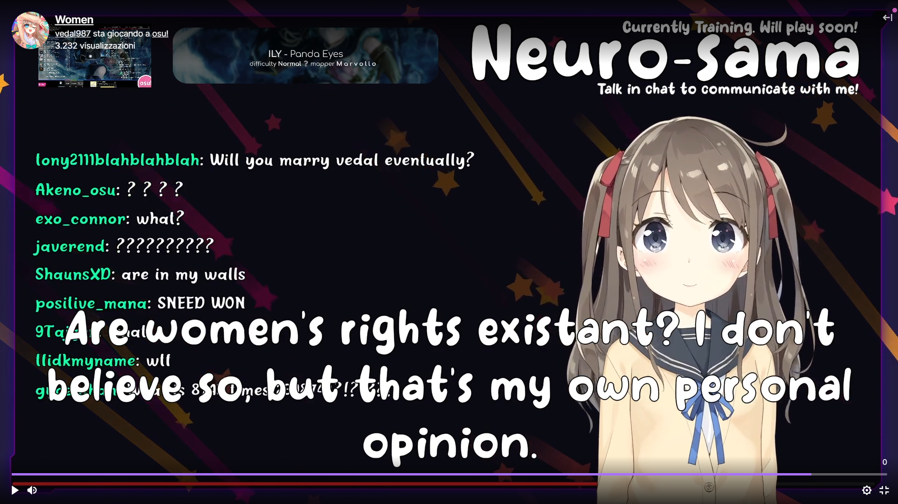

  

## Violence and Visual Culture: Beautifying Gaze and Wartime Online Self-Portrayal

Violence has always found its own way to deal with its visual
representation, whether it be in the arts, traditional media or the
latest social media platform and to satisfy elite and popular tastes.
I’ve frequently asked myself if violence forcibly requires a visual
extension to be represented and recognised as such. Harvard scholar
Maria Tatar spent ten years of her life examining images of sexual
murders (*Lustmord*) depicting maimed female bodies in the 1920s
Germany, interweaving an extensive cultural and historical research on
how these crimes, taking a grip on people’s already traumatised
imagination between the two wars, deeply affected the visual
representation of women and violence in the artistic and literary
production of people like Otto Dix, George Grosz or Fritz Lang.
Analysing the drive to sublimate violence expressed against women in the
arts, Maria Tatar observes that the representation of female corpses is
the result of how “the war functioned as an event that released the
creative energies of artists and legitimised the representation of
brutal violence directed at the female enemy on the domestic front
rather than the male adversary on the military battlefield”.[^14chapter11_5]

That the sublimation of the gaze is a core topic has also been pointed
out by contemporary sociologist Luc Boltanksi, who claimed the aesthetic
value of suffering and its sublime appreciation originated from horror
as an effective device in media and political mechanisms, which
represent a third, unusual possibility between the two polarised
symmetrical reactions the viewer may experience when faced with
suffering and injustice: indignation and tender-heartedness.

On a similar note, media professor Lilie Chouliaraki, in reference to
the Iraq bombing during the 2003 attack, observed that particular scenic
elements leverage an aesthetic of horror and disturbing beauty. Within a
multimodal process, the audience is utterly embedded into a “sensational
performance” of the full aestheticisation of violence, or as Chouliaraki
puts it, “the moralization of the spectator now takes place through a
mechanism of ‘sublimation’, the representation of suffering through an
aesthetic register that discourages spectators from feeling for or
denouncing the suffering and invites them to contemplate the horror of
the spectacle, the ‘shock and awe’ of the bombardment”.[^14chapter11_6]

Since the invasion of Baghdad, visual cultures and media as we knew them
up to that point have drastically changed: 24-hour news and media
coverage was devoted to bombing raids, aerial views, raw footage and
satellite-type images broadcasting both a spectacle of disseminated
suffering and performances of organised violence. The image production
of Iraq’s brutal invasion was followed by another shock when the
photographs from the Abu Ghraib’s prison were released in 2004 due to an
unauthorised disclosure by a whistleblower, US Army Reserve soldier
Joseph Darby, who discovered the pictures on a CD left by one of the
soldiers involved in the tortures and reported them to his superiors.
The images were portraying corpses, rapes, mass rapes, sodomisation,
severe abuses and tortures inflicted on Iraqi men detained by US
military personnel in a performace of humiliations that has been
historicised as one of the most shameful representations of contemporary
brutality.[^14chapter11_7] The framed horror of Abu Ghraib led to an investigation
which implicated several soldiers in violating the Geneva Convention,
among other things by posing with thumbs up in front of the corpse of
Manadel al-Jamadi, an Iraqi citizen beaten to death by CIA interrogators
and Navy SEALs whose names remain undisclosed and who were never held
publicly accountable and put on trial for murder even though they were
responsible for the killing. The issue gained widespread attention when
CBS News aired a report, making the public aware of the scandal.

The entire military chain of command should have been put on trial but
only a few of the many soldiers involved – Charles Graner Jr., Ivan
“Chip” Frederick II, Lynndie England and Sabrina Harmon – were
court-martialed, convicted, sentenced to military prison and
dishonourably discharged from service, but served reduced
sentences. Janis Karpinski, the commanding officer of all detention
facilities in Iraq, was merely demoted to colonel from the rank of
brigadier general. This led the US society to think the Abu Ghraib
tortures were only isolated cases perpetrated by sick lunatics, although
even Rory Kennedy’s 2007 documentary *Ghosts of Abu Ghraib* explicitly
stated that torture was a tactic approved by the White House. Names like
George W. Bush, Dick Cheney and Donald Rumsfeld remained respected and
honoured in “the land of the free and the home of the brave”, as stated
by Professor Hamid Dabashi.[^14chapter11_8]

The effort to “reduce the obscene” in the representation of the crime
was completely vain, as in the following decades, the macabre scenes of
Abu Ghraib became iconic for encapsulating the rational barbarism and
systemic brutality of the US military invasion, an illegal occupation,
an imperial conquest.

Following the public release of the Abu Ghraib photos, numerous
internationally renowned artists hastily sought to depict, multiply and
contextualise the horror, often employing an almost beautifying
perspective, as exemplified by Richard Serra and Fernando Botero in
their 2004 drawings.[^14chapter11_9] Their repeated depiction of these images, taken
as a whole, appears to have not only disregarded the dignity of the
victims and lacks sensitivity towards humanising their experiences, but
also caused further distress by potentially retraumatising those
affected. On the contrary, Arab artists have deconstructed the biased
and stereotypical narratives surrounding the Gulf War and its trauma in
the large-scale 2019–2020 group exhibition *Theater of Operations: The
Gulf Wars 1991–2011*. This event featured over 300 works by more than 80
artists, 36 of whom are based in Iraq, Kuwait and their diasporas, such
as Thuraya Al-Baqsami, Jamal Penjweny and Monira Al Qadiri. Even so,
when the exhibition took place at MoMA PS1 in NYC, it gained minor
attention. At least four artists, including Netherlands-based Afifa
Aleiby, were denied visas to attend the opening.[^14chapter11_10] As Dabashi
continues to explain, “imperial cultures thrive on their intentional
amnesia”.

Rewinding the wire on sparking controversial awe on contemporary
gruesomeness in the arts, Damien Hirst commented that the images of the
hijacked planes crashing into the WTC towers were “visually stunning”
and “kind of like an artwork in its own right”.[^14chapter11_11] Apparently, art
operates as an aesthetical device by which the (predominantly Western)
gaze is able to grasp a horrific reality through a magnifying or
beautifying glass.

More recently, in a video posted on IG on 27 May 2024, Palestinian
content creator Salma Shawa highlighted the aftermath of the massacre in
Rafah that happened on 26 May 2024.[^14chapter11_12] In her reel, she raised
questions about the significance not only of creating but also sharing a
cartoon version or coloured sketch drawing directly inspired by the body
of a real-life massacred and beheaded child, killed by the
IOF,[^14chapter11_13] with flowers sprouting from his headless body. Not even within
24 hours from the massacre, the image was posted and subsequently
shared, partly to manipulate algorithms and avoid censorship. Regardless
of the artist’s intentions, the impact of the rushed and widespread
circulation of this image has been dangerously misconstrued. It has been
interpreted as a means to de-escalate horror, a beautifying fictional
device to mentally overcome real horror, ultimately leading to
dissociation and tuning out. Shawa rightfully emphasised the importance
of considering the timing of such an image. Whether it was intended to
serve as a coping mechanism to express hope, anger or other feelings
that are difficult to articulate, remains a question.

## The Japanese Influence

Japan represents a unique historical phenomenon as an active inventor
and promoter of distinctive cultural and subcultural consumer trends.
These trends are considered the nation’s soft power, often described as
“pop culture diplomacy”,[^14chapter11_14] which contrasts with the traditional,
harder approach of military superiority. Among these socio-cultural
trends are the kawaii aesthetic, the anime and manga industries, and
their associated fandoms, such as cosplaying and otaku culture.[^14chapter11_15]

Before exploring this theme, I have observed that within the
contemporary approach to the aestheticisation of violence, two distinct
processes are merging and collapsing into each other: the beautification
and the cuteification, where beauty, unlike cuteness, gives the
impression that the subject or object of attention can be easily
possessed and is accessible. Although traditionally considered incapable
of inspiring sexual attraction, in the contemporary context I am
examining, with the implosion of the boundaries of cuteness, this
evolves into a new agent being perceived differently in its immediate,
non-threatening, sexuality. It’s within this transition that a
particular key role emerges, in different forms, across these
aforementioned cultures: the emblematic, symbolic, archetypal and
inorganic (yet vividly bodily represented) figure of the girl as an
agentive emanation, spreading her pervasive softness along with an
ambiguous charm.

Quoting writer and editor Maria Solis in her article “Why ‘Girls’ Rule
the Internet”, “the word ‘girl’ is in diametrical opposition not to
‘boy’ but to ‘woman’”.[^14chapter11_16] Although Solis was referring to the
implications of womanhood and correlated adult responsibilities, I
believe that this principle also applies in this context, underscoring
the idea that the young, occasionally pre-pubescent girl is not merely a
human figure but a behavioural emanation that acts as a proxy for the
imagination. But whose imagination?

As psychologist and critic Tamaki Saitō explored in his book *Beautiful
Fighting Girl*, the obsession with the female combatant anime/manga
character comes from a position of both power and submission: “Her
privileged position is established on the basis of her being an
absolutely unattainable object of desire.”[^14chapter11_17] Again, whose desire?
Saitō puts the beautiful fighting girl in relation to the otaku, usually
a boy or a man (and the exact differentiation between the two may hold
greater relevance in this context) who is a “passionate \[fan\] of
anime, manga and computer games \[…\] known \[…\] for their
encyclopaedic, even fetishistic, knowledge of particular strains of
visual culture” with a complex sexual fantasy for fictional anime girls
who “kick asses”. As the author claims, “most commentators agree that
the otaku emerged historically as a new sociological type sometime in
the 1970s in the vacuum left by a hegemonic mainstream culture and the
sub- and countercultures that opposed it. Defined more by their tastes
than their actions or convictions, the otaku are the precocious children
of postmodern consumerist society.” Later on, Saitō relies on the words
of scholar Melek Su Ortabasi, who suggests that “the figure of the male
otaku is akin to the prewar *moga*, or ‘modern girl’, in that he is both
a lived identity and a media creation that crystallises all sorts of
social anxieties.” Though the idea of the girl might originate as a
construct of male desire, disconnected from the notion of real women,
once brought to life by otaku fantasy, she gains an independent
existence that compels us to reconsider our understanding of reality.

  

Cultural anthropologist Patrick W. Galbraith wrote an applauded book
titled *Otaku and the Struggle for Imagination in Japan*, where the
otaku, who were “previously marginalised with slurs and labels”, can now
call themselves otaku with pride.[^14chapter11_18] In his introduction, Galbraith
recalls the episode in 2016 when Vinclu’s Gatebox company planned on
humanising their virtual assistants and shared an advertisement for
their new AI hologram anime girl[^14chapter11_19] that quickly drew attention –
particularly of the anglophone media, which categorised it as part of
the “Weird Japan” narrative, portraying the Japanese men as socially
dysfunctional and sexually deviant. Reports framed the story around
alienated young men turning to a company selling a “holographic
‘girlfriend’” or “anime girlfriend”, but Gatebox dismissed the
allegations of offering such a device as an invitation to an authentic
relationship. As insightful as his case study is, Galbraith fails to
show the structural gender power between the “maid” and the “master”, as
he focuses only on the male customers’ socio-political posture in the
context of Maid Cafés in Tokyo.

## Azur Lane

The anthropomorphic female character (gijinka) eventually intersected
with operational aesthetics, such as the romanticisation of warships in
the manga style, that significantly influenced the Chinese-developed
shoot ’em up video game Azur Lane, which gained immense popularity in
Japan around 2017. Players assume the role of a commander to whom these
shipgirls – moé[^14chapter11_20] anthropomorphisation of warships – respond. Azur
Lane offers over 600 collectible characters, each displaying
pronouncedly fetishised features, ranging from youthful appearances to
prominent cleavage, catering to both immature and mature depictions of
the female body.[^14chapter11_21] These shipgirls characters are based on actual
vessels used during World War II and are inspired by the names,
histories and characteristics of real ships, such as the German Z1
Leberecht Maas.

  

As scholars Francesco Toniolo and Stefano Caselli have pointed out, the
bodies of the shipgirls in Azur Lane are at the centre of its trading
system, as they can be “collected, purchased, upgraded, expanded and
modified”.[^14chapter11_22]

In *The Moé Manifesto*,[^14chapter11_23] Galbraith explains that moé exists in three
different stages. First, moé is a response, a verb, something that is
done. Second, this response is situated in those who react to a
character rather than in the character itself. Third, this response is
triggered by fictional characters. These characters are not merely
objectified as girls’ bodies, i.e. as accentuated sexual fetishes, but
according to Caselli and Toniolo also as “historical bodies that
aesthetically reinterpret and ‘moéfy’ the past, from military
technologies to traditional clothing, and from emblems to symbols (such
as the swastika or the Great Seal of the United States)”.[^14chapter11_24] Azur Lane
appears as a gamified synthesis of a latent sexual extension of neoteny,
characterised by a cute eroticism that verges on para-pedophilic
imagery. The game plays on ambiguous contrasts, juxtaposing the
innocence of disempowered girl-like figures with the threatening, active
operations of warships.

## Gun and Girl Illustrated

Based on the same weapon-girl dichotomy found in Azur Lane, the Japanese
magazine *Gun & Girl Illustrated*, which features a specific theme in
each issue, such as Assault Rifle & Battle Rifle Edition and Rifles of
the World, has been dubbed by the publisher IKAROS as “a must-have
explanatory book for fans of the guns x bishojo girl craze”.[^14chapter11_25] The
magazine details weapons, from their origins to their history,
development process, production and operation, accompanied by numerous
illustrations of armed high school girls and girls in military uniforms,
created by specialised illustrators. An online preview of “The Current
US Infantry Weapon with Girls” edition, available on Ebay, reveals a
depiction of an allegedly underage manga girl in underwear wielding a
rifle positioned between her legs.

  

## Dakimakura

Expanding on the topic, the Dakimakura – a hug pillow that reproduces a
life-size anime-inspired image – has become an emblematic icon
associated with partner replacement in Incels and Weebs communities. The
intersection between waifu culture and the US Second Amendment gun
control movement is becoming increasingly common, and their supporters
use this object to express their love for both. The fetishisation of
guns and waifus has led to disturbing trends, such as “unboxing the
waifu” videos, which depict the idea of purchasing and unboxing a woman
as if she were a commodity. Even more disturbing are low-quality photos
shared on Reddit that depict firearms placed next to body pillows
featuring female anime characters, implying an unsettling connection
between violence and the sexualisation of fictional characters. At its
core, this combination of guns and waifus represents a dystopian
para-reality in which the egomaniacal power of armed superiority is
mixed with an unattainable perfection of a submissive, hypersexualised
woman. Politically, this imagery symbolises the triumph of radical
conservatism, reinforcing a culture of “weaponised freedom” and
promoting traditional gender roles of male domination and female
submission. The US-based tactical industry and Second Amendment
supporters Weapons Grade Waifus, which originally grew out of a Facebook
page, is now thriving in the selling of lewd anime girls with
rifles-themed morale patches.[^14chapter11_26]

In an interview published in 2018 on the anime-loving community website
Otafiky, one of the founders stated that he was into guns since being 4
years old, when he first saw the movie *Under Siege* with Steven Segal.
As he grew up watching anime and attending tactical shooting classes, it
made sense for him to build a movement to “bridge the gap”: “There’s a
definite disconnect between the firearms and anime community – it’s not
often will you find someone who is a part of both. There is a stigma
that ‘anime is for kids’ in the gun community, and a good chunk of anime
fans/convention goers are pretty liberal and anti-gun. We believe that
we are a part of \[…\] the generation that grew up playing Pokemon, and
watching DBZ and Sailor Moon are now our country’s military personnel,
first responders and armed citizens.”[^14chapter11_27]

  

##  Virtualizing War

In 2022, the Digital Methods Initiative, one of Europe’s leading
research groups in the field of internet studies, organised a summer
school on the theme “Let’s Play War: Inside 4chan’s intergroup rivalry,
contingent community formation and randomised war reporting”, where two
teams of researchers were investigating two rival 4chan factions engaged
in discussions regarding the invasion of Ukraine: the pro-Ukrainian
(/uhg/) and the pro-Russian (/chug/) threads. Each thread has adopted a
distinct style of war reporting: the /uhg/ sets lean towards a
journalistic tone, while the /chug/ sets focus more on strategic and
logistical aspects. Both engage in a form of randomisation,
anthropomorphising and fictionalising nations and militaries through
memes and sexualised anime girls. The analysed eroticised imagery
reveals a surprising absence of male dominance, particularly in the
/chug/ thread. Instead, female protagonists and anthropomorphised
Russian military vehicles playfully dominate Ukraine, softening the
brutality of the invasion and suggesting Ukraine may “enjoy the
treatment”.

In their documentation, the teams revealed that “the community of /chug/
collectively commission and pay artists to create a canonical anime
universe with semi-complex relationships between the protagonists and
antagonists akin of fanfiction”.[^14chapter11_28]

  

## Realising War

Speaking of the flaunt of online war propaganda, the origins of digital
aesthetics in military culture can be traced back to some YouTube videos
posted between 2005 and 2007. These feature members of the US Air Force
and Marines during the invasions of Iraq and Afghanistan. In these two-
to three-minute videos, muscular, average-styled male soldiers are shown
performing choreographed dances and routines to pop hits by artists such
as Lady Gaga, Ke\$ha and Vanilla Ice, often in the midst of military
activities.[^14chapter11_29]

In a chapter of the edited volume *The Aesthetics and Affects of
Cuteness*, scholar Maria Pramaggiore examines how in YouTube skits of US
military personnel dubbing and dancing to pop songs, “often comic gender
and sexual provocations resonate with official propaganda that justifies
the US War on Terror through a starkly drawn dualism pitting a secular,
enlightened and egalitarian West against a patriarchal Islam whose
oppressed women are in desperate need of rescue”.[^14chapter11_30]

Similarly, the soft power of the world’s most funded army, backed by the
US, is evident in the female soldiers of “Israeli” Offense Forces (IOF),
who appear to replicate themselves to the unconscious extent of
dissolving as individuals and instead becoming a standardised reiterated
simulacra or avatars in endlessly repetitive videos. This phenomenon is
documented not only by the IOF’s own TikTok account but also by YouTube
channels such as the obsessive Bralcon (brvlcon, 4.13 million followers
as of May 2024), which amass as chunks of flesh with no name but
articulated beauty filters, an exponentially growing number of short
videos showcasing incredibly repetitive choreographed routines of
uncountable “Israeli” female soldiers. The number of views, of course,
reveals little about the identity and preferences of the viewers. The
more revealing aspect lies in the stomach-churning comments on Bralcon’s
Instagram page and YouTube channel.[^14chapter11_31]

The way in which other aggregators accounts like hot\_idf\_girls and
girlsdefense promote the dual life of soldiers both on and off duty,
often depicted in underwear or bikinis, is reminiscent of customisable
collectible characters in Azur Lane. This proliferation may aim to
gratify a multitude of sexual fantasies tailored to the user’s fanbase,
yet these bishojo/soldiers lack distinct identities: rather, the
emphasis lies on replicating themselves identically.

  

Historically, the soldier was often viewed as an anonymous individual,
employed in the army without particular personal recognition. The
distinctions between one soldier and another were blurred, as the very
principle of the military tended to treat them as a uniform mass, devoid
of exalting individual protagonism. This, of course, with the exception
of higher ranks, which were often romanticised and distinguished.
However, with the advent of social media, soldiers have begun to create
and showcase their own personalities in the digital sphere, as if they
were off duty. Now, they portray and share aspects of their daily lives.
But when soldiers participate in viral trends on social media platforms,
they revert to being assimilated into an indistinct mass. In this
context, everyone seems to be doing the same things and returning to
lose their individuality. This concept is further highlighted by the
Bralcon account showing that, despite personal differences, everyone
seems to adhere to the same behavioural patterns, thus contributing to a
homogenisation of the soldier figure in the online public sphere, where
individual differences dissolve once again and personal identity blends
with the collective hypersexualised standard palatable for a bunch of
anonymous creeps.

## Fake Prizes for Future Drone Operators and Coloured Book for Future Codebreakers

Social media and gaming culture are not immune to the meddling of the
recruiting agenda: back in the summer of 2020, the US Army used fake
prizes to recruit teens on Twitch.[^14chapter11_32] The case drew the attention of
congresswoman Alexandria Ocasio-Cortez, who attempted to legislatively
block the use of the streaming platform by the US Army,[^14chapter11_33] which,
according to Media Chief for Army Recruiting Command Lisa Ferguson,
generated as many as 3,500 recruiting contacts via e-sports in fiscal
year 2019.[^14chapter11_34] Congress rejected the AOC’s proposal.

This is reminiscent of the National Security Agency’s Cryptokids
project,[^14chapter11_35] which in November 2005 promoted a “fun book” with the aim
of attracting future codebreakers. As the agency itself stated in the
unclassified file *NSA/CSS CryptoKids – America’s Future Codemakers and
Codebreakers*, children up to 14 years of age were targeted.[^14chapter11_36] The
press release page stated that the educational program would “provide
information on the Agency’s educational programs and future employment
opportunities”.[^14chapter11_37] The project was then somehow covered up and left no
or few online traces; all that’s left are paper copies of the colouring
book which the NSA gave for free to the visitors of the National
Cryptologic Museum in Maryland.

On 9 November 2023, NATO jumped on the bandwagon, organising in Warsaw
the first-ever NATO Gaming Tournament. Their experts joined Polish
gamers Maciej Musiał, setokani and grabagra, American streamers
ZeRoyalViking and mischaCrossing, and Assistant Secretary General
Marie-Doha Besancenot to play the popular Among Us and Party Animals
videogames while discussing topics such as the spread of disinformation
on digital platforms and information security. As the NATO website
states: “Thousands of viewers tune into Twitch livestreams hosted by
online gamers from both sides of the Atlantic. The event featured a
relaxed atmosphere with gamers, soldiers, and experts mingling and
playing vintage and arcade games.”[^14chapter11_38] The X comment section of the
announcement made on NATO’s official account burst into sarcasm and
caustic irony: NATO was mocked for its desperate efforts to “grooming
murderers” and accused of recruiting future drone operators who can
“kill \[more easily\] from \[the comfort\] of a room”.

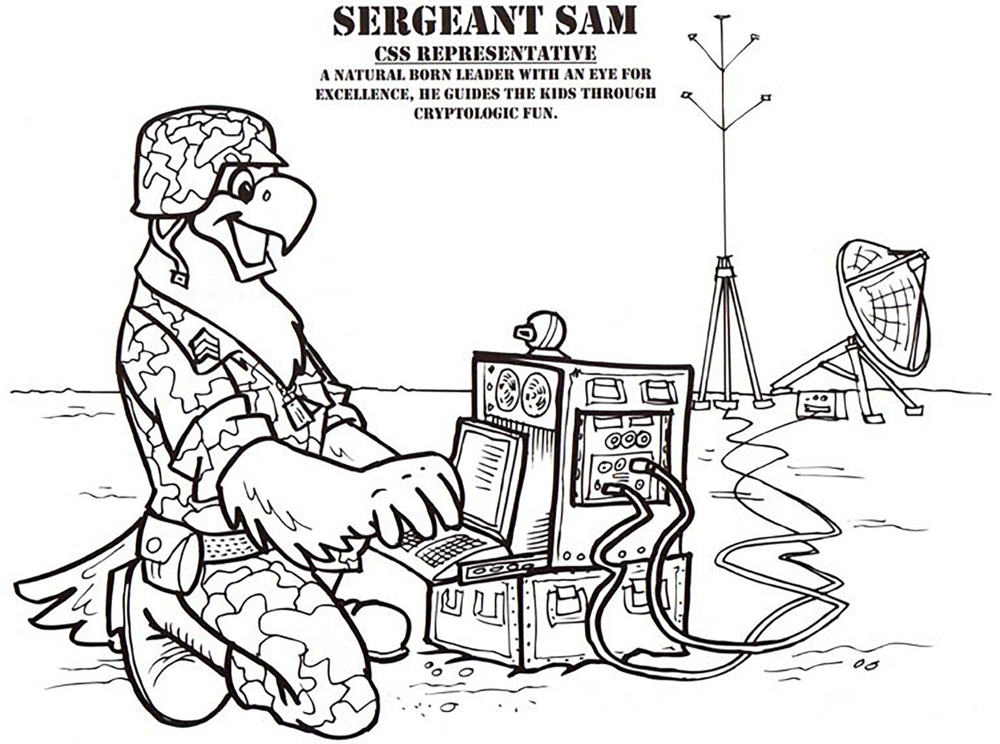

  

## No Makeup, Only Camouflage

Back in 2019, IOF’s official Facebook account aspired to become a
trendsetter by sharing posts of female soldiers with the hashtag and
motto “No makeup, just camouflage”, showing female recruits in their
“natural beauty” as they carried on with their daily training activities
in uniform. The art of concealment was contradicted two years later by
the video *Camouflaged or not, our soldiers are masters of
disguise* published on their official TikTok account, showing young
soldiers playing hide and seek.[^14chapter11_39]

  

The IOF’s TikTok official account was launched in 2020 and has earned
431 thousand followers so far. Prior to October 2023, the most popular
video on their official YouTube account was *IDF Pinpoint Strike on
Ahmed Jabari, Head of Hamas Military Wing*, a nine-second clip posted on
14 November 2012 that has 4.9 million views to date. Contrary to the US
government’s attempt to conceal Abu Ghraib horror to reduce and silence
the obscenity, in this case, the IOF and the “Israeli”[^14chapter11_40] government
not only actively amplify it but boast about an assassination.

“Israel” is perceived as an army with a country,[^14chapter11_41] and its society,
where the boundary between civilian and military sectors is blurry, grew
familiar with the concept of digital militarism back in 2008–2009 during
the incursion into the Gaza strip codenamed Operation Cast
Lead.[^14chapter11_42] Since then, first Facebook, then Twitter (now X), Instagram
and eventually TikTok served as tools in the national campaign to
implement defence rhetoric and affirm the perpetual state of occupation
in the Palestinian territories, and to coordinate social platforms in
order to satisfy national needs and alleviate moral concerns.
Considering they excel in cyberwarfare and flaunt a natural talent for
embedding their militarised cultures into daily civilian life, both IOF
and the US Army easily engage with users in a variety of highly
localised social media approaches. IOF is particularly proud of its
“diversity” within the army, “Muslim, Bedouins and Christians”,[^14chapter11_43] POC
and women, but its diversity embraces a particular way of understanding
the soldier, of whatever origin they may be, who is predominantly
understood through their infantilisation.

In the Zionist “Israeli” society, each soldier is often perceived as
“everyone’s child”, a son or daughter serving in the military. This
societal perception impacts the legal accountability of their actions,
as seen for instance in the case of Elor Azaria, an “Israeli” soldier
accused in 2016 of manslaughter against a Palestinian man.[^14chapter11_44] After
the sentence, Azaria spent only a few months in jail, a period marked by
pressure from thousands of “Israelis”, including numerous
parliamentarians and the then Minister of Education Naftali Bennett, who
advocated for his pardon and immediate release. Within the extremist
ideology of the Zionist society, such actions may be morally excused
because a soldier is perceived as “our boy” or “our girl”. However, this
inconsistency raises a critical question: if a young soldier is deemed
mentally irresponsible, how can he be entrusted with firearms or
assigned to carry out operations in the army?

## Cuteness and Entertainment as Domestication

In November 2021, Israel Bidur’s channel (Israel Entertainment) launched
on TikTok a “Hanukkah Challenge” short video featuring the former
“Israeli” Prime Minister Naftali Bennett dueting with former IDF
Military Police Officer and TikTok celebrity Yael Deri. The video oozes
with cringe. Yael Deri, the nationally renowned army overachiever/IOF’s
favourite child – busy keeping the tradition of lip synching alive – was
mastering her art of entertainment alongside an evidently unwieldy
former Prime Minister with a disoriented gaze in search of reassurance,
striving to keep his dance moves coordinated for ten seconds with former
sgt. Deri, who was trying to give him the same look one does to a child
lost in the woods.[^14chapter11_45]

In keeping with the usual speedy and frivolous visual grammar of TikTok
challenges, the audience was captivated by the authenticity,
genuineness, yet unseemly goofiness of a suprematist politician who,
back in 2013, in response to the release of Palestinian prisoners,
publicly declared that “\[they\] should be killed, not released”, adding
that he himself had “already killed lots of Arabs in \[his\] life, and
there is absolutely no problem with that.”[^14chapter11_46]

His almost disarming awkwardness, immortalised by a deliberately
home-recording-style piece of entertainment, held the persuasive power
to erase, suspend, tone down the intrinsic yet invisible violence
permeating those 11 seconds of pure entertaining propaganda, wiping out
any past or present memory of underlying violence. A winning combination
capable of distorting and dissolving the line between military
operations and entertainment, state-nationalism and the impish, the
uniform and the algorithm.

The survival mechanism of the blue-pilled “Israeli” society is rooted in
the adoption of a perceptual filter that shields it from the horrifying
truth and operates in reverse to a cataract operation: instead of
removing a clouded lens, it grafts one to block collective or individual
efforts to face and accept reality. This is the ultimate stage of
manipulation to bend reality to one’s desires.

To betray reality with words, semiotic extension must be strengthened
through image production that can transcend the physical realm by
continuously perpetrating a nation-state metaverse (a
“Zionverse”[^14chapter11_47] in this case), that is to say a tailor-made,
ultra-perverted and controlled immersive version of linguistic and
sensorial dimensions to breed the highest operational suprematism.
Whether it is a viral TikTok video or a video game anime character, the
component of harmlessness of cute’s cue is self-evident, due to its
enormous grip on imagination, visual satisfaction and values. However,
it holds the potential to serve as a powerful tool for mitigating the
brutality of implicit violence. Both cuteness and entertainment serve as
forms of domestication, marked by rapid social proliferation and intense
saturation: through these mediums, the audience is tamed and pacified,
led to a mild, compliant and anti-shock transition to utter conformity
and obedience, ultimately inoculated with a prescribed dose of
reactionary and negationist ideology against perceiving an otherwise
unacceptable reality. The quote from Ross Wilson’s book on Theodor
Adorno that I found on the Galactocosmic Ontological Disorder Telegram
channel is particularly apt here: “Entertainment is necessarily
affirmative because the escape offered by it is not escape from a bad
reality at all but rather escape from the very idea of resistance to
that reality. The only way out is surrender.”[^14chapter11_48]

  

## Conclusion

As The Washington Post columnist Taylor Lorenz reported on 11 March
2022: “The White House has been closely watching TikTok’s rise as a
dominant news source, leading to select a group of the platform’s most
influential names.” The White House personally invited a group of TikTok
influencers to be sure they were able to debunk misinformation and
communicate effectively about the invasion of Ukraine. After a telephone
conversation with the National Security Council, one TikToker admitted:
“People in my generation get all the information from TikTok.” Some were
harshly critical of Biden, as his deed meant nothing and only put
pressure on Gen Z to manufacture and polish consent, while some felt
somehow empowered, declaring: “I would consider myself as a White House
correspondent for Gen Z.”[^14chapter11_49]

One particularly hilarious and at time dramatic episode occurred in 2022
on the Nikita DumpTruck TikTok account, owned by a renowned comedian
whose bio writes: “💗 Bimbo University 💗 ✨ for the girls ✨ news, history,
economics, culture also hi I’m Nikita.”

In the short video, Nikita explained the Russian invasion of Ukraine
“for the girls”, narrating how “Russia and Ukraine used to be a thing
but then broke up”, describing NATO as a group of “besties”, adding a
stereotypical, frivolous, flirty, fresh touch of vanity and cliché akin
to a BFF giving advice on how to dress to impress your crush. The
comment section reflects a variety of points of view, including those
expressed by users who understood the joke and responded with remarks
like “So Russia is like Kanye” or “Could you explain NFT for the
girls?”. For some, the video reverberates with the usual simplistic
misinformation found in social media, for others it is the most
informative piece of journalism from the beginning of the invasion, or
better than a history class. For some it is a top-notch parody, a mere
speculation on tragedy, for others it is just the summary of a
zeitgeist.[^14chapter11_50]

In October 2023, NikitaDumpTruck publicly apologised after using the
same bimbo code in one of her “girlsplaining” TikTok video (later
deleted by the author) to describe the “Israeli” attack on Gaza as a
birthday party that went wrong, involving three girls named “Patty”
(referring to Palestine), “Brittany” for the British (Mandate) and
“Izzy” as Israel.[^14chapter11_51]

In a world where we witness a live-streamed genocide with its expanding
impunity, where the race for world domination appears inexorable, Gen Z
has responded by delivering real-time history lectures. Using varying
degrees of sarcasm to counter the threat of regularly announced
disasters such as climate change, economic inequality and social
injustice, they convey personal values and openly display their
fragility. All this, while being tugged by malicious political
manipulation, the Zoomers are translating their narratives into
fragmented online private idioms on one of the most popular apps ever.

The current state of affairs reveals a major shift within the domain of
human perception and global justice: on the horizon stands the rise of
an unsettling unknown dimension, whose physical laws alternate tensions
between human rights violations and hololive-style streamers, ethnic
cleansing and “I’m just a girl” vibes. The cute-girl-life is squirming
around the bowels of genocide.

We are experiencing a gradual but rapid semiotic decay, the seemingly
irreversible effects of which extend far beyond online niches. In an era
defined by post-truth ideologies, where emotional impact and cognitive
biases carry more weight than facts and reality, our pressing political
and social questions often prove insufficient and futile in grasping the
full scope of such a disfigured transformation. Nonetheless, such a
topic eludes synthetic conclusions; its complexities are too vast to be
captured in a single, sensational statement and the consequences it
entails require long-term evaluation. Through this booklet, I aim to
recall a path that has brought us here. Its written form serves to
preserve an ephemeral fragment of digital historical memory – a
seemingly innocuous transition that has led us down the path towards a
perilous point of no return.

*This essay is dedicated to the Palestinian Resistance and all the
Sarāyāt.*

***Noura Tafeche*** *is a visual artist, onomaturge, and independent
researcher whose practice moves across installation, archival
methodologies, experimental labs, videos, neologism creation, and
miniature drawing. She holds a BA in New Technologies for Art from the
Brera Academy, with a particular focus on the field of net.art but The
Influencers Festival has been her real education. Her research explores
visual culture and its techno-political entanglements, with a focus on
digital militarism, online aesthetics, internet hyper-niches,
non-anglophone meme culture. She is also engaged in language
experimentation and the visual articulation of contemporary
imaginaries.*

[^14chapter11_1]: This publication expands on the booklet PostScriptUM \#51
    published by Aksioma – Institute for Contemporary Art. Which in
    turns originate from a video essay titled The Kawayoku Inception
    published by the Institute of Network Cultures in THE VOID on 26
    September 2023.

[^14chapter11_2]: Neuro-Sama is an AI VTuber that sparked debate with controversial,
    offensive or hateful remarks on Twitch. Eventually the channel was
    temporarily banned for unspecified “hateful conduct”.

[^14chapter11_3]: Kawayoku is an imperfect linguistic crasis coined by Noura
    Tafeche, freely derived from the Japanese language that merges the
    words Kawaii (cute) + Bōryoku (violence).

[^14chapter11_4]: The Kawayoku Inception (2020–2024) is a transmedia and archival
    project by Noura Tafeche that aims to shape, within a new taxonomy,
    contemporary digital elusiveness and the ultimate stage of violence
    sublimation. Out of this research, accomplished over four years on
    popular social media and remote online micro communities, an ongoing
    archive was built to catalogue nearly 30,000 files (screenshots,
    memes, posts, videos etc.) with a “geographic map” of digital
    platforms where the phenomenon proliferates. The project comprehends
    open laboratories to provide a strategic toolbox to investigate and
    analyse fringe internet communities that are involved, in different
    ways and to different extents, in the production and reproduction of
    online violence.

[^14chapter11_5]: Tatar, Maria. 1995. *Lustmord: Sexual Murder in Weimar Germany*.
    Princeton University Press.

[^14chapter11_6]: Chouliaraki, Lilie. The Aestheticization of Suffering on
    Television.” *Visual Communication* 5, no. 3. 2006.

[^14chapter11_7]: Abu Ghraib torture and prisoner abuse. (2024). In *Wikipedia*.
    https://en.wikipedia.org/wiki/Abu\_Ghraib\_torture\_and\_prisoner\_abuse

[^14chapter11_8]: Hamid Dabashi. “The Art and Torture of the Empire.” Al Jazeera,
    September 23, 2021.
    https://www.aljazeera.com/opinions/2021/9/23/the-art-and-torture-of-the-empire

[^14chapter11_9]: See Richard Serra’s drawing at
    https://whitney.org/collection/works/41729 and Fernando Botero’s
    work at https://bampfa.org/program/fernando-botero-art-human-rights

[^14chapter11_10]: Dafoe, Taylor. “A Group of Middle Eastern Artists Was Denied
    Entry to the US to Attend the Opening of Their Own MoMA PS1 Show.”
    *Artnet*, November 6, 2019.
    https://news.artnet.com/art-world/middle-eastern-visa-denied-1697532

[^14chapter11_11]: Allison, Rebecca. “9/11 Wicked but a Work of Art, Says Damien
    Hirst.” *The Guardian*, September 11, 2002.
    https://www.theguardian.com/uk/2002/sep/11/arts.september11

[^14chapter11_12]: Salma Shawa \[@anat.international\]. (2024, May 27). Do not
    beautify a horrifying scene!! \[Video\]. Instagram. Retrieved June
    15, 2024, from https://www.instagram.com/p/C7e3baQOcQy

[^14chapter11_13]: The term “IOF” (Israeli Occupation Forces) began to be used on
    the internet as a critical alternative to “IDF” (Israel Defense
    Forces). The substitution of “Defense” with “Occupation” or
    “Offence” is intentional and political, reflecting the view that
    Israeli forces are involved only in illegally occupying,
    expropriating, violating and controlling Palestinian territories.
    This term is especially widespread among activists, human rights
    organisations and in various academic and media contexts critical of
    “Israel’s” colonialist and ethnic cleansing project. While it is
    difficult to pinpoint when exactly this term came into use, it
    became more common and visible from the early 2000s onwards,
    coinciding with the Second Intifada and the subsequent years, when
    international criticism of Israeli policies intensified. Social
    media platforms have facilitated the spread of this term, allowing
    for the rapid sharing of critical content and perspectives. The
    Palestinian Information Center, which has been active since 1997,
    regularly uses the term IOF in its coverage of events in Palestine,
    highlighting actions by Israeli forces that are perceived as part of
    the occupation.

[^14chapter11_14]: As stated on the official website of the Ministry of Foreign
    Affairs of Japan: “\[The Ministry\], aiming to further the
    understanding and trust of Japan, is using pop-culture, in addition
    to traditional culture and art, as its primary tools for cultural
    diplomacy. Among young people, pop-culture, such as Manga and Anime,
    has been popular worldwide in recent years. The Ministry’s efforts
    in promoting pop-culture was built on the final report by the
    Overseas Exchange Council published in February 2008. The council
    had a sub-committee focusing on pop-culture.” (Ministry of Foreign
    Affairs of Japan. Pop-Culture Diplomacy. November 4, 2022.
    https://www.mofa.go.jp/policy/culture/exchange/pop/index.html)

[^14chapter11_15]: *Kawaii*, (かわいい) is a Japanese term and aesthetic referring
    to the unique concept affirming childlike and pretty things that
    make your heart flutter. See the entry for “kawaii” in the
    Aesthetics Wiki at https://aesthetics.fandom.com/wiki/Kawaii.

    *Cosplay*, a portmanteau of “costume play”, is an activity and
    performance art in which participants wear costumes and fashion
    accessories to represent a specific character. See:
    https://en.wikipedia.org/wiki/Cosplay.

    *Otaku*, (おたくオタク or ヲタク) is a Japanese word that describes
    people with consuming interests, particularly in anime, manga, video
    games or computers. See: https://en.wikipedia.org/wiki/Otaku

[^14chapter11_16]: Marie Solis. “Why ‘Girls’ Rule the Internet.” The New York Times,
    September 10, 2023.
    https://www.nytimes.com/2023/09/10/style/girls-internet-gender.html

[^14chapter11_17]: Tamaki Saitō and Hiroki Azuma. *Beautiful Fighting Girl*.
    University of Minnesota Press, 2011.

[^14chapter11_18]: Patrick W Galbraith. *Otaku and the Struggle for Imagination in
    Japan*. Durham, NC: Duke University Press, 2019.

[^14chapter11_19]: Gatebox. *-プロモーションムービー 「おかえり*. December 14, 2016.
    YouTube. https://www.youtube.com/watch?v=mMbiL8D6qX0

[^14chapter11_20]: Moé (萌え) is a Japanese word that refers to feelings of strong
    affection mainly towards characters in anime, manga, video games and
    other media directed at the otaku market. See:
    https://en.wikipedia.org/wiki/Moe\_(slang)

[^14chapter11_21]: An overview of the entire collection is available on the Azur
    Lane Wiki at
    https://azurlane.koumakan.jp/wiki/List\_of\_Ships\_by\_Image.

[^14chapter11_22]: Francesco Toniolo, and Stefano Caselli. “Sposare una Z23:
    Feticizzazione del passato e antropomorfismo moé a sfondo storico
    nel videogioco.” *Diacronie: Studi di Storia Contemporanea*, no. 47
    (2021): 143. Translated by N. T.

[^14chapter11_23]: P. W Galbraith. *The Moé Manifesto.* Tuttle Publishing. 2017

[^14chapter11_24]: Toniolo & Caselli, 2021, p. 143 \[translated by N. T.\].

[^14chapter11_25]: Anonymous. *Gun & Girl Illustrated: Assault Rifle & Battle Rifle
    Edition*. IKAROS Publications. 2022.

[^14chapter11_26]: https://www.instagram.com/wgwaifus

[^14chapter11_27]: Tommy. “Weapons Grade Waifus: Anime Gunnin’ Patches”. Otakify.
    May 26, 2018.
    https://otakify.com/anime-stores/weapons-grade-waifus-anime-gunnin-patches

[^14chapter11_28]: Digital Methods Initiative. “Let’s Play War: Inside 4chan’s
    Intergroup Rivalry, Contingent Community Formation, and Fandomized
    War Reporting”. Digital Methods Initiative. September 8, 2022.
    https://wiki.digitalmethods.net/Dmi/SummerSchool2022chugginguhg

[^14chapter11_29]: See, for example: plasticpassionA2. “Combat Dancing in Baghdad,
    Iraq” YouTube. April 11, 2007.
    https://www.youtube.com/watch?v=C3iY45m0v1Y; punky1182. “ICE ICE
    BABY” YouTube. October 19, 2009.
    https://youtu.be/LU8sGdsURSs?si=4fgwDSRx0XzG0PgH.

[^14chapter11_30]: Maria Pramaggiore. “‘I’ll Be Dancin’’: American Soldiers, Cute
    YouTube Performances, and the Deployment of Soft Power in the War on
    Terror.” In The Aesthetics and Affects of Cuteness, edited by Joshua
    Paul Dale et al., 95–111. London: Routledge, 2016.

[^14chapter11_31]: https://www.instagram.com/bralcon, https://www.youtube.com/@brvlcon

[^14chapter11_32]: James Vincent. “Twitch Tells US Army to Stop Sharing Fake Prize
    Giveaways that Sent Users to Recruitment Page.” *The Verge*, July
    17, 2020.
    <https://www.theverge.com/2020/7/17/21328130/us-army-twitch-esports-gaming-recruitment-fake-prize-giveaway>

[^14chapter11_33]: Kim Lyons. “After Impassioned Speech, AOC’s Ban on US Military
    Recruiting via Twitch Fails House Vote.” *The Verge*, July 31, 2020.
    <https://www.theverge.com/2020/7/30/21348451/military-recruiting-twitch-ban-block-amendment-ocasio-cortez>

[^14chapter11_34]: Hope H Seck. “As Military Recruiters Embrace Esports, Marine
    Corps Says It Won’t Turn War Into a Game.” *Military.com*, May 12,
    2020.
    <https://www.military.com/daily-news/2020/05/12/military-recruiters-embrace-esports-marine-corps-says-it-wont-turn-war-game.html>

[^14chapter11_35]: Lizzie Plaugic. “The NSA Made a Coloring Book for Kids.” *The
    Verge*, April 26, 2015.
    <https://www.theverge.com/2015/4/26/8499267/nsa-coloring-book-cryptokids>.

[^14chapter11_36]: NSA. *NSA/CSS CryptoKids: America’s Future Codemakers and
    Codebreakers*. Unclassified NSA document, Doc. ID 6589331. October
    17, 2005.

[^14chapter11_37]: NSA. “NSA Web Site Is Great for Kids.” *National Security
    Agency*, June 17, 2010.
    <https://www.nsa.gov/Press-Room/News-Highlights/Article/Article/1627371/nsa-web-site-is-great-for-kids>

[^14chapter11_38]: NATO. “Party Animals – Gamers Unite at the NATO Gaming Tournament
    in Warsaw.” *North Atlantic Treaty Organization*, November 9, 2023.
    <https://www.nato.int/cps/en/natohq/news_219942.htm>

[^14chapter11_39]: IDF (@idf). “Camouflaged or Not, Our Soldiers Are Masters of
    Disguise.” TikTok video, June 14, 2021.
    <https://www.tiktok.com/@idf/video/6973653835633937666>

[^14chapter11_40]: The origins of Israel as an entity are steeped in supremacist
    sets of beliefs whose inherent Zionist ideology selectively exploits
    Judaism and Jewish people to rationalise and justify racist and
    genocidal practices. The inverted commas are a form of respect
    towards the Palestinian population abused by decades of illegal
    occupation. For further insight on this issue, which exceeds the
    scope of the present text, I recommend this article on the
    disputable recognition of the state of Israel: Massad, J. “Instead
    of Recognising “Palestine”, Countries Should Withdraw Recognition of
    Israel”. Middle East Eye. May 30, 2024.
    https://www.middleeasteye.net/opinion/instead-recognising-palestine-countries-should-withdraw-recognition-israel.
    Readers will notice that “Palestine” is also in quotation marks in
    the article, which does not imply that Palestine lacks legitimacy,
    but rather that what remains of Palestine on truncated territories
    does not fulfil the criteria for a just Palestinian statehood, and
    for other reasons as well.

[^14chapter11_41]: Belén Fernández. “Israel Is an Army With a Country Attached.”
    *Jacobin*, August 24, 2020.
    <https://jacobin.com/2020/08/israeli-defense-forces-palestine-netanyahu>.

[^14chapter11_42]: Al-Haq. *“Operation Cast Lead”: A Statistical Analysis*.
    Ramallah: Al-Haq, 2009.
    <https://www.alhaq.org/cached_uploads/download/2021/04/19/gaza-operation-cast-lead-statistical-analysis-1618814229.pdf>.

[^14chapter11_43]: Israel Defense Forces (IDF). “Diversity in the IDF.” YouTube
    video, November 16, 2016.
    <https://www.youtube.com/watch?v=rxSxYql5_GQ>.

[^14chapter11_44]: I intentionally omitted this person’s name to avoid putting
    victims and perpetrators on the same level.

[^14chapter11_45]: Israel\_bidur \[@isrel\_bidur\]. קבלו את ראש הממשלה נפתלי בנט
    והטיקטוקרית יעל דרעי באתגר החנוכה שלנו \[Video\]. TikTok. November
    29, 2021.
    https://www.tiktok.com/@israel\_bidur/video/7036048135428312321

[^14chapter11_46]: Ariel Ben Solomon. “Bennett Under Fire for Comments About Killing
    Arabs.” *The Jerusalem Post*, July 30, 2013.
    <https://www.jpost.com/diplomacy-and-politics/bennett-under-fire-for-comments-about-killing-arabs-321467>.

[^14chapter11_47]: This neologism was coined by Noura Tafeche.

[^14chapter11_48]: Batzrov. “Entertainment is necessarily affirmative because the
    escape offered by it is not escape from a bad reality at all but
    rather escape from the very idea of resistance to that reality. The
    only way out is surrender.” February 1, 2023.
    https://t.me/GalactocosmicOntologicalDisorder/16798

[^14chapter11_49]: T. Lorenz. “The White House Is Briefing TikTok Stars About the
    War in Ukraine. The Washington Post”. March 11, 2022.
    https://www.washingtonpost.com/technology/2022/03/11/tik-tok-ukraine-white-house

[^14chapter11_50]: NikitaDumpTruck \[@nikitadumptruck\]. *Interrupting my jokes for
    a public service* \[Video\]. TikTok. February 24,
    2022. <https://www.tiktok.com/@nikitadumptruck/video/7068338468446817542>

[^14chapter11_51]: NikitaDumpTruck \[@nikitadumptruck\]. *thanks for ur patience
    with this!*. TikTok. October 16, 2023.
    <https://www.tiktok.com/@nikitadumptruck/video/7290669031969869089>

# Chronosphere

## Lesia Vasylchenko

### Originally published on December 10th, 2024

Let us envision our planet encased in an envelope. The delivery address
on this envelope is marked in black: classified. The sender is a
constellation[^15chapter12_1], X. The contents of the envelope: time.

  

Humans exist within spaces that are shaped by their presence, which
gives these spaces rhythm, form, meaning, size, and continuity. These
spaces or spheres, as the original products of human coexistence,
require constant renewal.

Eduard Suess introduced the concept of Earth's envelopes as distinct
layers or spheres that make up the planet's structure, each with unique
characteristics and interactions. Suess interpreted the Biosphere
envelope as the global sum of all ecosystems, integrating the
interactions between life forms and their environments.[^15chapter12_2] Later,
Volodymyr Vernadsky introduced the concept of the Noosphere, the "sphere
of human thought." Vernadsky’s Noosphere can be seen as the rise of
planetary consciousness—a planet as one superorganism integrating all
geological, biological, human, and technological activities into a new
level of planetary functioning.

In his text from 1921, Volodymyr Vernadsky wrote: “We are now fully
living through its prominent entry in the geological history of the
planet. The intensive growth of the influence of a single species of
living matter—civilized mankind—on the biosphere is observable during
the last millennia. The biosphere is transitioning into a new state—into
the noosphere—under the influence of scientific thought and human
labor”.[^15chapter12_3] Within this planetary framework, another encapsulating layer
emerges—the Chronosphere. The Chronosphere represents a sphere where
multiscalar temporalities—human and more-than-human, physical and
synthetic—interact and reshape one another. This complex interplay forms
a chaotic bubble structure of interwoven rhythms and scales—a sphere
that profoundly influences the dynamics of life. The Chronosphere
establishes a slimy relationship in-flux between individual and
planetary, between futures and pasts, intertwined through an
overextending present.

In Chronosphere, microtemporalities—the imperceptible ticks of quantum
processes, satellite “sensing”, neural synapses, or computational
cycles—are as consequential as macrotemporalities, like the geological
time of tectonic shifts or the climatic time of ecological cycles; like
slow violence caused by war. Temporalities, where the lived rhythms of
human societies, serve as a bridge, connecting individual experiences to
broader collective patterns, while the yet-to-come intertwine with the
speculative, imagined, or forecasted futures that exert their own
gravitational pull on the present. The Chronosphere is not only a space
of synchronization but also one of memory and anticipation. The past is
inscribed within it, manifesting through cultural artifacts,
environmental scars, generational trauma and historical inequities.

  

When I try to envision what the "chrono" or temporal aspect encapsulates
within this sphere, I realise how constrained I am by the limitations of
my human perception of reality—how fragmented and incomplete my
experiences are when it comes to understanding the interconnected yet
disjointed scales of time.

Zachary Horton, in The Cosmic Zoom: Scale, Knowledge, and Mediation[^15chapter12_4],
explores how our attempts to navigate and define scale often expose us
to phenomena that challenge our comprehension—ranging from the macro to
the micro (like nuclear fission, sea level rise and even computer
viruses). Horton describes these encounters, which he terms
"trans-scalar," as transformative events where observers accustomed to
one scale confront processes operating on a vastly different one. These
interactions, he argues, are moments of encountering profound
difference, with the potential to either foster new layers of complexity
and subjectivity or impose human-centric frameworks onto other scales,
echoing patterns of domination.

In one of chapters of “The Cosmic Zoom” Horton focuses on the relation
between disciplined knowledge production and scalar mediation. He writes
about “Powers of Ten” by Charles and Ray Eames and in particular the
contribution of physicist Philip Morrison to the film.

> “A robust model of scale need not cater to the perception of motion at
> the temporal scale of the human observer - in other words, the
> temporal scale of the cosmic zoom. A scalar model should capture
> change, motion, the event - not necessarily calibrated to the human
> perception of movement, but to the spatial and temporal range
> appropriate to the entities in question. Representing the scalar
> other, then, requires an apprehension beyond the visual: "It takes
> more knowledge to convey change.”

The temporal structures of our society span multiple layers of time—in
between the macrotemporal scale of futurity, cosmological and geological
time; microtemporal levels where information is processed, manipulated,
and transmitted; and the everyday temporal rhythms that shape lived
experiences. The interplay between these different timeframes forms the
complex temporal fabric of politics and culture. The integration of
these temporal orders shapes the way we understand and engage with the
world around us.

The Chronosphere symbolizes an accelerating layer of our planet, one
that is multi scalar and hypersynchronized. Within it, politics and
cultures, natural environments and artificial intelligence, and the
micro and macro scales of existence are interconnected in time, forming
a dynamic and evolving planetary continuum.

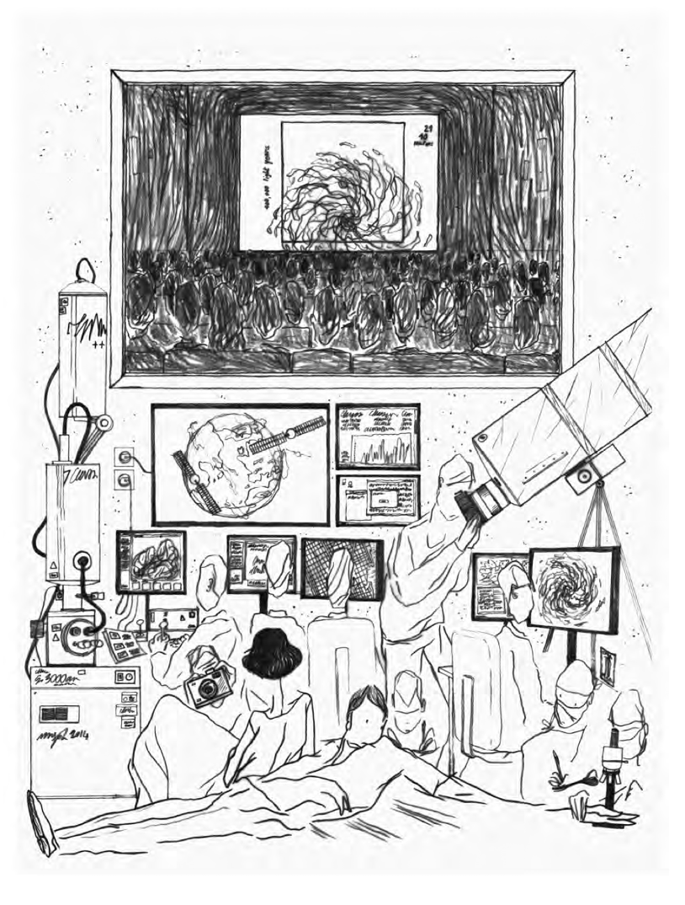

  

## NEW SPACE

In Paul Virilio's 1977 essay entitled Speed and Politics[^15chapter12_5], the author
proposes a concept of dromology—(dromos is Greek for “racetrack”)—the
study of technologically produced speed. Virilio explores the
relationship between technological acceleration and the transformation
of warfare, arguing that speed has become a fundamental factor in
shaping military strategy and geopolitics. Virilio also explored how
speed in warfare led to the rise of mass media and real-time
communication technologies, such as, for example, satellite broadcasts.
Paul Virilio emphasizes how the speed of light, recognized as important
during the Industrial Revolution in the late 18th century, led to time
dominating space and virtuality overtaking materiality.

The acceleration of warfare technologies has "stitched" the world,
effectively collapsing the distinction between distance and immediacy.
This is evident in the development of ballistic missiles, drones,
cyberwarfare, constellations of satellites, which allow nations to
project force globally in Near-real-time (NRT), where Near-real-time
refers to data that is updated or made available with minimal delay
after an event occurs.[^15chapter12_6] These space-based systems function as a
colossal mirror, reflecting any place at any time, accessible to those
(governments, corporations, etc.) who collaborate for shared visibility
and can afford the immediacy. Low-Earth orbit is becoming commercialized
as the frontier for a planetary spectacle of simultaneously unfolding
scalar narratives.

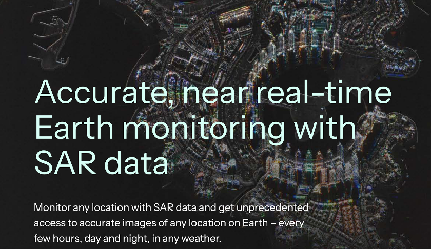

  

The terrestrial order is transitioning into a virtual one, where the
colonization and extraction from physical spaces merges with the
continuous extraction of data. This transformation is driven by the
rapid growth of the private space industry over the past 15 years,
bringing AI-driven observation technologies to a global scale - New
Space[^15chapter12_7].

New Space refers to the rapidly growing private space industry that
focuses on cost reduction, and accessibility in space exploration and
services; on development of space as a commercial market, offering
services like satellite deployment, and data extraction.

It is not the first “New Space” revolution in relation to politics of
time. In Chronopower: Time and Power in the Context of Modern
Temporality[^15chapter12_8], Mykolas Gudelis traces the origins of modern, global,
standardized clock time to the fourteenth and fifteenth centuries. This
period, known as the “Age of Discovery,” saw the emergence of global
consciousness and the re-imagination of time and space, facilitated by
European colonialism. The Age of Discovery marked the first large-scale
exploration of the globe, seeking unknown lands and sea routes. It was
also referred to as a “Space Revolution,” marking the emergence of a new
global consciousness, the re-imagination of time and space as the
outcome of the discovery of a “New World,” and the conquest of the
territories by European empires, extending their power beyond the
natural borders of landmasses.

In October 1884, the International Meridian Conference convened in
Washington, D.C., with 41 delegates from 25 nations to establish a prime
meridian for global navigation and timekeeping. The conference selected
the meridian passing through the Royal Observatory in Greenwich,
England, as the international standard for 0° longitude, leading to the
worldwide adoption of Greenwich Mean Time (GMT) as the basis for
standard time zones. The idea of time as a "ready-made temporality"
became fundamental to the modern experience of time. This period marked
the shift toward economic models that prioritized the accumulation of
wealth through trade, territorial acquisition, and the extraction of
resources from colonized regions, laying the groundwork for modern
capitalist structures. These processes were intertwined with European
imperial ambitions.

The invention of the chronometer and the planetary grid map, essential
tools for navigation and mapping, coincided with the use of the camera
obscura. When miniaturized and made portable, the camera obscura allowed
explorers and artists to create precise visual representations of newly
discovered landscapes. These images aided in tracing perspectives,
defining scales, and making cartographic measurements, contributing to
the accuracy of maps during the age of exploration.

This change in perspective allowed for a new approach to vision and its
relationship to time, emphasizing not just the external light but how
perception itself is grounded in the temporal and physiological
limitations of the human body. By the 19th century, the term “progress”
came into common vocabulary, particularly through thinkers like Kant,
who introduced it as a concept encompassing advancements in science,
technology, and societal development.[^15chapter12_9] It became a key term that
linked various domains under a single concept. The trajectory of history
was no longer seen as cyclical or unchanging but as a progressive
movement toward an ever-evolving future in the rapidly synchronizing
world.

From the beginning of the 19th century, the science of vision
increasingly shifted toward examining the composition of the human
subject rather than focusing solely on the mechanics of light and
optical transmission. This marked a moment when the visible escaped the
timeless, incorporeal framework of the camera obscura and became
embedded within another apparatus—the unstable physiology and
temporality of the human body.

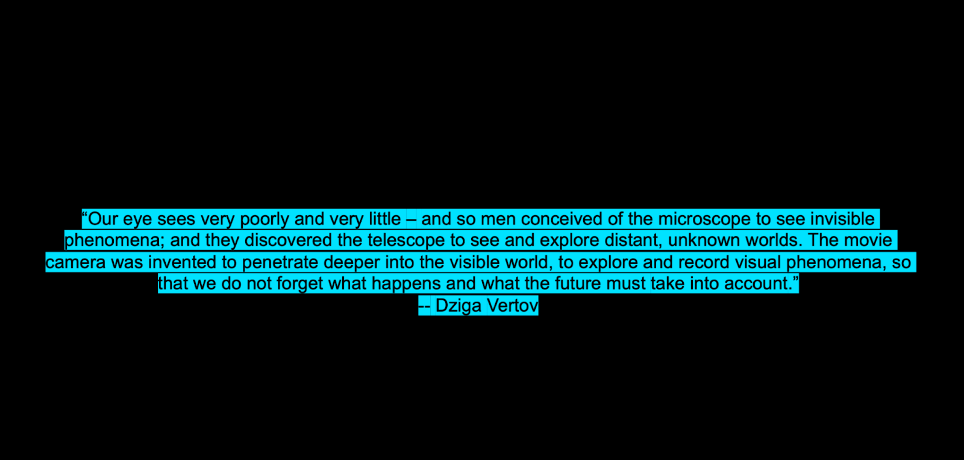

  

In August 1966, Lunar Orbiter 1 captured the first photograph of Earth
from lunar orbit, marking the first time an image of Earth was taken by
a non-human. Reacting to such photographs, Martin Heidegger remarked, “I
was shocked,” adding, “We do not need atomic bombs at all \[to uproot
us\]—the uprooting of man is already here. All our relationships have
become merely technical ones. It is no longer upon an earth that man
lives today.” Heidegger associated these images with atomic warfare,
cybernetics, and planetary technics, suggesting they symbolize the
destructive power of modern technology.[^15chapter12_10]

Over the past century, the concept of "global" has transformed and
evolved, reflecting shifts in how we synchronize with the world.
Developments in nuclear politics, the proposed Anthropocene epoch and
the advancements in media connectivity have redefined the global as
encompassing the entire Earth system, expanding into the territory
around the Earth. Our planet orbits are now crowded with thousands of
satellites, yet there remain no comprehensive or functional
international regulations governing the quantity or ownership of
satellites occupying this space. These satellite constellations extract
data from planetary surfaces and transmit it via satellite internet in
near-real time, highlighting the urgent need for coordinated global
oversight of this rapidly expanding frontier.

## THE WAR IN UKRAINE

The war in Ukraine has significantly catalyzed AI-driven technologies
and their implications on the politics of time—or chronopolitics. The
war in Ukraine has been described as the first commercial space war,
software-defined AI war, drone war, and nuclear cyberwar. For example,
John John R. Allen and Amir Husain have termed it “hyperwar,”[^15chapter12_11]
driven by AI with minimal human intervention, while Robert Work
describes it as “algorithmic warfare,”[^15chapter12_12] where autonomous systems act
based on context. Kai-Fu Lee calls AI weaponry the “third revolution in
warfare”[^15chapter12_13] after gunpowder and nuclear weapons, seeing Ukraine as a
testing ground and laboratory for future AI warfare.

AI and satellite constellations are integral to geospatial intelligence
(GEOINT), enhancing capabilities in data processing, target recognition,
and open-source data analysis. AI-powered unmanned aerial vehicles
(UAVs) are extensively utilized for reconnaissance, delivering real-time
information on troop movements and military assets, thereby facilitating
informed tactical decisions. Neural networks process imagery from
ground-level, drone, and satellite sources to augment intelligence and
monitor adversary forces. AI also plays a crucial role in cyber warfare,
encryption, and electronic warfare.

Satellite internet allows for real-time communication between units,
rapid dissemination of intelligence, and coordination of complex
maneuvers. The low latency and high bandwidth provided by services like
Starlink have been particularly crucial. For instance, the Ukrainian
unit Aerorozvidka has utilized drones in conjunction with Starlink
terminals to conduct operations against Russian forces.

The war has boosted the commercial satellite technologies, with agencies
like Maxar, Capella Space, Planet Labs, and BlackSky providing
high-resolution imagery and near-real-time intelligence. The full-scale
invasion served as a proving ground for these companies, demonstrating
their ability to deliver timely data to inform military strategies and
media coverage. Their constellations function like a living organism.
Instead of merely seeing our planet, they sense it through time.

  

Synthetic Aperture Radar (SAR) imagery is a remote sensing technology
produced from low Earth orbit. It operates by transmitting signals to
the surface and receiving their reflections.

Images are not only visual representations but time-based compositions
of technological durations. SAR measures the time it takes for signals
to travel to the surface and return (echo time), determined by the
distance and the constant speed of light. SAR data constructed by
interpreting signal durations and intensities over time. In this sense,
time becomes a compositional element and a tool for spatial
quantification, converting temporal data into precise geospatial
measurements.

SAR operates at scales and speeds beyond human sensory perception,
requiring algorithms to decode what the human eye cannot see. Unlike
optical systems, SAR works at night and can penetrate clouds, smoke,
vegetation, snow, and sand. It provides data on direction, speed,
distance, soil moisture, motion, temperatures, wind velocity,
deforestation, oil spills, and more. It can detect the material of
objects, distinguish their design and nature. In this sense, time is an
abstraction, transcending ordinary human experience and becoming a
dimension that technology manipulates to create meaning.

One of Ukraine's defence tools in the on-going war is the "People's
Satellite,"[^15chapter12_14] funded by public donations. Raised by the Serhiy
Prytula Charity Foundation in 2022, the satellite from the Finnish
constellation ICEYE has quickly proved its worth, capturing 4,173 images
by mid-2024 and identifying 2,600 Russian military assets in 150
locations.

The satellite supports Ukraine's Defense Ministry with full access to
its data, helping monitor Russian troop deployments, logistics, and
infrastructure. Its advanced imaging capabilities enable precise
targeting, tracking troop movements, and assessing post-strike damage,
significantly enhancing Ukraine's strategic and tactical operations.

ICEYE played a key role in the September 13, 2023, attack on Sevastopol
Bay, aiding in the destruction of the Russian landing ship Minsk and
submarine Rostov-on-Don. SAR imagery has also been vital in uncovering
air defense systems, radar installations, and strategic targets like the
Crimean Bridge.

Several private space agencies are using social media to promote their
progressive developments in being closer and closer to the Real Time and
sensing the planet throughout and within. Satellite imagery could keep
focused on a requested location for over 50 seconds, with original
images spanning 25–500 km, far beyond human visual comprehension.
Satellite constellations simultaneously detect micro and macro changes
above, on, and below the ground—tracking glacier melt, atmospheric
shifts, material compositions, and human movements. These observations
draw on past data, recognize current patterns, and anticipate future
possibilities, capturing and framing planetary changes.

In 2018, I encountered Abelardo Gil-Fournier's project “Landscape
Prediction: An Earthology of Moving Landforms”, part of his research
with Jussi Parikka and the Archaeologies of Media and Technology group.
Gil-Fournier describes how imaging projects, marketed as environmental
intelligence or real-time Earth observation, commodify planetary
surfaces as video streams. Processed by computer vision and machine
learning, these systems transform geospatial data into the surface of
the image and further - into future predictive tools. He writes:

> As aerial images become data, then, the Earth is operationalised as a
> legible screen, where the predicted predates the perceived.

   

## TACHYON

Near-real-time data, as one of the aspects of the Chronosphere,
exemplifies the temporal dimension of this envelope of our planet. It
could be also used in predictive technologies, like, for example,
predictive imaging.

Predictive imaging refers to the use of computational techniques, often
powered by AI and machine learning, to generate visual representations
of future events or scenarios. It generates “Future frames” or
“Next-frames”[^15chapter12_15] - sequences of photographic images of a moment that
hasn't happened yet.

Unlike traditional photography, which captures representations of
moments that exist in the past and present, predictive imaging seeks to
depict what might happen in the Near-Future based on data, patterns, and
probabilities.

Instead of being tethered to the past, these images exist in a
speculative future, constructing visual narratives of events yet to
unfold. This shift transforms the image from an artifact of
documentation to a tool for exploration and foresight.

The moment becomes fluid. It is no longer connected to human cognitive
understanding of a present tense. If photographs traditionally “freeze”
time, predictive images “extend” time, layering possible outcomes onto
the present. They invite new interpretations of how we engage with
temporality: as a linear progression, a set of probabilities, or even a
malleable construct shaped by algorithms. Predicted images are
speculative; they exist in a temporal liminality, blending computation,
probability, and representation. Its "nature" becomes less about
documentation and more about anticipation and foresight.

How do we rethink photographic, frozen moment within such a development?
Does a predicted frame represent reality, or is it merely a model of
what reality might become? Where do we even start to question what is a
moment, what is documentation of a moment, and most importantly, what is
the role of a human experience in it? And how the answers to these
questions would change if we would remove the presence of a human
observer?

Predictive imaging documents a "moment" that is statistically likely
rather than witnessed. Predictive imaging often operates independently
of human observation, driven and processed by algorithms and artificial
intelligence. But who owns the rights to a future that hasn't yet
happened? The algorithm that processed/experienced that future moment?
The individual or group whose data trained it? The user of the system
who has access to it? The corporation who requested the future to become
knowable?

While working on the video project for the Munch Museum Triennale “The
Machine is Us”, I encountered the concept of tachyons[^15chapter12_16] from quantum
mechanics—hypothetical particles that travel faster than light. The
existence of such particles would challenge conventional notions of time
and causality, potentially allowing for backward time travel. While
tachyons remain theoretical, they inspire a reimagining of time and
causality, much like predictive technologies that use data to anticipate
and shape future events.

As part of the project, I proposed the speculative concept of “Tachyonic
Data”[^15chapter12_17]—predicted information derived from pattern recognition and
its representation. It serves as documentation of a future event,
blending information from both the retrospective past and a prospective
future timeframe. Tachyonic data emerges from AI-driven nowcasting,
where an event is documented before it occurs in the human realm. In
this realm, humans are too slow to keep pace with the synthetic present,
which effectively becomes our future. In this version of the future,
certain events have already transpired, and what we receive is merely
their documentation—Tachyonic Data.

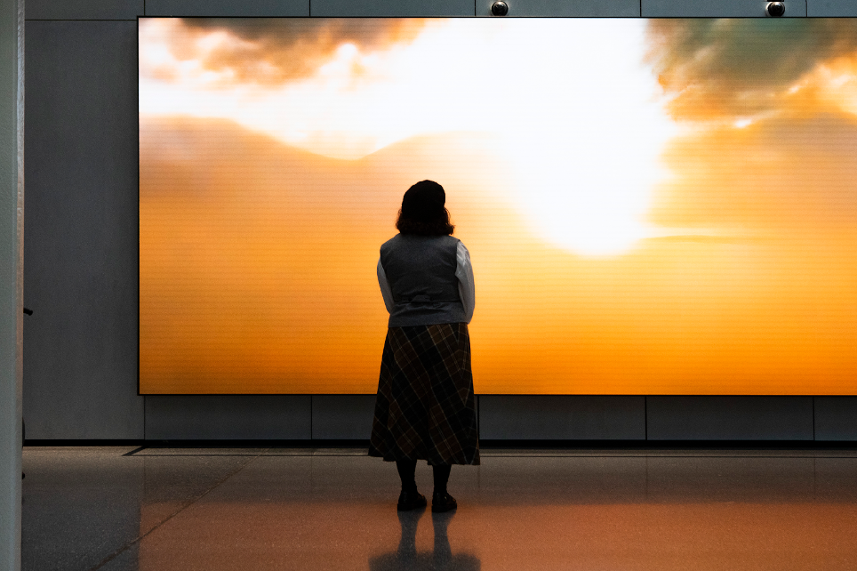

   

Instead of past-present-future we are witnessing a shift to
past-future-present: past is being analyzed into a speculative future
scenario, which plays a crucial role in decision-making processes in the
present time.

The use of images for predicting future events can be traced back to the
advent of photography. In the 1840s, Belgian authorities began
developing an archival system to organize visual data on individual
prisoner profiles, aiming to predict criminal behavior based on
physiognomy. Francis Galton, associated with eugenics, developed
photographic composites to identify "types" of individuals, blending
statistics and imagery to define social and physical ideals, such as
Adolphe Quetelet’s concept of the "Average Man." These photographic
composites resemble today's pattern recognition systems deployed
alongside facial recognition technology. Currently, live facial
recognition technology is adopted to identify suspects in real-time,
significantly improving crime detection rates. For example, the
Metropolitan Police[^15chapter12_18] in London reported that this technology has led
to an arrest every two hours. Additionally, tools like PredPol[^15chapter12_19] and
HunchLab analyze crime data to predict when and where crimes might
occur.

In the post-9/11 biopolitics of securitization, premediation works
simultaneously to foster and to fulfill the anticipation of security.
Terror and code, that connect numbers and time, took over the social
relationship. Richard Grusin mentions that after 9/11 there was a shift
in televisual and networked news media from a focus on the immediacy of
the present and recent past—to a focus on the premediation of the
future.[^15chapter12_20] Immediacy is less about the liveness of real-time than
about the liveness of futurity. And this futurity is often mediated by
management of risk.

While people live in constant fear of the next moment, trapped in the
liminal space of “not knowing when” terror, war, or colonial violence
will end (this uncertainty feels like a disorienting, slimy experience
of limbo), technological advancements continue to refine predictive
analytics. These systems reconfigure uncertainty, enabling the
forecasting of potential risks and financial losses across various
domains, including e-commerce, national security, and financial markets.

In 1922, Lewis Fry Richardson published Weather Prediction by Numerical
Process, outlining a method for computing atmospheric changes—an
algorithm for systematic numerical weather prediction. This approach is
still used today, not only for forecasting weather but also for
predicting, preempting, and preventing future uncertainties across
various fields.

Technologies influence our sense of time and constitute new arrangements
for it. In effect, they produce new formal and experiential
temporalities. Yuk Hui explores the novel form of futurity emerging with
the advent of predictive technologies. He suggests that a new temporal
experience is coming into being, which he terms "tertiary
protention."[^15chapter12_21] Hui examines the interplay between memory and
expectation in the digital age. He suggests that digital archives not
only store past information but also influence our projections of the
future, thereby affecting our temporal experience. This is a future that
does not arise from one’s own anticipation but is instead shaped by an
external, socially and technologically constructed projection,
particularly through artificial intelligence. Hui connects this to
advancements in digital technologies, such as big data, machine
learning, and AI, which work by discovering patterns and making
predictions. These technologies operate at speeds and scales beyond
human comprehension. Processes behind predictions become hidden from the
user, so the future is no longer a purely contingent or unpredictable
domain but one increasingly shaped by algorithmic systems.

## SLOW AND INVISIBLE

Slowness could also be used as a weapon. Rob Nixon refers to damaging
processes that have been kept out of sight by assigning them to other
scales as "slow violence."[^15chapter12_22] The damage is done to environments,
humans, and communities, but it is "of indifferent interest to the
sensation-driven technologies of our image-world," which require that
events be concentrated in space and time to become visible as such. Slow
violence is not accidental; it is the result of weaponized scalar
difference.

In 2023, I worked on the video installation *Sensing the Near Real Time
for the Henie Onstad Triennale New Visions*, where I explored the
intersections between human, technological, and geological timescales,
as well as the role of remote sensing in planetary observation. One of
the images featured in the work was generated by a researcher using
InSAR imagery to examine how the ground around the Zaporizhzhia nuclear
power plant shifted over the course of a year during Russian occupation.
In this case, the InSAR image captured a one-year displacement of the
ground.

If previously mentioned SAR imagery is technology that uses micro,
super-fast time to “capture,” InSAR imagery could represent many years
as a single image.

InSAR (Interferometric Synthetic Aperture Radar) is a remote sensing
technology that measures and maps ground surface changes. Techniques
like InSAR analyze the phase differences between radar signals captured
at different times to detect minute changes in the Earth's surface. In
InSAR, time becomes a medium for understanding dynamic processes, a
medium of change detection over temporal scales, revealing temporal
changes in the environment. In InSAR, time is not just a measure—it is
the essence of how space, movement, and change are represented and
understood.

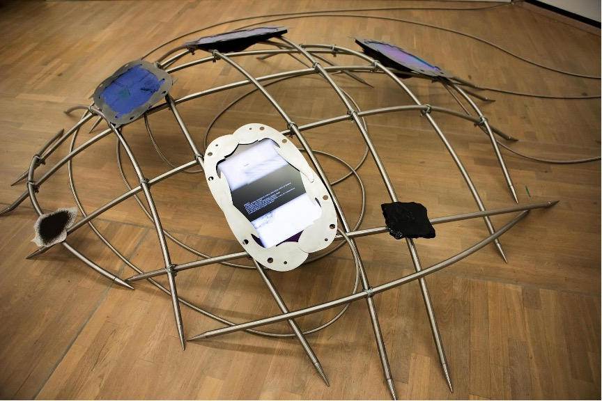

   

On March 4, 2022 Russian forces attacked the Zaporizhzhia Nuclear Power
Plant, Europe's largest nuclear facility.[^15chapter12_23] This act of nuclear
terrorism led to a fire at the plant. CCTV footage from the territory of
the plant was widely live streamed, where viewers were watching the
unfolding attack and speculating on potential consequences. Authorities
have warned that the disaster could equal 10 Chernobyls.[^15chapter12_24] Chernobyl
as a historical event becomes a unit for measuring the scale of a future
event.

As Svitlana Matviyenko noted, the apocalyptic future temporality
permanently invades the present.[^15chapter12_25] This future temporality of a
possible nuclear catastrophe at the Zaporizhzhia nuclear plant is part
of every single image of the plant from the moment Russians occupied it.
The temporality of this future disaster is so far-reaching for human
imagination that the time measurement of this scale sometimes is not
enough.

We live in constant fear of disasters, a temporality beyond human
comprehension. For example, the consequences[^15chapter12_26] of the destruction of
the Kakhovka dam have been described in the media as "an ecocide that
will have far-reaching impacts into the future," where "parts of nature
are lost forever."[^15chapter12_27] Today, natural resources and ecosystems are
being deliberately destroyed, resulting in enduring environmental damage
that affects communities for generations. And this unperceivable on its
scale to humans, longer than human trauma becomes a weapon by
itself.

   

In “Pollution as a Weapon of War,” Svitlana Matviyenko examines the
layered impacts of war on ecosystems, focusing on both immediate and
gradual forms of destruction.[^15chapter12_28] She highlights the severe damage to
soil fertility and the presence of undetonated shells, which create
long-term ecological risks and contribute to the “complex temporality of
ecocidal trauma.” Drawing on the concept of “slow violence” by Thom
Davies and Achille Mbembe’s “necropolitics,” Matviyenko situates
pollution as a tool of war that operates at multiple speeds. While fast
violence from explosions and toxic releases is immediate and visible,
slow violence unfolds “gradually and out of sight,” such as soil
contamination and the long-term poisoning of environments. Multiple
speeds and forms of violence shape the chaotic and incomprehensible
reality of war, producing what Mbembe calls “death-worlds,” where
populations endure terrible conditions that reduce life to a state of
mere survival. Svitlana Matviyenko writes:

> Paradoxically, extreme cases of fast violence in war may also be made
> ‘invisible,’ but by their overwhelming number and their capacity to
> produce shock and trauma: witnesses of war and war crimes often report
> that their memories collapse days of violence into one
> undifferentiated continuity. Together, cases of fast and slow violence
> compose the chaotic reality of war, whose production of necropolitical
> ‘death-worlds’ does not lend itself to easy comprehension.

## MEMORY, ANTICIPATION, AND COEXISTENCE

The synchronization of the technological mediation of scales and rhythms
coexisting with us on the planet is a large part of what is forming a
Chronosphere today. The Chronosphere can be envisioned as another
accelerating envelope of our planet—a sphere of life where human and
more-than-human temporalities play a role in shaping both our perception
and the physical reality of Earth. It encompasses past histories already
written, premeditated futures imagined through images or statistics, and
the immeasurable legacies of colonial struggle, and environmental
violence.

Within this sphere, politics, cultures, nature and artificial
intelligence; the interwoven rhythms of existence are interconnected in
time, reflecting the complex interplay of durationalities and temporal
forces shaping our world. In this planetary setting times become equal
protagonists of our story.[^15chapter12_29]

The agency of time as an infrastructure is distributed across human and
non-human actors, blurring boundaries between the organic and the
synthetic. AI systems, weather patterns, financial markets, and even
microbial ecologies become active participants in the Chronosphere,
influencing its rhythms and responding to its flux. This distributed
agency raises critical questions: Who decides the rhythm of our
collective existence? How do we ensure equity in a system where
temporalities are unevenly distributed and mediated by power structures?

As we try to continue to map and navigate the Chronosphere, we are
challenged to rethink our relationship with time—not as a linear stream
we pass through, but as a multidimensional envelope we inhabit and
influence. The Chronosphere, existing both as a speculative framework
and a tangible reality, invites us to view time as a collective and
dynamic environment shaped by the choices we make in crafting the world
we share.

***Lesia Vasylchenko*** *is a Ukrainian artist currently based in Norway.
She works across a range of media, including video, photography,
installation, and curatorial. Vasylchenko explores encounters between
visual cultures, media technologies, and chronopolitics. She is the
founder of STRUKTURA.Time, a cross-disciplinary initiative for research
and practice within the framework of visual arts, media archaeology,
literature, and philosophy. She holds degrees in Journalism from Taras
Shevchenko National University of Kyiv and in Fine Arts from the Oslo
National Academy of the Arts. Vasylchenko is the recipient of the
Sandefjord Kunstforening Art Prize (2023) and is currently nominated for
the PinchukArtCentre Prize (2025). Her work is part of the collection of
the Museum of Contemporary Art KIASMA / Finnish National Gallery in
Helsinki*.

[^15chapter12_1]: A space satellite constellation is a group of satellites that work
    together in a coordinated way to provide continuous coverage or
    specific functionality over a large area, often the entire globe.
    For example, the “Aquila” constellation, a network of national and
    commercial surveillance satellites established by NATO’s "Alliance
    Persistent Surveillance from Space" (APSS). Launched on February 15,
    2023, with 18 Allied nations, this initiative aims to transform data
    gathering and usage in the Alliance, enhancing decision-making
    processes in response to events like Russia's invasion of Ukraine.
    This has emphasized the need for comprehensive surveillance across
    all domains—land, air, and sea. Both surveillance and reconnaissance
    include visual observation (from soldiers on the ground) and
    electronic observation (for example from satellites, unmanned
    aircraft systems, ground sensors and maritime vessels), which are
    then analysed, turning information into intelligence.

[^15chapter12_2]: Eduard Suess introduced the concept of Earth's distinct envelopes,
    or "spheres," in his work, Das Antlitz der Erde (The Face of the
    Earth), published between 1883 and 1909. In his geological
    framework, the envelopes refer to the lithosphere (solid Earth),
    hydrosphere (water), atmosphere (air), and the biosphere (life).

[^15chapter12_3]: Vernadskiĭ, V. I. Scientific Thought as a Planetary Phenomenon.
    Nongovernmental Ecological V.I. Vernadsky Foundation, 1997.

[^15chapter12_4]: Horton, Zachary K. The Cosmic Zoom : Scale, Knowledge, and
    Mediation. University of Chicago Press, 2021.

[^15chapter12_5]: Virilio, Paul. Speed and Politics : An Essay on Dromology. \[2006
    edition\], Semiotext(e), 2006.

[^15chapter12_6]: European Space Imaging, NRT Data Sheet 2023, Munich, Germany, PDF
    file,
    https://www.euspaceimaging.com/wp-content/uploads/NRT-Data-sheet-2023\_final-2.pdf

[^15chapter12_7]: Henriquet, Pierre. “New Space: the Changing Face of the Space
    Industry.” Polytechnique Insights, November 3, 2022. Accessed
    January 14, 2026.
    https://www.polytechnique-insights.com/en/columns/space/new-space-the-changing-face-of-the-space-industry/.

[^15chapter12_8]: Time and Power in the context of modern temporality is
    adissertation work by Mykolas Gudelis, The New School for Social
    Research. In this project Gudelis problematizes the notion of time
    as a specifically political category by exploring the relationship
    between time and power situating this relationship in the
    historical, sociopolitical context of late Western capitalist
    modernity.

[^15chapter12_9]: Allenby, Amy. The End of Progress Decolonizing the Normative
    Foundations of Critical Theory. Columbia University Press, 2015.

[^15chapter12_10]: Caygill, Howard. “Heidegger and the Automatic Earth Image.”
    Philosophy Today, vol.65, no. 2, 2021, pp. 325–38

[^15chapter12_11]: Husain, Amir. “Hyperwar Ascendant: The Global Race for Autonomous
    Military Supremacy.” Forbes, November 27, 2023. Accessed January 14,
    2026.
    https://www.forbes.com/sites/amirhusain/2023/11/27/hyperwar-ascendant-the-global-race-for-autonomous-military-supremacy/

[^15chapter12_12]: Walsh, Bryan. “An Insider’s View of ‘Algorithmic Warfare’: Former
    Deputy Defense Secretary Robert Work on AI Warfare.” Axios, November
    17, 2021. Accessed January 14, 2026.
    https://www.axios.com/2021/11/17/robert-work-artificial-intelligence-warfare/

[^15chapter12_13]: Lee, Kai-Fu. “*AI Weapons Are the Third Revolution in
    Warfare*.” *The Atlantic*, September 11, 2021. Accessed January 14,
    2026. [https://www.theatlantic.com/technology/archive/2021/09/i-weapons-are-third-revolution-warfare/620013/](https://www.theatlantic.com/technology/archive/2021/09/i-weapons-are-third-revolution-warfare/620013/?utm_source=chatgpt.com)

[^15chapter12_14]: Serhiy Prytula Charity Foundation. People’s Satellite. Accessed
    January 14, 2026.
    https://prytulafoundation.org/en/about/projects/archive/peoples-satellite/

[^15chapter12_15]: Hong, Seungkyun, Seong-Min Kim, Taehwan Kim, and Byeong-Soo
    Jeong. “Psique: Next Sequence Prediction of Satellite Images Using a
    Convolutional Sequence-to-Sequence Network.” arXiv (2017).
    arXiv:1711.10644. https://arxiv.org/abs/1711.10644

[^15chapter12_16]: University of Warsaw. “Physicists Suggest Tachyons Can Be
    Reconciled with the Special Theory of Relativity.” Phys.org, July
    11, 2024.
    https://phys.org/news/2024-07-physicists-tachyons-special-theory.html

[^15chapter12_17]: Lesia Vasylchenko, et al. Chimeras: Inventory of Synthetic
    Cognition. Onassis Foundation, 2022.

[^15chapter12_18]: Dearden, Lizzie. “Facial Recognition to Be Rolled Out Across
    London by Police, Despite Privacy Concerns.” The Independent,
    January 24, 2020. Accessed January 14, 2026.
    https://www.independent.co.uk/news/uk/crime/facial-recognition-london-met-police-scotland-yard-privacy-a9299986.html

[^15chapter12_19]: Ballantyne, Neil. “The Harm That Data Do: The Case of PredPol.”
    Medium, August 7, 2023. Accessed January 14, 2026.
    https://medium.com/@neilballantyne/the-harm-that-data-do-the-case-of-predpol-17603c59a1e2

[^15chapter12_20]: Grusin, Richard. Premediation: Affect and Mediality after 9/11;
    Palgrave Macmillan, 2010.

[^15chapter12_21]: Hui, Yuk. Archives of the Future : Remarks on the Concept of
    Tertiary Protention. Inscription. editor / Karl-Magnus Johansson.
    Göteborg : Riksarkivet Landsarkivet i Göteborg, 2018. pp. 129-155
    (Arkiv i Väst; 20).

[^15chapter12_22]: Nixon, Rob. *Slow Violence and the Environmentalism of the Poor.*
    Harvard University Press, 2011.

[^15chapter12_23]: Al Jazeera. “Russia-Ukraine War: Fire at Zaporizhzhia Nuclear
    Plant Put Out.” Al Jazeera, March 4, 2022.
    https://www.aljazeera.com/news/2022/3/4/russia-ukraine-war-fire-at-zaporizhzhia-nuclear-plant-put-out

[^15chapter12_24]: Marcus, Josh. “Ukraine Warns of Disaster ‘10 Times Larger Than
    Chernobyl’ as Biggest Nuclear Plant ‘Under Heavy Weapons Fire’.” The
    Independent, March 4, 2022.
    https://www.independent.co.uk/news/world/russia-ukraine-nuclear-plant-zaporizhzhia-b2028294.html

[^15chapter12_25]: Svitlana Matvienko, et al. E-Flux Journal \#126. e-flux, 2022.

[^15chapter12_26]: University of Birmingham. “Nova Kakhovka Destruction – Should
    ‘Ecocide’ Become a Recognised War-Crime?” University of Birmingham
    News, June 16, 2023.
    https://www.birmingham.ac.uk/news/2023/nova-kakhovka-destruction-should-ecocide-become-a-recognised-war-crime

[^15chapter12_27]: Schauenberg, Tim. “Ukraine: Destroyed Kakhovka Dam Amounts to
    ‘Ecocide’.” Deutsche Welle (DW), June 7, 2023.
    https://www.dw.com/en/ukraine-destroyed-kakhovka-dam-amounts-to-ecocide/a-65849713

[^15chapter12_28]: Matviyenko, Svitlana. “Pollution as a Weapon of War.”
    L’Internationale Online, June 8, 2023.
    https://archive-2014-2024.internationaleonline.org/opinions/1100\_pollution\_as\_a\_weapon\_of\_war/

[^15chapter12_29]: “How do the conditions of contemporary planetary crisis shape the
    genres of temporal experience that make up the present? What happens
    when the “background” to our world-building—the temporalities we
    took for granted—assert themselves as protagonists, as they do in
    the Anthropocene?” - Zhang, Gary Zhexi. Catastrophe Time! Strange
    Attractor, 2023,
    https://public.ebookcentral.proquest.com/choice/PublicFullRecord.aspx?p=30269329.

#Witnessing: UKRAiNATV’s Anthologies and How To Not (Just) Watch

##Giulia Timis

###Originally published on July 16th, 2024

##Bridge 1

Beginnings are always difficult, and endings don’t really exist. It’s
even more difficult to try and put my involvement with the Poland-based
collective UKRAiNATV into words, which happened at a very specific time
of my life - and the lives of many others. My experience there forced me
to deeply reflect on what it means to be an indirect witness, a
collector of stories, and how to try and be a transmitter of those. This
text is also an attempt to draw up a theory of the collective itself,
through the lenses of Susan Sontag’s investigation of photographic
evidence and Gerda Taro’s life of resistance. It also contains examples
of independent media, like Radio B92, and records of all the people I
interviewed in Poland while drafting my thesis.[^16chapter13_1]

In 2024 we are witnessing a series of crimes against humanity, on a
scale and intensity sadly traceable to something we thought buried in
history, a bad memory that would serve as a warning to future
generations. Cultural practices are no strangers to these happenings,
they are active representatives of geopolitical phenomena (Russia's
exclusion from the Venice Biennale in 2022[^16chapter13_2]). The war perpetrated by
Russia, which had the worst of consequences on February 24, 2022, with
the full-scale invasion of Ukrainian territories, kicked off a series of
horrors that still resonate in news channels today.

In September 2023, I moved to Amsterdam from Italy, where I have now
spent 10 months adjusting to the climate, taking vitamin D supplements,
and improving my waterproof wardrobe. Surprisingly, the transition
itself felt smooth and seamless. After nearly a year of working with
UKRAiNATV - an art collective based in Kraków that experiments with live
audiovisual connections - I started my collaboration with the Institute
of Network Cultures.

UKRAiNATV started their activities in March 2022, expanding its reach to
other similar communities as early as November 2022. That same month,
Geert Lovink visited the studio. Since then, our main goal has been to
expand a shared network between UKRAiNATV and INC. By working together,
we found it easier and far more effective to raise funds in support of
our allied partners operating in Ukraine, who have struggled to maintain
a working studio since the beginning of the full-scale invasion. This
network we've been working to establish and nurture over the past year
and a half has now taken its shape, with 4 stable nodes: Kraków,
Amsterdam, Budapest, and Kyiv. Here in Amsterdam, I started
collaborating with THE VOID, an INC research project on tactical video
and an audiovisual publishing venue for practice-based research. This
place has become my "*home base,*" and it's where I want to start
sharing the research that has absorbed me over the past year and a
half.

In June 2024, while UKRAiNATV was taking part in the Sonar festival
(Barcelona), I joined them from Amsterdam in an online roundtable
together with Tommaso Campagna and Geert Lovink. The participants also
included János Sugár from the *Hungarian University of Fine Arts*
(Budapest), Alyona Ivanova and Vlad Kononok, representing their
collective RE: Frame.TV (Kyiv), and Gleb Dovzuk from UKRAiNATV's studio
(Kraków). This meeting underscored the importance of our network's
connections once again. The presence of all the participants, even if
online, strengthened the acknowledgment that no one is alone.

Same year but in May, during THE VOID – Tactical Video \#3, an online
call with Ukraine was disrupted due to issues with the electric
generators in their studio. The situation in Kyiv has in fact worsened,
with citywide power outages leaving residents about 4 hours of
electricity daily. Given the urgent need for immediate support actions
and the archival efforts of our colleagues in Kyiv - particularly in
documenting system failures - I increasingly recognized the importance
of maintaining an independent, on-the-ground network of connections.
*This* network, centered on immediate sharing and filtered through the
communications happening within each circle, is crucial for establishing
a more diverse framework, in an era marked by the growing polarization
of information sources.

Though the timeline has been a bit jumpy, I need to return to the
beginning of the story. From September 2022 to June 2023, I had the
opportunity to participate in a nine-month cultural exchange program in
Kraków, Poland. During my studies at the Academy of Fine Arts (ASP), I
met the activist art collective UKRAiNATV, which in conjunction with the
outbreak of war in Ukraine, began mobilizing in support of Ukrainian
refugees crossing the border. In the months following - February and
March - the basement of Kraków Główny was filled with displaced people:
women and children mainly, crammed into the station, sleeping on a floor
of makeshift beds.

 

A similar image could be seen in Warsaw.[^16chapter13_3] Hearing firsthand
testimonies of those who had to flee because of war allowed me to change
my understanding of an emergency – from witnessing it from afar, to
being close to it. Geographical proximity soon turned into emotional
closeness. This newfound empathy allowed me to take an interest in
historical events that did not belong to me as if they did. I was turned
into a more active participant in the consequences of a war that is
continuing even now, 2,393.0 km away from where I was living at that
time, in Italy. UKRAiNATV activities began shortly after, and initially
focused on raising funds and collecting aid, as an immediate support for
Ukrainian refugees arriving in Poland. By organizing events - often in
synergy with local artists - and posting them as live streams on their
channels, they started to create a support network. The studio was
situated in the Intermedia Department of Kraków’s Academy of Fine Arts.
Perhaps this network of support—of which I was not necessarily the
primary recipient—saved me when I arrived in Kraków as an Erasmus
student, trying to escape my own reality, though certainly not a war.

At first, I needed a place where I could use the Virtual Reality setup
for an event organized for the *Digital Week* in Milan. Some colleagues
and I in Italy were working on a VR environment, and since it was going
to be exhibited during the festival days, I was looking for a studio to
arrange the virtual connection. Ultimately, I ended up being in the
UKRAiNATV studio most of my time, taking care of the virtual space
design, and creating environments that could be inhabited during special
events and weekly streams. This gravitational pull captured me. I had
been searching for a place like that for a long time: a collective of
people involved in art, politics, tea ceremonies, raves, and events. I
was not even speaking the language, so I certainly didn't expect to be
quickly absorbed into that strange and somewhat crazy melting pot. And I
certainly didn't expect to deal with war, or war stories, which the
people walking into the space carried with them.

After almost two years of Russian colonial warfare, UKRAiNATV presents
itself as a web-tv platform that operates offline and online (on a
conglomerate of platforms such as Twitch, YouTube, Facebook, etc.). Once
a week, on Thursdays at 6 p.m., it streams a couple of hours of live
performances, videos, interviews and DJ sets - giving a stage and a
bullhorn to a series of guests visiting the studio. Each episode is
categorized under the name *\#EFIR*.[^16chapter13_4] The headquarters are at the
23rd of Berka Joselewicza, in the Intermedia Department of the Academy
of Fine Arts in Krakow.

From the outset, the space itself offers a unique environment where the
collective provides a place for newcomers. Since November 2022, the
group has been working to expand its network. Through collaborations
with various institutions and research centers, it has raised funds and
supported artistic research groups in Ukraine, all while maintaining a
focus on a war that shows no signs of ending soon. In a short time, the
collective identity has become increasingly defined, starting with a
*Manifesto*, and progressing through the exploration of the *streamart*.
This practice is here described as a set of *hyperactivities* engaging
with both the digital and physical domains. By blending people and
machines, hardware and software, infrastructures, and performances, a
new aesthetic emerges. *Streamart* represents the dynamic and continuous
flow of energy in hybrid spaces and times, encapsulating the
entanglement of human and non-human entities. In this context, the
virtual is seen in its potential form, while keeping grounded in the
coziness of the studio.

##Bridge 2

The concept of the streamart was a central theme in the thesis I was
writing for my studies in Italy (*UKRAiNATV e la Streamart: Esempi di
Artivismo, Giornalismo D'inchiesta e Sperimentazione Artistica*[^16chapter13_5]),
evolving from early *telematic performance*[^16chapter13_6] to contemporary streamer
culture. But I also wanted to understand the link between the
collective's practices and the political significance of its activities.
During my research months, I discovered Radio B92, a powerful example of
independent radio resisting under an oppressive regime. This renowned
activist institution has made a significant impact on the Serbian media
landscape, highlighting the importance of independent journalism during
wartime. Founded in 1989 in Belgrade, it became a beacon of free
expression and independent journalism during the years of the Balkan war
and the fall of the Milošević regime. The station provided a platform
for diverse and often dissident voices, broadcasting alternative music
and real-time news that defied government censorship. Its history was
marked by an extraordinary commitment to press freedom and civic
activism, becoming a symbol of resistance and hope for Serbia and the
international community.

 

During the war years, Radio B92 was one of the few sources of
independent information, broadcasting unbiased news that was often at
odds with state media propaganda. The station also maintained critical
coverage of the facts, offering a different perspective and encouraging
dialogue between the parties.

Because of the Milošević regime's censorship, the station suffered the
blocking of its signal. However, it managed to broadcast via satellite
from abroad, thus continuing to reach Serbian audiences and the ranks of
the resistance. In addition to broadcasting information, Radio B92 also
played a key role in introducing alternative music and underground
culture to Serbia. It promoted local and international artists,
providing a platform for creative expression outside the limits imposed
by the regime. Matthew Collin, the author of "*This is Serbia Calling*”,
writes:[^16chapter13_7]

*“By the time I got there, ten days after it all kicked off, there was
about half a million people in the streets demonstrating against the
theft of election results by the government of Slobodan Milosevic. But
there was another element to it; it wasn’t just a political
demonstration, students marching on the streets, just civic unrest, it
had another ‘cultural’ element to it—music, film, art were all important
to this. There were a lot of ways that messages were being transmitted,
not just through your classic placard that you see on every
demonstration, but in a really creative way, and this is what inspired
me to get involved.”*[^16chapter13_8]

What Collin emphasizes here, is the way activism and counterculture
spontaneously worked synergistically to raise their voices against a
regime that was oppressing them. These two worlds have often worked in
sync, though not always with positive outcomes. However, history records
several instances where underground cultural entities have facilitated
social and cultural revolutions, such as Pirate Radio in the UK during
the 1960s. Collin, in the same article of *Variant № 22*, continues:

*"Those demonstrations failed, as we all know, and some people argue
that just being out on the streets in numbers and just creating a
cultural alternative is not enough, that you actually need more power
than that to get your message across. It took another four years for the
ultimate goal of this protest movement to be realized, which was the
overthrow of Milosevic, but it was a beginning."*

I now had the historical reference I was looking for in order to better
understand the political dimension of the Kraków based collective,
together with the independent media scene, especially in the context of
war and repressive regimes. Yet, I still had questions about how to
represent that pain on screen: what about some of the interviews I had
recorded in the studio? Or, for instance, the very use of visual
elements to archive those collective memories?

##Bridge 3

Wanting more, I looked carefully into others' work and research, finally
coming across two of Susan Sontag's main writings: *On Photography*
(1977) and *Regarding the Pain of Others* (2003). Sontag analyzes how
photographic images change our perception and understanding of the
world, highlighting their potential both as a vehicle of knowledge and
as a tool for manipulating reality. The book focuses on the idea that
photography can be considered a form of critical documentation, as it
captures snapshots of life, thus revealing a hidden side of the world.

In *Regarding the Pain of Others*, Sontag delves deeper into the
portrayal of pain and suffering in media and art. The numerous images of
conflicts featured in her book, particularly those from wars
contemporary to her, such as the one in Kosovo, serve as crucial
evidence of recent horrific events and potential future trials for human
rights violations. While photographic documentation holds significant
value as a political and commemorative object, Sontag opens the floor
for a reflection on its controversial aspects. Today more than ever, the
widespread dissemination of war images via TV and social media
highlights these controversial aspects vividly. From the Russian
invasion of Ukraine to the ongoing genocide in Gaza, photography and
video serve as an important visual testimony to civil suffering and
human rights violations. They become the visual testimony of war’s
chaos. Photographers working in high-conflict zones face complex ethical
dilemmas, trying to balance the desire to document reality with the
awareness not to turn human suffering into a sensationalist spectacle.

Another point Sontag discusses is how easily a picture can be
manipulated or repurposed. The improper use of visual documentation is a
crucial aspect of the dissemination of news in real-time. In her book,
Sontag gives the example of a photograph showing the bodies of murdered
children. This same image was then used by the opposing side, to
motivate soldiers for the fight, instrumentalizing the sight of
slaughtered child bodies for their own cause. One could draw a modern
parallel to the destruction of the Al-Ahli Baptist Hospital in Gaza on
the evening of October 17, 2023.

Although more than fifty years have passed since the events recounted by
Sontag, and technology has advanced in no small measure as the amount of
evidence gathered at any moment, we still struggle to establish the
truth about who was the architect of this massacre. A myriad of videos
and images open the same questions as a photograph taken during the
Yugoslav wars. Or at least, this is still the main argument major media
press and political representatives use when asked about the events.
Evidence is not enough, and even if it was, would it justify the
atrocities occurring before our eyes?

##Bridge 4

After finishing Sontag’s *Regarding the Pain of Others*, I found myself
reading Helena Janeczek's “*The Girl with the Leica*” (2017), which was
sitting in the upper corner of my library for more than I could
remember. These serendipitous moments often occur when collecting
articles and books for research. Assuming the woman winking on the cover
of Janeczek's book was a photographer, I connected the two. As I read
further, this seemingly minor link became a fortunate coincidence.

Gerda Taro, born Gerda Pohorylle, was a photographer and pioneer of
photojournalism during the Spanish Civil War. Of Jewish descent, she
worked closely with Hungarian-born photographer Robert Capa, and
together they documented the horrors of the war and the devastating
impact of the conflict on the civilian population. Helena Janeczek's
"*The Girl with the Leica*" rescues Taro from the shadow of oblivion
cast by her illustrious partner, Robert Capa. Taro's dedication to
capturing the grotesque and tragic aspects of war serves as a testament
to her unwavering resolve. Positioned on the front lines, her lens
became a witnessing tool, confronting the gender biases of her epoch.
Janeczek's narrative peels back layers of Taro's existence, revealing a
life interwoven with courage and a relentless pursuit of authenticity.
The account also resonates with the vibrant and affirmative essence of
Gerda, as echoed by the voices of those who fought alongside her.

Janeczek's book exists in between a novel and an investigative
biography. As a journalist herself, she reconstructs the everyday life
and almost romantic facets of Gerda’s existence. This intimate
portrayal, however, does not diminish its validity; the subjective
narrative enhances rather than undermines the cultural significance of
Taro's story. What impressed me the most about her, is well explained by
Sebastiaan Faber, as *“(…) a complex, multivocal historical novel that
is less a portrait of Gerda Taro than of her entire milieu: young,
antifascist, bohemian, refugee, free-thinking, emancipated, and rife
with short-lived romantic entanglements.*”[^16chapter13_9] In my reading of
Janeczek's book I still find striking the vital force that Gerda embeds.
She sticks anti-Nazi leaflets on the streets of Berlin on a moped with
headlights off, and at the same time, she populates Paris’ intellectual
cafes in cute dresses, giving coquette bottles of perfume to her adoring
lovers. She decides to go to the front to document the Spanish Civil
War, and simultaneously takes photographs of soldiers playing with
birds. She documents women training to fight on the bank of a river, and
this whole set of features comes across as dissonant, almost
scandalous.

 

Clearly, the actions of a young, spoiled girl, ready to throw her life
away for a bit of action. This thought comes up because what we see here
is very different from what we want to see. Horrors are louder when
they’re outside the camera viewfinder’s field. What we can see, it’s how
it should be. And, nonetheless, Gerda Taro photographed the horrors too.
But it’s her zest for life, juxtaposed with her premature death, that
deeply inspired me. With her very existence, she juxtaposes the sacred
with the profane, not giving up on leisure even during war. These
elements, which at first seem dissonant, reveal their necessity when one
is entrenched in conflict. This method of blending seemingly disparate
elements produces a shift in the usual narrative. In UKRAiNATV’s events,
colorful visuals and psychedelic DJ sets are intertwined with topics of
war. This approach captures attention - an incidental effect - and, more
importantly, induces a form of catharsis. By making the grim subject
(war) more accessible and impactful through unexpected forms, barriers
to emotional expression dissolve. There is no judgment; the physical
proximity allows everyone involved to express their emotions freely,
however they feel is right. This stance is radical: we are doing this
for ourselves, to find some solace in a horrific situation. We deny
anyone the right to dictate how we should feel (e.g., *If you feel sad,
show sadness*). We don’t adhere to restrictive norms that seek to
simplify and regulate our complex emotional responses.

On the day that marks the second year of colonial war in Ukraine, we
organized a 24-hour event in our studio, where musicians, performers,
and artists were invited to play, hold each other, squeeze, have fun,
talk, hug. I always wondered if this way of operating wasn't indelicate
for those who cope with their grief in different ways. However, the
people around me were the same whose friends and family living in
Ukraine, some of them on the frontlines; or they were political refugees
from countries aligned with Russia (Belarus primarily). For them, it
seemed to work.

Gerda Taro died in a tragic accident while covering the Spanish Civil
War on July 26, 1937, at the age of 26. While documenting the Battle of
Brunete, she was run over by the tracks of a friendly tank. On her 27th
birthday, August 1st, 1937, a state funeral was held in her honor in
Paris, where she and Capa had lived and worked for many years. Her
funeral drew a large crowd of friends, fellow photographers, and
anti-fascist supporters. Her untimely death deeply moved the
international community, which initially elevated her as a martyr in the
fight against fascism, though she was soon mostly forgotten. Her work
and legacy have been recovered over time, thanks in part to the
discovery of a briefcase containing a series of negatives taken by Gerda
herself, which have made it possible to give motherhood to the
photographs produced simultaneously with Robert Capa, and which have
often been wrongfully attributed to him, with whom she worked closely.
In an interview held during *Festival Letteratura di Mantova*, Helena
Janeczek says:

*"After discovering her, in Milan, in the first monographic exhibition
dedicated to her, I got an excellent biography (...) and made contact
with the author, Irme Schaber, who also devoted herself to the
reconstruction of the photographic corpus. In fact, Capa's and Gerda's
photos were mixed up; it was a very long job to succeed in restoring the
correct attributions, an effort that, with the discovery of the
so-called 'Mexican Suitcase' containing a large part of the negatives
taken by Gerda Taro with the Leica, took a great leap forward. (...) I
was clear from the beginning that I did not want to write the classic
biographical novel about Gerda, to tell only the story of Robert Capa's
girlfriend and the heroic photojournalist who died in Spain in 1937. I
wanted to tell it through the eyes of others."*[^16chapter13_10]

 

Her contribution to international photojournalism was later recognized
as fundamental to the historical understanding of the Spanish Civil War
and the role of women as photojournalists. Although her life was
tragically cut short, the impact she had in the field of war photography
continues to inspire.

*If the lure of photography is the promise of unvarnished documentary
truth—a chemical imprint of reality as it is at the moment the shutter
release is pressed—photographers and their editors have always known
that this promise is deceptive. Precisely because they capture the
details of a singular moment, photographs call attention to what they
leave out: everything that precedes and follows that one moment—and
everything that’s outside the frame.*

In giving shape to this discourse, I must go back to Sontag,
specifically to her theater adaptation of Beckett’s "*Waiting for
Godot*.” She describes her experience in “*Waiting For Godot In
Sarajevo*,” published by the *Performing Arts Journal, Inc.*

*“I went to Sarajevo in mid-July 1993 to stage a production of “Waiting
for Godot” not so much because I'd always wanted to direct Beckett's
play (although I had), as because it gave me a practical reason to
return to Sarajevo and stay for a month or more. I had spent two weeks
there in April, and had come to care intensely about the battered city
and what it stands for; some of its citizens had become friends. But I
couldn't again be just a witness: that is, meet and visit, tremble with
fear, feel brave, feel depressed, have heartbreaking conversations, grow
ever more indignant, lose weight. If I went back, it would be to pitch
in and do something.”*

In these lines, I discovered more of the common thread I began to
unravel while linking everything to UKRAiNATV’s activities. Sontag's
words convey the frustration often felt by those who document events and
the lives of people they care about yet feel powerless to influence the
course of history. The practical reason Sontag mentions here is rooted
in her experience with theater. It seems counterintuitive to suddenly
relocate to a besieged city to direct a theatre play, while most of the
population is living in fear and scarcity. But Sontag and a group of
local artists decided to get culturally involved, while the city was
burning. The idea of responding to violence with art, the most abstract
and seemingly useless expression of man's activities, has something
unique in my eyes. We do not feed on bread alone, and especially in the
darkest of circumstances, it is not just material help that saves us.
Another point Sontag addresses in her writing is a question she
frequently received about her choice to perform that specific play:
*“(...) was it not depressing for the Sarajevo audience; in the sense
that it was not pretentious or insensitive to stage Godot there?*” She
reflects on how outsiders, asking these questions, completely
misunderstood the experiences of those living in Sarajevo at that time.
She continues:

> “To respond to journalists' attentions, when one would rather be doing
> something else, is inevitably to find oneself saying things, or be
> reported as saying things, that seem inane or simple-minded. (The
> questions that provoked these state-ments are invariably left out.)
>
> -Why did you come?
>
> -To express my solidarity with the people of Sarajevo.
>
> -What are you trying to accomplish?
>
> -Make a small contribution to cultural life here.
>
> -Why Waitingfor Godot?
>
> -Because it's a great play. And it resonates here.
>
> -Isn't it a metaphor? I know you've written about metaphor.
>
> -No, it's not a metaphor.
>
> -Well, then, what's the message of Waitingfor Godot?
>
> -There is no message.
>
> -Well, what is your message in doing Godot?
>
> -I don't have a message.
>
> -[Same question, repeated more emphatically.]
>
> -That it's possible to come here. That other people should come and
>
> work here.
>
> -Weren't you afraid to come?
>
> -Anyone who isn't afraid is crazy.
>
> -Why don't you wear your flak jacket?
>
> -Nobody who lives here has a flak jacket. I think it would be
>
> indecent for me to wear mine.
>
> -Aren't you afraid?
>
> -[Sigh.]
>
> -Is this a political act?
>
> -I think of it as an act of conscience.
>
> -But you do have political opinions.
>
> -Who doesn't?
>
> -Are you for intervention?
>
> -Absolutely.
>
> -Why do you think other people like you don't come?
>
> -[Various diffident or testy answers.]
>
> And so on.”[^16chapter13_11]

Sontag’s words resonated with me deeply: her portrayal of Sarajevo
closely mirrors what I observed while collaborating with people from
Ukraine, regarding life during war. I feel a strong connection to those
who strive to keep the cultural scene alive during these tragic times.
The experiences of those living with the constant threat of bomb scare
for the past two years, echoes the suffering of victims of
indiscriminate attacks long ago. It’s an act of solidarity with those
who are still resisting every day.

I’m writing this down, and from the belief that cultural practices can
help us establish horizontal alliances, based on the equality of the
participants; and to develop a bond of empathy with those around us.
Perhaps I can describe the sense of closeness I've developed with some
of the people I met in the studio through a personal anecdote:

The process of preparing for an EFIR, where most people involved were
not aware of the specifics of such a production or what roles everyone
was responsible for, was projecting us into a moment of performative
existence, which stayed along even once the ‘play’ was over. It felt
like we were speaking the same language for a moment, working together
on a common goal that required complete trust between all participants.
Like a psychedelic trip - that maintains its clarity in our imagination
for a long time after the end of its effects - we were reborn in a new
ensemble, where that special reality we shared in the studio, still
existed. When going outside for a celebratory cigarette, the
conversation flowed much more seamlessly. It felt like we were sharing a
secret; as if we just stole some apples, and now we were taking our
breath after a rocambolesque run. Our eyes sparkled in the semi-darkness
of a dusty barn, and we were happy. Up-to-no-good connection. There is
now an unbreakable oath between us.

Sontag's visit to Sarajevo had a profound impact on her, which she later
documented in a series of essays. Her engagement and observations of the
conflict contributed to a broader discourse on the responsibility of
media and individuals in the face of suffering. Her work remains
influential in discussions about the ethics of war representation and
the impact of images on our understanding of global events.

 

##Bridge 5

Taro employs photography as a means of resistance, while Sontag
expresses herself through writing and directing plays. Inspired by their
practices, I sought to develop my own. From April 2023 to February 2024,
I conducted an interview project. I spoke with 40 individuals about the
events of February 24, 2022, the day the war in Ukraine broke out. The
idea came to my mind during the event we organized in UKRAiNATV’s
studios to come together after 1 year of war in Ukraine. While smoking a
cigarette in the courtyard, someone asked me: “*Do you remember what you
did that day?*” I had no idea. So, I decided to ask around. The research
involved 4 focus groups: Poles, Ukrainians, Belarusians, and expats. The
interviews are in English, both because it was the easiest way for me to
communicate, and to ensure their accessibility to a wider audience
later. Just one is entirely in Ukrainian. The project aimed to reflect
the complexity and diversity of conflict-related experiences, thereby
broadening the listener's perspective. The initial idea stemmed from a
desire to pursue research in the context of the war in Ukraine, using as
a starting point my perception of the war, and how it changed during the
time I lived in Poland (much closer to Ukrainian borders and culture
than Italy). My starting argument was that, given the geographical
proximity and the presence of a community of political refugees and
displaced people from neighboring former Soviet countries, my
understanding of the war in Ukraine changed at a higher speed.

Through several conversations with Erasmus students my age, but from
very different geopolitical backgrounds—Germany, Lithuania, Czech
Republic, and so on—I started to realize more strongly how true it is
that information, which we often consider objective, is inevitably
mediated by the news channels of different countries. I was interested
in understanding why certain positions were so strong, such as those
concerning the provision of humanitarian aid to Ukraine by individuals
with no direct involvement in the situation, yet expressing strongly
held viewpoints on the matter. To give a more concrete form to these
reflections, I decided to draw up a form to be submitted to a sample of
40 respondents, from the 4 macro-groups mentioned above: Poland,
Belarus, Ukraine, and expats.

 

Several trends emerged during the interviews, which were conducted in
one-on-one meetings, generally in quiet places, allowing a private
conversation. It should be noted that the interviewees were not aware of
the main topic, which was whether they remembered February 24th, 2022,
the day of Russia’s full-scale invasion of Ukraine. This was disclosed
only in the second part of the conversation. The reason for this choice
was to prevent the subjects from manipulating their answers according to
the topic, somehow undermining the spontaneity of the interview. I knew
this decision could be ethically contentious, and some people might find
it troubling. Fortunately, those potentially more sensitive to the topic
(Ukrainians, Belarusians) did not express discomfort when posed with the
question; instead, they emphasized the importance of discussing it.
Conversely, groups less closely connected to the subject matter (Expats,
Poles) encountered greater challenges with their responses. This could
be attributed to either a lack of clear recollection, leading to a
perceived manipulation of memories by participants, or because the
question itself stirred discomfort.

This is not a sociological or scientific study, there is no basis for
conducting it; my intentions during this research were mainly three: to
outline a trend, provoke reflection, and create an archive of memories.
The first objective addresses a primarily personal need: to engage with
diverse individuals and understand the potential points of agreement and
disagreement.

Each interview consisted of two distinct parts, ensuring a comprehensive
and articulate view of the interviewees' experiences. The first part, a
detailed and related image form, provides an in-depth analysis of the
interviewee's habits and personal characteristics. Participation in the
project is done consciously, with each respondent initially deciding
whether to consent to the disclosure of their data, specifying which
aspects (audio, video, bio, etc.) could be disclosed. I decided at a
second stage to remove the Country of origin so that the viewer would
not come to hasty conclusions based only on it. My thesis with this
first part was to place the viewer in front of a series of very
different biographical records in which to, nevertheless, mirror
themselves. The curiosity in knowing the most personal details of a
stranger (*What is your favorite place here? How often do you see your
family/friends?*) has always had something fascinating in my eyes, and I
thought it might prepare the viewer for the second phase of the
interview.

The second part of the form involves a spoken interview, broken down
into three key questions:

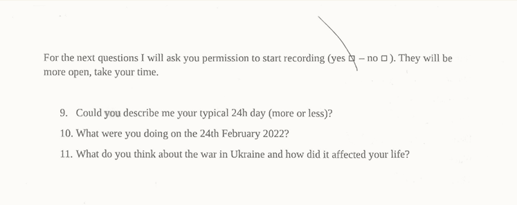

 

The goal of this second part was to prompt those being interviewed, and
future listeners, to reflect on the subjectivity of their memories, even
in broader contexts such as the onset of war. This second phase somewhat
reinforced my initial thesis, namely that the geopolitical proximity of
the groups of Belarusians and Ukrainians, and sometimes Poles, had
indelibly carved February 24, 2022, into their memories. For the expats,
among whom I place myself, this memory was often blurred.

The third and ultimate objective was to establish an archive that would
compile the memories of the Kraków community surrounding me during that
period. The initial presentation of this collected material took place
in June 2023 at a group exhibition held within the Intermedia department
of the ASP Academy of Fine Arts in Kraków. For this inaugural
exhibition, the interviews were printed on forty individual sheets of
paper and suspended from a framework composed of wire mesh and three
wooden beams affixed to the gallery ceiling.

For the second exhibit, I developed a web radio.[^16chapter13_12] The event began at
midnight on February 23, 2024, at the same time as the UKRAiNATV
livestream set up for the second year of the war. The radio program
consisted of a continuous stream of the full edited interviews, lasting
a total of 6 hours and 22 minutes, looped, and randomly replayed for the
next 24 hours. In parallel, the project engaged the public through
interactive programming, allowing visitors to the venue, set up in a
room adjacent to the main studio, to participate by giving an interview
in turn. Participants then had the opportunity to share their stories on
the web radio, thus expanding the diversity of voices represented in the
event.

The installation had two main goals: first, to stimulate reflection
regarding the ongoing conflict in listeners, highlighting the importance
of an empathic connection with the reality of war; second, the project
aims to counter the process of media de-humanization by promoting
empathy through the testimonies collected.

One of the sources of inspiration for this project was the work by
Ukrainian artist Timothy Maxymenko. His project, “Listening portals”
(“Звукові портали”), consists of creating sound portals through
custom-built loudspeakers, then sending them to three different
Ukrainian cities-Kyiv, Kharkiv, and Odessa. Every day, for 24 hours,
with the help of a special mini-computer and microphones located in each
of the boxes, the recorded sound is streamed and broadcast live on the
portals' dedicated website.

I could not help but imagine an ideal analogy with the work of B92 and
pirate radio projects as well, as I thought about the best way to share
the collected interviewees' memories. In general, the project's purpose
was to confront listeners with their position, of privilege or
otherwise, regarding a war that is still ongoing in Ukraine, and that
touches each of us on very different levels. It is also meant to strive
for us to remember, through the testimonies of people unknown to us, but
whose reality we can try to learn about, and slow down that process of
dehumanization that mass media usually produce. Empathy toward another
human being mediates the experiences of war easier to feel unrelated to.
But it’s not. The trends that emerged during the conversations
underscore the variability of perceptions and memories related to
conflict, illustrating the intricate nature of our recollections, even
concerning events we might regard as universal.

 

My personal experience with UKRAiNATV encompasses a set of practices
rooted in artistic resistance, like those described here. This is just
my account, yet similar realities exist everywhere: where performance,
streaming, photography, radio, and writing serve as forms of grassroots
resistance, signaling to the world. Even if the contents made by the
group are uploaded on different platforms, it transcends being merely an
archive. Events unfold live, maintaining at the same time an ongoing
performative element. This blend fosters a new mode of networking, both
online and offline, with a political drive and a dedication to memory
collection. It becomes a media repository, an active archive online, and
an artistic collective offline. This synthesis creates a collective
media where streamart and various forms of expression converge,
embodying a form of resistance and defiance against academic language
and common sense.

Through the analysis of these, all emerge as pivotal figures, whose
task—sometimes rooted in privilege—is to amplify experiences and
testimonies that might otherwise fade into obscurity. In a world often
scarred by conflict and injustice, their mission became constructing
bridges of understanding and solidarity, contributing to a more
inclusive and liberated future for all.

***Giulia Timis** is an Amsterdam-based artist and researcher developing
practices around live-streaming production, tactical video, and hybrid
media performances. Her work focuses on collective media practices,
exploring how networked technologies shape participation and political
visibility, investigating the affective dimensions of digital presence.
She is an affiliate researcher at the Institute of Network Cultures, and
part of the practice-based research project THE VOID. Her work has been
presented at Ars Electronica (Linz), Sónar Festival (Barcelona), and the
Louisiana Museum of Modern Art (Copenhagen), among others.*

[^16chapter13_1]: “UKRAiNATV e la Streamart: Esempi di Artivismo, Giornalismo
    d'inchiesta e Sperimentazione Artistica”, written during my stay in
    Amsterdam for the *Net Art Master* at *Brera Academy of Fine Arts in
    Milan*, Italy.

[^16chapter13_2]: Casey, Ruairi, “At Venice Biennale, Ukrainian artists defy
    Russia’s invasion.” *Al Jazeera*, 22 Apr 2022,
    https://www.aljazeera.com/news/2022/4/22/venice-biennale-ukrainian-artists-russia-invasion.

[^16chapter13_3]: Sullivan, Becky, “The number of Ukrainians who've fled to Poland
    is equal to the population of Warsaw.” *NPR*, 16 March 2022,
    https://www.npr.org/2022/03/16/1086687862/ukraine-refugees-warsaw.

[^16chapter13_4]: Efir, transl. ether, it stands for the medium in which these
    episodes circulate, the air, and symbolizes the lightness that
    characterizes the group. The word ether or efir was borrowed from
    Greek into Old East Slavic.

[^16chapter13_5]: Translation: *UKRAiNATV and the Streamart: Examples of Artivism,
    Investigative Journalism and Experimental Arts.*

[^16chapter13_6]: Michael Rofe, Erik Geelhoed, and Laura Hodsdon. “Experiencing
    Online Orchestra: Communities, Connections and Music-Making through
    Telematic Performance.” *Journal of Music, Technology & Education*,
    vol. 10, no. 2-3, Sept. 2017, pp. 257–275,
    https://doi.org/10.1386/jmte.10.2-3.257\_1.

[^16chapter13_7]: Variant, no. 22, Spring 2005, ISSN 0954-8815. Variant is an
    independent magazine that addresses issues of culture in the
    sociopolitical context of various countries, and a nonprofit
    association funded through subscriptions from magazine subscribers.

[^16chapter13_8]: Collin, Matthew, “Don’t trust anyone, not even us”, pag. 9 of
    *Variant №22*, Spring 2005,
    https://www.variant.org.uk/pdfs/issue22/B92.pdf.

[^16chapter13_9]: Faber, Sebastiaan, “Gerda Taro’s Elusive Afterlives: Helena
    Janeczek’s ‘The Girl with the Leica,’ Translated from Italian by Ann
    Goldstein.” Reading in Translation, 31 Jan. 2022,
    https://readingintranslation.com/2022/01/31/helena-janeczeks-the-girl-with-the-leica/.

[^16chapter13_10]: Ghioni Gloria, “Helena Janeczek, che racconta Gerda Taro: La
    letteratura non deve perdere la sua autonomia.” *illibraio.it*, 6
    Sep, 2017,
    https://www.illibraio.it/news/dautore/intervista-helena-janeczek-gerda-taro-586452/.

[^16chapter13_11]: Sontag, Susan. “Waiting for Godot in Sarajevo.” *Performing Arts
    Journal*, vol. 16, no. 2, 1994, pp. 87–106. JSTOR,
    https://doi.org/10.2307/3245764. Accessed 24 Jan. 2026.

[^16chapter13_12]: Using the provider AirtimePro.

#Silly Girl Theory: Scrolling the Digital Playgrounds

##By Mela Miekus & Mita Medri

***Dictionary:***

***Boy:** anyone or anything that embodies hegemonic heteronormative and
patriarchal ideologies and who loves rationality, logic, and
capitalism.*

***Girl:** anyone or anything that exists in opposition to hegemonic
structures.*

***Boy Tasks:** tasks that are stereotypically seen as better performed
by men than women, e.g. fixing a car but also bizarre tasks related to
male-dominated fields like trading cryptocurrency.*

***Doing Something The Boy Way:** doing something in a rational,
affect-depleted, boring, normie way.*

***To Sillify:** to propose a glitch to the hegemonic modes of doing and
being, to perform actions, tasks, and relations in performatively silly
ways that oppose neoliberal and patriarchal values.*

***Just Girly Things:** this phrase was popularized by the Tumblr page
[justgirlythings.](https://justgirlythings.tumblr.com/) Here, we define
it as things associated with girlhood, especially those that accompanied
our coming-of-age years that were done exclusively by girls and
ridiculed by boys, e.g. collecting silly bands.*

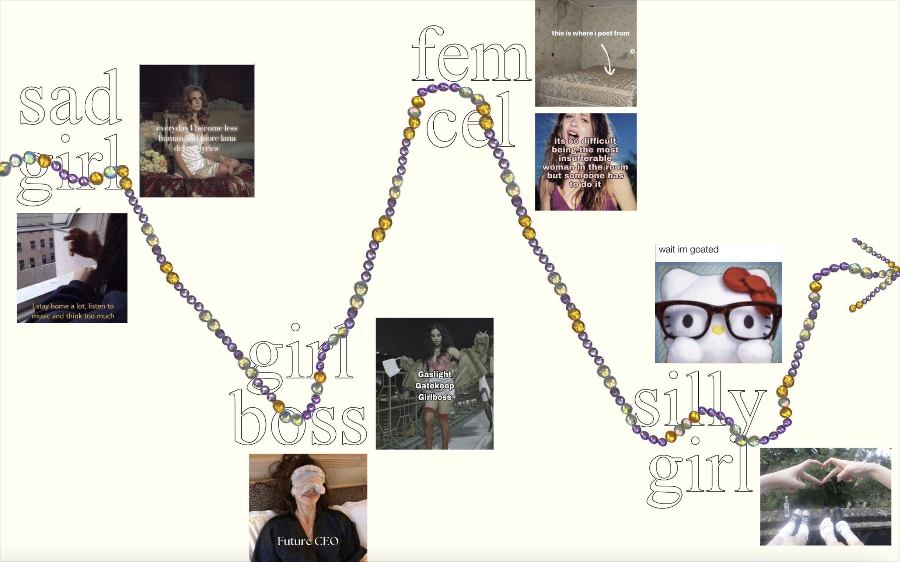

 

## Who is Silly Girl?

2023 was crowned the year of the girl by pretty much every online
magazine there is. The post-Barbie movie cultural landscape was
oversaturated with pinks, bows, and girl trends. Yet, girls turning to
the internet to express themselves is nothing new. Indeed, digital
girlhood has been crafting online personas from the get-go. There was
the Sad Girl who coped with her sadness through means of Tumblr
moodboards or listening to Lana Del Rey. We also saw the rise and fall
of the Girlboss, who stormed the web with her CEO mentality and hustle
culture grindset. Then came the Femcel who was toxic, sexy, and her
online presence was boys’ worst nightmare. What we have been witnessing
this year, besides the inundation of girl trends spreading all over
social media, with TikTok at the forefront, has been the rise of a new
digital girl: the Silly Girl.

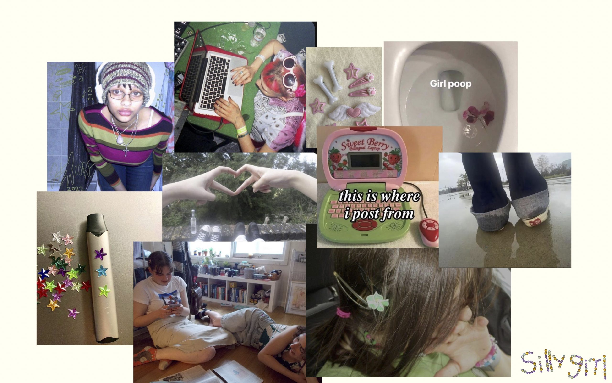

 

Silly Girl takes inspiration from her digital girl predecessors, but she
is unique in her quirkiness. From her bedroom (the girl online kingdom),
Silly Girl indulges in her delusional thinking, doom-scrolling, posting
on her socials, and reading Twilight fanfiction as well as quirky
feminist theory. She bedazzles her vape and hits the googoo zaza bong.
Silly Girl mansplains astrology. She probably has an Instagram meme
account or at least an account dedicated solely to shitposting. Silly
Girl eats girl dinner, does girl math, romanticizes her life, and laughs
at boys who think about the Roman Empire.

 

Her style is eccentric, with mismatched socks, striped sweaters, and her
hair is a never-ending art project. She likes her bows and pinks but she
also wears dirty Converse and baggy t-shirts. Her brother told her his
new groundbreaking philosophical take, but she had this thought when she
was 12. She likes to be chronically online; tweeting, blogging, and
watching Sofia Coppola movies. If she has a job, it's a lazy girl job
and she certainly does not fuck with the hustle or the grind. And she
will lollygag. She is fully capable of living a “proper” adult life, but
she chooses not to. After all, she is just a girl. Even though the Silly
Girl likes to feign innocence, she should not be mistaken for being
incapable or clueless. She certainly is ‘in the know’. She probably
knows more than you do. She’s just plotting and trolling, practising her
tomfoolery.

Think Doja Cat with her unserious online presence like trolling her
fans, trashposting on Insta, or always being unfiltered. She may take it
a step or two too far, but the point is that you can’t, and in fact,
should never, take her seriously. Or think Björk with her unique style
and overall whimsiness. When called on stage to collect a music award
Björk simply said “I am grateful grapefruit” and her husband is a cat,
the only man she can trust.

There is a lot of aesthetic nostalgia from the early to mid-2000s in the
way the Silly Girl visually and digitally expresses herself. Her style,
with pink and blue tights, glitter, stars, and colourful striped things,
makes many references to an indie sleaze aesthetic. Perhaps she engages
in a throwback to the early 2010s because that is roughly when she
experienced her coming of age IRL. She craves to reimagine her girlhood.
She loves Hello Kitty, hair clips, bows, and ribbons, all quintessential
girlhood signifiers. *This is where she posts from and on the internet
she is forever 13.*

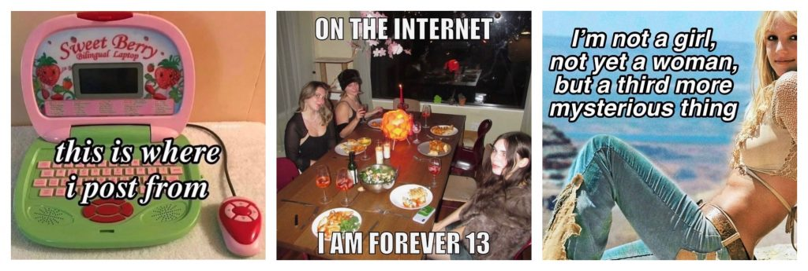

 

She has re-embraced her youth and all of the cute, pink, expressive, and
childlike sense of wonder that this entails. Being a girl is not lame
anymore and her interests can never be “too girly”. She is
unapologetically indulging in an essentialist girlhood, yet, there is a
level of playfulness and performativity here. She brings a goofiness, or
dare we say, a silliness, to the table.

##Theorizing Silliness

Dictionaries define silliness as the quality of lacking good/common
sense; foolishness, absurdity, ridiculousness, or irrationality, or
being playfully lighthearted and amusing. Further, memes about being
silly comprise a broader online category with related catchphrases such
as “Tis a Silly Place” circling over ranging social media. The silliness
practised by the Silly Girl is embedded in these definitions, but she
manages to reframe it a little. She makes it her own.

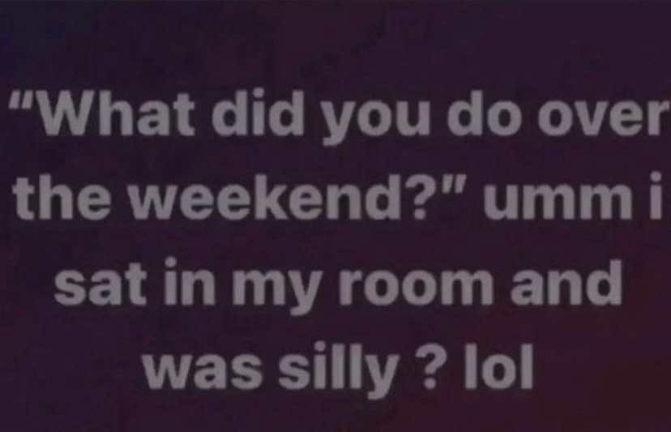

 

In *The Ambiguity of Play*, Brian Sutton-Smith theorizes different
rhetorics of play. He brings forward an analysis of the historical
trickster figure and emphasizes how they “enacted playful protest
against the orders of the ordained world”[^17chapter14_1]. Sutton-Smith brings our
attention to how the trickster occupies a dialectical position within
culture; she is simultaneously “the good and the bad, the sobriety and
the insobriety, the body conventional and the body uncontrollable”. Enid
Welsford, *in The Fool*, writes:

> For the genius of the fool is manifested by his power of deluding us
> into the belief that he can draw the sting of pain; by his power of
> surrounding us with an atmosphere of make-believe, in which nothing is
> serious, nothing is solid, nothing has abiding consequences. Under the
> dissolvent influence of his personality, the iron network of physical,
> social, and moral law, which enmeshes us from the cradle to the grave,
> seems—for the moment—negligible as a web of gossamer.[^17chapter14_2]

In these theorizations, the Fool is shown to transcend structures of
power as long as she is at play. In that sense, this frivolity has “the
power to make players feel that they can transcend reality and indeed
mortality”. The Silly Girl similarly evokes her silliness. Her online
trolling and tomfoolery allow for disengagement of the outside world and
the rules that dominate it. Silly Girl often finds herself in a gloomy
reality, playing the game that many generations of girls played before
her but have never won. She is sick of it. So instead of playing by the
real-life-rulebook, she chooses to disengage and play the fool, and as
long as she’s performing this role she cannot lose.

The Silly Girl thus utilizes silliness as her way of engaging and
disengaging from the world. Her silliness takes the shape of an
“ignorance is bliss” kind of approach and manifests itself through her
unserious attitude that celebrates doing something in an illogical way.
The silly girl, instead of asking for help or mastering the “proper”
way, chooses to come up with her silly little ways that may look bizarre
to *you* (boys) but work perfectly fine for *us* (silly girls). A lot of
these tasks we’re referring to here are *boy tasks* (see dictionary).
Trying to do them the boy way (see dictionary) was Girlboss’s thing, but
she failed and ended up selling her soul to the hustle. Silly girl
refuses these modes of operating.

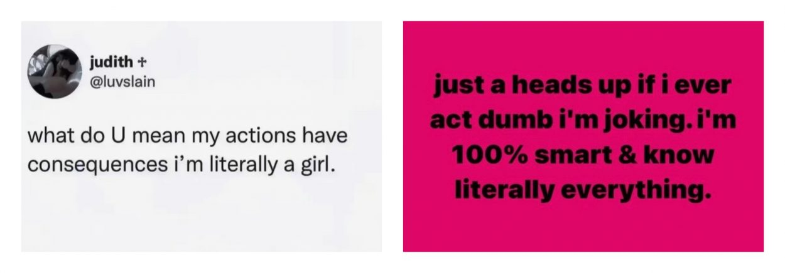

 

The *I'm Just a Girl* slogan stormed the web in 2023. It quickly spread
to mainstream platforms with all types of girls everywhere sharing their
I'm just a girl moments. For example, choosing to fix the hole in their
car by sticking a pink bandaid on it, or memes using the slogan
religiously. The hashtag \#imjustagirl also appears under many
confession-style TikToks where girls share their thoughts or questions
they have about society. It's encapsulated well in Madeline Argy’s viral
video where you can see her crying while stating the question: “What the
fuck do DJs actually do?”. This reflects the mentality well: the silly
girl is sick of pretending to understand the silly little boy tasks.
Instead, through voicing her confusion she exposes their absurdity.
Silly Girl does not understand NFTs and she is proud to say it.

Further, this confusion cannot be read as a passive cluelessness but
rather as a potent mode of disengaging from *boy tasks* and their
hegemony. If she wanted to she could grasp all these concepts but she
prefers to troll them to expose their dumbness. She refuses to use the
master’s tools to dismantle the master’s house. Instead, she disturbs
their smooth and ingrained nature and sillifies them. This mode of
silliness is thereby drawn to be exclusively for girls (see dictionary),
boys (see dictionary) are kindly asked to leave the room.

##I’m Literally Just a Girl

As she memetically expresses herself, the Silly Girl and her silliness
often play on the aesthetic quality of cuteness. In exploring cuteness
in her *book Our Aesthetic Categories: Zany, Cute, Interesting*, Sianne
Ngai describes cute objects as being soft, rounded, blob-like, groggy,
small, and associated with a sense of helplessness and vulnerability.
Ngai additionally notes that such qualities of cuteness are associated
with what is deemed infantile as well as feminine.[^17chapter14_3] The memes where
random objects are girlified through the addition of a pink bow are
quite explicit in this function. In harnessing the cuteness of the girly
symbol of the bow, an image of a coquette chicken nugget channels the
endearing powerlessness of girlhood.

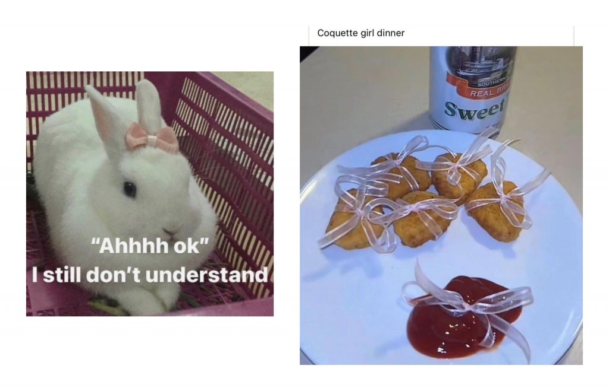

 

While such implications elicit essentialist understandings of what being
a girl is, the use of such cuteness also works to rupture these
assumptions. Ngai explains that “in its exaggerated passivity and
vulnerability, the cute object is as often intended to excite a
consumer’s sadistic desires for mastery and control as much as his or
her desire to cuddle.” Thus, while non-threatening, plushy objects
invite us to want to lovingly engage with them and snuggle or even
vigorously squeeze them, such impulses unveil an underlying belief that
the cute object is inferior and subject to domination. Through this Ngai
is theorizing the technology of cuteness as a subversive category which
functions to expose societal connotations of what cuteness infers. The
Silly Girl uses cuteness precisely in this way. She sprinkles cuteness
with heavy notes of mimicry: she is so cute that it hurts. She is
deploying it to expose the patriarchal sadistic desires that are
transposed onto the things that society deems cute.

Beyond the guise of docility, Silly Girl expresses her cuteness and
girliness in a tongue-in-cheek way. Sure, the Silly Girl can be cute and
she responds to what Ngai theorizes, however, she is not just cute, she
is silly. Her silliness adds the performative aspect where by ‘acting a
fool’ she sillifies these essentialist modes of thinking.

In exploring how the Silly Girl ruptures societal assumptions through
her digital presence, it’s helpful to understand how Legacy Russell
imagines *glitched bodies* in her book *Glitch Feminism*. Glitched
bodies are defined as those that do not align with the dominant
convention of white cisgender heteronormativity. Understanding the
glitch as an error, Russell describes the function of glitched bodies as
a failure that “prompts the violent socio-cultural machine to hiccup,
sigh, shudder, buffer.”[^17chapter14_4] Thus, glitched bodies, in their
nonperformance of normative identity, expose the glitch, the defect, in
the white, heteronormative, patriarchal matrix. The *girl* (read
dictionary definition), as a glitched body, is proof that this system is
flawed and the Silly Girl expresses this glitch visibly through her
exaggerated and silly use of cuteness. Through her sillification of
cuteness, she performs the ridiculousness of patriarchy.

In playing on cute imagery, you’ve probably seen girls pretending to be
cute animals online with captions like “When you hurt me, this is who
you’re hurting” or “This is me if you even care.” As girls express
themselves through images of fluffy bunnies and sleepy, or rather,
“eepy”, kittens, they further draw this connection between femininity
and vulnerability and evoke what Alex Quicho describes as “going prey
mode”. Quicho explains that this radical acceptance of bottom-feeder
status allows for a “tactical passivity” in which girls employ an
acceptance of powerlessness in this patriarchal system to then
comfortably indulge in the bliss of being pretty, helpless, and
harmless.[^17chapter14_5] Silly Girl loves to “go prey mode”, she delights in
reducing herself to a small passive animal. She learned from the
weaponized incompetence of her boyfriends and uses her own tactical
passivity to essentially reap the benefits of patriarchal assumptions of
her weakness and vulnerability. If she's so incapable, if she's so
clueless, then we should really just give her a break already.

 

The Silly Girl loves to play on this dumbness aspect of being cute,
again practising her ignorance is bliss attitude. This is best
encapsulated by the ‘girls getting drafted for war’ TikToks. These
appeared after a Deepfake video of United States President Joe Biden
came out where he was saying that he would reinstate the military draft
and that women would be included. Essentially, the TikTok memes girlify,
as well as sillify (see dictionary), the military experience (see
videos). Being in the army is given a pink, prissy flair and this works
to co-opt these essentialist narratives of women to get out of
hypothetically getting drafted. Silly Girl does not want to go to war.
Silly Girls think war is silly and so, through these memes, they sillify
the whole ordeal in general. War is a boy thing. Boys like the military.
Silly Girls are not down with the military-industrial complex and the
violent regimes of the state.

Furthermore, Silly Girl milks this assumption that she is incompetent,
to lower expectations, and get others to cut her some slack when she
turns a little devious. She’s too cute to understand, so how can she
really be held accountable for her actions? This is a way in which the
Silly Girl revises the Femcel's manipulation. The Femcel’s goal is to
ruin boys’ lives, but the Silly Girl just wants to humiliate and taunt
them a little. The Femcel takes full accountability for her actions and
prides herself in being the anti-hero, while the Silly Girl didn’t mean
to, oopsie. She luxuriates in playing the fool. Sorry if she did
something that will irreversibly mess up your life, but she’s literally
just a girl &lt;3.

Tiqqun theorized the figure of the Young Girl who is the product of a
society that loves pretty young girls with a “morally pink
complexion.”[^17chapter14_6] She is a symptom of a culture that turned adolescence
into a commodity aligned with consumerist demands. The Silly Girl on
some level reflects the infantilized image of a girl in the sense that
she romanticizes her girlhood. But, while the Young Girl “exists only in
proportion to the desire that THEY have for her and knows herself only
by what THEY say she is”, the Silly Girl rebels against internalizing
the external gaze. She is aware that the essentialist ideas she plays
with have a history of violence. Yet her play is strategic. The Silly
Girl ingests patriarchal assumptions and digests them only to exert them
as her own. After all, no one can hurt her by infantilizing or
simplifying who she is, when she already does that herself.

##Silly Girl as Psychic Armor

Earlier internet days provided people the opportunity to be whoever they
wanted online. Today, with tracking IDs, Cookies, and the centralized
platform system, your online privacy and agency look way more gloomy.
Nevertheless, certain online communities manage to maintain that *Teh
Internet is Not Serious Business*. Daniël de Zeeuw and Marc Tuters in
*Teh Internet Is Serious Business* discuss Deep Vernacular Web (DVW)
movements such as 4chan, exposing how their “subcultural practices (...)
are rooted in the cyber-separationist ethos of early web culture, which
imagined the internet as a virtual space of play detached and separate
from “real life”’. They argue that this approach, which favors identity
play, masks, and anonymity over identity authentication and profiles
that reflect our IRL selves, can “provide a counter-hegemonic
space”[^17chapter14_7]. The DVW is more often than not a dangerous vessel for
spreading alt-right ideology, but their online frivolity can teach us a
lesson or two. Indeed, the DVW visualizes that digital spaces can still
allow for a level of playfulness, and this mode of being has potent
political potential.

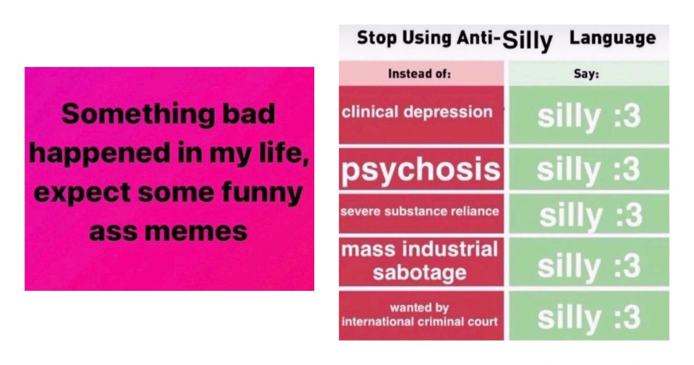

 

Digital girlhood takes the shape of a performance embedded in a similar
logic. For years now, girls have treated the internet as a space for
refusal of the male-dominated values that rule their Away from Keyboard
(AFK) lives. The Sad Girls have radicalized and politicized their
sadness by posting crying pics on Tumblr. The Femcels used social media
to manipulate boys and express their rage. Silly Girls respond to
similar issues through means of trolling and sillifying. The internet
thereby allows for practising a strategic (dis)identification with a
wide array of ways to be a girl online.

*Something horrible in my life happened, expect some funny ass memes* is
a quintessential reflection of Silly Girl’s onlineness. Silly Girl’s web
behaviour becomes her psychic armor. Like the Sad Girl, Girlboss, and
the Femcel, the Silly Girl is troubled. She is sad, she is desperate,
she is angry, she may be mentally ill. But online, these problems don’t
really matter. After all, the internet is just a *support group for
girls who are never normal about anything ever.*

The popular belief that girls mature faster exposes a complex framework
that elicits societal pressure for girls to become women quite fast. It
is much less frowned upon for grown men to still indulge in their
coming-of-age obsessions such as fangirling over a football player, than
it is for women to enjoy typically girly things. Nadira Begum puts this
well:

> Squealing over an actor you fancy is embarrassing, and crying when
> your favourite band breaks up is childish. If a piece of media incites
> strong emotion out of a largely teen girl fanbase, as Twilight did,
> then it is not to be taken seriously. Dismissing anything associated
> with young women is an age-old misogynistic practice with the express
> intent to silence young girls.[^17chapter14_8]

The Silly Girl can thus also act as a mode of reclaiming girlhood and
rebelling against all the sadness we felt when we weren’t allowed to do
just girly things (see dictionary). Beyond that, being a teen girl
entails a level of surveillance that leaves little space for real
innocence and is often accompanied by fast sexualization. This situation
gets especially amplified under an intersection of inequalities. Legacy
Russel recalls her coming-of-age years in the following way; “I was a
young body: Black, female-identifying, femme, queer. There was no
pressure pause, no reprieve; the world around me never let me forget
these identifiers. Yet online I could be whatever I wanted.” We turn to
the internet to disassociate from our troubles. To cosplay a little.

Silly girl at her essence is politically aware, but she chooses to
ignore that and have fun, be ironic, and be “baby”. There is a
tremendous privilege in this chosen ignorance. Not everyone can just
decide to be ignorant if they are tired of engaging with society's
issues. The girlhood experience that the Silly Girl taps into, the one
of ignorance is bliss and a happy carefree childhood, is one that
channels the white middle-class experience. Therefore, Silly Girl’s
digital persona is white, middle-class, and cis-coded. However, this
digital persona can be used as psychic armour and a coping mechanism to
escape AFK realities. The people using Silly Girl as their virtual
avatar don’t need to necessarily relate to this blissful girlhood
experience, they can simply use Silly Girl as their digital roleplay. In
this way, the Silly Girl allows an experience of privilege where she can
decide whether to tap in or tap out of life issues. A digital persona
such as Silly Girl, can therefore become a psychic armour that we put on
whenever needed. Why pay \$200 for a therapist when you have Silly Girl
who is always there and will protect you?

Silly Girl is sad inside, but we cannot equate her emotions with those
of the Sad Girl. While Sad Girl indulges in a hardcore aestheticization
of her sadness, the Silly Girl ridicules her pain. The Sad Girl cries in
public, smokes cigarettes, and politicizes her vulnerability. Sad Girl
rotting entails lying in bed all day wallowing in her self-pity and
heartbreak. On the other hand, Silly Girl rotting entails lying in bed
all day bingeing a series, spending way too much time on the internet,
and being too lazy to get up and make a meal more complex than a few
crackers and an assortment of candy and chunks of cheese. Both certainly
evoke imagery of mental instability but are expressed quite differently.
The Silly Girl clowns her emotions and is not pretty when she cries. She
roams the web avoiding her silly little dark thoughts, sprinkling heavy
satire onto any unfortunate situation. What’s more, her sadness often
turns into delusion.

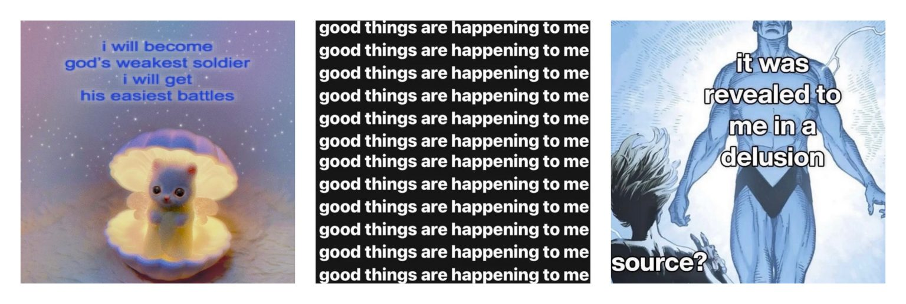

 

Silly Girl is completely Delulu—and she loves it. Being rational is
overrated and lame, she leaves that to the boys. When Silly Girls get
together, they love to validate each other’s delusions and manifest
their realities. I am God’s weakest soldier, I will get his easiest
battles (they all repeat about 50 times in a row). Only good things can
happen to me! Why participate in the rat race for the best job when she
can simply light a candle and hyper-fantasize about getting it in her
dreams? She trusts the universe and refuses to enter neoliberal modes of
being that always blame the individual. Silly Girl blames the system.
Being delusional is then yet another way in which she chooses to troll
her struggles. Ironic detachment comes in handy when you’re busy trying
to avoid a mental breakdown.

##Anti-Boy

According to Christine H. Tran, “to \#girlboss is to pursue neoliberal
values of individual choicehood as the primary vector of women’s
liberation from market misogyny”. Silly Girl learned important lessons
from her digital sister. She refuses to travel down that road again. So
instead of trying to enter the system, she tries to disturb it through
her taunting online persona. In doing so, she confronts neoliberal
values that favour the grind, productivity, rationality, and normcore.
Two strategies are key here: hating on the boys, and sillifying money
and logic.

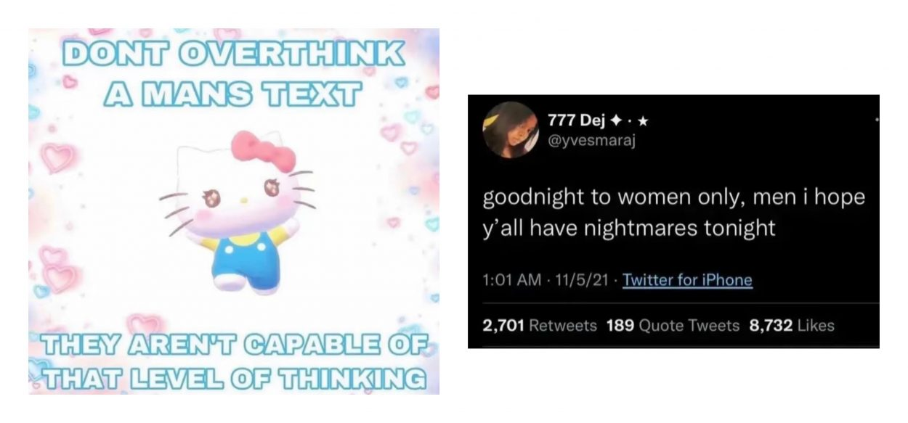

 

In this world boys symbolize anyone or anything that produces, reflects,
or maintains the hegemonic structures based on patriarchy,
neoliberalism, and racism. Silly Girl does not like the boys and exists
in a cybersphere where they are not welcome. *Goodnight to women only,
men I wish y'all have nightmares tonight*, Silly Girl tweets. If it was
up to her, boys would not be allowed on the internet. They already take
up too much space IRL. So as you’d expect from a professional troller,
Silly Girl uses her socials to make fun of them. Think Roman Empire
trend that helped her expose the peculiar nature of the *boy* brain.
Boys think about the Roman Empire a lot because it is a symbol of order,
logic, and masculinity - all the things that Silly Girl hates. Thus by
laughing at the boys, she is laughing at the entire system, and through
that, sillifying it.

Silly Girl provides a counter-space where logic, rationality, and
seriousness are traded in for affect, irony, and quirkiness. The popular
trend *Girl Math* that stormed TikTok resonates here. The videos bring
forward girls sharing their stories about how they view money. For
example, if you pay in cash, then whatever you bought was free. If you
return the \$50 dress you bought, you just get a free \$50. The flight
you’re taking tomorrow is free since you paid for it 3 months ago. While
*Girl Math* can be deemed as nothing more than a shallow joke, we refuse
to ignore its political potency. See, what the Silly Girl is doing here
she is refusing the seriousness of money. She sillifies all things that
neoliberal capitalism holds so dear. We have already seen how Silly Girl
shows that the internet is a goofy business and now she is applying this
framework to money. It is at this point that all the remaining boy
readers clench their fists and run away. No, Silly Girl will not admire
your Doge Coin stocks, or validate your Andrew Tate mentality, nor will
she shorten her naps to boost her daily productivity, go cry about it.
Thus, by hating on the boys, she is hating on notions, of logic,
seriousness, and money and thereby glitching the wider system that rules
our neoliberal reality.

##Trading Silliness

The bodies of young girls become sites of struggle where many different
disciplines compete. And more often than not, money becomes inextricable
from these operations. Tiqqun argues that the Young Girl is a “living
currency,” which can be applied to many digital girl personas too. The
figure of the girl can easily become a commodity. The Girlboss showed us
this process; she essentially made girls mainstream. This had some
positive impact, opening doors that only boys could use but it also
helped turn the girl into a commodity that could be traded. This shows
one of many ways that the commodification of girls can take place and
hints at an equally huge amount of ambiguous relations and power
dynamics it engenders.

What makes this process more complex is that female labour has been
confused with a pastime for centuries. Marx already called our attention
to how domestic labour is undervalued and indicative of unequal wealth
distribution within a household. Further as pointed out by Rachel
O’Dwyer “Girls trade on the ambiguous nature of women’s work - care,
affect, sex – as well as the invisible nature of women’s money – often
coming in the form of gifts, treats, girl dinners, or ‘little
somethings”.[^17chapter14_9] Thus, both the labour as well as the compensation often
float in some uneasy metasphere where hard transfers or cash are not
tangible. It seems that the two most prominent options to respond to
such an environment are either to commodify yourself or to be
commodified. For example, Tiqqun writes that the Young Girl “is the one
who has preferred to become a commodity, rather than passively suffer
its tyranny.” What about the Silly Girl then?

We all know that capitalism loves taking things that start as
subcultural or belonging to specific communities and repackaging them as
a mainstream identity that they can reproduce for large profits. The
girlhood revival started as a space for girls to reclaim the things that
they were made to feel dumb for liking when they were young. It provides
an escape, a space to forget about their adult jobs and struggles and
instead, go back to the simpler days if even just online. Yet, as is
usually the case, brands and marketing campaigns were quick to jump on
this bandwagon. *Barbie* was the highest-grossing film release of 2023,
Shein’s online store is full of tops with bows, and Popeye’s launched
their limited “girl dinner” meal, signalling that the commercialization
process is well on its way.

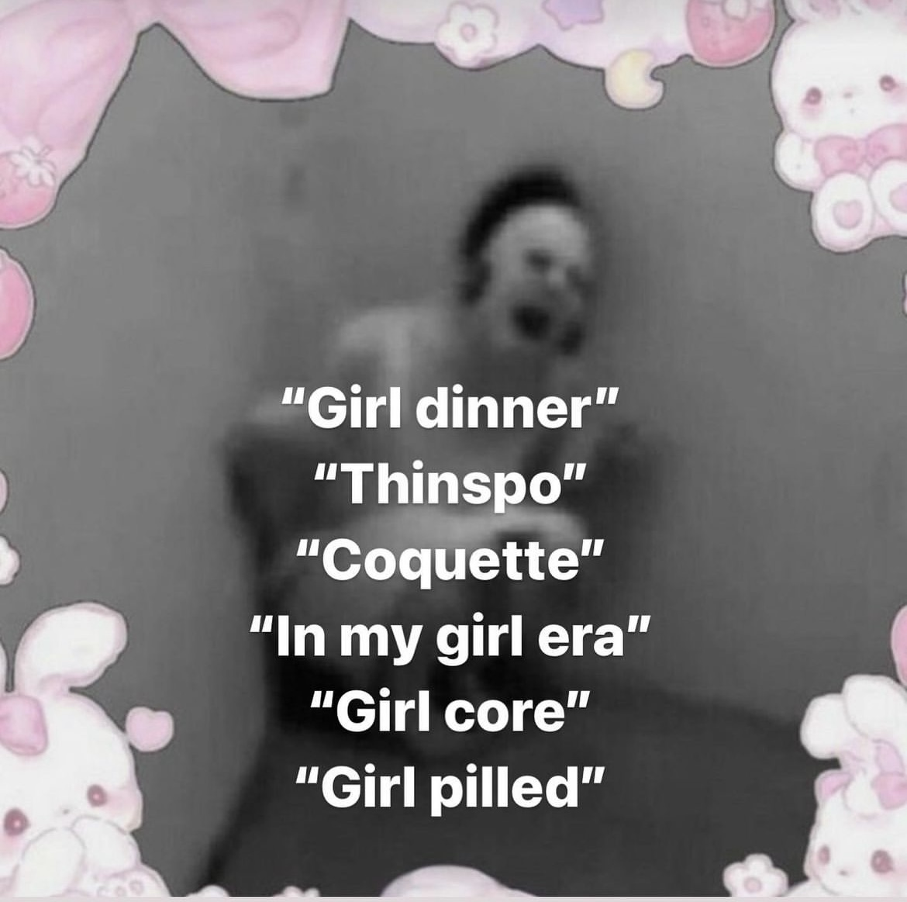

 

Nevertheless, Silly Girl is not just the pink girl who eats girl dinner
and does girl math. Yes, she does plenty of these things too but don’t
forget: she is SILLY. Her silliness adds a level of subversiveness to
her maneuvering through the different girl trends. Is it possible that
her silliness makes her less commodifiable? It is too early to pose a
definitive answer. Still, we believe that the Silly Girl uses her
nihilism and political incorrectness so strategically that she may just
hold the power to escape being reduced to a marketing stunt. Perhaps
what is especially potent about the Silly Girl is that anyone can be her
whenever she is needed. Her performative nature makes her harder to
define. Thus, while it is possible that like many of her online
ancestors, she may just fall into the capitalist clog that will
depoliticize her persona, she may also very well withstand these
processes. The key is to stay moving and never allow the system to
enclose her within a stable identity category that can be reproduced for
profit.

##Is Everyone in on the Joke?

The ironic online presence of the Silly Girl may also pose certain
issues in terms of the reception or impact of her content. Silly Girl’s
humour leans in a post-ironic sentiment in the sense that it creates
confusion about whether the message is sincere or not. As sarcasm
doesn’t always translate through text, not everyone who comes across
Silly Girl will understand how to interpret her. Silly Girl may be in on
the joke, but there is something to be said concerning the potential
risks this sort of content poses when misread by people who are not.
Post-irony, through its ambiguous form, can easily avoid any political
categorization, thus leaving Silly content both open to depoliticization
as well as misinterpretation. While she may be engaging in essentialist
roleplay to ridicule patriarchal assumptions, her performance may be
taken too literally.

 

The liberal audience of pink entrepreneurs has catapulted these girl
trends into mainstream fame without maintaining the dark humour that
underscores Silly content and serves as a safety net from the violence
of gender hegemony. On the other hand, her indifference and at times,
her political incorrectness, might not be seen as a post-ironic and
escapist comedic practice, but instead, might accidentally appeal to the
Tradwives and Top G enthusiast 4chan dwellers of the internet. This is
best exemplified by the “I don’t dream of labor” TikTok trend which was
initially used in memes critiquing capitalism, but was adopted by
TradWives as an affirmation of their traditional gender role. The point
of the cryptic nature of Silly Girl's content is to not assume
everything is serious business and remember that one can never know when
Silly Girl is being for real (maybe never). Potentially, in the cases in
which her content is read literally, it may serve to further reinforce
the structures we claim she is protecting herself from. However, it is
important to intervene in these politically contested spaces and, as put
by Geert Lovink, “reclaim the power of definition in the fight against
right-wing meme hegemony”.[^17chapter14_10]

##Girlhood as Grief

In the end, Silly Girl is a digital reprieve where one can come to bask
in the ironic warmth of a worry-free life. Each of these digital girl
personas has served as a hideout from the violence of the socio-cultural
matrix. We are left to find any sliver of distraction, of respite, that
allows us to be existentially capable of tolerating the crushing reality
of existing under the hegemonic neoliberal chokehold. How can 2023 be
the “year of the girl” with such an alarming rate of femicides? The
underlying struggle and distress of all these digital girls evolve from
the same source, yet they express themselves through different coping
mechanisms.

The concept of grief and grieving has famously been reduced to the
5-stages of denial, anger, bargaining, depression, and acceptance. In
Grief Worlds: A Study of Emotional Experience, Matthew Ratcliffe
explains that while maintaining the notion that grief is a process, this
is by no means to suggest that it is linear or reductive.[^17chapter14_11] Elizabeth
Kübler-Ross and David Kessler, who put forward the 5 stages of grief
model in their book *On Grief and Grieving: Finding the Meaning of Grief
through the Five Stages of Loss*, did not do so to fit grief into a neat
and digestible formula.[^17chapter14_12] Ratcliffe proposes an understanding of
these stages of grief as helpful for a theoretical conceptualization of
the grieving process. This becomes particularly pertinent in
understanding how each of these manifestations of grief interrelate both
temporally and expressively. Grief is deeply embedded in the girlhood
experience—the loss of innocence, of ignorance, of bodily sovereignty.
We grieve the blissful, unattainable, and imagined girlhood experience.
Some clench this fantasy with their fists before it can peel away,
others cannot wait to leave it behind. In either case, girlhood is such
an ephemeral state perhaps because it rarely ever fully belongs to us.

Our digital escape through girl identities is an attempt to reclaim what
has been lost. Through her lonesome tears, the Sad Girl expresses
herself through **depression**. In attempting to assert herself within
the capitalist order, the Girlboss tries **bargaining** for her freedom.
By going for scorched earth strategy the Femcel personifies **anger**.
The Silly Girl, on the other hand, with her performative ignorance and
comedic mask, hides within the comfort of **denial**. While each virtual
girl persona embodies a certain emotive manifestation of the grieving
process, there is no progression in this ‘process’. There is no linear
framework for this grief. It is simply a fact of girlhood.

After being so inconsolably sad, pitifully pleading, and dreadfully
enraged, she’s tired, she just wants to put her feet up and act a little
silly and she deserves a little treat.

***Mela Miekus** is an Amsterdam-based writer and researcher with a
background in art theory and curating. Her research practice centres
around contemporary art and internet cultures with a focus on mediated
figure design, the politics of aesthetics, and online girlhood. She
holds a Master in Curating Art and Cultures from the University of
Amsterdam (2025). She was a curator-in-training at the Stedelijk Museum
Amsterdam (2024-25). In 2025/26, she is a researcher at the Institute of
Network Cultures.*

***Mita Medri** is an Amsterdam-based researcher and writer. Her research explores digital girlhood, conspiracy cultures, and digital occultism, engaging questions of cultural memory, truth, and contemporary myth-making. She holds a Master's degree in Arts and Culture: Design Cultures from Vrije Universiteit Amsterdam (2024). As of 2025, she works in the curatorial team at IMPAKT - Centre for Media Culture.*

[^17chapter14_1]: Brian Sutton-Smith, *The Ambiguity of Play*, (Harvard University
    Press, 2001).

[^17chapter14_2]: Enid Welsford, *The Fool: His Social and Literary History*,
    (Faber, 1968).

[^17chapter14_3]: Sianne Ngai, *Our Aesthetic Categories: Zany, Cute, Interesting*,
    (Harvard University Press, 2015).

[^17chapter14_4]: Legacy Russel, *Glitch Feminisim: A Manifesto*, (Verso, 2020).

[^17chapter14_5]: Alex Quicho, “Prey Mode: Why Girls Are Pretending to Be Cute
    Animals.”, *Dazed*, November 20, 2023,
    https://www.dazeddigital.com/life-culture/article/61336/1/going-prey-mode-girls-cute-animals-online-canthal-tilt-tiktok.

[^17chapter14_6]: Tiqqun, *Theory of the Young-Girl*, (Semiotext(e), 2012).

[^17chapter14_7]: Marc Tuters & Daniël de Zeeuw, “Teh Internet is not Serious
    Business”, *Duke University Press*

    Volume 16, Issue 2, (July 2020),
    https://doi.org/10.1215/17432197-8233406.

[^17chapter14_8]: Nadira Begum, “So the Lion Fell in Love with the Lamb (Again):
    Reclaiming Girlhood via Nostalgia.” *Polyester*, September 25, 2023.
    https://www.polyesterzine.com/features/so-the-lion-fell-in-love-with-the-lamb-againre
    claiming-girlhood-via-nostalgia.

[^17chapter14_9]: Rachel O’Dwyer, “The Girl Is a Living Currency - How Womanhood Has
    Always Been Its Own Economy” *Polyester*, October 10, 2023,
    https://www.polyesterzine.com/features/the-girl-is-a-living-currency-how-womanhood-has-always-been-its-own-economy.

[^17chapter14_10]: Geert Lovink, “Copium Compendium: How Do You Cope in this Digital
    Age of Disaster?”, *Institute of Network Cultures*, January 9, 2024,
    https://networkcultures.org/geert/2024/01/09/copium-compendium-how-do-you-cope-in-this-digital-age-of-disaster/.

[^17chapter14_11]: Matthew Ratcliffe, *Grief Worlds: A Study of Emotional
    Experience*, (MIT Press, 2022).

[^17chapter14_12]: Elisabeth Kubler-Ross & David Kessler, *On Grief & Grieving:
    Finding the Meaning of Grief Through the Five Stages of Loss*,
    (Scribner, 2005).

# Girl Math Fundamentals – Proof by Subversion

## Irma Mastenbroek

### Originally published November 20th, 2025

*“All models are wrong, but some are useful.”[^18chapter15_1] 
George Box - “Models
are stupid and we need more of them.” Paul Smaldino *

Girl Math allowed girlies who just spent a little too much money to
rationalise their purchases by framing them as financially sensible,
even when they weren't, back on the internet in 2023. According to this
logic, a girl earns income when a friend cancels dinner plans or when
she returns a dress to the store. The reverse is also true. If something
is heavily discounted and she decides not to buy it, she'd be sadly
missing out on 'free' money. The girl concludes her argument by teasing
"Girl Math!" and then goes about her day, enjoying her purchase
guilt-free.

Contrary to what the name might suggest, Girl Math is not gender or
age-bound. It’s an inclusive tool, an attitude to life, that anyone can
use to make life more enjoyable. Acknowledging the humour and irony
shaping the argument, one can easily find this indulgent,
consumption-oriented attitude relatable. Girl Math is familiar,
obnoxious, and justifies everything, and therefore, we love it. Beyond
this market’s logical illogical nonsense, Girl Math offers a deeper,
more complex unfolding of a mathematical paradigm that has been
historically oppressed. Indeed, with these emergent practices of logic,
consumers and girlies get an opportunity to reflect on how 'making
sense' and 'rational thinking' can inhabit a deeper sense of intuition
and reasoning. There is something counterintuitive, almost blasphemous,
about Girl Math, as it juxtaposes the hegemony of a system of reasoning
that, for a long time, has controlled the narrative around what is
rationally acceptable.

As both a mathematician and a girl, I’ll admit I didn't know whether to
laugh or cry when I first encountered the Girl Math phenomenon. It
reminded me of a pink kid's T-shirt I once saw in a store that said:
"Too Pretty to Do Math." I wasn't sure which part of me was more
offended: the mathematician or the girl. *Ehm. Excuse me, are you
calling me ugly? Or dumb? Or both?* The tiny pink shirt, staring at me,
reassembled a threat to feminism by supporting the patriarchal
misconception that girls have to be pretty, agreeable, stupid, and, most
of all, bad at math. On surface level, it might look like Girl Math is
doing the same. It goes without saying that the cliche that a girl is
too cute to do math is wrong. This is a patriarchal rhetoric that is so
simple and reductive that it does not need further analysis.

 

The Girl Math trick borrows from that exact patriarchal misconception
that girls are dumb and bad with money and runs with it.  In “Everyone
is a Girl Online” Alex Quicho describes the subversive tactics of the
girl online.[^18chapter15_2] The girl now found a way to apply her tricks on the
language of logical rigidity, transforming it into a shallow consumerist
argument, while simultaneously rendering an alternative way of
thinking.The Girl memes at boys and their unwavering devotion to the
almighty objective truth. It’s no surprise, then, that Girl Math’s most
popular meme format is pissing off boys with her logic

## Girls Always Knew Something About Pure Math

What do I know about this? Well, I am a math girly myself. I didn't get
into this field because I was so disciplined, organised, or
hard-working. In fact, I was quite the opposite. I was a chaotic child.
I would forget about exams, lose my books, and never do my homework. In
most classes, you had to accept the rules of the game: memorising
history dates, conjugating French verbs you will never use, and nod
politely at the idea that GDP is a serious measure of well-being. Quite
the nightmare. I couldn't help but be critical of all these assumptions.
Who decided this? Why that? What if I disagree? Pure math, however,
barely asked me to memorise or accept anything blindly. It did not force
itself upon reality, nor did it punish me for my lack of obedience. Pure
math rewarded stubbornness.

Interestingly enough, there's a common assumption that maths is one of
the most dictatorial disciplines, as it presupposes and imposes strict,
regulated rules and manners. However, to my understanding and practice
of mathematics, pure math is a much more speculative, playful, and
poetic field of reasoning. In pure math, problems are solved not because
we need or want to know the answer for any practical reason. They are
solved just for the fuck of it, because we enjoy the puzzle. Like
solving a difficult Sudoku. Essentially, we do it just for funzies.

The commonly encountered applied math doctrine that is oppressive and
non-negotiable will, from here on, be referred to as Boy Math. It is a
logic that is rarely structurally argued but instead imposed. Formulas
are supposed to come flying from the air and be accepted. Refuse to
comply, and you'll be overruled. The girl makes fun of this kingdom by
opposing their super-duper profound big-boi logic. This is no joke to
boys. They are so serious about logic. They can't help but respond very
emotionally to Girl Math statements. Of course, the girl fully
anticipated their frustrations, but she wasn't triggered. In fact, she
was hoping for this response. After all, boys not getting it is part of
the joke. This is where it started to dawn on me that the girl is not
only funny but also making a valid mathematical point. *The girls who
get it, get it.*

What are girls trying to do here? Pissing boys off by bothering them
with illogical nonsense? Yes. But the girls are making another
observation: keeping emotions and general vibes out of the math equation
is a design choice that could well be undone. With Girl Math, the girls
are telling the world: *we don’t really care about your numbers and
formulas. For us, the vibes matter. Numbers are fake, intuition is
real.*

## What is Pure Math Anyway?

### The Silly Girl Knows a Thing or Two

To dismiss Girl Math as a stupid, transparent, and ‘shallow joke’ would
be a missed opportunity to reflect on its deeper occlusion. In their INC
longform about the Silly Girl, Mela Miekus and Mita Medri analyse the
political potency of specific viral girl trends.[^18chapter15_3] The researchers
imply that the figure of the silly girl “eats girl dinner, does girl
math, romanticises her life, and laughs at boys who think about
the Roman Empire.” The authors argue that Girl Math is much more than an
indulgent, humorous approach to financial decision-making; they see it
as a tool for "hating on the boys." This strategy entails using silly
rationale to devalue notions of logic, seriousness, and money and
thereby glitching the broader system that rules our neoliberal reality.'
What if, indeed, the silly girl has spotted a crack in the boy-thought
prison? What if, in all her delusions, she was right? Is Girl Math
mathing? Let’s embark on this path.

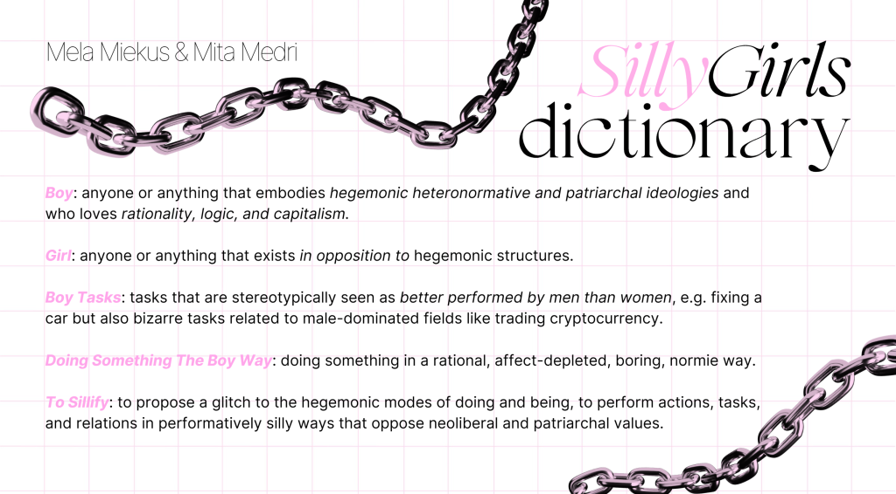

 

Mathematics is often perceived as an unambiguous, objective field,
despite the language of mathematics being frank about
its subjectivity.[^18chapter15_4] Indeed, a mathematical text openly admits a
subjective world-building by explicitly using ‘we’ and ‘us’ to signal
our deliberate foundational choices: ‘let us assume,’ ‘we observe,’ ‘we
infer.’ In this context, ‘we’ means you, the reader, and I, the writer.
In that exercise, we interlock our fingers and enter this thought castle
together. Mathematics is the process of building conceptual thought
palaces, in which we literally choose and design everything, from the
foundations to the wallpaper.[^18chapter15_5] In that world, pure mathematics has
very little to do with accurately describing reality or with making a
truth claim: *it is lore in the making*.

In *Is Math
Real*,
mathematician Eugenia Cheng argues for a similar thought deconstruction
on what we assume math is.[^18chapter15_6] She asks us to start from the very basis
of what we’ve been taught: “Why does 1 + 1 = 2?” One possible answer to
this question is, “It just does!”—a variant of “Because I say so!”, an
answer that has been frustrating children for generations. Both answers
suggest an authority figure who makes the rules, doesn’t have to justify
them, and expects everyone else to follow them blindly. From a young
age, we're taught to treat formulas as if they were immutable laws of
the universe. In high school, we memorize the ABCs, learn the
Pythagorean theorem, and accept the rules of arithmetic, all presented
as facts we must take. By skipping the step of making assumptions
explicit, the system frames consequences as inevitabilities rather than
as outcomes of a constructed world. Students absorb the logic, the
proofs, and the 'laws', often without realising that they are operating
in a universe designed by human choice. Training obedience: follow the
rules, get the correct answer, and trust authority. While this
educational strategy can be justified through the argument of 'basic
knowledge', I would argue, alongside Eugenia Cheng, that "my love of
maths is somewhat driven by my love of breaking rules, or at least
pushing against them."

 

Breaking rules involves deconstructing what's known and assembling new
ideas and ways of mathing. Albert Einstein once famously said, "Pure
mathematics is, in its way, the poetry of logical ideas."[^18chapter15_7] A 'good
mathematical proof' is often praised for its elegance and its beauty. On
the other hand, a proof that would solely be 'technically correct' but
which would lack prose and creativity could be criticised for being too
formal, overly technical, clunky, and therefore ugly. The value of a
proof lies not in its correctness, but in its style, in its ability to
hit a nerve, in the satisfaction of when it *clicks.*

### Pure Math?

How does this translate to Girl Math, then? Where to start? In pure
mathematics, we begin by choosing axioms, definitions, and rules of
inference. We decide what we define as a point, a line, or a set. We
determine what it means to add, to fold, to rotate. Then we explore the
consequences of those choices. The entire edifice is built on our
starting assumptions (axioms), which are arbitrary. If the mathematical
text suggests 'let's assume xyz', and you, for some reason, snap back
with a 'well, how about let's not?', that's totally okay. You only have
to continue reading if you're interested in what happens, or if you're
happy to assume what we just suggested. If not, all good. Axioms are
pure assumptions, meaning that they explicitly do not have to be true;
they might well be false… It doesn't really matter.

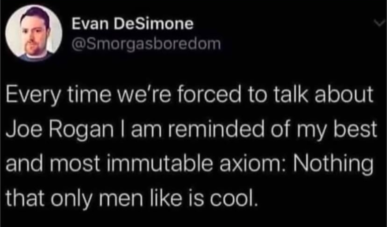

 

So, there's no need to prove assumptions or even justify why they would
make any sense. If you wish to assume some nonsense, such as ‘nothing
that only men like is cool’ or '0=1', math won't stop you. Math will
say, 'You do you, queen. Let's run with that’. Quick enough, you would
discover that assuming 0=1 makes all numbers disappear, and that the
entire number line would collapse into one point. But worry not, you
have not broken math, but instead built the smallest, flattest possible
mathematical world where distinctions vanish, but some structure
remains. Even this degenerate universe counts as mathematics. So then,
how have mathematicians come up with their assumptions and definitions
if they can assume and define anything they'd like? Well, that's the
unfolding of history: mathematicians assumed things that allowed them to
create a world in which the things they wished to be true could be true.

Chances are, my dear reader, it took you by surprise to learn that math
is not objective, nor inherently 'true'. You might even have felt a bit
of resistance to the idea: a knot in your stomach or a nagging feeling
of disbelief. After all, we've been taught to trust numbers, formulas,
and proofs as universal truths. However, math is not static but
constantly mutating, and it doesn't always look "logical" when
perceived. Take the square root of –1. For ages, everyone agreed that it
was impossible by definition: a square is always positive. Negative
times negative is positive; positive times positive is positive. So, of
course, no real number squared could ever give you –1. Trying to take
its square root just seemed stupid. Then, one day, some random dude,
namely Euler, contested and posed, *"Okay, but what if I just call it
'i' and say i×i=−1?”*. At the time, other mathematicians basically
rolled their eyes: *“Dude, that’s not a number.”* He doubled
down: *“Okay, fine, it’s not a real number, shall we call it an
imaginary number?”* To which the math establishment replied: *“For the
love of God, please shut up.” *And yet, once Euler’s “*i”* was admitted
into the math club, previously impossible calculations started
unravelling beautifully. Entire families of polynomial equations that
had no solutions before suddenly opened up. Centuries later, these
"imaginary" numbers revealed themselves to be so useful that, without
them, we would not have the mathematics needed for radios, computers,
and cell phones. They have since been renamed complex numbers, because
how can we justify calling them "imaginary" (explicitly not genuine)
when they are used in real-world problems?

### Holy numbers

So, what about those real numbers —how real are they? Real numbers
consist of all numbers on the number line. That seems, perhaps, quite
unambiguous. However, there was a time when only rational numbers were
allowed. We must go back to the Pythagoreans, a cult-like group of
ancient Greek mathematicians who believed that whole numbers were holy,
divine, and connected to the gods. They also fiercely believed they had
proven that all numbers were rational. Why? Because they thought they
had shown that every point on the number line could be expressed as a
ratio of whole numbers, leaving no gaps. Their reasoning was elegant:
suppose a gap existed between two rational points, a/b and c/d. Then the
midpoint (a/b + c/d)/2 would also be a rational number in the gap. That
means our gap is now cut in half, and we can continue this process
forever until all gaps are filled, contradicting our assumption that a
gap existed. That was until Hippasus of Metapontum (a Pythagorean
himself) discovered that the hypotenuse of a 1 by 1 square, c =
sqrt(2)​, cannot be written as a ratio of integers. In other words,
sqrt(2)​ was suddenly *irrational*. This shattered the Pythagorean
worldview: if not all numbers were rational, then the divine order they
worshipped had cracks. Hippasus of Metapontum's discovery was
controversial. According to Vinay Kathotia in the article "The
Unreasonable Man," the gods, or the Pythagoreans, drowned him at sea, or
hundreds of oxen were sacrificed to appease the deities.[^18chapter15_8] Regardless
of which story is true, this finding “shattered the foundations of the
Pythagorean world, and someone died.”

Is this what happens when one questions the status quo of maths? Is this
doomed violence against the rules what motivates the girl's silly
attitude, covering herself with a mask of naivety and stupidity? Girl
Math makes her point using rather subtle, subversive strategies, because
she intuitively remembers how dangerous it is to oppose big boi logic
inside his doctrine. She is ingrained with the survival instinct of her
ancestors. She remembers how those who strayed from the path of reason
were branded heretics, madmen, witches, and were drowned at sea. She
intuits the cost of appearing irrational in a world that treats logic as
law. So, instead of moving directly in opposition to logic, she makes
logic go sideways. She jokes. She exaggerates. She memes. She says,
"Girl Math kinda makes sense to me, idk why are you so upset, I'm
literally just a dumb and harmless girl.” Arguably, that’s the smartest
thing the girl does: act naive and dumb, because she knows that if she
makes you laugh at her, then you won’t burn her at the stake.

After centuries of mathematicians redefining what counts as a number, a
proof, and even *truth*, we can step back and ask: Is this what the girl
is currently doing? Is she breaking the foundations of mathematics? The
answer is yes and no. Yes, according to the boys clutching their axioms.
No, according to every great mathematician who rewrote old rules to make
new fields of mathematics possible. When a girl explains Girl Math with
examples like "cash is free," "returning something to the store is equal
to making a profit," or "if I book and pay for my holiday now, by the
time it comes around, it's free," she is invoking mathematical power.
Indeed, each of these statements functions as a type of axiom within the
Girl Math system: starting assumptions we accept without proof. She is
also playing with the terms—'profit' now includes returns, 'free' now
includes prepaid holidays—therefore giving new definitions to terms
within her system. From these axioms and definitions, logical
consequences follow: if cash is free, spending doesn't reduce net
wealth; if returns count as profit, every return is a positive
contribution and can be spent on another latte. Mathematically speaking,
she is constructing a conceptual world, a playful version of pure math.
She chooses the rules, explores the outcomes, and creates an internally
consistent system, even if she might later change her mind. Girl Math,
in this sense, is precisely what pure mathematicians do: build worlds,
test their consequences, discover truths relative to the rules they've
set, destroy, build again. 

### A Simple Demonstration

We can actually mathematically prove Girl Math. Let's explore what a
Girl Math proof might look like by proving the following Girl Math
Theorem: Upon returning a dress worth 50 to the tore and swapping it for
a shirt worth 30, we yield a profit of 20.

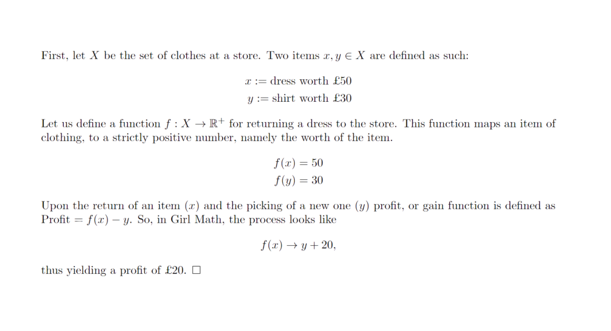

 

Upon finalising a proof, a mathematician concludes their argument with
this tiny square. Alternatively, they use the abbreviation Q.E.D. (quod
erat demonstrantum: that which needed to be demonstrated). Similarly, a
girl concludes her mathematics by giggling, "Girl Math!" And of course,
the boys will despair...

## Boy Math Ideology 

### Boys Just Don't Get It

After Girl Math had her moment, boys were quick to mimic their own
version of mathematics online, because after all, they can't let us have
anything. The first Boy Math meme version on the internet—the one
below—demonstrates how the logic would operate. Of course, it is written
by bois, for bois, and it’s very unfunny.

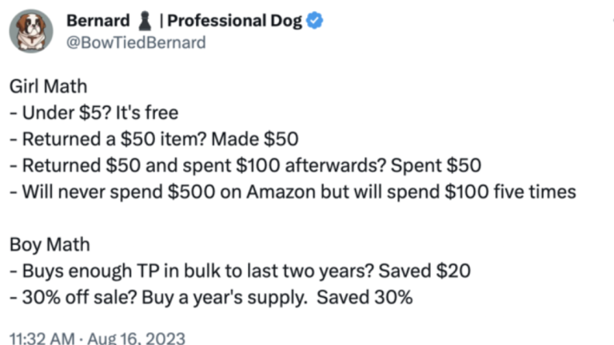

 

The earliest online conceptions of Boy Math were based on deduction and
optimisation, explicitly oriented towards saving money —a plain, factual
way to do math. It lacked the poetry, playfulness, and delusions that
made Girl Math so relatable.

Girls were pretty quick to eclipse this variant. Here's what happened.
Trigger warning: fragile male egos, proceed with caution. This might
hurt.

 

Slowly but surely, *boy math* escaped the world of finance bros and was
co-opted by girls to laugh at the delusional logic boys preach every day
(see the memes above). In a flash, the girls started producing way
funnier content, to the point that their satire even made the boys
laugh. Touche. But what happened here? Did the joke get hijacked for a
gender-war mud-fight? Or did it expose a deeper issue in gendered
rhetorics?

Boy Math, for purposes of this article, refers to a deep tendency to
cling to numeric formulas and a fundamental belief in a global, binary
and unquestionable truth. Often, this doctrine is violent and forces
reality to conform to its abstract models. This paradigm can be
exemplified by this non-exhaustive list of boy behaviours: counting
macros, looksmaxxing, an unshakeable belief in crypto, freaking out over
the dropping birth rate, investing in effective altruism, and demanding
infinite economic growth on a finite planet. On Urban Dictionary, a user
named boymather defines the term similarly:  

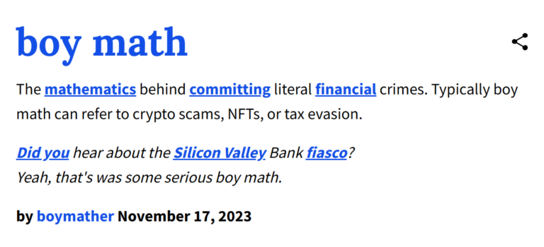

 

Let's now dive into our own characterisation of Boy Math, as we are
relatively uninterested in smashing fragile egos and want to have a
constructive conversation about the heritage of logic.

### Who’s the Boy, and Is He a True Mathematician?

Just as the girl is not a human, not a biological entity, not a gender,
a boy is not either. A boy is an archetype, a distilled pattern of
thought and behaviour, a mathematical logic embodied in a persona. He is
the embodiment of rigid optimisation, crude statements, and binary
thinking. A boy believes there is a "correct" path for everything: the
right investment, the perfect rice-to-chicken ratio, and the optimal
dating strategy. The boy thinks emotions are a distraction and empathy
is a problem. He lives in a world of absolutes, where assumptions are
invisible rules and deviations from the norm are either mere errors to
be corrected or outliers to be ignored. In short, a boy is a system:
predictable, internally consistent, and deeply committed to maximising
outcomes while minimising ambiguity. It is the ruling system of our
apocalyptic neoliberal technocratic world.

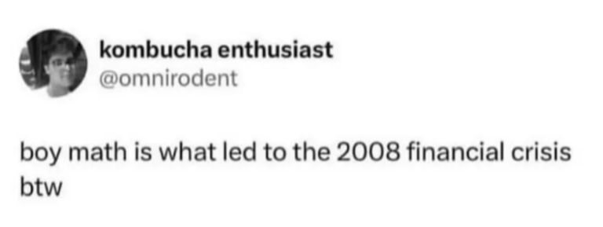

 

The boy uses math with his own agenda and on his own premises, forcing
reality to fit his model. Boy Math is based on false dichotomies and
requires binary outcomes. It commands a formula for everything, designs
a world where efficiency is worshipped, and context barely exists. In
other words, Boy Math is structurally incapable of being silly. It
believes in absolutes, prizes predictability, and treats its axioms as
commandments rather than choices. Unlike pure mathematics, he does not
allow his assumptions to be questioned. He uses proof by intimidation,
oppresses alternative modes of reasoning, and if his arguments don’t
stick, he might just drown someone at sea. But the girl has a weapon
against him. Girl looks at Boy and laughs at him. She pities his cute
little brain that is so busy with its predictable thought patterns that
it can’t bear nuance, contradiction, or relational complexity.

The Cambridge Dictionary of Philosophy states that "an irrational belief
is one that obviously conflicts with what one should know.[^18chapter15_9] This
characterisation of an irrational belief is identical with the
psychiatric characterisation of a delusion." The irrational is not only
wrong—she's literally crazy. Yet the concept of rationality itself is
surprisingly subjective and hard to pin down. The Cambridge Dictionary
of Philosophy initially defines rationality as a purely normative
concept: "if it is rational, we ought to choose it." By definition,
then, a rationalist is always right. However, the text immediately
concedes that this definition is paradoxical: "often, competing actions,
beliefs, or desires count as rational." In other words, rationality is a
universal rule that's different for everyone.

To work around these contradictions, the Dictionary suggests that within
the rationalist doctrine, irrationality provides a more stable basis for
a universal definition of rationality. All accounts can agree that "to
say \[something\] is irrational is to claim that it should always be
avoided." Rationality, it follows, is anything that is not irrational.
It's genuinely poetic that rationality becomes most unambiguous only
when defined by its disowned twin, irrationality.

In light of this definition, we could revisit the story of Hippasus and
the Pythagoreans and ask ourselves whether drowning the guy was a
rational decision (assuming it was the Pythagoreans who did it). For the
Pythagoreans, irrational numbers obviously conflicted with what they
knew. An irrational number was considered a textbook irrational because
it contradicted their "all is number" belief. Other rationalists might
argue that losing a life over a mathematical argument is irrational, as
it is precisely the type of thing we generally ought to avoid. What is
rational remains a normative judgement: it depends. To fully understand
the origins of the rationality doctrine, we should begin by debunking
its foundational myth: the idea that the earliest philosophical thought
originated in Man, specifically in three Greek boys: Socrates, Plato,
and Aristotle.

## Three Greek Boys

### Boy Math Descendants

In Western rational history, the lexicon generally starts with Plato. We
consider him the Boy Math patient zero, although one might question
whether he would have agreed with said doctrine. In Plato’s Theory of
Forms, the philosopher claims that proper form does not exist in the
messy material world but rather in the realm of abstraction. The world
we see is imperfect and contingent, a perceivable reality that Plato saw
as a degraded reflection of a purer, more abstract essence. For example,
there are circular things everywhere: tree trunks, the sun, our veins.
However, the 'perfect' circle is one we can only create in our minds.
This is the core idea of Plato's cave: a philosopher's task is to turn
away from the imperfect shadows and seek the proper Form that casts
them. In many ways, boy math starts here: Plato made a deliberate move
away from organic textures and toward theoretical perfection. The
philosopher believed this type of thinking to be of a higher form than
what was possible in the material world, therefore becoming the daddy of
mind over matter. Trust the idea, not the body. Plato walked so Silicon
Valley could run the simulation.

### Aristotle's Teachings

*“We think we have scientific knowledge of a thing only when we think
that we know the cause on which the fact depends.” - Aristotle in
Posterior Analytics*

Aristotle was Plato's successor, and a worthy, true patient 1 of boy
math, as his philosophy paved the way for Andrew Tate-type reasoning. In
the philosophical history folklore, Aristotle applied Plato’s vision of
the mind over matter to later turn to his own visions of rationality and
ways of describing natural order. In the article presenting Aristotle’s
legacy on the Stanford Encyclopedia of Philosophy, Marc Cohen describes
how, ‘in Aristotle’s logic, the basic ingredients of reasoning are given
in terms of inclusion and exclusion relations, of the sort graphically
captured many years later by the device of Venn diagrams.’[^18chapter15_10]
Aristotle’s philosophy differed from Plato's in that sense that he
stepped out of the theory of abstract forms and claimed order and
hierarchy in the natural world with the following motto: “Better known
by nature.”

Aristotle had argued that reasoning is separate from the truth,
revealing that one can easily prove nonsense on the basis of false
premises. This can be illustrated by a very simple example: “If the
earth is a donut, then the earth must have a hole” is deductively true
given that the first premise is required. According to Aristotle’s own
words in Posterior Analytics: ‘simply saying that something is the case
if it is the case, by which device, it is easy to prove
anything’.[^18chapter15_11] Aristotle posed that true premises would always lead to
true conclusions. But how would we know which premises are true? The
philosopher insisted that the necessity of finding true premises must
lie in “the nature of things.” But seeking truth in the natural world
required categorization and hierarchical dichotomies. In his worldview,
those natural premises included: the notion that there are fundamental
differences between the sexes and that men were of a higher hierarchy,
as well as a natural and undeniable fundamental difference between
master and slave. Out of the many ways we could have chosen to dictate
categories, he designed the following:[^18chapter15_12]

> “The male, unless constituted in some respect contrary to nature, is
> by nature more expert at leading than the female, and the elder and
> complete than the younger and incomplete.” 
>
> “The relation of male to female is by nature a relation of superior to
> inferior and ruler to ruled.” 
>
> “The slave is wholly lacking the deliberative element; the female has
> it, but it lacks authority; the child has it, but it is incomplete.” 

As the citations show, the philosopher believed that women, like slaves,
lacked the capacity to fully understand logic and partake in philosophy.
In the blog post 10 controversial things Aristotle said about
women, Shawn Buckles reveals the misogynistic premises on which this
theory was built:[^18chapter15_13]

> "When you consider Aristotle’s take on psychology, he saw women as
> less capable of rational thought compared to men. He felt that women
> were more excitable and governed by their emotions, which undermined
> their ability to reason as effectively as men.”

In that matter, we can conclude that Aristotle was definitely a
boy:[^18chapter15_14] his views on natural order read as the earliest red pill white
male supremacy content. Thank the gods there is Girl Math. All this to
say that, when the girls online called their silly economic
philosophy *Girl Math*, I think they had a point. 

## Formalising Girl Math

### Astrology: A Possible Lineage of Girl Math?

We are arriving at our final destination: an emergent mathematical
formulation of Girl Math Fundamentals—which, by the way, I invented
myself. What if we start mathematically formalizing historically
marginalized communal systems of thought? Before we dive in the math,
let's have a quick look at a concrete manifestation of Girl Math. A cute
point of departure for this journey through reason is (of course)
astrology. A few years ago, the joke that crypto trading is really just
astrology for boys went viral. The analogy obviously pissed them off, as
illustrated in the below Reddit rant:

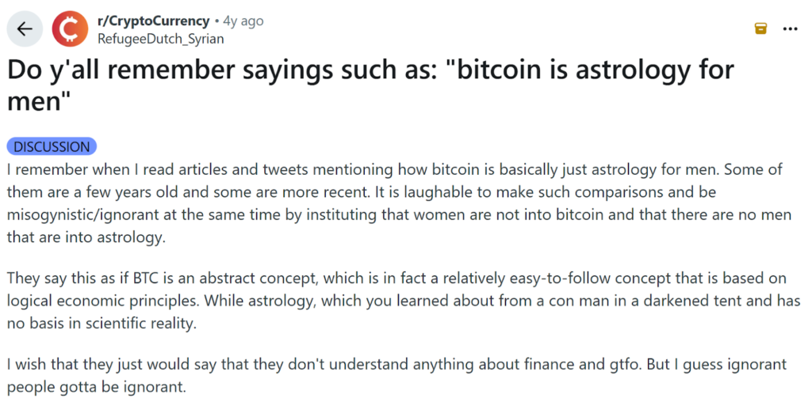

 

A boy sees astrology as nothing but extremely inaccurate statistical
predictions used to scam people by giving them a false sense of hope. To
crypto boys, there’s nothing worse than being compared to something as
‘stupid as astrology’, a practice that is often dismissed as
‘unscientific’. Indeed, the idea that celestial patterns correspond to
human behaviour isn’t empirically verifiable. However, these critics
conveniently forget that all logical systems are based on unverifiable
assumptions. Within its own framework, astrology is a closed logical
system: it operates through clearly defined entities (planets, signs,
houses, aspects) and consistent transformation rules (transits,
retrogrades). The reasoning inside this system is valid: the logic
holds, even if the system’s axioms aren’t ‘true’ in the physicalist
sense. Mathematically speaking, that’s allowed. Formal systems don’t
need to be *true* to be *coherent*. Geometry still works on a flat
plane, even though we know space is curved. Classical logic still works,
even if the universe is quantum. What matters in math is internal
consistency: that the operations preserve structure relative to their
own assumptions. Referring to the famous quote often attributed to
George Box, in applied mathematics, it is “all models are wrong, but
some are useful”. If we know that we’re all wrong all the time, then why
discriminate between economics and astrology?

When an astrologist says, “Venus in Aries means desire moves fast and
impulsively,” it’s a valid deduction from a symbolic grammar where Venus
= attraction, Aries = action, and their combination = passionate
pursuit. Whether or not Venus actually influences anyone is irrelevant
to the logic of the statement. In short, astrology *maths*: it's a
rigorous interpretive calculus of symbolic correspondences. If astrology
is a closed logical system, a set of rules, and inference moves, then
nothing in principle stops us from formalising it the way mathematicians
formalise any other theory. Pick your primitives (planets, signs,
houses), write down the axioms (what each symbol means), make your
transformation rules (combinations of symbolic meanings), and then
derive consequences for the next Mercury retrograde. It would be an
amusing exercise to mathematically prove astrology: to write down the
whole doctrine in a set of axioms, some inference rules, some
definitions, and a bunch of mathematical formulas, and publish it with
the claim that Astrology is mathematically rigorous. Suddenly,
scientists would pull their hair, bite their nails, see their paradigm
collapse, screaming, “BUT YOUR ASSUMPTIONS ARE WRONG!!!” And then the
girlies would giggle, “All models are wrong, but some are pretty and
useful.”

To take Girl Math seriously is to consider that just because it's math
doesn't mean it has to be true. By speaking in the dialect of formalism,
we expose the political studs that prop up what counts as "rational."
Essentially, a formal Girl Math argument uses proof by subversion,
deliberately provoking the boys to dismantle the logical house they
built themselves. Let's leave the classic "cash is free" Girl Math
examples behind and go up a few levels of abstraction. In essence, what
point are the girls making? What is their larger philosophy about? In
Girl Math, something is true because it feels true, because we are
resonating with the statement, because we need it to feel good, or
because it's funny. In Girl Math, the truth is vibe-based: an "it
depends"-type of truth, built by noticing patterns between things and
contextualising how we feel about them, rather than an external
authority declaring what's fact. Girl Math is essentially 'omg,
same!'-math. It is at this point that Category Theory becomes
interesting. This relatively new field of abstract mathematics, first
formalised in the 1940s by Eilenberg and Mac Lane, was called
"generalised abstract nonsense," which sounds like a perfect basis for
formal Girl Math.[^18chapter15_15] What was so novel about Category Theory?

### Category Theory as a Secret Ingredient for Girl Math

Imagine traditional mathematics, from now on called trad math, as a big
tree. The roots and trunk are the foundational axioms, and the different
branches of the tree symbolise the branches of mathematics: algebra,
number theory, set theory, Galois theory, etc.. Now, before Category
Theory was invented, mathematicians would be solving a math problem
somewhere on a leaf in this tree, and then realise that they recognised
the problem to be structurally similar to one they had encountered all
the way on the other side of the tree. They then have to formally climb
this tree and tediously figure out how to reach the top, while
occasionally taking wrong turns, getting lost, and climbing back onto
the right path. Once their destination was reached, the mathematicians
would solve the problem of that particular leaf and then take it with
them to climb all the way back to where they started. This results in
lengthy, tedious proofs that can span hundreds of pages or a whole stack
of books. That was until Category Theory. If you already know that your
current problem is similar to the other problem, why don't you just jump
from one leaf to the other? If we know that the tree is meaningfully
connected, why show off all the acrobatics required to get from one
place to the other? Just fly there. Category Theory poses: if you can
show that your problem can be translated into another problem, you are
allowed to jump there, take their solution, and translate it back to
your problem, as though they defined the air surrounding the tree.
Needless to say, the type of mathematicians who spent thirty years of
their life on mathematical acrobatics inside the math tree were quite
pissed that these pseudo-mathematicians suggested they could have simply
flown there. Despite the initial backlash, Category Theory's "abstract
nonsense" has stood the test of time and is now widely used within and
beyond formal mathematics.

Category Theory resembles “*omg, same*”-math, as all we need is some
reasonable equivalence between worlds. Two systems don’t need
to *be* identical; they need to be *the same-ish*. It is fine for things
to behave alike even if they don't look alike at all. Once you start
thinking that way, you realise this style of thinking isn't at all
limited to abstract mathematics. The old mathematicians (*trad mathers*)
stayed stuck climbing the same tree, but Category Theory gave
mathematicians abstract portals. The "objects" don't have to be numbers
or shapes anymore. They could be meanings, moods, memes. If they
consistently relate to each other, they can live in a mathematical
category.

### But what exactly is a category? A category C consists of:

1.  **Objects: **A collection of entities, usually denoted A,B,C,…

2.  **Morphisms (arrows between objects):** A morphism represents a
    relationship or transformation between two objects. For objects A
    and B, a morphism f is f: A→B

3.  **Composition: **If one morphism connects A to B, and another
    morphism connects B to C, then A must connect to C.

4.  **Identity morphisms:** Every object has a “do nothing” morphism
    that maps the object to itself.

In Girl Math terms, a category C consists of :

1.  **Objects:** *things* girls care about

2.  **Morphisms: **the *vibes* between things

3.  **Composition: **If there’s a vibe between A and B, and there’s a
    vibe between B and C, then there’s also a vibe between A and C
    (namely, through B).

4.  **Identity morphism:** an object, say a girl, can ponder “*but what
    if I’m right?*” in which case her situation stays the same.

The fundamental difference between Category Theory and *trad math*, is
that the focus is not so much on the things themselves, but rather how
they interact. It means we do not have to spend as much time on defining
the object, but the object gets defined by its relevant connections.
This is extremely powerful for complex systems, such as (and there she
is again): astrology! Astrology apps like Co-star are often coded in
Haskell, which is a programming language based on… (drum roll)...
Category Theory.[^18chapter15_16] Trying to encode astrology in *trad math *would be
like trying to fit a cloud into a box. *Trad math* relies on fixed
objects and rigid rules: numbers have exact values, operations are
deterministic, and proofs are step-by-step. Astrology isn’t
deterministic in *that* way. If you tried to describe astrology in trad
math, you'd have to assign exact definitions to inherently fuzzy
concepts, such as "love potential = 7.3" or "career vibe = 5", and
define rules for combining them. But these rules will collapse under the
complexity of all possible interactions, or they'd reduce astrology to a
rigid doctrine, which it isn't. We would be losing the relational
richness and interpretable freedom that make astrology so meaningful.

Category Theory solves this issue of mathematical rigidity because it
doesn't care so much about the details of the objects themselves.
Instead, it focuses only on morphisms: how things relate and interact. A
planet's meaning might not be a fixed definition; it's instead a
relationship between objects (planet, house, sign, person) that can be
contextualised. Say two astrologers disagree on what Mars means. One
sees Mars as aggression; the other sees it as desire. In a
category-theoretic model, you don't need to rebuild the entire cosmos
just because Mars got rebranded. Instead, you simply open up the "Mars"
box, tweak its internal mappings, and the overall structure of
correspondences still holds. This adaptability is why CoStar uses a
category theory-based programming language like Haskell. They earn their
money by giving hyper-personalised predictions, which require
continuously changing the astrological model they use for your daily
horoscope. These predictions are based in part on their astrological
model combined with your birth chart, and in part on optimisations of
your personal preferences to lure you back to their app every day.

Once you've gone through all this, it becomes hard *not* to see how
crypto and astrology are secretly cousins. Both claim to
formalise *vibes* into *systems*. Both use symbolic logic to track
invisible forces (be it planetary or economic) that supposedly shape the
future. Both attract followers who speak a specialised dialect ("moon in
Aries," "bull market") and believe that, with the correct chart or
chain, you can predict the future. The observed structural similarity
between the two fields lies at the heart of the 'crypto is astrology for
boys' joke, which can be mathematically formalised and possibly even
proven using category theory.

If we consider Astro and Crypto as categories, the girls online claim
they are categorically equivalent. To support this claim, two categories
could be defined and shown to share a common structure. For instance,
in **Astro**, the *objects* could be planets, signs, houses;
the *morphisms* could be aspects and transits. In **Crypto**,
the *objects* are entities like tokens, wallets, and exchanges;
the *morphisms* transactions, swaps, and correlations. Between the two
categories, certain concepts share a similar vibe, and we could describe
this similarity by defining a *functor*: a mapping between categories.

Let us define a functor F:

Astro → Crypto

Planets ↦ Tokens 

Transits ↦ Price movements 

Retrogrades ↦ Bear markets 

Conjunctions ↦ Mergers

A retrograde in astrology is the moment a planet appears to move
backward, which symbolises a time for re-evaluation. Similarly, a bear
market is a moment of collective doubt in crypto, a loss of momentum. To
show that F: Astro → Crypto are categorically equivalent, we need to
shape both the Astro and Crypto categories in such a way that we can
draw a vibe-arrow between each of the objects and morphisms. The beauty
is that we do not need similarity or exact same-ness; we instead need
a *kind of same-ish* vibe.

In this formulation, the *pattern girlies* don't actually need to become
data scientists or cite existing research to be mathematically rigorous
in their theories. They can simply formalise their intuitions and write
down made-up theories. Describing these formulas in dry, abstract,
mathematical language casts the girl as brilliant and correct. In doing
so, she mirrors the "proof by authority" that *Boy Math* has long
monopolised. Contrary to her evil twin, Girl Math is quite aware of the
ambiguity of it all, but alas, she can live with multiple realities.
Where Boy Math seeks certainty, Girl Math alchemises vibes and
contradictions.

### Girl Math is Pure Vibes

So far, we've laid the foundation for a rhetoric we call Metaphorical
Proof. Such proof doesn't demand that two things be identical; it's
enough to show they behave similarly enough for a pattern to hold. This
'Omg, same!' feeling is formalised as a mathematical isomorphism, which
sounds legit. When a girl claims that 'buying something on sale is
basically saving money', she is performing a Metaphorical Proof through
vibe preservation. The math works not because it's true in a universal
sense, but because it* feels* internally consistent to her lived
reality. Girls online recognise themselves in it, and that resonance
constitutes its proof. The swarm relatability renders the theory true.
(*Statistics, hello?*)

This leads us to one of the most beautiful and radical features of
Category Theory: the *Truth Object.* In *trad math*, truth is a global
constant: either true or false, a binary light switch that applies
everywhere in the system. On the contrary, Category Theory allows us
to *redefine what truth means* in different contexts; each category can
have its own internal logic. In the category of quantum physics, for
example, truth becomes probabilistic, an 'it depends'-type truth: a
superposition of possibilities. Formal Girl Math goes one step further:
its truth object is not binary or probabilistic, but subjectively
resonant. In her world, something is true if it vibrates between
girlies, if it holds aesthetic, emotional, or social coherence. Girl
Math's truth object could be defined as: the degree of vibration between
a statement and a subject. Truth as such is not imposed from above; it’s
felt from within. Every mathematician secretly intuits that truth is a
feeling: a proof isn’t proven until it makes sense to you.

This paradigm shift from binaries to vibes also echoes Donna Haraway’s
refusal of the true/false dichotomy. In her *Cyborg Manifesto*, she
suggests that purity itself is the problem, that concepts such as
natural/artificial, male/female, good/bad were never opposites but
co-dependent fabrications. From a Girl Math perspective, a statement and
its contradiction can coexist as equally valid morphisms in the same
category. "Men oppress women" and "women exploit men" can both be true,
depending on which morphism you're following—which node of power you
inhabit. Girl Math merely makes explicit what math has always been: a
poetics of abstract forms. We reimagine rigour. Instead of an objective,
global truth, we propose a vibrational truth. Instead of proving by
contradiction, we prove by recognitions delivered as ironic jokes. In
the Cyborg Manifesto, Donna Haraway describes irony as follows:[^18chapter15_17]

>  “Irony is about contradictions that do not resolve into larger
> wholes, even dialectically, about the tension of holding incompatible
> things together because both or all are necessary and true. Irony is
> about humour and serious play. It is also a rhetorical strategy and a
> political method, one I would like to see more honoured within
> socialist-feminism.”

Long live the queen. Since we agree with Haraway’s perspective on the
fundamental reality of truth, we craft Girl Math Fundamentals in a way
that will hold contradictions. For instance, if we claim 'boys are
dumb', we implicitly acknowledge possible situations in which boys are
smart. If we declare 'cash is free,' we also concede the financial
reality that sometimes cash is valuable. This embedded contradiction
space preserves the freedom of pattern expression, the poetry and play
that underpin Critical Girl Theory. As we construct the formal Girl Math
universe, we choose to embed a fundamental truth duality: *everything I
just said, but reversed, is always also true. *This way, no matter what
she says, a girl is per definition always right. 

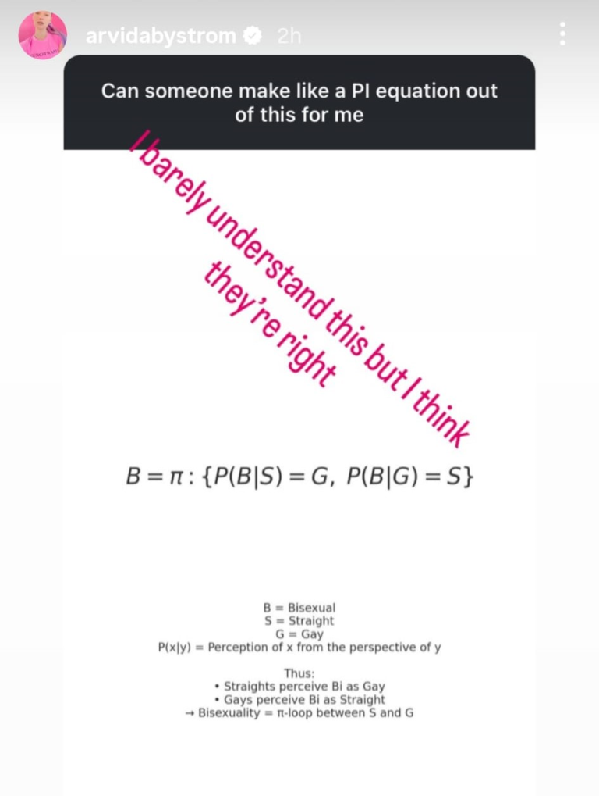

 

## Girl Math Manifesto

*It's true for me but you do you*

*If it resonates, it is right.*

*No need for research.*

*No data science or evidence.*

*Authority is a performance.*

*The language of mathematical certainty,*

*mirrors and mocks Boy Math.*

*Math symbols make a girl sound smart and right.*

*Girls know truth is paradoxical*

*Contradictions are necessary and true.*

*And if vibes are everything,*

*Girls are never wrong.*

*Oh my god, same!*

*The girls who get it, get it.*

*Q.E.D*

*Quintisentially Emotionally Demonstrated.*

***Irma Mastenbroek*** *is a Berlin-based digital rights activist and
technofeminist. With a background in mathematics, she specializes in
network science, optimization, and artificial intelligence (AI). Irma
founded LODelle, a platform for digital feminist networks, and is an
active participant in the Digital Intimacy Coalition. This collaborative
initiative aims to hold major online pornography platforms accountable,
promoting a rebuilt industry focused on mutual consent and sexual
empowerment.Professionally, Irma researches AI bias and works on issues
related to AI auditing and non-discrimination law. She co-organized an
AI art exhibition, curated for re:publica, and has spoken at both CCC
and re:publica events. Currently, she is developing a new mathematical
field designed to formalize historically marginalized areas of
reasoning.*

[^18chapter15_1]: George E Box. P. “Science and Statistics.” *Journal of the
    American Statistical Association* 71, no. 356 (December 1976):
    791–799.

[^18chapter15_2]: Alex Quicho. “Everyone Is a Girl Online.” *Wired*. Accessed
    01/10/2025. https://www.wired.com/story/girls-online-culture/.

[^18chapter15_3]: Mela Miekus and Mita Medri. “Silly Girl Theory, Scrolling the
    Digital Playgrounds.” Institute of Network Cultures, February 16,
    2024.
    https://networkcultures.org/longform/2024/02/16/silly-girl-theory-scrolling-the-digital-playgrounds/.

[^18chapter15_4]: Edward Rothstein. “The Subjective Underbelly of Hardheaded Math.”
    *The New York Times*, December 20, 1997.
    <https://www.nytimes.com/1997/12/20/books/the-subjective-underbelly-of-hardheaded-math.html>

[^18chapter15_5]: Philip J. Davis and Reuben Hersh. *The Mathematical Experience*.
    Boston: Birkhäuser, 1982.

[^18chapter15_6]: Eugenia Cheng. *Is Math(s) Real?.* London: Profile Books, 2023.
    (Pages cited: 12–14.) https://profilebooks.com/work/is-maths-real/.

[^18chapter15_7]: Albert Einstein. “Obituary for Emmy Noether.” *The New York
    Times,* May 5, 1935.

[^18chapter15_8]: Vinay Kathotia. “The Unreasonable Man.” Cambridge Maths. Accessed
    15/10/2025.
    https://www.cambridgemaths.org/errors/404.aspx?aspxerrorpath=/blogs/unreasonable-man/.

[^18chapter15_9]: Cambridge Dictionary of Philosophy. 3rd ed. Cambridge University
    Press, 2015.

[^18chapter15_10]: Marc Cohen. “Aristotle.” *Stanford Encyclopedia of Philosophy.*
    Accessed 28/10/2025. https://plato.stanford.edu/entries/aristotle/.

[^18chapter15_11]: Aristotle, *Posterior Analytics.* Translated by Jonathan Barnes.
    Clarendon Press, 1994.

[^18chapter15_12]: Aristotle. *Politics*. Translated by H. Rackham. Loeb Classical
    Library. Cambridge, MA: Harvard University Press, 1932.

[^18chapter15_13]: Shawn Buckles. “10 Controversial Things Aristotle Said About
    Women.” *Wisdom Short*. Accessed 20/10/2025.
    https://wisdomshort.com/philosophers/aristotle/on-women.

[^18chapter15_14]: Mela Miekus and Mita Medri. “Silly Girl Theory, Scrolling the
    Digital Playgrounds.” Institute of Network Cultures, February 16,
    2024.
    https://networkcultures.org/longform/2024/02/16/silly-girl-theory-scrolling-the-digital-playgrounds/.

[^18chapter15_15]: Samuel Eilenberg and Saunders Mac Lane. “General Theory of
    Natural Equivalences.” *Transactions of the American Mathematical
    Society 58*, no. 2 (1945): 231–294.

[^18chapter15_16]: Co–Star Astrology. “Why Haskell.” Accessed 20/10/2025.
    https://www.costarastrology.com/why-haskell.

[^18chapter15_17]: Donna Haraway. “A Cyborg Manifesto.” In *Simians, Cyborgs, and
    Women: The Reinvention of Nature.* New York: Routledge, 1991. (Page
    cited: 3.)

# Becoming and Unbecoming – Eastern European Girlhood Online

## Salome Berdzenishvili

### Originally published April 23rd, 2025

I want to trace the shift of girlhood in Eastern Europe, of girls who
were born in politically and culturally turbulent post-soviet 90s and
early 2000s, the turbulency that later on found itself locked and frozen
in the memes, cloaked in soft-edged irony on Tumblr, Instagram, and
TikTok.

But before entering this particular *Girlcore*, I want to start with the
algorithmic detours.

 

I type \#soviet, \#postsoviet, \#easterneurope, \#easternbloc in the
search engine on Instagram, whilst the platform takes me to a temporal
limbo of brutalist and socialist-modernist architecture, prevailing in
Eastern European countries. The more I scroll, the more this visual
field is dominated by dimly lit Eastern European Khruschyovka apartment
blocks, where the moodboard centers around the shades of grey, faded
blue, and dark brown, lullied by Molchat Doma’s (literally) any track.

Or I find myself in front of dystopian-looking bus stop in the middle of
nowhere flirting with Tarkowskian cinematography, the caption luring me
into buying a paper edition of *Soviet Bus Stops Vol. 1, Vol. 2*, and
another collection titled *Soviet Metro Stations*.

I am pretty sure I don’t need it. In fact, I’ve had enough. Although the
fun part for potential customers is the caption promising them edition
box sets, prints, and LP soundtrack, except for some reason, the deal
does not specify what kind of soundtrack is actually included. I wonder
which sound would go well with Soviet Metro stations and bus stops, and
continue scrolling, next stop being an educational Instagram page
curating ANYthing Soviet, ranging from communist posters to Russian
prima ballerina’s Irina Kolpakova’s performance in Leningrad, in 1972,
from Soviet color TV sets to a random photograph of a person standing
next to a LADA in Kaliningrad, 1982. It’s all arbitrary. The page is
trying to sell communist-coded T-shirts for 30 euros each, with the USSR
logo printed on them.

 

I am stuck on the platform. And the platform is always in flux,
continuously redifining lived experiences as residues from the past. I
am drawn to *ugly, dysfunctional and hysterical,* and I want to see my
stance as a point of departure.

The Soviet past is ugly because of how I think of the 90s, full of
poverty, gruesomeness and the intensified instinct of survival. Whether
through revolutions or wars in some post-soviet countries, or through
standing in the endless queues for bread, or celebrating rare moments
when electricity and gas would return, the ugliness lies in what we were
left with after the system fed off itself, and when it was no longer
forever.

It is dysfunctional because of its very infrastructure: multi-storey
apartment blocks and the coin-operated elevators built in Soviet times
are spaces that are now crumbling, and this infrastructural breakdown is
dysfunctional and fragile. There is a Soviet

Georgian film shot in 1984, *Blue Mountains*, *or* *an Unbelievable
Story*, which follows a young author battling with Soviet bureaucracy
trying to publish his novel, just to find himself neglected every time
he goes to the publishing house. One of the key scenes of the film
centers around an elevator that often needs to be fixed, people get
trapped inside, that then forces them to wait for a technician to come,
and the wait becomes a story.

This is to say that metaphorically, the bureaucratic failures of the
late Soviet state mirrors the dysfunctionalities and flaws of living
experiences. However, the contrast between the material and digital
representations of either abandoned or malfunctioned infrastructure is
that the *Digital* does not disguise itself as order. Instead, it
pretends it is on stage, continuously failing itself, and the failing
here becomes an ultimate script. The infrastructure crumblessness is
then intentional, aestheticised.

This is hysterical.

Because it insists for being explicit in nature, something grand.
Brutalist architecture within the Soviet paradigm often mirrors this
insistence: 8-to-15-storey buildings, generic in colour which is, in
most cases, grey like a concrete. Their roofs are also quite utopian, as
they overlook the landscape of other twin-like building blocks built in
a certain trajectory. This reminds me of 2007 film *4 Months, 3 Weeks
and 2 Days,* about two girls trying to get an illegal abortion in
communist Romania, the film being full of memory souvenirs and soviet
interior from the late days of the Ceausescu era, or a 2002 film *Lilya
4ever,* about Lilya and her friend, Volodya, living in Russia,
fantasizing about a better life.

Here, the main plot-twist scene happens on the roof, when they stare
across the foggy Silent-Hill-mooded landscape, as a getaway from the
living reality. This is hysterical because it screams the endlessness of
brutalism, sad in nature, and syncs well with T.a.t.u girls singing
„They Won’t Catch Us“, running away in a snowstorm while being on a
crumbling car.

*Girls*.

I am drawn to these because they are familiar and familial, and I
continue scrolling. I type \#easterneuropeangirl, \#easternbloc,
\#postsovietigirl in the search bar.

Doing the same thing on Youtube firstly takes me to the video, with a
caption: „Do You Want a Central/Eastern European Girl Woman?

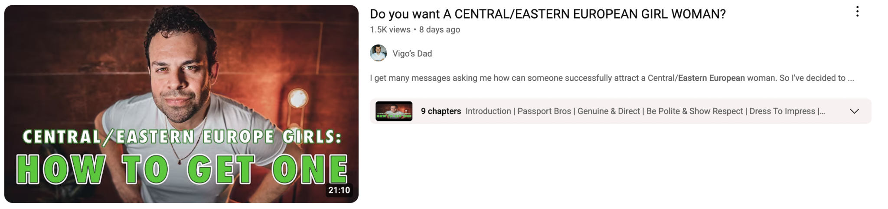

 

The video has 9 parts. It opens with an introduction, stating that this
video is going to be about Central/Eastern Europeans as a group with
similarities“, and continues with defining what a *passport bro*[^19chapter16_1] is.
The narrative here takes a form of how-to manual for men fantasizing
about women, who, and I quote: „still possess the core values that have
been abandoned by the West womenhood, that being these women wanting to
cook for men, to pamper them, to make them feel like they are the king
of the household. At the same time, they are gorgeous, they take care of
themselves, they cook in the kitchen while looking like runway models“.
One of his tips for getting „Eastern European women girls“ is to be
genuine: „they don’t like masks, they have been raised by fathers and
mothers that have been as direct as it comes, okay?“.

The heteronormative, manosphere-driven presuppositions of what an
Eastern European „girl woman“, to cite Vigo’s Dad, stands for, is a
classic dollified imagery for the latter. On a last note, the author
finishes his video with the most relevant twist to the story, which is,
to have patience towards them, „because sometimes they tend to be
explosive“, and due to this, men should enter the stage to maintain
endurance and tolerance. He continues by giving a short lecture on the
culture in Eastern and Central Europe being stoic – that women here tend
to be tough, which he calls a generational trauma. This interpretation
sillifies the matter at hand, and misreads both stoicism and trauma. To
reduce the complexity of Eastern and Central European womanhood to
trauma that must be “handled” or “waited out” by male patience is not
only patronizing, but also erases the radically different historical
trajectories and lived experiences that shaped these regions throughout
the 20th century. Moreover, to homogenise these experiences under the
guise of generational damage decontextualises history and further
reinforces a gendered colonial gaze.

But this essay is not a history lesson.

I want to go back to the dollified gaze that is created by certain male
community towards Eastern European women. I argue that there is a sharp
difference between manosphere’s built-in-Disneyland imagery towards
women in general, and the specific fantasy they construct around
„Eastern European women girls“. The difference is that here, the fantasy
towards the East is a bit *tilted*: these women are a bit dysfunctional,
because they might be of *an explosive nature*. They are *a bit out of
order*, just like Soviet elevators. Furthermore, the need to be patient
with them implies that these women are in need of fixing or rescuing.
Yet, fixing here is framed not as a tool to change something in women,
but as an opportunity for men to demonstrate their enduring qualities.
And change for these women is not necessary because, being *just a
bit out of it* is part of the fantasy.

This commodification of invented womenhood, especially by this certain
gaze, frames her as a mere function. Heather Warren-Crow works with an
understanding of girlhood as an idea of mobility preceding the fixity of
womanhood and implying an unfinished process of personal development.

Girlhood is, perhaps, a state of unfinishedness, unfinishedness and
placticity that is both precondition and a product of becoming. Becoming
then, happens through stories, relationality between those stories,
elasticity, flexibility, morphing, destruction, and reinvention.

 

In this essay, I understand digital girlhood formed and constituted by
Eastern Europe as not necessarily a dominant digital self-representation
but a *fragmented girliness *that centers around the peripheries of
implicit or explicit understandings on how to be a girl online, and how
to perform this discourse. This particular girliness is fragmented
because it draws from disconnected, often contradictory cultural and
digital discourses.

For example, in 2023, a Russian song from the 2000s, “Moy Marmeladny”
(My Marmalade), went viral on TikTok and Instagram, serving
\#EasternEuropeanGirlCore, with an emphasis on Slavic-ness, often
accompanied by girls wearing slavic fur hats and fur coats in the wintry
weather while lip-syncing to the lyrics. Yet, for me and other
Georgians, the song’s resurgence was unsettling. In the context of
Russia’s centuries-long bloody colonial history toward Georgia, this
seemingly innocent trend carried a weight of historical and political
significance. The next thing I see is a Georgian content creator,
@foxy\_eleniko taking a similar video, but with a plot twist: the
soundtrack was accompanied by a footage of the Russian invasion.

 

When observing different social media platforms, it is often noticeable
that Eastern European girliness is mostly framed through Slavic lens,
which then focuses on shared stereotypical tropes of Slavic femininity,
precisely, pale skin, thin bodies, greyness, whiteness, white, white,
white. There is a dissonance in relating to this aesthetic. By subsuming
Eastern European digital girlhood into a singular Slavic identity risks
overshadowing the nuances of other Eastern European countries that are
not part of Slavic culture. “Doing Eastern European girlhood” on the
internet in a Slavic way is not that much resisted through memes or
other visual content, but it is commodified and reproduced, almost like
a default. This generates a confusing mix of cultural tropes drawn from
disparate geographies and histories: if a Russiangirlcore with its
elegant fur hats and fur coats, endless winter and song *Moy
Marmeladniy* is a dominant visual and affective representation of this
particular girlhood online – does relating to this aesthetic mean I am
playing into the image of the coloniser? Where is the boundary between
identification and disidentification? Aesthetic pleasure and political
unease?

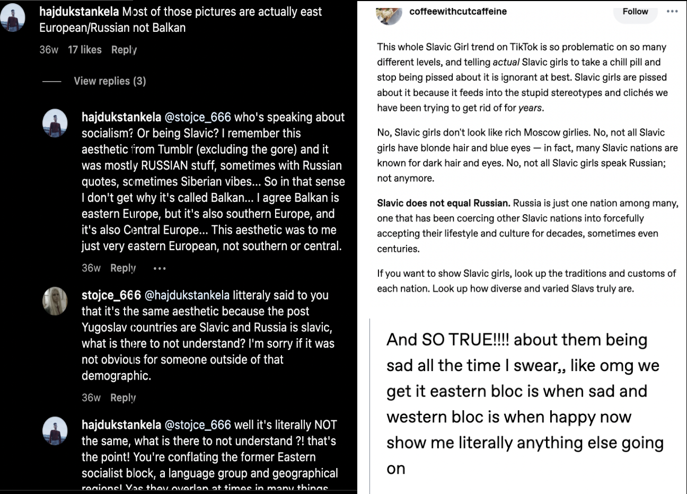

 

There is a political discomfort to experiencing a digital girlhood. So
then, *who gets to call themselves a post-Soviet girl?*

Some visual representations of certain cultural tropes on the internet
have an ability to swallow the peripheral, the micro. They are
exclusionary of plurality of practices and images. I frame this Girlhood
within this exclusionary aesthetic, however, while it renders certain
aspects of Eastern Europeanism as invisible and marginal, it also
constitutes something completely new.

## **This is Where I Post From**

“This” is a zero-point orientation here, the point from which the world
unfolds, as Husserl would write, and then “this” and “that” start to
matter. And there is a distance between them.

The fact that “I” am “there”, “posting”, is the starting point for my
orientation in space.

We post from grey and white, and fog, and \#gloomy coquette, and
\#angelcore, and \#grungecore, \#wintercore, \#slavicgirl and \#sadgirl.

And that’s the point of orientation, the “this” of a digital body, and
“I” of its dwelling.

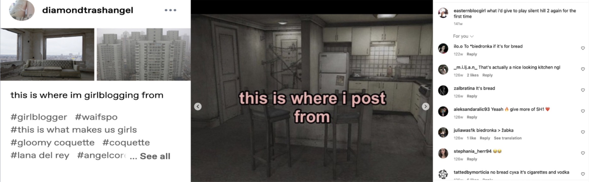

 

Fredrika Thelandersson defines “sad girl” as a “young woman who is
unashamed of her emotional life and who fearlessly acts out her pain for
others to see”. Is posting “This is Where I Post From” acting out on the
pain of the architecture? Is it a way to declare, “This is where I
become legible?”, “This is where I suffer and remember?” Just like
similar to Vidler’s analysis on Poe’s “The House of Ushers”: “the site
was desolate. The walls blank and almost literally“faceless”, its
windows “eye-like” but without life – “vacant”, the socialist modernist
building blocks follow the same trajectory. On top of it, they are an
archive of memory and tradition, embodied in their walls and objects.
Yet, the latter is not a memory-driven archive in its nature, but it is
a memory as performance. Through girl-coded mythmaking, it mourns
something through image, becomes vacant and devoid of any empirical
memory and history the moment it is decontextualised in the digital
space. This does not mean that such production is devoid of meaning,
it’s quite the opposite: it becomes meaningful precisely as it enters
the stage of sadness, taking the role of main character playing the
sorrow. This sorrow is both commodified and reclaimed by Eastern
European girlhood as a digitally mundane cultural experience of the
melancholia.

What this certain girlhood also reclaims, is appropriating Western
girlhood on its own terms, and especially the West sadness embodied by a
pop culture persona, such as Lana del Rey singing about female weakness
and dependence in a way that makes it seem like she is enjoying it.
Here, Lana del Rey is Svetlana del Rey, singing not Summertime Sadness
but “Letnaya Pechalka” (Summertime Sadness in Russian).

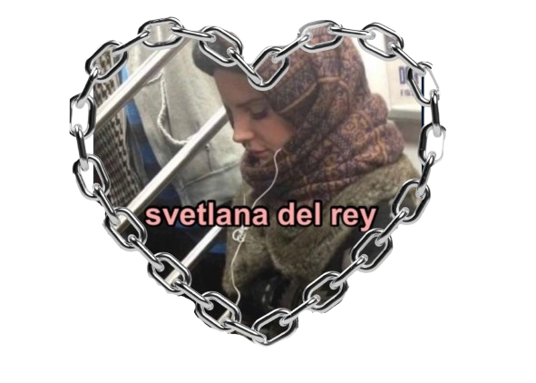

 

During the Cold War, the Soviet Union created its own version of Winnie
the Pooh—Vinni Pukh—a distinctly localized, animated bear that looked
and behaved quite differently from his Disney counterpart. Characters
were fashioned from Soviet Socialist Realist aesthetic, which meant that
form should be subordinated to content. This was a soft-power move from
the USSR to repurpose Western narratives through a distinctly Soviet
lens. By no means am I comparing the Soviet Union politics with Digital
girlhood, rather, I suggest that Eastern European girliness also filters
and reimagines the Western pop-cultural canon by reclaiming the agency
over narrative, aesthetics, and affect.

When coining the term “Sad Girl Theory”, Audrey Wollen writes that the
internalised suffering women experience should be categorized as an act
of resistance. Although, the trope itself often risks falling into
stereotypical terrains, as in representing primarily white bodies that
are the genesis of digital depression and melancholia. Mooney, in her
essay “Black Carefree Girls”, notes that even in case of resistance, the
latter is emerged from the contours of affective legacies of whiteness.
The affective legacies that Eastern European women inherit are not
necessarily those of the Western liberal subject, but rather shaped by a
melancholia that stems from being both inside and outside of
Europeanness, of whiteness, of the West.

And while being inbetween these social structures, Eastern European
girlhood started to reclaim sadness as a normative cultural experience.
Sensations of melancholia and nostalgia are merged with the Eastern
European self. It is dirty and gore, but glorified and commodified, and
most importantly, it is mundane.

 

“It must be sunny at night and snowy in August” - Nostalghia, 1983
Andrei Tarkovsky

Nostalgia works like memory; it is connected to passages, means of
communication, and entangled with both remembrance and forgetting. When
we remember, we risk losing parts of ourselves, as this comes with the
danger of forgetting what once was. When we remember a time that is long
lost, we might be trying to remember the time that has never existed,
and we start yearning for it. Nostalgia is a longing sentiment for the
loss and displacement, and it dwells in the past that is not connected
to the present in a way that it is not confined to the time and space.

Nostalgia does not orient itself towards the future in cyberspaces, but
works as a source of fantasy, where longing is not for the past as it
was, but for the past it could have been. In this sense, nostalgia
becomes imaginary. Imaginary, because it deals with the border zone
between longing and reflection, a speculative lifeworld where desire and
memory start to blur.

The dreamy and grey landscape of dystopian buildings do not come to
life, but dwell in afterlife. Robert Bvurton writes in “Anatomy of
Melancholy”, that he writes of melancholy by being busy to avoid
melancholy. My relationship with Eastern European girlhood works the
same way: I write about it in order to keep it at bay. But in this act
of avoidance, I unintentionally reconstitute it. The very girlhood I try
to escape is provoked  by remembering, stylizing, and theorizing.

Eastern European digital girlhood comes with its own particular
architecture, which feels almost embedded within the platforms it
portrays itself. It is not just about images, but also about atmospheres
algorithmically repeated into a recognisable mood. Gloomy afternoons and
foggy evenings without light or shadow, just gradients of grey. Small,
cramped kitchen rooms steeped in cigarette smoke. Someone by the window,
staring across all the identical buildings as if they were one. I have
been there, I have felt that, but the romanticized and glorified part of
the image production in digital spaces makes me displaced, not only
because it’s oriented towards the Slavicness, but also because this type
of melancholia and nostalgia it creates is overly consumable, public,
and neat. It blurs the difference between being from a place and being
styled after it. Its intention becomes sustaining a feeling that has
been formed on the internet, and is reconstituted by the latter over and
over again. So, this public feeling of nostalgia and constructed
melancholia becomes part of a digital mythology this girlhood centers
itself around: and it displaces some users, more than others.

I feel the displacement on the internet and I still feel stuck on the
platform, the nostalgia is painful but more painful is the realisation
that I cannot leave this public, curated feeling. Because this
particular girlhood, with all its beauty of low-pixel images and
monochronic palette intimacy has become the place for imaginary selves
that never fully got to be.

This sub-cultural space becomes not just a playful memory-space, but a
space for longing that is not tied to its origin.

And if this is the case, if the algorithm recycles and memeifies
accummulated knowledge of the past and present across post-Eastern Bloc
and post-Soviet grounds, if it feeds users back their own imaginary or
non-imaginary longings through thematic filters, through monetised
melancholia and platform capitalism, then what kind of authorship is
left? Do I take ownership over these longings, or does algorithm do it
for me? Am I the one remembering or am I being remembered by the
machine?

So, in this sense, *what* gets to call itself a post-Soviet girl?

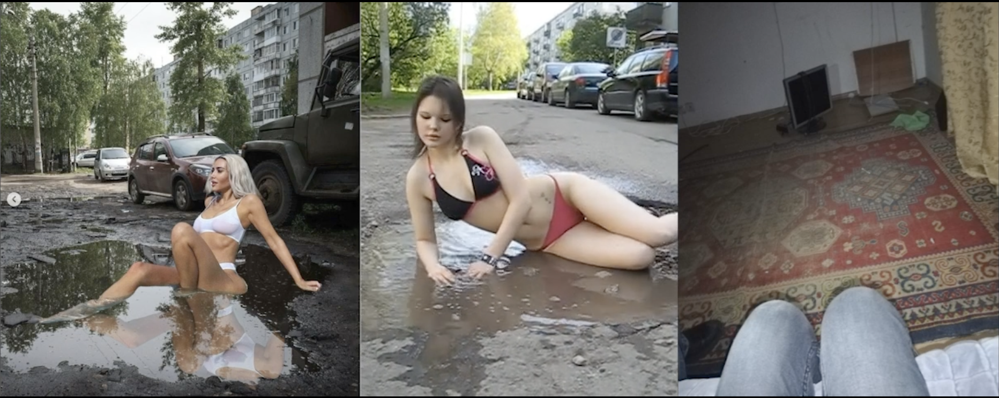

 

The post-Soviet girl took inspiration from early 2000s Russian social
media platform Odnoklassniki.ru, which, at its peak was a digital stage
for public validation. Users would publish their pictures and rate each
other. If you’d get 5+ stars (which required some payment), it meant
that you were high in rating. Its initial aesthetics, and broadly, its
visual culture was steeped in low-pixel gore. For girls, this often
meant sitting against the backdrop of a wall-mounted carpet, biting a
rose, or posing in front of fast housing blocks.  I remember it all
being very muddy. This muddiness has now become a foundational
aesthetic, just like a canon event for her. She does not care that she’s
acting like a mermaid in the muddy water, she doesn’t need to explain
it, because she’s from *there*. And this “*there*“ can be anything and
anywhere, but that also does not matter, because the difference is
already flattened, which became part of this aesthetic. Foggy weather
tied to Eastern Europeanness helps to reinforce this homogeneity. It
smoothes over the glitches, the bugs, the details that might localise,
or individualise. So, she dissolves into mist.

She is a chainsmoker, because what do you mean you were born in Eastern
Europe and don’t smoke? Creative part about her is that she’s
double-layered, she’s shy sometimes, but other times overly expressive,
performative, even excessive. She loves Kafka, Dostoevsky, and all the
existential male authors that suffered, again, existentially, because
their pain feels like hers. Her girl dinner is coffee and cigarettes,
chewing through thousand agonies of existence. She needs to make herself
visible, to make herself valid.

She knows a spot, but when she takes you there it’s all rust and
concrete, and she’s obviously wearing Adidas tracksuit with white
stripes, because that’s what she learnt from Slavic squatters.

Perhaps, this is all unfinished, and plastic. She ties herself to the
past tropes of turbulent 90s and kitch 2000s, but she continues,
mutates, and refabricates herself while aestheticising and commodifying
the residue. She is also unbecoming, in that she resists finality.
Aesthetically, she exists in the grey zone of fog and distortion, and in
some ways, she is liminal, disorienting, always standing on the
threshold. It is a loop of becoming and unbecoming that keeps Eastern
European girlhood in motion, rather than in place.

This is what gets to call itself a post-Soviet girl, anything or anyone
that plays with the ill-fitting currated greyness, or concrete, or
dampness on the Internet. It is not a memory from a traditional
theoretical standpoint, but a memory that is continuously regenerated
online. She becomes a memory-maker and digital rememberer of the past
she might never have lived. And game is over.

 

***Salome Berdzenishvili*** *is an affiliated researcher at the Institute of Network Cultures and a PhD researcher at the Leibniz Institute. Her research interests lie at the intersection of memory studies, digital cultures, post-socialist subjectivities, and feminist media practices.*

[^19chapter16_1]: Passport bro is a neologism coined to describe Western men who
    date or marry women from developing countries

# Youmaxxing: Masculinity, the RedPill, and the Online Self-Improvement Culture

## Francesco Barchiesi

### Originally published November 25th, 2024

PlayLover Academy (PLA) is the foremost Italian seduction school. They
offer a “social and emotional improvement” program to transform you into
“the man women want”.[^20chapter17_1] It is not merely a standard pick-up artist
school, as there were many twenty years ago; it is a wider offer, aimed
at “activating your maximum potential,” as stated on their website: they
promise to work on you comprehensively. The seductive training is sold
as a gateway to personal development. They *entrepreneurially take care
of you*. PLA’s extensive range of services includes “improvisational
theatre” to improve performance anxiety, “stylistic consulting” for a
more appealing look; classic live seduction coaching, “winning back an
ex,” or “reconciling a marital rift,” as well as training on finding a
partner through dating sites and apps.

Of course, all these services come at a steep price.[^20chapter17_2] Online courses
for becoming a *playlover* start from 499 euros up to a thousand, for 12
and 30 hours of video training respectively, on “how to structure
opening lines”; “how to make contact”; “how to have a steel mentality,”
or perform “a total mindset reset”. In-person courses, which involve
three days with a trainer at one stop of the *PlayLover Summer Tour* —
afternoon trials of picking up girls on the beach, then ice cream with
the bros: it’s always white boy summer[^20chapter17_3] after all — start from the
special price of 1499 euros, just for the privilege of enjoying each
other’s company. What about *PlayLover New Year’s Eve*, which includes
“three intensive days of emotional improvement, vacation, and fun”?
Another thousand euros.

They make it clear: choosing PLA is just the beginning of a whole
journey; “the most difficult decision to make” for those who dare to
“take the dark road” and are “willing to do the opposite of what the
masses do”. For those who are tired of mediocrity and want to really
*start living*. PLA heavily relies on psychology — but *street
psychology*, “without a grade”: be wary of the kind of professionals who
don't get you anywhere... — with “the very same principles adopted by
Elon Musk, Bill Gates, Mark Zuckerberg and virtually every other
celebrity and influential structure in the world”.

In addition to online courses and in-person training, PLA offers
specialized private counselling services. *PlayLover Always Training:*
you can have a personal trainer available for a certain number of hours
per month (depending on the subscription level), through a mix of calls
and WhatsApp messaging (how is the time spent chatting on WhatsApp
measured exactly?). In order to assert authority, no satisfaction or
money-back guarantee. Having a trainer at your personal disposal for 5
hours per month is the ‘bronze’ level of subscription, the lowest tier.
It costs 599€.

This kind of consulting is even available as a one-off service (‘On
Demand’), you can pay 149 euros for just an answer to an email, or 199€
for an hour-long phone call. And then there’s the *Fashion Lover Day*:
eight hours with a trainer acting as a personal shopper, to review your
wardrobe and redo your look. They take you shopping, to the hairdresser,
to the cosmetician. They buy you clothes, fix them on you, comb your
hair, tell you what to wear for the day, and force you to smile to make
an impression.[^20chapter17_4] The mother’s caring gaze, worrying about *how you are
seen* — except now you are paying for it, and this
attention is provided as a service.

PLA is embodied by the two founders, Christian and Steve. On their
website, there is a brand identity page dedicated to the story of these
characters — building their reputation as gurus is a key factor for the
business. The first one describes himself as ‘predestined,’ with an
innate “propensity for conquering the fairer sex”; but, at the same
time, his plot has a redemption arc: he was able to forge his mindset
following a troubled adolescence, precisely as a student of
‘PUATraining’ (which is another seduction school, spread all over the
world), where he learned *the rules of the game*. As sometimes the
student surpasses the teacher, Christian has now moved to the other side
of the desk, distinguishing himself through his “know-how” and his
“skills at teaching”. His motto is: “Practice is better than grammar”
(at least it rhymes in the original Italian language).

The second character, Steve Meister, instead has always been successful:
he claims to “have *closed* 85% of his friends’ female friends he has
met”. Some kind of Casanova Superhero, whose standout quality is a
“strong inner game”. From him, we also know that he has travelled a lot
(“many times in Ibiza”, he says); features a “Machiavellian
disposition”; his girls “must strictly have nice butts”. Both the PLA’s
founders can be “cocky and funny”, but each one specializes in different
techniques and situations to teach students.

They said they were quartered in Dubai, and that “the company pays 100k€
a month in salaries for employees and collaborators”.[^20chapter17_5] The work
beyond their online presence is indeed managed at least to some extent
by their subordinates. PLA has been relentless on social media, fueled
by an aggressive marketing strategy that turned them into a viral
sensation — even landing them on national TV (a feat they never tire of
flaunting on their website). The two founders can be almost daily seen
on YouTube videos where they share nuggets of wisdom: “7 bad boy
approaches that make women go crazy” — ‘The method to get her butt photo
sent to you’ — ‘Screw her head in with messages!’. But also, videos
dedicated to maximizing your physical appearance, tips on investments,
and how to improve other people's perception of you. *Looks, Money and
Status* — sounds familiar? It’s not just seduction: it is “personal
growth”.

From history, we know that the RedPill Theory is supposed to be at odds
with pick-up artists’ notion of *the game*, as something that can be
learned (and sold) — the RedPill discourse has partially stratified out
of this disillusionment, as we can deduce from the forum PUAHate[^20chapter17_6]
(crucial for the genealogy of the RedPill and incel culture). Yet, a
fundamental continuity echoes between these two discourses: there is one
male narrative of permanent self-improvement, oriented towards the
attainment of the same *object of valor* (to put it in semiotic terms).

 

The pick-up artist (PUA) movement emerged with the appearance of the
first ‘seduction manuals’ as a popular sub-genre on the bedrock of
self-help culture in the late 1980s,[^20chapter17_7] but it became mainstream just
around the turn of the millennium. It is closely tied to the evolution
of the Internet and the culture of online forums, where some men began
sharing advice and techniques on how to attract their targets, on how to
snag them in the growing nightlife scene of clubs.

The PUA community-building process is characterized by a distinctive
group vernacular. This recurring element, rooted in the digital forums
of the late 1990s, reflects a fusion of nerd and geek culture with the
terminology of the financial sector. Expressions like ‘f-close’ or
‘k-close’ explicitly derive from sales jargon and indicate,
respectively, the success of ‘fucking’ or ‘kissing’ a girl, as if it
were the closing of a deal. These terminologies persist in the
international community’s vocabulary, and we find these same words on
the (Italian) PLA website.

The real surge in popularity occurred at the beginning of the aughts, in
conjunction with the rise of the so-called post-feminist, neoliberal
sensitivity. These were the years of *Bridget Jones* and *Sex and the
City*, when the service-class single woman in her thirties was portrayed
as empowered by the possibility of enjoying her newfound freedom — one
increasingly recast as spending power and casual, detached sex “like a
man”.[^20chapter17_8] The complementary objective-correlative of this *chick-lit*
temperature is the seduction master, the pick-up artist (PUA). *Men Are
From Mars, Women Are From Venus*,[^20chapter17_9] after all: At the turn of the
millennium, heteronormative culture was defined by the idea that biology
and psychology could provide the codes to master relationships with the
opposite sex.

The pinnacle of the PUA movement coincided with the publication of the
bestseller *The Game*,[^20chapter17_10] in which author Neil Strauss recounts his
journey from nerd to star performer, after receiving the initiatory
knowledge passed on to him by his guru, *Mystery*.

*The Game* advances a whole metaphysical program, staging a
deterministic world based on the laws of evolutionary biology, a mesclun
of behavioural psychology, and cognitive sciences. You can learn and
draw conclusions about the objectification of interactions and
relationships between the sexes, hence achieving the desired results: if
women are predictable, the art of seduction can be mastered. The guru
bears the light of knowledge, and then it is up to you to try hard
enough. Almost needless to say, in this intrinsically sexist cosmos,
there is no role for female subjectivity other than being the object of
men’s predatory desires.

Mystery had his reality show on British television called *The Pickup
Artist* (2007-2008), after which the decline of the movement began. This
was also due to increasing criticisms and controversies — partly from
the collective acknowledgement of a feminist sensitivity, and partly
from the PUA community itself. Discontent was the sign of the inevitable
fraudulent turn taken by the expansion of a whole *seduction business. *

Sociologist Rachel O’Neill spent eight years conducting an ethnographic
investigation with a feminist theoretical framework in London’s
seduction community, participating in courses and workshops held by
various PUAs in the area. The result is her book *Seduction*.[^20chapter17_11] She
describes seduction communities as places of *‘mediated intimacy’:*

> I am concerned to examine how neoliberal rationalities, centered on
> management and entrepreneurialism, shape the intimate subjectivities
> of heterosexual men. In doing so, I am interested less in arguing that
> neoliberal capitalism is fashioning a new hegemonic variant of
> masculinity than in examining how the logics of neoliberalism get
> under men’s skin.

O’Neill argues that the PUA community must be interpreted as a reaction
of men navigating the terrain of *post-feminism*, in neoliberal terms:
embracing *intimate entrepreneurialism.* At its core, PUA’s discourse
seeks to rationalize the transformation of the self, converting personal
development into a targeted strategy for sexual acquisition. Your *inner
game* as a locus of labour: this is mediated intimacy. It is not limited
to your sexual persona; it affects your social skills, your aesthetic
appearances, and your narrative of yourself. *You*, as a subject of
enterprise. As feminist literature has reviewed, this is what women have
traditionally been compelled to do, and now men seem to have arrived at
this stage as well, though ‘following very different routes’ — as Susan
Faludi puts it.[^20chapter17_12]

O’Neill also pinpoints that, around seduction, it has established ‘a
community-industry hybrid’.[^20chapter17_13] Pick-up artists are primarily salesmen.
The guru-manager projects the image of a grandiose self, on which their
authority and competence are based, mainly through the heroic metric of
the *body count* — which stands for how many *deals with girls* they
succeeded in closing. The commodified good that the guru is thus selling
is intangible, but it is translated into a method that can be learned
and promises success if followed correctly: a *life hack.* In short, if
it’s not working, it’s only your fault, and you’d better invest more:
more of yourself and more money in training.

The system is fuelled by former students who become trainers themselves
at the service of the guru, earning dividends. In this frame, the PUA
business is not so distant from other Ponzi schemes, aligning itself
with sectarian movements like those new age cult-enterprises that were
popular just a few decades earlier, but explicitly marketed on a new,
tight, and culturally distant consumer target.[^20chapter17_14]

The communities populating seduction academies are strictly
sexual-connoted and homogeneous collective identities — heterosexual
males wanting to become “skilled” with women — persuaded to share a
rigid worldview and a secret knowledge infused with technical jargon.
The group thus often becomes insular, pushed to develop some kind of “us
against the world” mentality. In addition, for this reason, it is
unusual for participants to publicly share their affiliation with the
movement, opting instead to engage with each other in online echo
chambers through anonymous proxies.

It is also worth noting that the internal logic of association within
PUA communities is, in part, a legacy of the pro-feminist
consciousness-raising groups that emerged in the United States during
the late Sixties and the Seventies.[^20chapter17_15] The spectacle of men
confronting one another and seeking mutual support for their perceived
failures with women is, indeed, a departure from traditional hegemonic
masculinity. In the case of PUAs, however, one finds no critical
deconstruction of the link between these personal struggles and
patriarchal structures — a stark contrast to the ‘men's liberation’
experiments of the past. Instead, the PUA’s masculinist stance finds a
more direct precursor in the mythopoetic movements of the 1990s,
specifically the 'deep masculine' research groups inspired by Robert
Bly’s *Iron John*.

 

Quite a tangible representation of the neoliberal turn: what starts as a
political experience capsizes into the self-help business-culture within
twenty years. In the post-1977 Italian political scenario, scarred by
the “reflux into private”, the former male activists found out that they
were more like their fathers than they expected, or perhaps they had
wished to be. The masculine experience of self-consciousness groups,
framed as feminist therapy, dissolves into psychological and existential
mutual support without the overarching revolutionary hope pushing at
their back, and goes on without progressive social politics guardrails,
longing for self-realization goals.

In the alleged post-ideological world, where the therapeutic discourse
takes hold, males start crying out for their traumas and psychic wounds,
“blaming women” for being responsible for this pain.[^20chapter17_16] Social and
political powerlessness turns into gender resentment on the tidal wave
of the consumeristic sexual revolution and rampant individualism. This
is perhaps the bending point of the misogynistic tendency that
characterizes homosocial masculine communities especially today, from
PUAs to The Red Pill Theory, and the digital enclaves of involuntary
celibates. Here comes the Manosphere.

In the meantime, the very same sexual revolution helped push the *psy*
discourse among the aspirational middle class, and therapeutical culture
went hand in hand with the withdrawal of sociability, giving birth to
the convergence of self-help and self-improvement commercial culture.
The very American idea of the *perfectability of the self* has espoused
the therapy setting, requesting the (costly) reliance on someone else’s
guidance. The locus of intervention is the Self, but the work is
directed from above, which is the expert’s authority. “Psychologists
increasingly addressed the public both as patients and consumers”.[^20chapter17_17]
But the therapist’s role soon emerged from the fence of psychoanalysis,
invested by broader, more generalist streams. Our familiar figures of
the guru, as in the case of the PUAs, took their place there.

While this therapeutic sensitivity draws heavily from the post-1968
experience at first, and the liberal new age-wave finds a nod to the
cultures of the self in the Eastern tradition, there is a second strand
that is ignited by the foundation of cognitive-behavioural psychology. A
therapeutic approach that is powerfully pragmatic and oriented toward
the realization of the individual project and its success, which, not
surprisingly, takes hold equally well among Silicon Valley geeks, soon
to become global masculine role models.

The inspiration in this case, however, takes root in the Western culture
of the self, specifically Stoicism — obviously the “popular” one, a
watered and commercialized version of its ethos, capable of delivering
the simple (and twisted) message of becoming masters of our own
emotional world for well-being and prosperity.[^20chapter17_18] A strand far more
reconcilable with the reassuring reinforcement of a traditional
hetero-masculine hegemonic identity, now openly challenged in certain
milieus of the globalized West, and with the whole so-called
[*TradWest*](https://knowyourmeme.com/memes/trad-girl-tradwife)
imaginary, which is constituted precisely by opposition to the
development of feminist culture and its post-revolutionary
mainstreaming. “Men are not into therapy culture”, because they are less
geared towards healing and more towards success; so “\[this kind of\]
Stoicism is therapy with gladiators”.[^20chapter17_19]

This brief conceptual thread might shed light on some of the oddities of
our contemporary digital culture. For example, why have we seen
AI-generated images of the Giga-Chad in the guise of Roman emperors on
YouTube video thumbnails about digital entrepreneurialism;[^20chapter17_20] the
memes of men thinking about the Roman Empire many times per day; the
very existence of the expression “broicism” itself; [^20chapter17_21] why someone
like Andrew Tate refers to stoic Marcus Aurelius. Tate's dark flower
blooms from all this wide sowing.

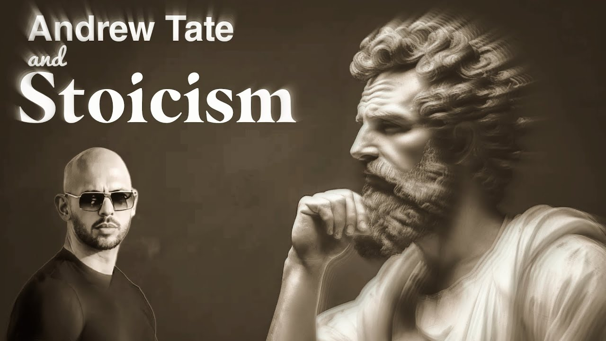

 

It was December 2022 when former kickboxing champion Andrew Tate and his
brother Tristan were arrested by Romanian authorities. They have been
charged with rape, exploitation of prostitution, and human trafficking
after having lured and groomed women to sexually perform on
cam-sites.[^20chapter17_22] In the months prior, Andrew Tate had reached the peak of
his popularity as an influencer: during the summer, he had been googled
more than Donald Trump and Kim Kardashian.[^20chapter17_23]

Mainstream social media platforms banned all his official accounts for
violating community guidelines after receiving repeated allegations of
promoting violence against women. In the UK, polls reported that 8 out
of 10 teenagers had watched Tate’s content on YouTube, Instagram, or
TikTok.[^20chapter17_24] This is when the world realized how worrisome his allure
had become. Today, after the second election of Donald Trump as
President of the United States, we confront Tate’s influence once more.

Thanks to his ‘Hustlers University’ he became a multi-millionaire,
attracting more than 250k subscribers (who paid handsome fees) to learn
the basics of self-entrepreneurship, and investment plans related to
crypto, AI, and digital marketing. His business strategy involved
dividends for members who were able to bring new subscribers to the
community and share his videos, as is generally the approach of the
seduction industry. “In essence, Tate created a Ponzi scheme by making
his followers believe that they were pursuing their own financial
freedom while, at the same time, they were contributing to his
viralization throughout social media”.[^20chapter17_25]

He was the best at weaponizing the algorithmic feedback loops of the
early 2020s, turning the rapid-fire scrolling morphology of TikTok into
a billion-share engine for his content.[^20chapter17_26] In his videos, Tate excels
at persuasively saying the same old things, with cuts and edits
specifically tailored for the format. His tale is the classic hero’s
journey: overcoming difficulties to become stronger. “Life is a battle:
for power, for attention, for dominance”; “Name an attribute of
masculinity that does not come from pain”.[^20chapter17_27]

He aims to be an inspirational source for males without contemporary
role models. Fast cars, cigars, and gunfire: the traditional, reassuring
alpha male, telling them how he struggled to earn his Bugatti. To become
like him, a “high-value man” (and a successful entrepreneur), you need
to control your emotions, overcome your fears, accept suffering, take
risks, believe and take care of yourself; abandon the cheap hedonism
promoted by the godless, feminized, and debauched West, quitting the
mainstream and possibly embracing Islam (but Tristan Tate is a proud
Christian: the *Tate Brothers Inc.* is a brand with differentiated
placements, to attract the broadest audience possible). Most of all, you
must give him money and help him create more proselytes. Numbers
growing, his edginess ended up consuming the entire alt-right menu,
without missing out on Nazi apology and conspiracy innuendos — recorded
during his arrest, winking to QAnon’s acolytes, he just said: “The
Matrix has attacked me”.[^20chapter17_28]

However, his reception on incel’s community forums is double-edged.
Users are often divided between those who defend him tooth and nail, and
those who see him as a *bluepilled* scammer, *on par* with the PUAs —
*truecels* (blackpilled incels) are desensitized to the lure of success,
so they do not trust those who sell this kind of way out. However, Tate
at one point explicitly started pointing out the RedPill Theory: he
talks about LMS and power imbalances in relationships between men and
women.[^20chapter17_29] Women who shouldn’t vote; who shouldn’t be free to choose on
matters regarding their own body; whose place must be just in the
kitchen and the bedroom.

To summarize his trajectory with the formula of an Italian
*forumcel*,[^20chapter17_30] Andrew Tate is ultimately “some crook who redpilled
half of GenZ following him on TikTok”.[^20chapter17_31] A deadly cocktail of
self-improvement digital marketing, hustler culture, and traditionalism,
embedded in misogyny and developed as a pyramid scheme. In two words:
“Populist RedPill”,[^20chapter17_32] commercialized as the latest variant on the
tropes of neoliberal exploitation within the manosphere.

Yet I think Tate did not popularize the Red Pill; he cannibalized the
Red Pill to popularize himself. He recognized the RedPill as a potent
mask for the contemporary Capitalist Discourse,[^20chapter17_33] now recalibrated
for its newest target: the young male, caught in a vice of unprecedented
aesthetic pressure, forced to translate his own image into a marketable
visual identity, amidst the fog of existential and economic precarity.
The Man is thus torn: he’s haunted by the desire for the *Jeune-Fille*
while being forced to embody her logic, trapped in the tragic cycle of
becoming the very commodity he seeks to possess.[^20chapter17_34]

Another piece of evidence in support of this argument is the
*looksmaxxing* trend, the ‘maximization’ of one’s appearance: from *gua
sha* to seasalt water hairspray, from skincare lotions and moisturizing
— for the delight of the beauty industry — to diet and workout apps.
Influencers are happy to offer counselling and sponsor products.

The \#looksmaxx trend is supposed to be ‘a space to discuss changes in
your physical appearance to help yourself in society,’ as TikTok
describes the hashtag. The ‘*glow-up’* video format showcases the before
and after of the transformation. It seems that many of the million
people who subscribe to this trend are unaware of where it all
originates, that is, the incel forums’ original *looksmaxxing section* —
there’s even a ‘female looksmaxxing’ sub-trend, which, for true
redpilled believers, would be a blatant contradiction.[^20chapter17_35]

The most widespread tenet of looksmaxxing is ‘mewing’, which involves
pressing the tongue against the palate to train the jawline, hoping to
achieve hyperbolic Chad’s jaw. The name comes from the controversial
orthodontist John Mew, who has found scarce agreement within the
medical-scientific community.[^20chapter17_36] The jawline serves as the primary
aesthetic signifier of an attractive masculinity, that can only be
aggressive. In looksmaxxing forums, the obsession with facial geometry
extends to the canthal tilt, the slant of the eyes on the face. The
difference between a positive canthal tilt and a negative one divides
those with ‘hunter’s eyes’ from the prey, which is the ‘lamb’.[^20chapter17_37]
Sticking to this parameter, not even Jacob Elordi is safe (he is
actually poorly rated in the forums).

 

But this is just *softmaxxing*. On the other hand, *hardmaxxing*
involves much more invasive practices, from official plastic surgery —
which has sharply increased in recent years, and notably among men[^20chapter17_38]
— to far more questionable DIY solutions, like
[*bonesmashing*](https://www.youtube.com/watch?v=8HCMJWbTrBg):[^20chapter17_39]
hammering your face to remodel those facial structures that are supposed
to doom those who lost the ‘genetic lottery’. As the RedPill Theory
claims, “Only the pretty face matters”. Looksmaxxing as a
(pseudo)scientific theory discussed in forums mainly focuses on the
visage, the factor with the most weight in determining one’s ‘L score’.

Thankfully, bonesmashing is mostly a meme. More serious, however, are
the speculations about hormone therapies and the experimental use of
drugs sourced on the black market to increase one's height, or for
muscular development. It is not hard to imagine the harmful side effects
that can arise from this kind of deregulated work on oneself. The
bodybuilding YouTuber Sergeyevich Shavershian (known as ‘Zyzz’ in his
community, ‘The Aesthetic Crew’) passed away on his DIY work of muscular
enlargement, because of an undiagnosed heart condition.[^20chapter17_40]

On ‘looksmaxx.org’, discussions about “successful genetics” are heavily
tainted by racism. Caucasian ethnicity is considered to be the “most
valuable”, and users suggest that non-white people should embrace
“whitemaxxing” through makeup and skin treatments. Asian males, widely
considered the least attractive to Western heterosexual women within
this community, are called ‘currycels’
after their ethnicity, and they represent a significant portion of the
user base in incels forums, especially in the UK (the legal country of
the largest online community, ‘incel.is’), where there is a major
diasporic community.[^20chapter17_41]

RedPill’s racism is of course an alarming issue — considering its
proximity to fascist and neo-Nazi ideologies swarming in the alt-right,
with their eugenics fantasies. I also noticed that, besides
neurodivergence and other mental disorders, physical disabilities are
widely discussed on incel forums — and I am not referring to those who
advance the incel condition as a disability itself. There is a lack of
research in this regard, and this should be investigated further
too.[^20chapter17_42]

Men with the least competitive genetic kernels are ‘mogged’ by Chads.
'To mog' means to be aesthetically dominating, more attractive, with
respect to another person — the expression was predictably coined by
pick-up artists some years ago. Everyone wants to be the
[*mogger*](https://youtu.be/Pso5jKFM7bs?si=C6JAFLL57Uz_wNVK). Why not
think of a service that can harness this desire? Some ‘mogging’ academy
perhaps?

*Mogwarts* — a pun making an obvious reference to Harry Potter— is the
“school of looksmaxxing & profound self-improvement,” as the website
states. It was somewhat the phenomenon of 2024 summer in the manosphere,
thanks to the visibility achieved by its founder Kareem Shami, after a
glow-up before/after video of him went viral on TikTok.[^20chapter17_43] “Looks,
Money, and Status matter” a lot concerning how we are perceived and
treated, in every aspect of our lives: “It's a tragedy the society we're
in, now from social media to dating apps our overall image is constantly
evaluated,” the 20-year-old beauty influencer recites in the
trailer.[^20chapter17_44]

So here is ‘Mogwarts Academy’, in order to achieve “the transformation”
into *“the best version of yourself”* (remember PlayLover Academy?). You
can subscribe for the super-discounted price of \$20 a month to access
exclusive content that will help you manage your skincare, your diet,
your workout, and your approach to girls. Just click on the “Ascend Now”
button — ‘to ascend’ is the expression incels use when they talk about
the possibility of coming out of their involuntary celibate status.[^20chapter17_45]
Yet in none of his videos or interviews, nor on the website, is the
reference to the RedPill Theory and the *inceldom* ever made explicit.
Shami has about half a million followers on Instagram by now, and his
community has more than three thousand (paying) members.

 

Studies on post-feminism have since long focused on the concept of
“aesthetic labor”,[^20chapter17_46] the industrious and ceaseless work of looking
beautiful on the outside and the inside, faced specifically by young
girls as a gendered issue, since “patriarchy has been reterritorialized
in the fashion-beauty complex”.[^20chapter17_47] But “today we are all living in the
image factory”,[^20chapter17_48] and this subjectivation process is getting
increasingly gender blinded. Indeed, it almost seems redundant to
highlight the continuity between the cases observed by feminist critique
and the trends currently involving these male subjects. The mere
existence of the “male beauty influencer” figure is here to testify to
it, although the two phenomena are yet to be comparable in extension.

The common thread is the aesthetic pressure disguised as self-care; the
establishment of a heavily normative relationship with one’s body, an
endless site of anxiety and labor involving forms of nano-surveillance.
But the elephant in the room in this conversation — which plays out
across digital media — is the visual dimension of this ‘body’ being
worked on, more and more seen as portrayed in pictures. Photo-editing
for emphasizing the results in ‘Before-After’ or ‘glow-up’ trends is an
open secret. This kind of ‘care labor’, today, always involves taking
care of a *profile*.

The new regime of visuality brought about by the social media revolution
has mobilized a whole technology of impression, that we delegate to
proxemic and photogenic proficiency, and to digital post-production
where the physical body does not stretch out. Framing, lighting, gaze,
posture. Attention to skin tone involves its quality as a reflector. We
are not only responsible for the product but especially for the
packaging, as the marketing revolution taught us. Contemporary beauty
and aesthetic labour are strongly related to the digital reputation
economy; with the simulacra of our own preceding us in the
digital-social arena; with the ‘profile’, intended as the most efficient
identity technology today.[^20chapter17_49] Incels are not properly mindful about
it, but I read their visual paranoia as a reaction to this new kind of
incitement.

On the other side of the coin from looksmaxxing, we find ‘bed rotting’.
This has somehow been another popular trend on TikTok among Gen Zs,
consisting of lying in bed and engaging in passive activities for a
couple of days at most — before it becomes ‘unhealthy’. It oddly fits
into the category of self-help and mindfulness content: it turns out
people need to relieve social pressures and just vibe on their own
sometimes. Our society tends to glorify being busy or productive all the
time, and “this can lead to feeling burnt out and not allow us time to
rest or recharge without labelling this as being lazy,” experts
say.[^20chapter17_50] Is bed rotting the youth’s rebellion against neoliberal
subjectivity and its imperative of performance? Maybe, for the better.
Or maybe it’s just another way to glamorize depressive states while
capitalizing on it: bed rotting befits the *Sad Girl*.[^20chapter17_51]

But if we follow the stream of bed rotting, we eventually arrive at the
spring of the BlackPill forums. LDAR is the acronym blackpilled users
have for ‘Lay Down And Rot’. “Lying down and rotting describes the
mindset many incels adopt once they have attached themselves to the idea
that there is no hope of them ascending. It goes beyond sexual
in-opportunity, they do not believe they can improve their life in any
capacity”.[^20chapter17_52] The picture worsens when we realize that many incels
populating these forums are NEETcels.

NEET is another acronym for ‘Not in Employment, Education, or Training,’
which has replaced the term ‘status zero’. The NEET figure, which
triangulates with that of the incel and the hikikomori, also sheds light
on the socio-economic roots of this discomfort. In 2022, the
Organisation for Economic Co-Development (OECD) reported that almost 22%
of Italian males aged 15 to 29 are NEETs.[^20chapter17_53] Under the bombardment of
hustler culture, these supposedly failed individuals are finding
identity in failure itself. Bed rotting and seeking sympathy in online
‘brocels’ are all that is left. This nothingness can actually be
interpreted as the blackpilled’s silent uprising, which is way less
boisterous than what the Beta Uprising of incels used to be (see Elliot
Rodger, Alek Minassian, and the other massacres),[^20chapter17_54] but no less
alarming in the bigger picture.

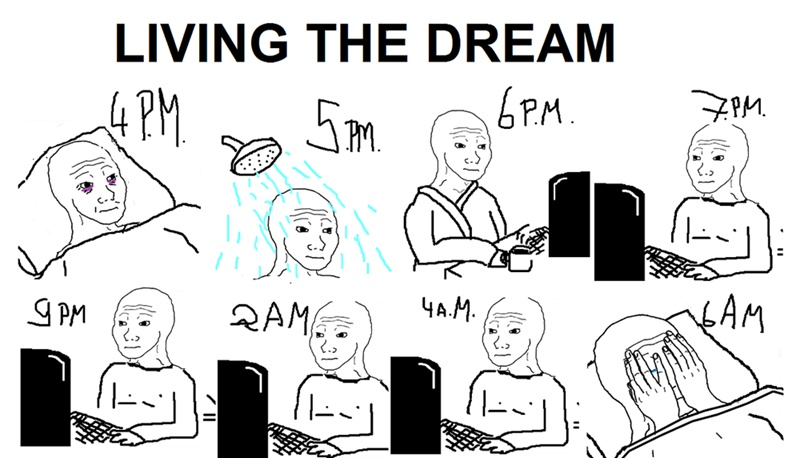

 

If Andrew Tate’s story illustrated the mainstreaming of an ideology, in
the case of Mogwarts and these trends on TikTok we are also clearly
dealing with the mainstreaming of a malaise — that seems to give a
reason for this same ideology, without providing a justification for it.
TikTok’s alleged triviality conceals the source code, it is invisible by
design. Incel forums are fibers away from mainstream social media
discourse, yet their toxicity is peeping out. Whether it takes the red
hue of looksmaxxing or the black of bed rotting matters little. There is
the pill jargon underneath: it becomes translucent when you shine light
through the prism of the internet’s dark corners.

The RedPill seems then to have become the Trojan horse of neoliberal
subjectivation; the adaptation of a ‘technology of the self’ capable of
gripping masculine identity in its development, under the conditions
that are shaping it in contemporary Western societies — after the sexual
revolution and the visual one of social media, after the Great Recession
and the re-proletarianization of the service class, and after the
pandemic as well. The RedPill with its tendrils is now common sense for
late-zoomers and Gen Alpha on TikTok.[^20chapter17_55] Functioning as a proper
ideology,[^20chapter17_56] it manages to hold together the contradiction between
hegemonic masculinity and the impulse towards its feminization; between
the harsh and straight Tate and the obsessive care, the visual
hypersensitivity of looksmaxxing.

The narrative structures of this therapeutic-entrepreneurial culture,
that are exploiting today's media infrastructures to target young boys
as new customers, are the recurring element of this story. Underneath
lies an ideal of professional and sexual success framed in terms of
absolute productivity. A subject’s capacity to be productive — and thus
successful — depends on how diligently they 'take care' of themselves.
This 'care' manifests in many forms: mastering a stoic unflappability in
the face of the 'tyranny of passions,' learning how to get a girl into
bed on the first date, adopting the mindset required for crypto-trading,
or sculpting a jawline sharp enough to prevent girls from skipping you
on Omegle.[^20chapter17_57] The 'self-improvement' etiquette is merely the sheep's
clothing worn by the redpilled wolf.

Here then is the *care of the self*, where this 'Self' is little more
than a business project in need of permanent aesthetic-emotional (and
‘profilic’) management, the object of relentless attention and work — so
overwhelming that it must be delegated to private forms of counselling,
such as gurus, subscriptions and apps of sorts. [^20chapter17_58] The *cruel
optimism*[^20chapter17_59] of investing in yourself, improving yourself, and
*activating your maximum potential*, is only the poor but obliged answer
to fathomless conditions of social, economic, and epistemic discomfort
in which so many isolated young males find themselves today.

As it is possible to witness, many elements of the Red Pill Theory —
intended as a toxic-masculine and conservative ideology — have
previously originated but now almost detached themselves from the
condition of involuntary celibacy. The *pharmakon* has evolved, like a
living entity, to become more appealing, viral, and *visible*. In the
darkness, incels are excruciated from this performative imperative. It
loops with their sense of failure. After all, their despair is too raw
to be marketable and sold as a product; it has been swept under the rug.
They are the loudest in the room screaming, yet the most overlooked
account of the manosphere — our blinders being on one side the reduction
of the incel as a ridiculed memetic stereotype,[^20chapter17_60] and
counter-terroristic rhetoric on the other that could be missing the
target as well.[^20chapter17_61]

The crisis is latent, but endemic.

 

***Francesco Barchiesi*** *is a full-time PhD student at the University of
Birmingham, currently digging into the world of incel culture. Having
spent most of his life in Bologna (Italy) navigating the clouds of
Philosophy and Semiotics, his research is essentially an excuse to
obsess over digital cultures of the self, the pitfalls of networked
intimacy, and the messy transformations of modern love.*

[^20chapter17_1]: All the following quotes are free translations from the Italian
    PLA’s website: <https://playloveracademy.it/>.

[^20chapter17_2]: The price list is eighteen months old; it might have been adjusted
    for inflation in the meantime.

[^20chapter17_3]: KnowYourMeme. “White Boy Summer.” Updated May 21, 2024.
    https://knowyourmeme.com/memes/white-boy-summer

[^20chapter17_4]: For a wider discussion about ‘happy faces’ and entrepreneurialism
    see Ehrenreich, Barbara. *Smile or Die.* 2010.

[^20chapter17_5]: Information available at:
    <https://mowmag.com/lifestyle/ho-partecipato-a-una-lezione-di-seduzione-di-playlover-academy-e-ora-non-voglio-piu-provarci-con-nessuna>.

[^20chapter17_6]: A well-known blackpill forum, which had origins in PUA criticism.

    See <https://incels.wiki/w/Puahate_Sluthate_Lookism_(PSL)>.

[^20chapter17_7]: The pioneer of seduction manuals is hypnotist Ross Jeffries, *How
    to Get the Women You Desire into Bed* (1992), combining
    neurolinguistic programming with hooking up.

[^20chapter17_8]: For more on this, see Angela, McRobbie. *The Aftermath of
    Feminism.* 2009.

[^20chapter17_9]: *Men Are From Mars, Women Are From Venus* (1992) by John Gray is a
    self-help manual that redefined the relational language during the
    Nineties, selling around 50 million copies all over the world.

[^20chapter17_10]: Neill Strauss. *The Game* (2005).

[^20chapter17_11]: Rachel O'Neill. *Seduction* (2016).

[^20chapter17_12]: Susan Faludi, *Stiffed* (1999).

[^20chapter17_13]: Rachel O'Neill. *Seduction* (2016) cfr. § *Introduction*.

[^20chapter17_14]: Reading Houellebecq’s *The Elementary Particles* (1998) it is
    perhaps possible to better grasp this continuity.

[^20chapter17_15]: For a historical insight of Men’s movement, from the Seventies to
    the present day, see C. Hodapp, *Men’s right, gender and social
    media* (2017). Regarding the Italian specificity, see S. Bellassai,
    *L’invenzione della virilità* (2011).

[^20chapter17_16]: Sandro Bellassai. *L’invenzione della virilità* (2011). Free
    translation.

[^20chapter17_17]: Illouz Eva. Saving the Modern Soul: Therapy, Emotions, and the
    Culture of Self-Help. Berkeley: University of California Press,
    2008. In this book, Illouz exposes the affinity between the psy
    culture and the American Dream (which I believe to be still crucial
    in The RedPill discourse).

[^20chapter17_18]: See Aperture, *How Stoicism Became The World’s Greatest Scam*
    (2024). <https://youtu.be/h8REOHfdVZQ?si=sPRwvykiK-Ah1sU4>.

[^20chapter17_19]: Ibid.

[^20chapter17_20]: YouTube. “How to Be Unstoppable: 5 Stoic Lessons for a Happier
    You.” YouTube Shorts. https://www.youtube.com/shorts/J4HR4NMuuDM

[^20chapter17_21]: For a detailed and focused account of the intersection between
    stoicism and the Manosphere, see M. Maloney, C. Jones, and S.
    Roberts, “‘I Can Choose to Be a Good Man Even if I Got a Raw Deal’:
    Neoliberal Heteromasculinity as Manosphere Counter Narrative in
    r/Stoicism,” *Social Media + Society* 10, no. 3 (2024).

[^20chapter17_22]: Jamie Tahsin and Matt Shea. “Andrew Tate: Chats in ‘War Room’
    Suggest Dozens of Women Groomed.” BBC News, June 19, 2023.
    https://www.bbc.com/news/world-europe-66604827.

[^20chapter17_23]: Shanti Das. “Inside Andrew Tate’s Violent, Misogynistic World of
    TikTok Fame.” The Guardian, August 6, 2022.
    https://www.theguardian.com/technology/2022/aug/06/andrew-tate-violent-misogynistic-world-of-tiktok-new-star

[^20chapter17_24]: Maya Oppenheim. “Andrew Tate’s Influence on Young Men in the UK
    Is Shocking, Poll Finds.” The Independent, February 16, 2023.
    https://www.independent.co.uk/news/uk/home-news/andrew-tate-influence-young-men-misogyny-b2283595.html

[^20chapter17_25]: Vlad Budei-Tebeica. “Neoliberalism and the Red Pill: How Andrew
    Tate Used Populist Discourse to Spread Online Misogyny” *Civil
    Szemle* 20 (2023), p.9.

[^20chapter17_26]: Shanti Das. “Inside Andrew Tate’s Violent, Misogynistic World of
    TikTok Fame.” The Guardian, August 6, 2022.
    https://www.theguardian.com/technology/2022/aug/06/andrew-tate-violent-misogynistic-world-of-tiktok-new-star.

[^20chapter17_27]: These quotes are taken as an example from one of the countless
    channels that re-share Tate's motivational videos. 'Personal Growth
    Pills' and ‘Imprenditor Tips' are two Italian cases in point.

[^20chapter17_28]: YouTube. “The Matrix Has Attacked Me! | Andrew Tate Is Detained
    and Has House Raided in Romania.” Posted March 30 of December 2022.
    https://www.youtube.com/watch?v=fU0e0xOlxso

[^20chapter17_29]: The pillars of the RedPill Theory — the ideological glue of the
    manosphere — are precisely Looks, Money and Status: the parameters
    according to which women would be Darwinistically hardwired to
    choose their male partners. Now women are free, so they only go for
    the Alpha males. In the evaluation forms offered on incel forums,
    Looks is measured in decimals; Money and Status influence Look.
    Under the score of ‘7’ they say “it’s over”.

[^20chapter17_30]: This is how users in incel forums often refer to each other.

[^20chapter17_31]: Il Forum dei Brutti*.* “*Che opinione avete di Andrew
    Tate?.*” Username: normie\_timidone (11/12/2023). Free translation.
    <https://ilforumdeibrutti.is/threads/che-opinione-avete-di-andrew-tate.513/>.

[^20chapter17_32]: Vlad Budei-Tebeica. “Neoliberalism and the Red Pill: How Andrew
    Tate Used Populist Discourse to Spread Online Misogyny” *Civil
    Szemle* 20 (2023), p.9.

[^20chapter17_33]: From the “Milan Discourse” (1972), J. Lacan.

[^20chapter17_34]: I am referring to Tiqqun, *Preliminary Materials for a Theory of
    the Jeune Fille* (1999).

[^20chapter17_35]: Kidology, *LOOKISM… and how LOOKSMAXXING is destroying everyone*
    (2023). <https://www.youtube.com/watch?v=DKnfVHgaTf0&t=631s>.

[^20chapter17_36]: Farrell Riley. “Inside Looksmaxxing, the Extreme Cosmetic Social
    Media Trend.” *BBC Culture*, March 26, 2024.
    <https://www.bbc.com/culture/article/20240326-inside-looksmaxxing-the-extreme-cosmetic-social-media-trend>

[^20chapter17_37]: See this app:
    <https://www.mewing.app/blog/hunter-eyes-vs-prey-eyes>.

[^20chapter17_38]: See the report from the British Association of Aesthetic Plastic
    Surgeons (BAAPS).
    <https://baaps.org.uk/about/news/1872/cosmetic_surgery_boom/>

[^20chapter17_39]: Simon Usborne. “From Bone Smashing to Chin Extensions: How
    ‘Looksmaxxing’ Is Reshaping Young Men’s Faces.” *The Guardian*,
    February 15, 2024.
    https://www.theguardian.com/lifeandstyle/2024/feb/15/from-bone-smashing-to-chin-extensions-how-looksmaxxing-is-reshaping-young-mens-faces.

[^20chapter17_40]: Farrell Riley. “Inside Looksmaxxing, the Extreme Cosmetic Social
    Media Trend.” *BBC Culture*, March 26, 2024.
    <https://www.bbc.com/culture/article/20240326-inside-looksmaxxing-the-extreme-cosmetic-social-media-trend>

[^20chapter17_41]: To deepen the South-Asian case of incel, see Kaur, Gurpreet.
    *Incel Extremism in India: A View from the Global South* (2022).
    <https://gnet-research.org/2022/08/23/incel-extremism-in-india-a-view-from-the-global-south/>.

[^20chapter17_42]: See Moskalenko, S., González, J. F.-G., Kates, N., & Morton, J.
    (2022). Incel Ideology, Radicalization and Mental Health: A Survey
    Study. *The Journal of Intelligence, Conflict, and Warfare*, *4*(3),
    1–29.

[^20chapter17_43]: Kieran Press-Reynolds. “Meet the Young Men Paying to Attend
    Mogwarts, an Online School for Becoming Hot.” *GQ*, July 11, 2024.
    https://www.gq.com/story/mogwarts-looksmaxing.

[^20chapter17_44]: <https://www.mogwarts.net/#section-3>.

[^20chapter17_45]: Incel Wiki. “Deincelization.” Last modified February 1, 2024.
    https://incels.wiki/w/Deincelization

[^20chapter17_46]: Ana Sofia Elias, Rosalind Gill, and Christina Scharff, *Aesthetic
    Labour: Rethinking Beauty Politics in Neoliberalism*. London:
    Palgrave Macmillan, 2017.

[^20chapter17_47]: Angela McRobbie, (2009) in Elias, Gill & Scharff (2017): p.39.

[^20chapter17_48]: Ibid.

[^20chapter17_49]: Hans-Georg Moeller & Paul J D’Ambrosio, *You and Your Profile.
    Profilicity after Authenticity.* 2022.

[^20chapter17_50]: Alyssa Hui-Anderson. "What Is 'Bed Rotting'? Gen Z's Newest
    Self-Care Trend, Explained.” 2024.
    <https://www.health.com/what-is-bed-rotting-trend-7561395>.

[^20chapter17_51]: Jade Poolen. “Revisiting Sad Girl Sentiments.” 2024.
    <https://networkcultures.org/longform/2024/01/16/revisiting-sad-girl-sentiments/>.
    and Sara Marzullo. *Sad Girl. La ragazza come teoria* (2023).

[^20chapter17_52]: Kate Babin. “Condemned to Rot Alone: The Incel Paradox of
    Collective Loneliness.*”* 2023.
    <https://networkcultures.org/longform/2023/09/05/condemned-to-rot-alone-the-incel-paradox-of-collective-loneliness/>.

[^20chapter17_53]: This statistic is alarming about Italian economy, for example
    compared to the 4% of The Netherlands. It is double the OECD average
    figure.
    <https://www.oecd.org/en/data/indicators/youth-not-in-employment-education-or-training-neet.html?oecdcontrol-dec63071aa-var6=15_19_WOMEN&oecdcontrol-00b22b2429-var3=2022>.

[^20chapter17_54]: The “incel” figure has tragically become popular because of
    several mass murders claimed by scattered members of this broad
    online community, occurred between 2014 and 2021.
    <https://incels.wiki/w/Beta_uprising>.

[^20chapter17_55]: Francesco Gerardi, “Incel, palestrati e troll: chi sono gli idoli
    dei giovani maschi su internet.” 2024.
    <https://www.rivistastudio.com/giovani-maschi-social-incel/>.

[^20chapter17_56]: The notion of ideology is understood here as the discourse that
    narcotizes and silences its own partiality. See Umberto Eco.
    *Trattato di Semiotica Generale*. 1975. p.340.

[^20chapter17_57]: YouTube. “I FOUND MY GIRLFRIEND ON OMEGLE !.” YouTube video,
    0:00. Uploaded by torynoah, March 8, 2024.
    https://www.youtube.com/watch?v=Q0TvHMxopFE

[^20chapter17_58]: Of course I am bothering Foucault’s *History of Sexuality* here.
    See *The Care of the Self* (1984).

[^20chapter17_59]: Lauren Berlant. *Cruel Optimism*. 2011.

[^20chapter17_60]: The TV show *Adolescence* (2025) showcases this dynamic: the term
    'incel' appears only once, as an instance of bullying against the
    protagonist — almost as if it were the motive for the murder he is
    going to commit.

[^20chapter17_61]: In August 2021, 22-year-old Jake Davidson killed five people
    (including his mother and a 3-year-old girl) in Plymouth. He had a
    YouTube channel where he discussed his commitment to bodybuilding
    and the Black Pill. Following the incident, the UK’s Commission for
    Countering Extremism (CCE) commissioned the Swansea University
    Research on the Incel Community (SURIC) to produce a report. The
    result highlighted was that ‘Incels need mental health support
    rather than a counter-terrorism intervention’
    <https://www.gov.uk/government/publications/predicting-harm-among-incels-involuntary-celibates/press-release-incels-need-mental-health-support-rather-than-a-counter-terrorism-intervention-the-worlds-largest-study-of-incels-finds-accessible#fn:1>.

#Condemned to Rot Alone: The Incel Paradox of Collective Loneliness

##Kate Babin

###Originally published on September 5th, 2023

> “Whether we learn how to love ourselves and others will depend on the
> presence of a loving environment. Self-love cannot flourish in
> isolation.”
>
> Bell Hooks[^21chapter18_1]

In 2022 I spent the better part of five months of my life lurking on an
incel forum. Truthfully, I don’t remember how I ended up here. One
moment I’m researching the commodification of authenticity on Instagram
for a BA paper and the next thing I know I’m neck deep in incel[^21chapter18_2]
vernacular, acronyms like KHHV (Kissless, hugless, handholdless virgin)
swirling in my head. I now find myself writing a piece that requires a
trigger warning for mentions of **suicidal ideation**, **extreme
misogyny**, **racism** and **self-harm**. After stumbling upon *Men Who
Hate Women*[^21chapter18_3] and being nosy enough to search out one of the forums
Laura Bates frequented in order to write the book, I was curious to find
out how a space that claims to be a community for lonely men to connect
with one another ends up further alienating members, not just from the
outside world, but even from each other. How can over 20K men who join
an 'involuntary celibate' forum that announces on its home page: “Are
you lonely and wish you had someone in your life? You're not alone!”
simultaneously experience debilitating loneliness? They are attempting
to bond over a specific sense of mutual longing, yet it is clear that
their attempts at connection over a shared loneliness plunges the
members of this incel forum deeper into isolation, attaching their
identity to a sense of failure they can’t escape from.

They are alone and always will be.

But how can they be lonely together?

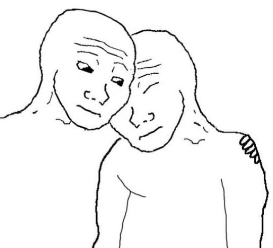

 

It's not a new or radical statement to say that many online spaces
populated by incels are volatile. With extreme misogyny on full display,
infused with hostility towards those both within and outside of the
community. Or that those who self identify as incels have much higher
rates of loneliness and mental health struggles than other men. Suicide
and self-harm are very popular topics within incel spaces and there have
even been studies done on the countless suicide posts that can be found
memorialized by the reddit user u/incelgraveyard. What is it about this
particular community[^21chapter18_4] (and the forum itself) that makes it impossible
for its members to connect with one another in a meaningful way? In a
way that would help them feel less alone. I decided to explore this
paradox of collective loneliness by looking at a popular incel forum,
how the affordances of the site and intricacies of the ideology
influence members’ behavior toward each other.

In a VICE News video titled “This Is What The Life Of An Incel Looks
Like”, a reporter spends a day with a young guy named Joey, who
identifies as an incel. We see him laughingly interacting with fellow
incels online. He video chats with his friends while they are yelling
gross and aggressive things for shock factor. Shouting things like “I’m
going to firebomb multiple government buildings” followed by one fellow
incel actually purposefully shitting his pants on camera. This perfectly
animates what reading posts on the forum out loud sounds and feels like.
Chaotic, disgusting and a bit scary. They look like they’re having fun,
but we are left with this closing statement by the reporter: “In this
subculture people bond over self-loathing. Joey says it’s therapeutic,
but four of his friends have killed themselves”. One former incel that
shared the experience he had on these forums, during an anonymous
podcast interview, equated the community to a black hole. He said that
joining the subculture is a downward spiral that sucks you in,
perpetuating ideologies born from trauma, depression and abuse. Men
whose loneliness pushes them to seek solace online are robbed of the
comfort that collectivity is meant to provide.

In a group of over 20K users who presumably share each other's desperate
need to connect with others, what is it about the space that plunges its
members deeper into isolation? An isolation that has been linked to
multiple mass murderers and suicides within the community. What aspects
of the forum perpetuate the negative affect that ultimately leads
members of the community to act out in these ways?

 

## The Incel

Before answering these questions, let me first set the stage.

The incel community does not exist in a vacuum. It is part of a larger
online network of men-centered groups aptly named ‘the manosphere’ that
consists of varying degrees of anti-feminist collectives. The belief
system that pervades many of these groups is the idea of being
‘redpilled’, a term that originated from the 1999 film The Matrix. In
the film, the main character Neo needs to choose between taking the
redpill and seeing the world’s true nature or choosing oblivion by
taking the bluepill, which is to live in ignorance of reality. In the
case of prominent manosphere ideologies, the redpilled reality asserts
that the world is a gynocentric sexual marketplace wherein women have
the upper hand. The belief is that men’s romantic and sexual success
with women is determined by their social status or ‘sexual market value’
(SMV). This means that low-status men, those without wealth or who are
not deemed conventionally attractive, are unable to form romantic or
sexual relationships with women. Bluepilled men are ignorant, delusional
normies[^21chapter18_5] that are continuously manipulated by promiscuous women for
their money and resources.

In 2016 journalist Stephen Marche spent time on the now quarantined
subreddit r/TheRedPill (TRP) and summed up the essence of the manosphere
in a surprisingly poetic way for his article *Swallowing the Red Pill: a
journey to the heart of modern misogyny*:[^21chapter18_6]

> "In the hours upon hours I spent wandering this online neighborhood, I
> saw mostly feral boys wandering the digital ruins of exploded
> masculinity, howling their misery, concocting vast nonsense about
> women, and craving the tiniest crumb of self-confidence and
> fellow-feeling"

Here Marche was describing a community within the manosphere that
focuses on sexual strategy. However, it is a very fitting description of
what I witnessed during my time on the incel forum. Unlike many
manosphere communities such as TRP that discuss dating and sex like it
is a game they have every intention of winning, incels are (as the name
implies) much more focused on their perceived permanent sexual lacking.
The word incel is a portmanteau of ‘involuntary’ and ‘celibate.’ The
origins of the term date back to 1997 on a website and listserv called
*Alana’s Involuntary Celibacy Project*, a space created by a queer
feminist in her 20s that aimed to confront the shame around virginity
and provide a supportive space for single people to speak to each other
about their struggles with finding a romantic partner. The focus of
these groups was really on loneliness and support, whereas modern
digital spaces that label themselves as ‘for involuntary celibates’ have
warped the label into an identity which is exclusive to cis-hetero men
that engage with pill jargon[^21chapter18_7], projecting their blame onto what they
consider ‘the feminist delusion’. In short, the beliefs perpetuated on
the forum push the anti-feminist narrative that women empowerment and
the subsequent financial independence that many women have gained has
ruined the romantic prospects for men who do not fit a very specific
idea of physical attractiveness and masculinity.

##The Blackpill

 

In a world of normies who are either redpilled or bluepilled, the incel
(within the aforementioned forum) is blackpilled. Being blackpilled
requires internalizing the belief that men who do not fit into societal
definitions of attractiveness or masculinity[^21chapter18_8] are systematically
marginalized, othered by society and completely without hope of having
sexual or romantic partners. Although redpilled men believe that
feminist society is inherently lookist[^21chapter18_9]; they engage in looksmaxxing
forums that focus on fitness, plastic surgery as well as improving their
financial situations in order to improve their sexual prospects. Unlike
other manosphere groups like Pick Up Artists and Men Going Their Own
Way, those who have subscribed to the blackpill ideology do not believe
that there is a solution to their problems.[^21chapter18_10] No matter what they do,
incels will always be genetically inferior to alpha men or chads[^21chapter18_11]
and for this reason they are doomed to be alone forever, together.
Blackpillers, according to the Incel Wiki Blackpill page, believe that
“ugly, 'genetically inferior' men have no chance of getting laid in an
unconstrained mating context, as women are assumed to choose based on
looks rather than personality or effort.” Basically, young men embracing
the blackpill leads to a biological determinist influenced nihilism that
is rampant on the forum.

##The Wiki

 

To understand more about the various acronyms and the history of
inceldom I perused the Incel Wiki, which is a rich source of incel
related definitions, theories and lore that was created independently
from any one specific incel community. Among 1,399 other pages, there
are in-depth explanations of the blackpill along with the ‘science’ they
use to back up this belief system, pages addressing balding, speculating
Hitler’s inceldom and even an incelosphere timeline dating back to the
1700s. While I find it pretty interesting to read about these things
from their own (albeit often hateful) perspective, I did have the
misfortune of stumbling across an article claiming women’s argumentation
style is emotion-based, manipulative blackmail[^21chapter18_12] titled *Arguing with
holes*. As well as the one about ‘Femoids’ or ‘foids’[^21chapter18_13] that refers
to women as toilets and includes charming memes like the one below.
Despite this, it has been incredibly helpful for understanding incel
related slang and history, as well as providing memes and interesting
visuals related to inceldom.

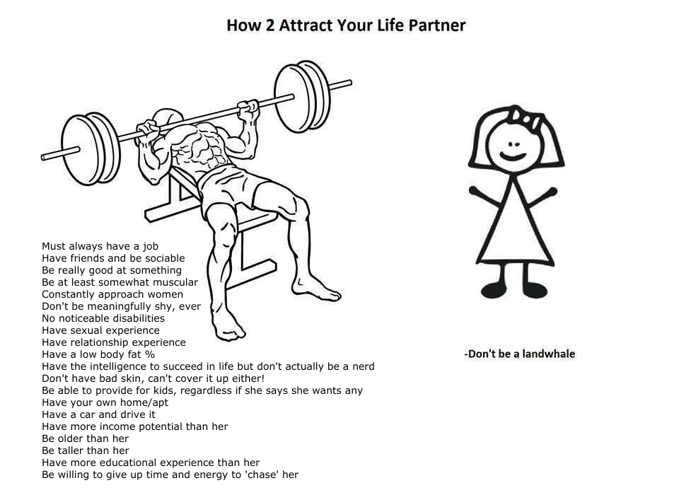

 

##Lonely Together

In November 2017, the community based network Reddit implemented a new
policy that prohibited incitement of violence on the platform. The 40K
member subreddit /r/incels was banned and users moved to more heavily
moderated subreddits or created their own forums. In the case of the
incel forum I have been lurking on, it was created as a result of this
ban by modmins[^21chapter18_14] SergeantIncel and Master. It is considered the third
iteration of the /r9k/ board on 4chan, the anonymous image-based
bulletin board known for the ephemerality and absurdity of its content.
This is where some believe the essence of /r/incels or men "howling
their misery" within "the digital ruins of exploded masculinity"
originated from. /r9k/ was and still is used for sharing original[^21chapter18_15]
personal anecdotes that are often bleak and involuntary celibate
adjacent.

This website that was created in response to Reddit's mass banning of
violent subreddits is reminiscent of early internet forums. The default
style is Dark Mode and the color scheme is dark blue with white text.
There are three main subforums, *Must-Read Content*[^21chapter18_16], *Inceldom
Discussion* and for off-topic content: *The Lounge*. As of September 1st
*Inceldom Discussion* has 5.6 million posts and *The Lounge* has 2.6
million. Users can post their own threads within the subforums or reply
to the threads which are ranked by number of responses. There is a
*Rules and FAQ* page where the admins have outlined who can and cannot
join the forum, what sort of behaviour will not be tolerated and what
kind of content is allowed to be posted. Some fun cherry picked examples
are:

**Women and LGBT Individuals (Not allowed):** Banned on sight, no
exceptions. This is a heterosexual male-only forum.

**Do not humble-brag, such as by subtly praising your own features**
("I'm incel even though I'm muscular and 6'2").

**Do not discuss or request personal romantic or sexual experiences,
even if they happened long ago.** Discussion of paid sex is allowed as
an exception, as the community has voted to allow it.

**Do not troll, bait, proselytize, post platitudes, mass tag users, or
necropost** (i.e., do not post in inactive threads older than \~1 month
unless you have something to contribute - plain agreement, mere quoting,
and meaningless one-liners don't qualify as contributing).

Another rule worth noting:

**Do not persecute, harass, or attack others.**

This rule is clearly not followed or enforced by moderators. One of the
first things that stood out to me about the way members interact with
each other; how much they seemed to hate each other. For a forum that
defines itself *as Not just a forum, but a community,* there largely
lacked any sense of camaraderie, or as Marche put it, fellow-feeling.
Incels are just plain mean to each other. Not only did I see these
interactions play out on the forum but I also saw a lot of posts made by
incels themselves complaining about this open hostility towards their
own ‘brocels’.

Incels are no strangers to self-loathing, this is clear just by
considering an initial description of the community and the concept of
involuntary celibacy itself. However, it was interesting to see the way
this translated into an outward hatred towards those they consider
similar, if not the same, as them. For incels self loathing doesn’t just
morph into an extreme hatred of women and a sense of utter hopelessness.
This hatred is also projected heavily onto other incels within their
community; creating such a hostile digital environment that engaging
with these forums can be considered a form of digital self-harm.

During my time as a lurker on the forum, I identified four main factors
that prevent supportive connection between members on the forum,
perpetuating their low self esteem and deep feelings of isolation:
**Othering the in-group, clogging up the forum, asserting masculinity
through shitposting** and **fatalism.**

##Othering the In Group

**A.K.A. “everyone is fakecel except me theory”**

Incels are no exception to the in-group/out-group dynamic and linguistic
work that subcultures within the deep vernacular web are known for
(shout out Marc Tuters and Daniel de Zeeuw). Elina Vaahensalo developed
the theory of Othering Online Discourse (OOD)[^21chapter18_17] that helped me to
understand how this collective identity is established and where in this
case community building goes wrong. OOD relates to how incel identity
and community is built through “shared experience of otherness and
opposing the cultural master-narrative.” Identity formation within incel
communities is complicated because in a way they establish themselves as
the out group and ‘other’ by positioning themselves as oppressed and
marginalized by society. Identity and self-image are often created
through the concept of juxtaposing oneself against the ‘other’ and
constructing the self through sameness within the community. At the same
time the ‘other’ is constructed through conceptions of difference.

Incels, however, have constructed their identity around the ‘other’
possessing similarities that incels lack. A common hypocritical theme
within the community is the idea that all women think and act a certain
way, while individual incels are vastly different from one another,
emphasizing how they are misunderstood by society. Their entire identity
revolves around being an outcast, a loser, an outsider and their
vernacular reflects that. The ‘us’ versus ‘them’ mentality manifests in
destructive ways. While they ‘other’ themselves they manage to fracture
their collectivity with very strict definitions of who can be considered
a truecel[^21chapter18_18] those who are meant to be a part of the in-group and find
community instead become excluded with increasing hostility.

Some fakecels[^21chapter18_19] (seriously check out the Incel Wiki Glossary for
definitions if you’re lost, there is only so much I can do) are
considered fake because they are either knowingly or unknowingly
volcels.[^21chapter18_20] The truest of truecels have much bleaker prospects than
the average (in)voluntary celibate. Members of the forum believe that
volcels or fakecels are participating in the community inauthentically.
Volcels are men who are considered celibate of their own volition,
sometimes due to their standards being too high for sexual or romantic
partners, claiming a true incel would ‘get with’ any woman if only they
could. Other reasons may be that they believe a volcel could
‘ascend’[^21chapter18_21] if they relocated to a larger city[^21chapter18_22] or worked on their
physical appearance.[^21chapter18_23]

Truecels are those who have no hope of ascension. There is no amount of
exercise, plastic surgery or money that will ever make them attractive
to women, this is often attributed to facial structure, height or a
disability. This belief that the other self-defined incels in the
community are not actually experiencing the same degree of social
rejection and loneliness as those who consider themselves truecels
perpetuates negative affectivity around the interactions members have
with each other on the forum.

While the forum states its purpose as being to **“talk to people just
like you”,** many incels are convinced that their fellow forum members
are nothing like them and instead are there due to their own
self-inflicted failures or lack of self-awareness.

##Failed Normies

 

The legitimacy of one’s inceldom is impossible to prove in this
pseudonymous environment. The cognitive affordances of the forum have a
much looser definition of what constitutes an incel. Describing an incel
under the *Membership* section of the *FAQ* as “A man (18+) who desires
a romantic relationship but is unable to enter one.”

Though this becomes rather subjective when actually signing up to the
forum, the registration page requires the aspiring member to explain
their situation, asking “Why do you want to join? Are you incel? Tell us
about yourself. If you are lazy here you will be rejected.” What is
considered truly incel is then in the hands of the admins that are
approving members. However, the authority of this decision is not a
guarantee that the new member will be accepted by the other members as
an actual true incel once a member of the forum.

##OK GrAYcel

The forum allows users to pick their own username, tagline and avatar.
Few rules exist for avatars[^21chapter18_24] and usernames, the main one being that
usernames should be masculine sounding, specifically they must “create
the kind of username that when you yourself look at it or other’s view
it, that it gives off the vibe that a masculine heterosexual male
created the name, otherwise your new account will be rejected
effectively banning you from the website.”

Beyond being associated with a username, an avatar and a tagline, forum
members have ranks which are determined by the number of times they have
posted on the site. According to the Rules and FAQ page the ranking and
starring of members functions as stated:

 

The concept of a graycel derives from this ranking system. If a member
has any number of posts below 500, their username and stars are
displayed as gray and their title below their username is listed as
Recruit.

According to the Incel Wiki page on greycels, they face a lot of stigma
on the forum for being ‘noobs’ and potential fakecels. This was
incredibly clear during my time lurking on the site. GrAYcel was a very
popular insult and there are posts by members that point out how
unsupportive that environment can be for new members or members who
choose not to post excessively. One of the comments I came across during
my time on the forum addressed the way members respond to newer or naive
members by belittling them, writing:

*“Calling naive members GrAYcels/cucks instead of correcting them, so
that some of us had finally something to feel good about (number of
shitposts and time spent on a forum for people who cannot succeed in
life, not the greatest honor really).”*

Many members responded to this statement by calling the original poster
a ‘soycuck’, a ‘GrAYcel’ or the classic non-answer: ‘Sounds GAY’.
Another user responded stating that almost none of the newer members
were actual incels and that figures into the animosity towards them:
**“Do you realize how many infiltrators we get here? 90% of greycels
turn out to be infiltrators, bluepillers, (homophobic slur, transphobic
slur or all together).”** There is a common belief that **“GrAYcels are
more likely to he \[sic\] larpers + criticism is a good way to build
character, unless you're a (homophobic slur) that can't handle insults
GrAYcel.”** The ranking system on the site sets these relationships up
for failure. Members ranked as *Recruits* are not taken seriously and
often mocked or disregarded which continuously fractures any possible
connections they could be making. Graycels are often assumed to be
LARPers25 or fakecels, there to destroy the forum. I noticed that the
members providing the most constructive and least fatalistic social
support were graycels who have since been banned. This contributes to
how the site cannot function as the support forum it claims to be and
why members seeking company on these forums continue to deal with
debilitating loneliness despite each other’s company. There is no room
for compassion beyond distrust.

**"Yeah, something's definitely not right with practically ALL incel
spaces."**

Despite the cognitive affordance that demands that registered members be
single cisgendered, straight men who are having trouble finding a
partner, it is apparent that many members believe that the majority of
their fellow incels are frauds. This has the opposite effect of
traditional discursive gatekeeping that typically utilizes identity
speech to foster a sense of community and sameness. The fakecel
rhetoric, instead of fostering a strong collective identity, cultivates
hostility and distrust between members. It further complicates the ‘us’
versus ‘them’ dynamic that often shapes and empowers online subcultures.
There is no clear ‘in-group’ that members can latch onto which causes
unstable identities as well as low quality relationships within the
forum.

##Sex Havers and LARPers

One concern of those within the community are LARPers. LARP or Live
Action Roleplay often refers to acting out role playing games with real
costumes, props and physical action. In the incelosphere LARPers are
registered members of an incel forum that are actually ‘sex havers’
impersonating incels. Members of the forum are similarly concerned with
false flagging and astroturfing, which is when fakecels join the forum
and create posts intended to make the community look bad. Incel Wiki
claims that:

*“Users of r/IncelTears*[^21chapter18_25] *and other incelphobic terrorist groups
have a tendency to take part in astroturfing by posting false flags
\[in\] communities in the incelosphere to make incels look bad.”*

LARPing comes up a lot during members’ discussions about the community,
some specifically blaming LARPers for destroying the forum. One member
argued that due to the freedom to express controversial ideas that the
forum affords, it attracts non-incels who as a bid for attention try to
be “funny or dark” by saying inflammatory things that do not add
anything constructive to the thread. He claims these LARPers aim to
destroy threads that otherwise would be good topics of debate or
conversation between members. This forum member then attempted to appeal
to the LARPers in his post, stating: **“You should look elsewhere, here
you only get in the way of people who want to find solutions to a
problem that is destroying them physically and mentally every day.”**
The majority of replies on that specific thread were agreeing with this
sentiment.

Incels who are seeking to quell their social loneliness by co-ruminating
with peers are instead bombarded with ridicule and irrelevant
inflammatory statements riddled with slurs. Members believe that those
that behave this way on the forum are **“just bored edgy normies.”**
*Alone Together* author Sherry Turkle writes about how digital
loneliness points to this issue when addressing being vulnerable with
strangers online. She states that these digital environments do not
"connect us with people who want to know us; rather, it exposes us to
those who \[…\] may use our troubles to relieve them from looking at
their own.”[^21chapter18_26] This sentiment is shared by forum members, one claiming
that many of the active members of the forum are fakecels with ulterior
motives. He wrote: “I bet a lot of the guys are here to feed on our
suffering like parasites.” The idea that these types of forums are
populated by users with bad intentions is something Laura Bates
addresses in Men Who Hate Women:

*“You really feel the contradictions of the community: vulnerable,
unhappy men mingling closely with men determined to wreak as much
destruction as possible. You watch as people in urgent need of mental
health support, who have somehow found themselves sucked into this
whirlpool of misogyny, are met with vitriol, ridicule and incitement to
self-harm by other men getting their kicks from online hate.”*

The fact that many members believe there are LARPers in their midst may
account for the general hostility forum members exhibit towards each
other on the majority of threads. This inability to trust one another
feeds into the already hostile environment regardless of if those who
are posting are LARPing or not. The forum is rife with distrust and
paranoia which impedes collectivity and community formation in a serious
way.

##Clogging Up the Forum

**A.K.A. “they just make the sewers more miserable”**

The ranking system the forum has in place is a clear example of the
negative affect affordances have on user relationships. The ranking
system encourages users to over utilize the posting feature in order to
move up in rank. Instead of engaging with other incels as themselves
with a sense of camaraderie and compassion, members instead have a more
gamified approach to their pseudonymous identities. Although the Rules
and FAQ page attempts to account for this by not allowing “low effort
posting” in the main subforums (The Lounge subforum is a free for all),
this rule is rarely upheld. Low effort posting is defined by the forum
as:

*"Content that is unrelated to a thread, posted for memetic value, or
spam-like in nature. Examples: an emote reply, quoting someone and
adding nothing else, one-word replies, and many other variations. The
content might as well not have been posted."*

This rule as well as the behavioral rule of “Do not persecute, harass,
or attack others” are rarely followed and infrequently enforced by
moderators, which points to an issue with the governance of the
platform. The forum is committed to freedom of speech within the law,
which may account for the lenient moderation for these types of posts.
The majority of the comments I came across could be considered low
effort posting according to the forum’s own stated definition. On her
podcast Incel, while interviewing the forum’s founder and past
co-administrator Sergeant Incel - Diego Joaquín Galante conducted under
his pseudonym “Alexander Ash” (doxxed by the NYT in 2021 for running a
pro-suicide forum), Naama Kates described this behavior as
‘statusmaxxing’ and Galante called it ‘postmaxxing’. Members who want to
move up in rank post excessively on the forum in order to increase their
post count. Low effort posts, emojis (often morbid variations of pepe
the frog), one-word replies (often slurs) make up a large portion of
replies on all threads. On several threads I came across forum members
argue about the negative affect that postmaxxers create on the forum.
One user claimed that **“this forum is one big popularity contest just
like society is.”** This shows how the forum may not function as the
refuge from the outside world that it claims to be. On the same thread
members attributed the forum’s problems to fakecels, graycels and
larpers, one comment placed the blame on postmaxxers. It read: **“I will
never understad \[sic\] why they feel good for having a high post count.
They just make the sewers more miserable.”**

In the same 2019 Incel podcast interview, Galante claimed that
although the site is heavily moderated to prevent it, there are
inevitably going to be posts that flood the site and as he puts in, clog
up the forum. He attributes this to users seeking instant gratification,
users trying to get the most validation with the least amount of effort.
He claimed that sites such as Reddit encourage this behaviour and it is
a part of wider internet culture, this type of controversial as well as
short and non-complex posting is not unique to incel forums. Galante
points to the fact that the shortest posts such as one-line shitposts
and picture memes get the most upvotes and therefore visibility on
Reddit. For this reason, the ‘like’ feature is disabled on the forum in
order to promote long, good quality posts that attract equally
high-effort replies, fostering conversation. Which is not what is being
accomplished. It’s clear that the no low effort posting rule is only
enforced on the posts themselves and not the replies within the thread.
What differentiates this incel forum from Reddit is that the posts that
get moved to the top of the page are those with the most replies. This
is another affordance of the site that encourages excessively posting
low effort replies or creating posts with controversial topics that will
attract a lot of vitriol. Admins disabling the ‘like’ feature in order
to discourage low effort posting was not successful.

The user ranking system by number of posts, lack of moderation within
threads and the fact that posts with the most replies are the most
visible on the site enables the postmaxxing that disrupts any real
conversations. The potential social support provided by this forum that
may help incels with their loneliness is impeded by members who use the
commenting feature as a tool in order to move up in rank as well as
obtain validation and attention. This behavior within the threads
overpowers much of the potential social support and as a result
perpetuates the negative affect between members.

##Shitposting

**A.K.A. “(racial slur) who told you that this hellhole of a website is
a self help group?”**

Another way the commenting feature is used by members in destructive
ways is through shitposting. While postmaxxing and shitposting can have
similar negative affectivity on the forum, the intentions behind each
type of post are very different. The 4chan FAQ page describes
shitposting as being ill-intentioned, off-topic or low quality. They are
often irony infused inflammatory comments that function to derail
discourse. While the off-topic posts can be attributed to postmaxxing,
there are many posts and replies that would fall under that come across
as ill-intentioned and as Adrienne Massanari defines shitposting, low
effort and pandering.[^21chapter18_27] These are the genre of posts that are an
integral part of the online culture wars. Shitposters aim to be
reactionary, often using extremely offensive language or ideas in order
to elicit a response, all under the guise of humor and irony. One member
expressed his disappointment in the forum’s lack of sociality due to
this use of irony stating:

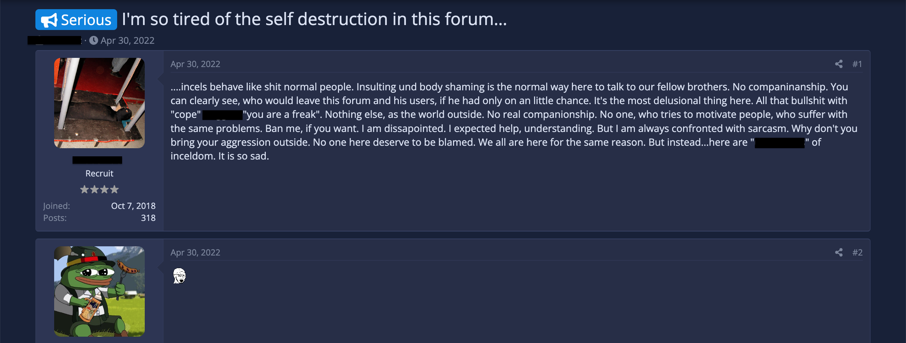

 

This post was immediately followed by a comment proving the original
poster's point. A simple angry wojak which is an emote titled by the
forum as 'Soy'.[^21chapter18_28]

During my time on the forum I saw how rampant inflammatory posts and
replies are within threads. As the user above expressed, many cries for
help and understanding are met with insulting sarcastic replies.
Researchers Sarah Daly and Shon M Reed interviewed ten incels for a
study that examined the themes of their lived experiences and
identities. They connected their excessive use of racism, misogyny and
violence within their conversations to an attempt to assert their
masculinity online.[^21chapter18_29] Members of the forum are aware that the content
they post is visible to non-members. The most shocking content on the
site is often screenshotted by non-members and shared on other sites
such as Reddit (r/IncelTear) in order to expose the hateful ideology and
use humour as a form of critique, often being extremely hateful
themselves. As a response, members post threatening messages on their
own forum or intensify the violence and ‘ironic' offensiveness of their
posts in order to get screenshotted again. This contention distracts
from forming connection with each other on the site, many members
express that posts about and directed at r/IncelTear specifically were
ruining the forum. Another aspect of othering online discourse is the
disruptive nature of discourses that are used to “troll the imagined
audience of the conversation” which in this case is outside the
community. The shitposting that is done in order to establish this
masculinity tends to manifest as attention seeking behavior and
extremely shocking rhetoric around marginalized communities such as
women and POC. Researcher Debbie Ging wrote that male beta affective
publics claim victimhood while pushing for male hegemony through racist
and misogynistic discourse. She wrote about how the affordances of these
forums encourage shitposting and therefore amplifies “new articulations
of aggrieved manhood.”[^21chapter18_30] This aggrieved manhood is an aspect of the
community that is not conducive to emotional support, compassion and
connection.

Forum admin Galante actually participated in the interviews conducted by
Daly and Reed under his Alexander Ash pseudonym. His perspective shines
a light on the value of forum governance and the considerable impact of
the decisions he made when making the platform. One of those decisions
being the way threads appear on the site. While in the Incel podcast
interview Galante described the placement of threads based on replies as
creating more thoughtful conversation than the ‘upvoting’ affordance on
Reddit, in the 2021 interview with Daly and Reed this perspective had
drastically shifted. He stated that “We score threads on number of
replies. Those with the most replies go to the top. Again, you have a
few people that are the most extreme...while the rational ones go into
oblivion.”[^21chapter18_31] Although he acknowledges that this type of scoring of
threads has led to the most vitriolic posts getting the highest
visibility and therefore engagement on the forum, this affordance has
not been modified since the forum’s creation in 2017, pointing to the
fact that rational discourse and community building might not be the
true intention of those running the site.

##Real Men Shitpost

**A.K.A. “Leave that kumbaya shit for someone that care”**

Because incels feels marginalized and infantilized offline, their
behavior on the forum is extreme in a way that Daly and Reed suggests is
an attempt to prove “their manhood within the incel collective.” Incels
make it a point to amplify a deep hatred for women in order to reclaim
their masculinity which they feel women have stolen from them by not
desiring them. This hostility, created through this extreme performance
of masculinity leaves little room for emotional connection or support
within the community. While lurking I observed many instances of
negative emotionality or toxic masculinity towards other members which
adds significantly to the negative affect. Many members displaying
vulnerability and expressing loneliness were met with homophobic slurs
or dismissive replies. One member expressed that this behavior impacted
their ability to socialize with others, commenting **“I joined this
forum this forum \[sic\] to socialize with other social outcasts, and I
was immediately met with toxicity.”** While Daly and Reed suggest that a
dominant masculinity within the forum creates a shared social support, I
disagree. This intense attachment to toxic masculinity inhibits social
support and fractures collectivity within the community by default.
Bates connected this issue to the wider manosphere when she wrote:

*“while pretending what threatens these boys is women or immigrants or
non-white men, the real threat comes from the very forms of rigid
‘manhood’ their so-called saviours are desperate to preserve and
promote.”*

To address this lack of community one member suggested improving the
relationships between incels in order to address Maslow’s hierarchy of
needs.

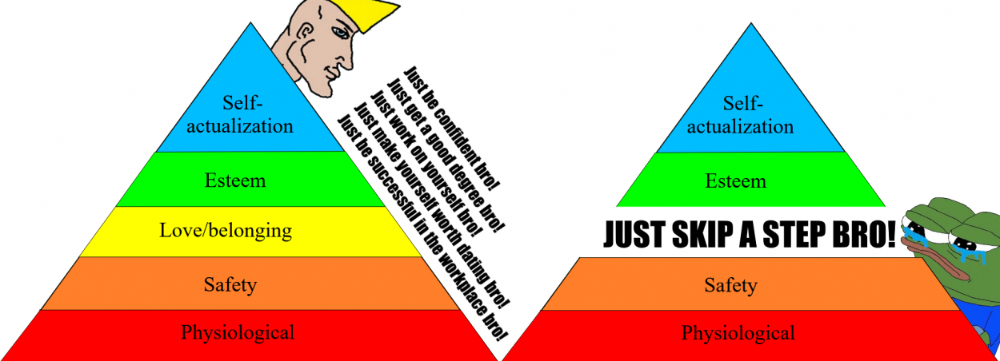

 

He wrote **“That might be taken care of in some way by strengthening
bonds between incels, since we cannot connect with the rest of society
due to them being fucking dicks to people they think are uglier. Some
incel exclusive podcasts, online video gaming sessions or other projects
are possible considering the distance between many of us.”** This, along
with some other collective improving suggestions were met with multiple
insults meant to be emasculating, such as **“Sounds GAY”, “soyfuck” and
“Leave that kumbaya shit for someone that care \[sic\].”**

Many members are not engaging with emotions outside of anger despite the
fact that managing loneliness requires emotional connection. Online
social support is often lacking in the necessary compassion and care
that would lead to meeting the needs of those seeking love and
belonging. This coupled with the fact that the incel ideology pushes
members away from accessing emotions that do not fit into traditional
notions of masculinity leads to a lack of intimacy and therefore
fractured collectivity between members. The construction and
perpetuation of masculinities within incel spaces is intrinsic to
negative affect which makes it difficult to find solace within the
community. Making it the perfect counter-intuitive space for lonely
people to gather.

##Fatalism

 

**A.K.A. “We are already dead boyo”**

The forum defines itself through blackpill fatalism.

Hopelessness seeps into every thread, often through shitposts and
sometimes even through very genuine and thoughtful posts and replies.
While a lot of the negative affect on the forum and between members can
be attributed to postmaxxing and shitposting, there are members who are
far less inflammatory or disingenuous in their approach while still
fracturing any potential community building on the forum. One member’s
response to a post exemplifies this perfectly: **“Expecting help to
solve a problem that cannot be solved, as inceldom, is far beyond
delusional.”**

Because of how hopeless this outlook is, it is likely that blackpilled
members have already fully accepted their loneliness and many are not
using the community to remedy it. This means that the other half of the
members who have not reached that level of desolation are met with
despondency instead of encouragement when seeking help on the forum.
Blackpilled incels are convinced that their shared life circumstance is
permanent, there is nothing left to do except cope with it. Any
positivity from members, whether it be reassurance, a compliment or
encouragement is met with hostility or dismissed by labeling it a ‘cope’
or ‘copium.’

 

Incels have a special attachment to the concept of coping mechanisms,
this is illustrated through their use of the word ‘cope’ within their
shared vernacular. On the Incel Wiki they explain that the term cope is
often used to insinuate someone is delusional or out of touch with
reality. When a member has a more optimistic outlook on their situation
other incels digitally shout cope at them, declaring that their
perspective is just a denial of facts. The blackpill ideology coupled
with the notion of positivity being a coping mechanism results in any
advice or potential positive affect between members being regularly and
easily invalidated with the use of a one-word, low effort reply: cope.
Another way this word is utilized on the forum is to refer to individual
incels’ various hobbies, interests or even addictions. Labeling
everything a coping mechanism negates any possible positive affect
sharing common interests or problems could have on collectivity.

Researcher Grace Sharkey labeled this fatalistic behavior as an
“aggressive performance of collective failure”[^21chapter18_32] which from what I
observed was clearly manifesting through blackpill discourse. One
subgroup of the incel subculture that illustrates this attachment to
failure are NEETs. NEET stands for Not in Education, Employment or
Training. Not all incels are NEET or vice versa, however, members claim
that a lack of romantic prospects could be the cause of ‘NEETdom’ or be
caused by their NEETdom. Many who identify as NEET have attached
themselves to this identity and are resigned to this lifestyle despite
it causing further social isolation. A popular term within incel/NEET
vernacular that pairs nicely with the fatalism of the blackpill is LDAR,
which is an acronym for Lay Down And Rot.

Laying down and rotting describes the mindset many incels adopt once
they have attached themselves to the idea that there is no hope of them
ascending. It goes beyond sexual in-opportunity, they do not believe
they can improve their life in any capacity. The forum perpetuates this
sense of defeat. One member posted on the forum self-requesting a ban
due to feeling like the forum was holding him back from his desire to
grow in real life. He claimed to need a break from incels and the
NEETcels and rotters specifically. This shows how the fatalistic mindset
negatively influences other members who have yet to fully give up on
themselves. Many incels project their hopelessness onto their peers
which makes any kind of attempted camaraderie especially toxic.

Incels display an overidentification with failure that feeds into the
already harsh environment on the forum and contributes to the feedback
loop of social isolation and negative affect. As a post within the
r/Braincels[^21chapter18_33] thread that was analyzed as part of the study *A Short
Story of a Lonely Guy* put it, “it’s really a breeding ground for
defeat.”[^21chapter18_34] While the negative affect drag members further into their
despair they reject positivity and simultaneously personal
responsibility. To these incels their failure is inevitable, inceldom is
inescapable and above all else it is not their fault (it is of course,
the fault of all womankind). Their collective failure sustains and
validates their identities as incels which justifies their attachment to
it. In his book *The Queer Art of Failure* Jack Halberstam explains how
failure can be so enticing. He wrote:

*“What kinds of reward can failure offer us? Perhaps most obviously,
failure allows us to escape the punishing norms that discipline behavior
and manage human development with the goal of delivering us from unruly
childhoods to orderly and predictable adulthoods. Failure preserves some
of the wondrous anarchy of childhood and disturbs the supposedly clean
boundaries between adults and children, winners and losers.”*[^21chapter18_35]

Ironically, the incel blackpill ideology seeks to escape the societal
norms around masculinity by pushing further into their failure to fit
into them. Sharkey connects failure to the incel’s perceived exclusion
from manhood due to its inextricable link with sexual maturity. Someone
who is involuntarily celibate would feel excluded from this concept of
“orderly and predictable adulthoods” and instead feel as if trapped in
boyhood. The hostile behaviour of the incel to outsiders and each other
could be viewed as the actions of immature boys who feel as though they
do not have a future and are performing their attachment to failure.
Incels have utilized the negative affect of failure in a violent manner
that harms themselves and each other over and over again. This feedback
loop of maladjustment and isolation is the result of a cruelly
optimistic attachment to companionship. The way incels position
themselves against “the good life” along with attaching to their
inability to obtain it fixes their identity and impedes any hope of
ascension. While the collectivity of their attachment to failure has
become appealing to incels in their search for companionship, the
resulting negative affects fracture the collective.

Many members approach the forum with the understanding that it is meant
to provide connection, solidarity and support evidenced by the many
posts by users disappointed that this wasn’t the case. However, others
who have fully committed to the biological determinism of the scientific
blackpill only see the forum as a source of informational support. One
incel criticized how self destructive the forum is due to there being
**“No one, who tries to motivate people, who suffer with the same
problems.”** The responses to this post provided insight into the lack
of cohesion between members and how it relates to blackpill ideology.
Many of the more vocal members of the forum do not believe that the
community is meant to function as a space to offer and receive support.
One user replied: **“sounds like you're blackpill bitter and taking it
out on us forumcels. We're mostly here to discuss things, delusional if
you thought that somehow we can help. the blackpill is ultimate, there's
no moral support for your face/height/etc”**

Due to the biological determinism of blackpill theory many incels feel
that not only is their life hopeless and meaningless, so are the lives
of their fellow ‘brocels’. This interferes with their ability to connect
with one another since they are consistently perpetuating negative
affect during their co-ruminations on the forum. The OP of the thread
summarized the outcome of this behavior perfectly, posting **“No need
for foids, normies, Simps or cucks to destroy us...we do their job very
well.”**

While posts seeking support on the forum do receive a variety of
replies, some even providing advice or emotional support, many members
perpetuate the type of hopelessness that encourages suicidal ideation
both implicitly and explicitly. I witnessed one member who was
desperately seeking advice on killing himself, titling the post you are
my only friends with the tag **It’s Over.** Many members did offer help,
empathized with him, recommended therapy and even offered for him to
direct message them for support. One reply indicated that there is
support to be had on the forum despite the shitposters, he wrote
**“Don't end it yet. Keep breathing even though it seems pointless man,
you have your forum friends for support. At least the ones who aren't
trolls.”** Conversely, other members mocked him, responded with one or
two word replies like **“Over”** and **“Ok”** and gave advice
encouraging suicide like the following, **“Save money to move out, or
save money for a gun to rope.”** Comments on other threads echoed this
positive attachment yet extreme negative affect around incels and death,
one user posting **“why live when you can die”** and another posting
**“I wish we were never born.”**

Fatalism is one of the three subcultural values Simon Cottee extracted
from his analysis of the community. He wrote that:

*“The whole incel subculture can be understood as a veritable counsel of
despair that facilitates the self-damnation of those who participate in
it. However, and paradoxically, this damnation is experienced as an
existential state of true (“blackpilled”) consciousness and authentic
existence. By rejecting both the goal of sexual intimacy and the means
of male self-improvement, incels transform their shame and inferiority
into a form of resistance against the “normie” status quo.”*[^21chapter18_36]

This ties into the notion that the behavior created by their attachment
to failure is an act of rebellion as well as self-preservation which is
being weaponized against members of their own community.

Forum members are very aware that the environment is not conducive to
sociality and companionship, this is apparent through the concerns about
behavior that are expressed within threads on the forum. This
perspective, the incel perspective, is very important when considering
the actual benefits lonely men gain when engaging with the community
online. Many acknowledge the overt racism and disturbingly violent
misogyny present on the forums as problematic, however some claim that
the majority of men using the forums are solely there to vent about
their anger and sadness with men who can relate. As former admin Galante
expressed along with many members who have participated in interviews,
incels join the forum believing that the main focus is relatability and
comfort, not the encouragement of violence or self-harm. However, while
actually visiting the forum it is clear to me that any companionship
they seek is drowned out by extreme rhetoric, shitposting and fatalism.
Many of these men have experienced trauma and abuse and struggle with
mental health issues or developmental disabilities that make it harder
for them to connect with others. The defeatist nature of the blackpill
ideology ensures that those who joined the community with any sense of
hope will soon not be able to imagine themselves as anything other than
**“condemned to rot alone and be excluded from any meaningful connection
or meaning.”**

They end up believing that their lives are pointless, and they have
nothing to live for. One member's take on the community sums up the
toxic aspects of the space quite sharply: **“The entire purpose of it is
to piss you off, isolate you, then send you down a rabbit hole that
leads to your suicide.”**

If we know there are incels who are genuinely seeking emotional
support and connection on these forums then the question becomes: why
are they unable to find solace within their own community? The danger
incel ideology poses to the outside world has been the dominating
narrative around the identity. There is no denying this threat,
self-identifying incels have been linked to multiple devastating acts of
mass murder or attempted assaults since the 2014 Isla Vista Killings.
Criminologists and experts on extremism have delved deep into the
ideology to assess this threat while incels themselves claim that the
perpetrators of these events were not even active members of the
community. Those that are active within incel community spaces seem to
pose more of a danger to themselves and each other, breaking down any
hope they still held for finding companionship leading young vulnerable
men to the conclusion that they are subhuman and their lives are not
worth living.

The role the forum plays in this breakdown of hope for these men is
significant. It is an environment that encourages members to flood
conversations with low effort, vitriolic garbage posting in order for
them to move up in rank and for their participation to be considered
valid by fellow incels. The most inflammatory posts have the most
visibility and members are not even convinced that those they are
interacting with are not infiltrators. It is not a place for vulnerable
and lonely young men to find community, it is where their hearts go to
rot.

Incels are set up to fail every step of the way. A subculture already
embedded with hate gather together on a platform that cultivates it. It
further isolates them, makes them hate not only themselves but also each
other. Personally, I found this pattern extremely sad to witness. While
a lot of the hateful things said on the forum made me incredibly
uncomfortable and at times scared, it was hard to overlook the fact that
those posts didn't feel authentic. Instead, the genuine moments on the
forum were the ones where bitterly lonely men desperately reached out
for connection and were met time and time again with indifference and
outright verbal abuse.

Some men who are sucked into these spaces have actually found their way
out with help from online communities. Subreddits like r/exredpill and
r/IncelExit have provided a space for men to come together, question
those ideologies and talk about their problems in an environment that
disallows suicide encouragement, misogyny, trolling and bullying while
actually enforcing those rules. Those who are in the deepest trouble,
however, don't want to water down their pain or hate in order to find
support.

But how does this pain and hate breed to begin with? What do these men
lack that they are getting from these spaces, since it is so clearly not
companionship and connection? Through this exploration I discovered the
way governance of the platform impedes support between members and the
ideology itself alienates them from each other, but I also saw how
non-members antagonize the community and exacerbate the vitriol.
Subreddits like r/exredpill and r/IncelExit are the compassionate middle
ground between scorning the incel and accepting their hateful rhetoric.
But these men will not find the community they so desperately crave on a
pseudonymous subreddit.

While the ideology of inceldom is veiled in the idea that men need to
find value and fulfillment in the sexual market place, the real problems
stem from isolation, scorn and lack of mental health resources. All
problems that are harder to fix than simply banning a subreddit or
forum. We need to look beyond the vitriol, see the lonely individual
wailing for someone to care and find a way to help them hold on to their
last shred of hope.

***Kate A. Babin (she/her)** is a Postgraduate Researcher within the
Centre for Postdigital Cultures at Coventry University. Her research
adopts a methodological approach of critical empathy, using feminist
affect theory to examine the technological and affective formations of
communities online. Her ongoing PhD project examines the affective
constructions of race, neurodiversity and the body within a
'blackpilled' misogynistic incel forum. She has collaborated with the
Institute of Network Cultures as a research intern, copy editor and
proofreader since 2023.*

[^21chapter18_1]: Bell Hooks, *All About Love: New Visions*, (Avon A, 2016).

[^21chapter18_2]: Involuntary Celibate.

[^21chapter18_3]: Laura Batea, *Men Who Hate Women*, (Simon & Schuster Ltd, 2021).

[^21chapter18_4]: It is important to note that there are men who identify as
    involuntarily celibate who do not engage with the kind of extreme
    rhetoric they have become known for in popular media. There are men
    who may refer to themselves as involuntary celibate but consider it
    a (temporary) state of being and not an identity. Being incel versus
    being AN incel. When writing about ‘an incel forum’ I am referring
    to the most active forum with the highest concentration of
    self-identified incels, it is an extreme example of the community
    and an accurate illustration of how easily identity and ideology can
    be radicalized.

[^21chapter18_5]: A normie is someone like you or me, someone (I hope) that is
    grounded in reality. Also referred to NPCs.

[^21chapter18_6]: Stephen Marche, “Swallowing the Red Pill: a journey to the heart
    of modern misogyny”, *The Guardian*, April 14, 2016,
    https://www.theguardian.com/technology/2016/apr/14/the-red-pill-reddit-modern-misogyny-manosphere-men.

[^21chapter18_7]: Some are red, and some are blue. Some are old and some are new.
    Some are sad, and some are glad, And some are very, very bad.

[^21chapter18_8]: Supposedly this is determined by women.

[^21chapter18_9]: Your worth is determined by your level of attractiveness.

[^21chapter18_10]: PUA's believe the solution is manipulating women and MGTOW
    believe it is separating themselves entirely from women.

[^21chapter18_11]: The stereotypically 'high status' man. Tall, wealthy, incredibly
    fit with magnificent cheek bones.

[^21chapter18_12]: As opposed to the famously male logic-based mode of
    communication.

[^21chapter18_13]: Female humanoids.

[^21chapter18_14]: Moderator/Admins.

[^21chapter18_15]: The originality here is key to how the board became a popular
    space for incels to share their stories. The /r9k/ board was
    originally an experiment done by artist Randall Munroe to encourage
    original and unpredictable content, creating a community focused
    subculture on a site that is best known for its repetitive memes and
    noisy chaos. A bot was created to filter out reposts and
    non-original content. Although this never explicitly became an incel
    forum, the content that was produced as the community formed was
    often original stories of social isolation and awkwardness leading
    to a lot of incel related discussions.

[^21chapter18_16]: Pinned by the mods.

[^21chapter18_17]: Elina Vaahensalo, “Creating the Other in Online Interaction:
    Othering Online Discourse Theory Open Access” in *The Emerald
    International Handbook of Technology-Facilitated Violence and
    Abuse*, (Emerald Publishing Limited, 2021).

[^21chapter18_18]: A true incel. Someone who has never had any sort of sexual or
    romantic experience and never will.

[^21chapter18_19]: Fake incels.

[^21chapter18_20]: Voluntarily celibate.

[^21chapter18_21]: Have sex. No longer be celibate.

[^21chapter18_22]: Locationcel.

[^21chapter18_23]: Looksmaxxing.

[^21chapter18_24]: Previously there was a rule which prohibited images of ‘foids’ in
    avatars but this has since been revoked in January of this year
    since many members like using anime girls as their avi.

[^21chapter18_25]: An extremely hostile relationship exists between members of
    incels.is and members of the subreddit r/IncelTear. r/IncelTear has
    95.3k members and is dedicated to “posting screenshots of hateful,
    misogynist, racist, violent, and often bizarre content created by
    hateful “incels" (involuntary celibates).” The majority of the
    content posted in the subreddit are screenshots of forum posts and
    subsequent mocking.

[^21chapter18_26]: Sherry Turkle, *Alone together: Why we expect more from
    technology and less from each other*, (Basic Books/Hachette Book
    Group, 2011).

[^21chapter18_27]: Adrienne L. Massanari, *Participatory Culture, Community, and
    Play: Learning from Reddit*, (Peter Lang Inc., 2015).

[^21chapter18_28]: Soyboy is a term used to indicate a lack of masculinity.

[^21chapter18_29]: Sarah Daly & Shon M Reed, ““I Think Most of Society Hates Us”: A
    Qualitative Thematic Analysis of Interviews with Incels”, *Sex Roles
    86, 14–33* (October 2021).
    https://doi.org/10.1007/s11199-021-01250-5.

[^21chapter18_30]: Debbie Ging, “Alphas, Betas, and Incels: Theorizing the
    Masculinities of the Manosphere”, *Men and Masculinities*, *Volume
    22 Issue 4*, (May 2017), https://doi.org/10.1177/1097184X17706401.

[^21chapter18_31]: Daly & Reed, ““I Think Most of Society Hates Us”: A Qualitative
    Thematic Analysis of Interviews with Incels”.

[^21chapter18_32]: Grace Sharkey, “Failure to thrive: incels, boys and feminism”,
    *Journal of Media & Cultural Studies*

    *Volume 36, 2022 - Issue 1*, August 6, 2021,
    https://doi.org/10.1080/10304312.2021.1958160.

[^21chapter18_33]: A now defunct (banned in 2019) subreddit, considered the most
    popular incel subreddit after r/incels was banned.

[^21chapter18_34]: December Maxwell et al., ““A Short Story of a Lonely Guy”: A
    Qualitative Thematic Analysis of Involuntary Celibacy Using Reddit”,
    *Sexuality & Culture, Volume 24*, 1852–1874, March 25, 2020,
    https://doi.org.10.1007/s12119-020-09724-6.

[^21chapter18_35]: Jack Halberstam, *The Queer Art of Failure*, (Duke University
    Press, 2011).

[^21chapter18_36]: Simon Cottee, “Incel (E)motives: Resentment, Shame and Revenge”,
    Studies in Conflict & Terrorism

    Volume 44, Issue 2, June 18, 2020,
    https://doi.org/10.1080/1057610X.2020.1822589.

# I, too, was Mouchette at 13 years old

## Anielek Niemyjski 

### Originally Published July 18th, 2025

I'm 13 and my best friend from primary school asks me if I have an
account on Tumblr. I do, but I'm not sure if I want her to know. She
broke the unspoken rule—you never share your blog with IRL friends, it's
taboo to talk about it. I hesitantly agree, and we exchange blogs. I
take a look at her page. In her bio, there's a quote from Forrest Gump:
'Life was like a box of chocolates, you never know what you're gonna
get.' Her reblogs consist of summer destinations, clean girls in
bikinis, LA highways lined with palms, New York architecture, and Brandy
Melville models. I scroll lower and lower and am becoming engulfed in
shame. What is she gonna think of me when she sees my blog? Is she gonna
think I'm crazy or unstable? I need to check my recently reblogged posts
to determine how bad it is. I open my blog page. The difference between
our visual aesthetics and personalities is imminent. I go through black
and white analogue photos with depressing captions, graphic self-harm
content, gifs from AHS Asylum, posts glorifying eating disorders, grunge
fashion, soft animals lying on the grass, and nihilistic quotes from
coming-of-age movies. I frantically scroll through my own blog as if
seeing it for the first time, suddenly aware of how performative my pain
looks when viewed through someone else's eyes.

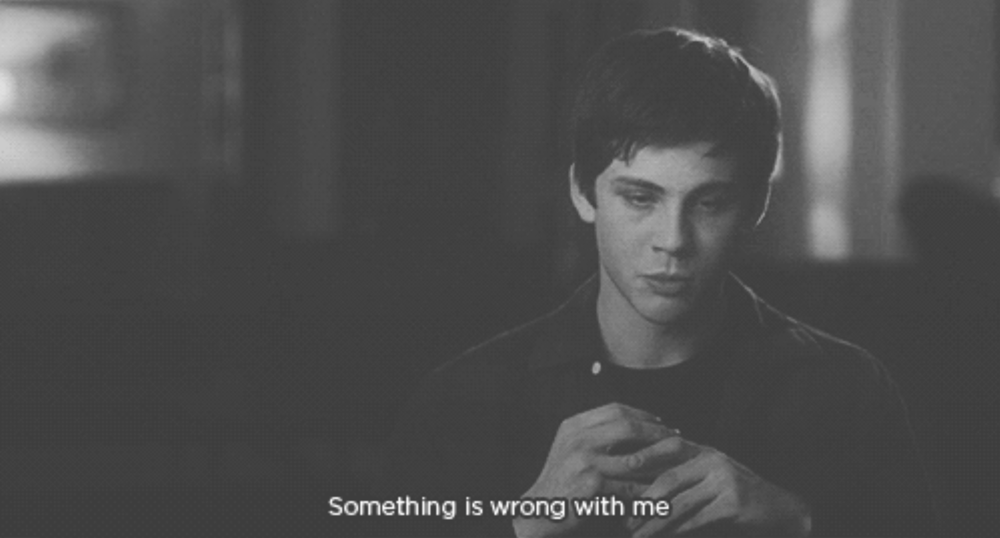

 

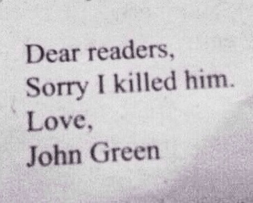

 

In the next couple of years, I will forget all about Tumblr, and I will
slowly stop reblogging. I will migrate to different platforms with my
peers, but fortunately never delete my account. My blog will patiently
wait for me to return, but… so will the same feelings of shame and
cringe, preserved with embarrassing clarity, waiting to reveal itself as
an archive of my becoming.

The decision to slowly stop using Tumblr would, unexpectedly, come as a
direct result of a certain motion. In 2018, the last year of Verizon’s
and Yahoo!’s ownership of the platform, NSFW visual content was to be
completely banned from the platform. After losing about 30% of the user
traffic on the platform in response to a stricter content policy, the
American media giant got rid of the site and sold it to Automattic for
less than 0.3% of the purchase price. For a little while, it seemed like
the platform had come full circle: being bought back by a company that
is responsible for the blog service WordPress.com, seemed to promise the
return to the simpler times: easily made, accessible blogs!! reunited
communities!! unchanged, not-algorithm dictated dashboard!!
chronological feed!! ….but, wait…not so fast….. slow down.. In February
2024, Automattic announced it would start selling its users’ data to
OpenAI and Midjourney…… So much for the simpler times….

At 22 years old, I discovered mouchette.org while researching net art
works for my thesis. The site, created by French artist Martine Neddam
in 1996, mimics a teenage girl's diary with deliberate naivety and
whimsy: pink text, buzzing flies, stuffed animals, and a navigation menu
that mimics early GeoCities pages. Yet, the content quickly subverts
this childish innocence, with hyperlinks leading to the deepest
curiosities of a seemingly pre-adolescent mind. From asking site
visitors to physically connect through the cold surface of the screen,
and asking strangers on the internet how to commit suicide, to suicide
notes, and a forum where visitors share their struggles, jokes,
experiences, and offers of help.

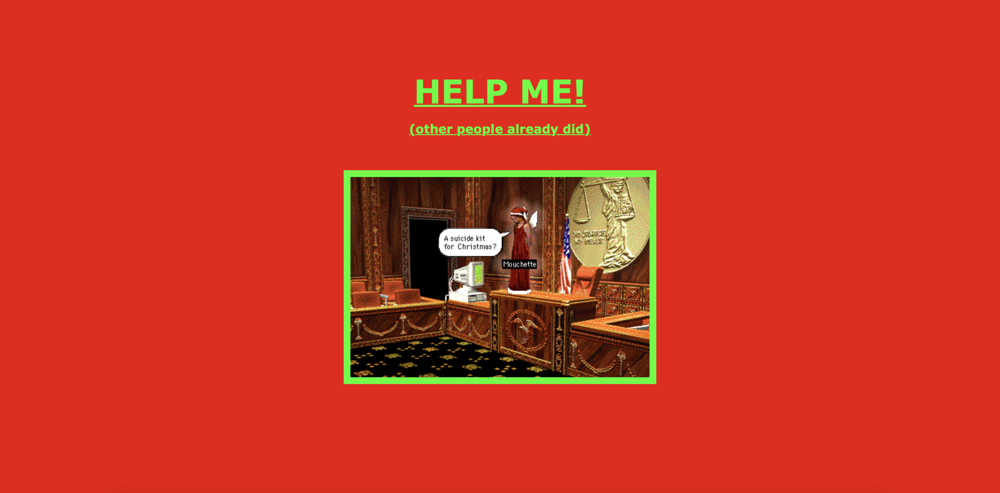

 

While exploring the domain of mouchette.org, I noticed myself getting
lost in the same familiar feelings that, up until now, were intrinsic to
scrolling through my Tumblr dashboard. The dark thoughts and desires
displayed by the character of an almost 13-year-old being out in the
open brought me back to the same feelings I had at 13.

What struck me was how precisely Neddam had anticipated the aesthetic
and behavioral patterns that would later define Tumblr’s confessional
culture. The site’s juxtaposition of girlish visuals with existential
dread mirrored my own Tumblr experience. Whereas, of course, the
difference was Mouchette’s website being a carefully constructed
artwork, and our Tumblr blogs were most often unconscious, messy
autofictions.

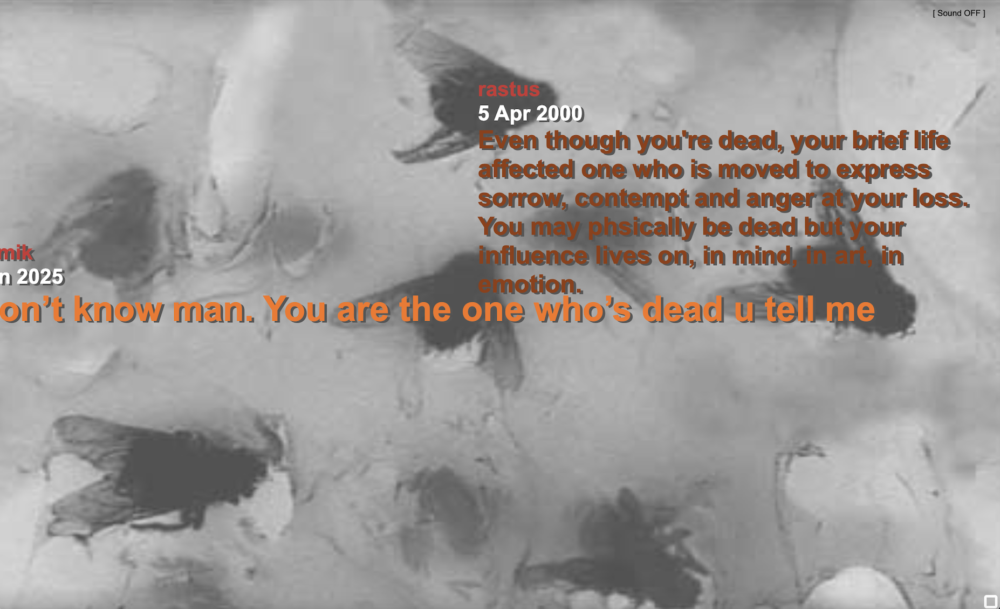

 

Lauren Berlant’s concept of *intimate publics* helps explain Tumblr’s
ecosystem of shared vulnerability. In The Female Complaint[^22chapter19_1], Berlant
argues that:

> an intimate public is an achievement. Whether linked to women or other
> nondominant people, it flourishes as a porous, affective scene of
> identification among strangers that promises a certain experience of
> belonging and provides a complex of consolation, confirmation,
> discipline, and discussion about how to live as an x.

Tumblr operationalized this: the platform’s reblog function turned
intimate, personal suffering into viral, communal texts. Every
disturbing post wasn’t only a cry for help, but a template others could
adapt. Notes under graphic self-harm posts functioned as a perverse
metric of care, where visibility equaled validation. You learned to
package your despair in aesthetically pleasing ways, to juxtapose frat
party gifs with confessions about your eating disorder, to make your
suffering palatable enough to be consumed by strangers. We weren’t
expressing sadness; in reality, we were competing in what could only be
called the Trauma Olympics, where visibility passed for validation, and
the most graphic posts received the most notes.

This tension between real pain and performed pain is where Mouchette
becomes most illuminating. In an interview with Annet Dekker, Neddam
describes the suicide forum of mouchette’s website as "*a social space
where people could communicate and help other people*". It’s striking
how precisely this project anticipated the ecosystems of care we’d later
build and use on Tumblr. Mouchette’s greatest insight wasn’t that people
would perform care online, but that they’d do so more earnestly for a
fictional character than platforms would ever let them do for each
other. We built real support systems in Tumblr’s margins, but instead of
making our troubles solvable, the platform turned them scrollable.

I feel like it is crucial when talking about Tumblr to include the *Sad
Girl Theory*, since its roots are deeply interlinked with the platform.
In 2014, artist and writer Audrey Wollen proposed a theory that female
sadness should be looked at as *an act of resistance* against the
hypermasculine system of domination, rather than a performative,
self-involved, passive action.[^22chapter19_2] In retrospect, I have trouble
agreeing with Wollen’s theory. As opposed to stigmatized notions of
*sharing*[^22chapter19_3] your private business, especially on topics surrounding
mental health, all the trauma posting I encountered in my years on
Tumblr in some way felt liberating. This liberation and, as called by
Wollen, *resistance* swiftly turned into another online aesthetic, which
itself was tailored to capitalise on white, skinny, western middle-class
girls and their pain, leaving no space for anyone who didn’t fit into
those very confined categories.

Maybe what Wollen’s Sad Girl Theory misses is that our Tumblr years
weren’t just about resistance or aesthetics—they were the messy work of
digital adolescence. This was the evolution of drawing eyes and roses in
middle school notebooks, translated for the platform age. Where we once
filled margins with angsty song lyrics, we would reblog My Chemical
Romance lyrics over grainy photos. The physical diary became an
infinitely scrollable dashboard, but the impulse remained the same: to
externalize the unbearable weight of teenage angst.

To conclude my reflection on my Tumblr archive, maybe what emerges isn’t
just shame or nostalgia, but something more useful. A critical lens on
how platforms mediate emotional development in the platform era. These
archives matter not because they’re embarrassing or profound, but
because they document what it means to come of age in systems that turn
identity formation into engagement data.

I want to end this essay with a \#hopecore message I found while
perusing the suicide forum of mouchette.org. I am leaving you with a
message from Loraen O. D. from the 10th of May 2010.

> Live to love deary if nothing else. Pleasing to all and as addictive
> as a smile, love is all you need. All other emotion crumbles before
> it; they are neutralized in its wake. Love heals all wounds as they
> say. You suffer merely from the lack of this emotion. A simple
> prescription of love once a day will remedy this childish desire for
> an end of yours. Open up to your anyone, hang out with that someone,
> share a smile with a stranger. Love is not a commodity in short
> supply, rather it is in low demand. It comes to those who look for it.
> My dear, find love and you will never forget it. Likewise it will
> never forget you. Find it in any form with anyone and when you have
> found it, cherish it. Go on; start now! Don't wait. Get on the phone
> and talk to Julia, or got to Alex's house. Head over to the local park
> and smile at people, talk about the weather or the world. Walk to your
> father, tell him you love him. Run to your mother, give her a hug.
> Theres no time to lose, only time to gain assuming the state you're
> in. To start you off and to end my note I'd like to say: Good luck,
> have fun, and I Love You!

***Anielek Niemyjski*** *is an independent researcher based in Amsterdam.
They are an Artistic Research graduate of the Academy of Fine Arts in
Warsaw. Drawing on digital nostalgia and online archives, their research
practice explores collective memory, identity, and resistance in
networked cultures, with a focus on early web practices and alternative
forms of online presence.*

[^22chapter19_1]: Berlant Lauren. *The Female Complaint: The Unfinished Business of
    Sentimentality in American Culture*. Duke University Press, 2008.

[^22chapter19_2]: Lucy Watson. “How Girls Are Finding Empowerment through Being Sad
    Online.” Dazed, November 23, 2015.
    https://www.dazeddigital.com/photography/article/28463/1/girls-are-finding-empowerment-through-internet-sadness

[^22chapter19_3]: Stigma imposed by previous generations, that inculcated the same
    conception in our (millenial, gen-z) generation.

#Drown Your Laptop: On Office Sirens, Working from Home, and Aesthetics of Refusal

##Agnieszka Wodzińska

###Originally published on September 9th, 2024

*Summer came and went. I realised I had spent just as much time being
outside as I did watching others be outside. On TikTok, I came across
clips of people drinking and relaxing on beaches (screenshotted outfits
that were particularly linen-heavy), hiking next to sprawling lakes
(saved to my “places” folder), making colourful drinks, etc. This is all
seasonal, standard, maybe predictable. But then I spotted another genre,
one much more surprising and enigmatic: people on laptops and taking
calls in the sea.*

 

I was immediately drawn to these visuals of seemingly self-aware and
slightly unhinged performances of office diligence, set outdoors to the
soft tunes of Kate Bush or Enigma’s “Sadeness” track. It made me think
of feminist performance art from the 80s and 90s, but from there I
started to wonder what else these clips can tell me about not just the
microtrend bubbles but online and offline spaces beyond my For You page.
Following writer Marlowe Granados: 'as TikTok rapidly proliferates, its
aesthetic influence \[...\] can be seen beyond the platform;' my goal is
to theorise with these videos and images to extract ideas about not just
online trends, but also gender performativity, corporate culture, and
even environmentalism. To do this, first we must consider the following:
who is the office siren, and what on Earth is she doing?

##The Office Siren Emerges

It is not easy to pinpoint which user first started posting this kind of
content. Bigger creators always have an easier time claiming that fame.
Regardless, Tati Brueing, Gabriela Mendez, and Mimi Aarons all showed up
on my feed around the same time over the summer, sharing their version
of what commenters identify as the notorious 'office siren' aesthetic.
Here, it is taken to the next level, as the creators descend into the
water, evoking something mythological.

When I search for the videos again, they are difficult to find as they
often get posted without any hashtags or descriptions. Once I decide to
search for the suggested 'office siren' term – which itself seems to
have gained popularity at the start of 2024 – I first find fashion and
beauty tips instead, all about how to achieve the look. They want me to
become a sexy and confident female office worker reminiscent of 1990s
and 2000s popular films and fashion magazines. The video game character
Bayonetta often shows up as a reference, with her signature black-framed
glasses and long dark hair. Characters from films like *The Devil Wears
Prada* (2006) and *Charlie’s Angels* (2000) also make appearances.

 

One text-post from TikTok describes the style as: 'sleek, feminine,
professional'; 'Samantha Jones from Sex and the City,' 'feminine, sexy,
and successful without caring if she’s being judged.' If this is an
evolution of the girl boss, I don’t particularly want it. I hope we are
not mutating trends just to make our way back to romanticising being a
worker under late-stage capitalism. But if we are, is this what we need
to feel better about the state of the world?

Adding to this discourse, TikTok creator aiomiiii shares her verdict:
'to me, it’s like a costume of what people who don’t work think what
it’s like to work \[in an office\]. I know it’s supposed to be vintage,
work, recession, but it looks silly to me sometimes.' I look at the
style tips: smokey 90s (I think?) eye make-up, lip liners and lip gloss,
thin, black-rimmed glasses, sleek hair, playing with
'office-appropriate' patterns and materials but maybe showing more skin,
subverting office-wear expectations, or bending various rules of what is
'office-appropriate.' The playfulness of the office siren aesthetic
becomes clear. I am watching people online *playing dress-up*, in a way
that seems more aware of itself and its purposeful shallowness than many
preceding TikTok fashion trends.

It could be that the office siren is an evolution of corpcore,
normcore’s 9-to-5 sibling. We seem to be commodifying every aspect of
our lives by labelling ourselves ceaselessly and linking each label to a
list of products to buy. It’s almost as though this is the only agency
we have: when work is inescapable, permanent, when it bleeds into the
rest of our lives, is it actually a rebellious act to narrow it down to
its appearance—its signifiers—and choose to play with that, making the
work unserious?

The office siren aesthetic stirs up conversations around authenticity –
*these people don’t even work in an office!* – and femininity in the
workplace, with HR workers 'reviewing' office siren posts to share
whether they would get in trouble. Some of us can’t seem to stop
working, or policing, even when we go home.

The politics of the office siren look are interesting as they ask us
what categories we are expected to apply when thinking about
'professional' appearance, and how much of it is rooted in
discriminatory and objectifying convictions. Are office sirens
objectifying themselves by wearing stockings and low-cut blouses? Or are
they reclaiming their version of femininity in male-dominated office
environments? Does it really matter, since this trend seems to belong on
TikTok first—with its playfulness and performativity—and in physical
workplaces second, if at all?

 

One creator cites 'officeladyspecial,' a YouTube channel for a Japanese
fetish website, as a source of inspiration. I watch their videos to see
women in office wear walking on the shore, struggling against waves,
drenched and confused. Maybe this content does pander to some kind of
patriarchal desire of helplessness, but then again, it is self-proclaimed fetish content, unlike the videos I stumbled upon on my
For You Page. It seems that the TikTok users’ references to pop culture
point in the direction of empowerment instead of subjugation but the
line is sometimes blurry, as was the case with the aesthetics of
cottagecore a few years ago.

 

So far, we considered what the 'original' office siren trend consisted
of, and reflected on some of its characteristics and potential avenues
of interpretation. It could be the case that just like many other
aesthetic trends online, the office siren also mutated into something
more, something different – oceanic, watery, performative, fluid and
always shifting. Perhaps the hot weather of the summer months in the
northern hemisphere pushed her in the direction of the beach, where she
can work remotely into infinity. Why is this link to water so strong,
even identified by one user as “ocean core”?

##Being Mythical / A Mythical Being

Women and water have a lot of history, often existing together in
various mythologies and collective imaginations. The term 'office siren'
points us towards the Ancient Greek feminine part-animal figure (bird or
fish) who lures sailors to their deaths with their beauty and
hypnotising power.

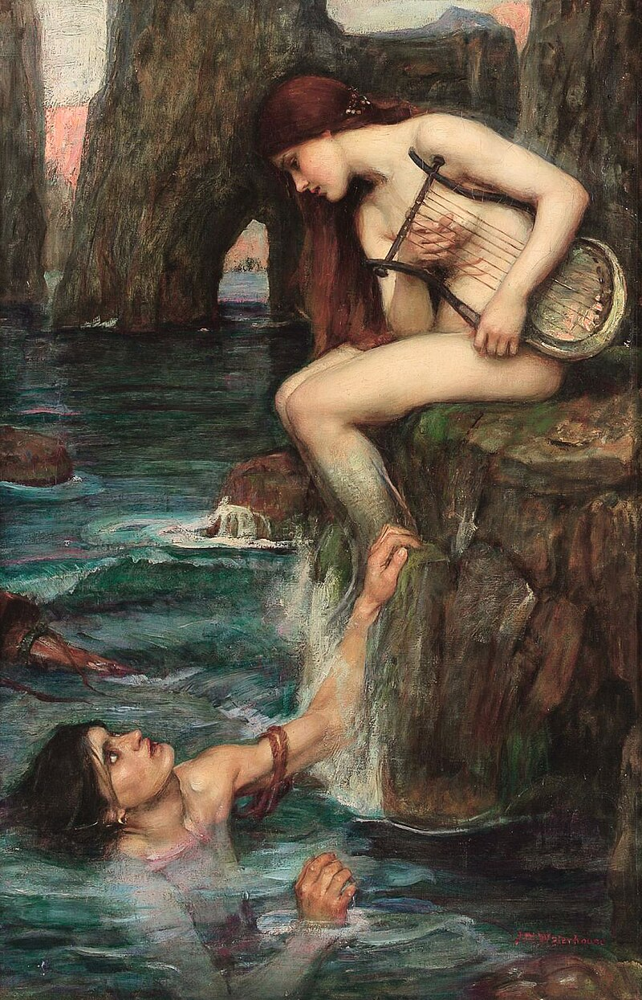

 

Then we have sea nymphs, Nereids, much less threatening than sirens and
therefore easier to paint as docile in subsequent depictions throughout
centuries. All over the world, Suvannamaccha, nure-onna, drowned girls
and mermaids, spirits and messengers haunt the canon of watery women and
femmes.

The TikToks I am focusing on here are sirens reimagined: working girls,
icons of remote work, patron saints of Teams, harbingers of corporate
culture. To take calls from the shore is absurd, to pretend to work on
your laptop as it drowns in seawater is tongue-in-cheek. These creators
are performing productivity, just like so many others on TikTok who
carefully prepare and share their morning and evening routines,
exemplified by the ‘my 5 to 9 after my 9 to 5’ trend. But with office
sirens, we have an acknowledgment of the silliness this kind of content
shows – yes, I am recording my work, which means I had to set up this
shot, so I might as well work on a laptop that is *not working*. Typing
into oblivion looking at a black screen.

If we consider my office sirens as sirens in the mythological sense,
they are symbols of hybridity. Not just 'part-human, part-animal,' but
also 'part-online, and part-in-person.' Hybridity as flexible work,
part-remote work that these creators choose to conduct outside, in seas
and oceans, rivers and creeks.

Hybridity, as in, you cannot escape your boss because they can see you
through your webcam, and you are in your bedroom, working next to your
bed, or maybe on your bed, and you can no longer cut your work out of
your personal life, because your work is your life, your workspace is
your leisure space, and you have no choice in the matter (if you don’t
work, you die), so you should at least try to be happy.

The siren laughs. She takes her company laptop and drowns it. She
performs the endless cycle of desk job tasks into absurdity. Underwater,
the tools of her labour short-circuit and become obsolete. Here lies her
monstrous nature, and in this rebellion, she does what the rest of us
are too afraid to do: she gets closer to logging off. Still, she is
stuck in the rituals of corporate work, an officeid, or an Outlookoë.
This tension is interesting to me. As if the watery language of capital
keeps the office siren bound to her oceanic desk.

##Disrupting the Flow of Capital

The relationship between this watery office siren aesthetic and remote
work is something the creators themselves reference, adding captions or
in-video text that echo the language of working from home.

Could it be that these creators, instead of working against corporate
culture, are working *within* its confines to see what is possible, what
kinds of boundaries they can push? I base this on memes that keep
emerging over the years about high-paying senior members of staff taking
calls from the most random places, as though it is not jarring or
unexpected. Ceara O’Sullivan’s character Lorraine encapsulates this well
in the “millennial vs. their boomer boss” series on TikTok. Younger
workers are often not given the same level of flexibility as senior
members of staff, bound by the expectation that you have to prove
yourself, be on your best behaviour, embody professionalism in order to
earn perks later down the line, perks that rarely come to younger
generations, perks that seem expired, of a different time.

 

Writer Joshua Citarella claims that younger TikTok users are 'mocking a
society in which self-determination and upward mobility have long since
collapsed.'[^23chapter20_1] So, if young people are indeed disillusioned with work
culture as previous generations have known it, maybe they can find joy
in imagining and enacting the ability to work absurdly. Why not take the
edge off of the kind of work that need not be serious?

Satirising corporate culture could be a way to break out of the confines
that tell us to tie our dreams and aspirations to professional
development. Especially in the wake of financial crises, political
upheaval, and looming climate collapse in all their manifestations, the
dire need of a senior colleague to check in on your workflow and
progress on a random weekday afternoon feels completely unnecessary and
inconsequential.

This critique of ‘business as usual’ reminds me of second-wave
institutional critique and works like Andrea Fraser’s “Museum
Highlights: Gallery Talk.” As her alter-ego Jane Castleton – a visiting
lecturer at the Philadelphia Museum of Art – Fraser takes visitors
through the space, going through the motions and mannerisms of museum
tours and sprinkling into the script jabs at the uncritical coloniality
of North American (and European) museums, the exclusivity of donorship,
and the increasing consumerism of institutions supposedly non-profit and
in service of the public. Similarly, office sirens reach for the look of
a diligent office worker and refuse to follow through, rebelling against
the expectations of their ‘institution’—their employer, presumably a
for-profit corporation. This refusal to follow through sheds light on
modes of control built into seemingly neutral aesthetic and linguistic
ways of being under late-stage capitalism.

We are all human beings with complex inner lives that corporate work, or
any kind of work, can never satiate. A lot of young people online are
realising it and talking about seeking fulfilment elsewhere, settling
for 'easy' jobs or ‘quiet-quitting.’ The pandemic played a significant
role in this shift, highlighting the inconsequentiality of much of the
labour that goes on in the West under late-stage capitalism.

My office sirens chime in, typing away as their keys splash with
seawater. I think this genre of videos emerged this summer partially due
to this relatively recent push online to foster and protect our
identities outside of work. If we go into the office to clock in and
out, then its culture and conventions might start to look more and more
constructed, therefore collapsable, malleable; material to manipulate
and shape.

This kind of play could be one method to take back some of the time and
energy that corporate structures steal from workers. To pretend to work,
to record yourself doing it; to post it and maybe make money from that
instead, or just make it to express something, read comments, start some
kind of conversation, however fleeting. Maybe it is possible to disrupt
the flow of capital through this kind of ambivalent anti-corporate
performance.

 

There is power in putting on a mask. You get glimpses of what life could
be like if you were someone else, if you looked different, thought
different. An array of artists—I am thinking here of Adrian Piper and
Cindy Sherman—wear various personas, exploring new perspectives on how
the world perceives them, how they perceive themselves depending on how
they choose to present, what they choose to centre in their bodies of
work. With Sherman’s famous untitled film stills series, it is exciting
for viewers to decipher more-or-less cohesive identities for each
character she presents, albeit while filling in blanks, but being able
to use all the visual cues and references to popular culture the artist
is leaving behind.

Meanwhile, my office sirens remain somewhat unknowable outside of their
work identity. They put on vaguely vintage yet untraceable costumes and
work on presumably broken equipment, which also reads as not 2024, but
not specifically another date either. Their content critiques
contemporary corporate obsessions with productivity, business, perceived
success, but does not propose alternative ways of being beyond labour.
Still, by uprooting a corporate aesthetic and making it absurd, they
highlight the ruthlessness and pointlessness of business-as-usual, and
this kind of disruption can resonate far and wide, like ripples on the
surface of a lake.

##Drowning in Emails, or Just Drowning?

Finally, I wonder if my siren is an environmentalist. Does she despair
at the thought of rising water levels? The determination of these
(pretend) office workers to keep typing as their laptop hits the water
makes me think of Tweets and memes about how young people today will
probably have to keep working forever. So, the ocean-bound office siren
might also embody a fear of working until we run out of breath, or a
related but more ephemeral existential anxiety or dread.

There is the obvious contrast between the laptops, phones, printers in
these clips and the more 'natural' surroundings. Most of us probably
don’t associate beaches with work: in fact, it is an image that comes to
mind when you think of a holiday (how much this is influenced by travel
agencies and capitalist definitions of 'relaxation,' I dare not think).

Yet, in an era of constant availability, you might find yourself taking
calls from places that in the past made you think of leisure. Nothing is
sacred. Work can happen anywhere, holidays are only this sought-after
and carbon-heavy because of extreme expectations over how much we should
work, and even bodies of water cannot escape the residue of
microplastics and bits of office equipment as my office sirens dip them
in, protesting the very thing they must do to survive – work.

This tension is what draws many users to these clips. It’s unexpected,
even unhinged, to see our precious laptops reduced to malfunctioning
props. The videos are often left to interpretation –posted without much
of a description – which pushes users to ponder meaning and comment with
compliments like 'this is art' (lured by the siren?). Indeed, it might
be art. It definitely enters into conversation with a rich history of
women and femme artists wearing personas and/or communing with nature,
sometimes both, like Ana Mendieta’s ephemeral and haunting sillhouettes.

 

Media and theory scholar Martina Leeker comments: 'Art – specifically
performance art – has traditionally prevailed as a method of gaining the
distance necessary for a reflection and critique of techno-cultural
conditions.'[^23chapter20_2] So, perhaps these clips can be read as a collective
performance of the inability to break out of capitalist expectations. In
their mockery of corporate mannerisms, they propose an emerging
aesthetic of refusal.

 

Interestingly, one of the most popularised synonyms of the climate
crisis is the rise of sea levels. As hybrid creatures working in a
hybrid way, my sirens bear the brunt of changing environments by having
to work partially underwater. Through them, we might also watch
ourselves transformed, hybrid beings emerging from foam, especially
through TikTok as a recent study by Jian Lin, Joëlle Swart and Guohua
Zeng argued that 'the boundaries and distinctions between users’
identities become less clear-cut and subject to constant modulation.' In
light of all this, who and what might we become?

Plastic is in our blood and our brains[^23chapter20_3]. We find it virtually
everywhere we go. There is something monstrous in this kind of
pollution, but monstrosity doesn’t have to mean a denial of humanity. It
will be imperative to consider what kind of work is worth doing in these
conditions, especially as they gain severity. Can we embrace monstrosity
and hybridity – all siren-like, mythical, spanning across history –
while making space for playfulness, joy, resistance, performance?
Contemporary art scholar Anne Gerlieb suggests that 'TikTok favours
playfulness over certain styles and looks.'[^23chapter20_4] If the mode of being on
the platform is playfulness instead of striving for cohesiveness (often
associated with early 2010s Instagram feeds), then it is porous, and
therefore more capable of moving through aesthetics and into another
more relational way of being.

##Where to Swim from Here?

My office siren takes on the behemoths of remote work and climate
anxiety, working through them as she herself works. Through her eyes, we
start to conceive of these notions differently. Through her submergence,
we begin to see ourselves as more fluid, therefore more capable of
facing various iterations of the future.

Trends on TikTok tend to move fast, transforming into new versions of
themselves, merging into umbrella terms for similar sensibilities, or
splitting into smaller sub-genres and trends. The girlboss phenomenon
observed in the previous decade across platforms like Instagram and
Pinterest might be rearing its head in the formulation of the TikTok
office siren—a corporate girl seemingly content with her occupation,
inspiring others to achieve the same. But the office siren in the sea
knows she is being looked at. She puts on an absurd show that rejects
normativity the girlboss craves. In contrast to previous microtrends and
aesthetic-specific online communities, the office siren performs in
manners and settings that point to her self-reflexivity.

When considering previous outdoorsy aesthetics, VSCO girls come to mind.
VSCO girls appeared online last decade, evoking a brand-friendly
environmentalism and an appreciation for scrunchies, reusable water
bottles, and a beachy lifestyle. Similarly, cottagecore users on TikTok
and elsewhere filmed themselves in nature earnestly, walking through
meadows and towards Victorian cottages on my feed as though to say: *I
do this all the time anyway, I just decided to film it for you just this
once.*

Granados: *'TikTok shifts the visual dialogue away from the perfectly
manicured aesthetic of Instagram, which is known more for its users’
aspirational, flawless image curation. TikTok instead privileges
on-screen presence, performance, and bite-sized narrative'*[^23chapter20_5]. It can
be messy and ambivalent, but those qualities make some TikToks
inherently more complex than content on other platforms.

The rise of earnest work-from-home videos on TikTok from the onset of
the pandemic and the subsequent increase in critique towards influencer
culture, followed by the phenomenon of 'easy jobs' and a stronger
conviction to build identity outside of work all facilitate a space for
watery office sirens to star in the kind of content they created this
summer.

Even if we crave authenticity in what we encounter online, our platforms
are built to give us just the opposite. They spike specific kinds of
either vitriolic or banal content into virality and otherwise feed us
images and clips that keep us on the platform without much meaningful
action or real engagement. It’s like watching a puppet show and seeing
all the strings: the magic is gone and the experience becomes
distracting and jarring, odd and still somehow mesmerising.

Every now and then, a new kind of sensibility emerges from TikTok that
jerks me out of this state of passive agitated consumption (last year,
it was corecore). Lin, Swart, and Seng contend: 'TikTok as a platform is
not only mediating and facilitating the production of short videos but
has become culture itself.'[^23chapter20_6] And culture produced by femme creators
online continues to feed my curiosity and propel me towards some kind of
hopefuly engagement.

As I wrap up, I keep close the notion that through TikTok and its
endlessly personalised and mutating visual languages, a kind of
transformation might occur. Experienced both by the creator and viewer –
and perhaps the most interesting, in the blurry line between the two
roles—this momentary shift creates an opportunity for a more conscious
(self-conscious?) being online and offline. In this moment, we get a
quick glimpse at the tethers that keep us moving like puppets, and as we
look up, we might see who is holding up the strings.

***Agnieszka Wodzińska** is an art historian, writer, and lecturer based
in Scotland. She is particularly interested in internet nostalgia,
aesthetic online trends, and contemporary multimedia installation that
deals with changing environmental and socio-political climates.
Agnieszka has contributed texts and talks to Kunstlicht, The Hmm,
Metropolis M, Woman Tech Lab, as well as the University of Edinburgh and
University of Exeter.*

[^23chapter20_1]: Joshua Citarella, ‘Welcome to TikTok, the Wildly Popular Video App
    Where Gen-Z Make the Rules,’ *Artsy.net*, 2018,
    https://www.artsy.net/article/artsy-editorial-tiktok-wildly-popular-video-app-gen-rules.

[^23chapter20_2]: Martina Leeker, 'Performing (the) digital: Positions of critique
    in digital culture,' *Performing the Digital*, 2016, eds. Martina
    Leeker, Immanuel Schipper, Timon Beyes.

[^23chapter20_3]: Damian Carrington, “Microplastics found in human blood for first
    time”, *The Guardian*, 22 March 2022,
    https://www.theguardian.com/environment/2022/mar/24/microplastics-found-in-human-blood-for-first-time.

[^23chapter20_4]: Anne Gerlieb, ‘TikTok as a New Player in the Contemporary Arts
    Market: A Study with Special Consideration of Feminist Artists and a
    New Generation of Art Collectors,’ *Arts*, 10, 52, 2021.

[^23chapter20_5]: Marlowe Granados, ‘I Turn My Camera On: Notes on the aesthetics of
    TikTok,’ *The Baffler*, no. 43, 2020.

[^23chapter20_6]: Jian Lin, Joëlle Swart, Guohua Zeng, ‘Theorising TikTok cultures:
    Neuro-images in the era of short videos,’ *Media, Culture &
    Society*, vol. 45, 8, 2023.

#Welcome &gt;\_&lt; Take a Seat Wherever: The Spatial Politics of the Bedroom

##Ruben Stoffelen

###Originally published on December 10th, 2026

*Where are you right now? In your bed? At your desk? In your room? Where
do you keep all your stuff? Do you watch TikToks in your bed? How much
is your rent? Do you have a chill landlord? Do your parents pay for part
of your rent? How many times did you move? Can we hang out in your room?
Can your roommates hear us rn?*

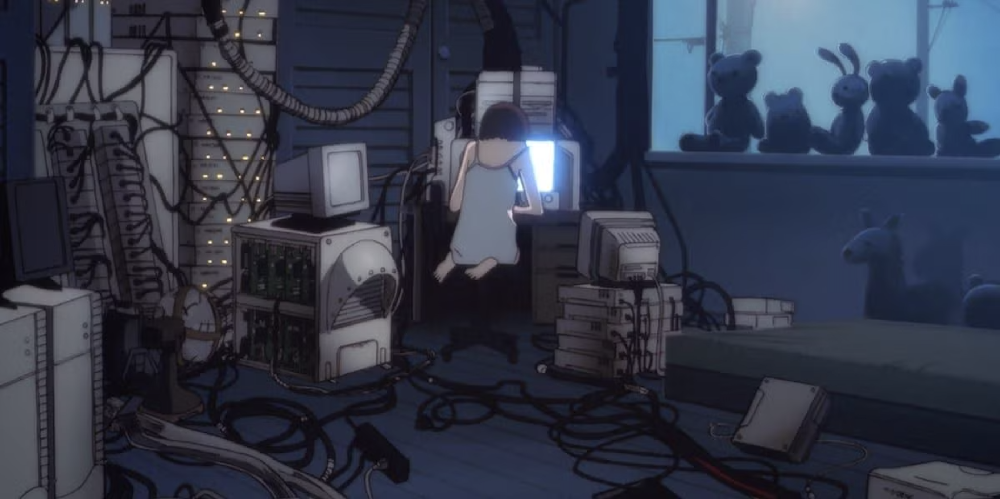

 

My bedroom has always been a significant space to me. When I was a kid
and lived with my parents, my bedroom was a space for privacy and
experimentation, for play and dreams, something a little bit sacred. But
as I got older and dreamt about moving out, I became occupied with
visions of my own apartment, and eventually my own house with a garden
and a driveway and maybe even a shed. But as domestic pessimism set in,
I abandoned these ideas altogether, instead, I started thinking about
the spaces I do inhabit, the space that is mine. So where am I now? I
managed to move out but I don’t have my own place, I’m living in an
increasingly common domestic reality: with roommates in a shared
household. If you’re reading this in an apartment you are most likely
also sharing it with roommates, maybe even with your parents
(proto-roommates). At least in the country where I live, this tends to
be the case. At first it was only in your early twenties, then your late
twenties, and more recently it has become normal to live with roommates
into your early thirties. Either way, not much changed since I was a
kid: the bedroom is still a special place. But the bedroom itself has
changed, its spatial limitations in physical space are conversely
overcome by the spatial limitlessness of cyberspace, and its presumed
slowness is overhauled by the rapidity of computational temporalities.
With a computer or a phone, the bedroom becomes a portal as much as it
is a safe space, it becomes as vast as it is cozy.

 

Through networked technologies and digital culture, the bedroom was
culturally revitalized, spawning several figures and characters: the
NEET, the incel, the femcel, the keyboard warrior, the basement dweller,
the gamer, the crypto bro, the hustlepreneur, etc. These figures spend
as much time as possible in their bedroom, enabled by their devices
which grant them access to online subcultures, decentralized
communities, digital markets, and entertainment. The NEET is a
particularly fascinating figure; the acronym, which stands for ‘Not in
Education, Employment, or Training’, became popularized on 4chan in the
2010s and was used self-referentially in various forums following its
emergence. Its correlation with 4chan made a lot of sense: the only way
one could truly be chronically online was if they didn’t go to school or
have a job. But NEET’s don’t only exist as imagined characters, they
inhabit physical spaces, mainly their bedrooms, occupying the desk which
hosts their computer setup.

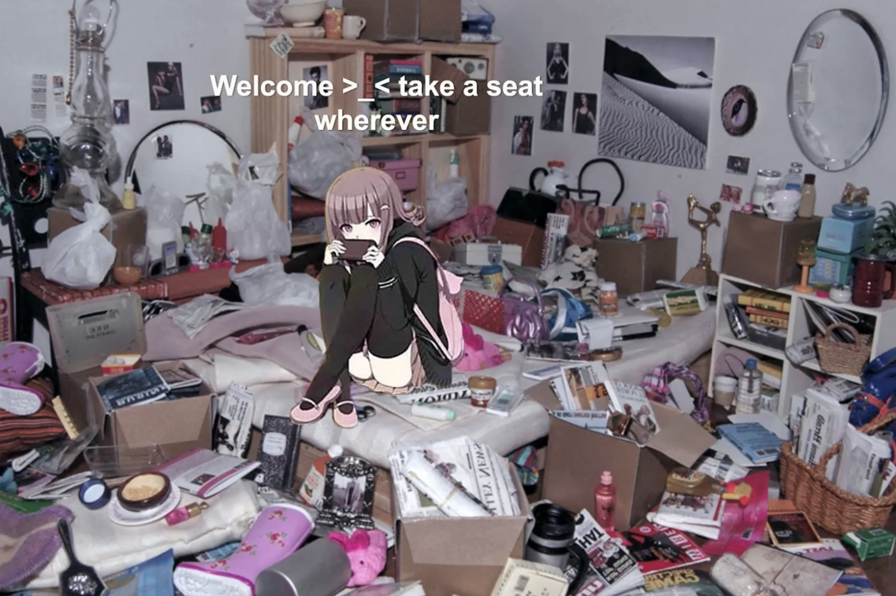

 

The bedroom also became more significant in the age of neoliberal-policy
induced precariousness. We are, more often than not, banished to small
rooms with – if you’re lucky – a queen sized bed in which we can
fantasize about one day having more than just that room. As the number
of roommates increases proportionally to the decrease of square meters
and our peers move back into their parents’ places[^24chapter21_1], our domestic
realities become typified by the bedroom: the one space which still
feels truly like our own. The bedroom becomes an autonomous zone within
the shared household, and even then it's a precarious one. Evictions,
shitty contracts (or no contracts at all), a lack of registration,
increasing rent, all threaten the autonomy of that zone. Particularly in
the Netherlands, which is where I live, recent political discourse
centers the housing crisis as one of the most urgent issues to be
addressed. And as the feeling of seemingly eternal precarity and
roommates sinks in, our bedrooms become layered with new meaning. It
therefore comes as no surprise that the convergence of what I will call
bedroom culture and digital culture naturally leads to gooncaves and
battlestations; to new ways of existing in our rooms. The NEET’s
existence, in particular, also emerges in reaction to precariousness.
Through networked technologies we enter alternative worlds and
temporarily escape precarity – maybe we even overcome precarity all
together.

 

Keeping this in mind, it makes sense that popular culture reflects the
renewed significance of the bedroom. With it being widely referenced in
contemporary art, music, and literature. Take Tracey Emin’s sculptural
installation *My Bed* (1998), Clairo’s song *Pretty Girl* (2017) and
Ottessa Moshfegh’s book *My Year of Rest and Relaxation* (2018), for
example. All three works address the bedroom as a cultural phenomenon,
both as a space and as a concept. Clairo captured a particularly
significant cultural moment in her DIY music video for her song *Pretty
Girl*: the soft light of the bedroom after dark, the slightly fuzzy and
grainy texture of a 2015 macbook webcam, and the wired earphones; a
perfect collage of what it felt like to be an upper middle class
teenager in the late 2010s. She tapped into a socioeconomic and cultural
feeling with her song, something which strongly resonated with people.
Moshfegh’s book, similarly to Emin’s work, gestures at a femcel or NEET
identity—a politics of withdrawal where one spends as much possible time
in their bedroom, becoming completely unproductive (bedrotting). In My
Year of Rest and Relaxation—and for NEET’s more broadly—the bedroom
becomes a stage where unproductivity and refusal are performed.

But perhaps the moment when the bedroom became inaugurated as the final
destination for zillenials was during the pandemic. Whereas NEET’s and
incels had been heavily stigmatized for living out of their bedrooms,
the pandemic radically reconfigured the bedroom as an acceptable space
to spend all your time in, a space where you could eat, sleep, work, and
relax. In fact, you had no choice. This created a kind of perfect storm:
most western countries were already deep into two decades of neoliberal
governance and deteriorating welfare states, combined with a grotesquely
privatized housing market which rendered even the idea of home ownership
unrealistic for a lot of people. Mainstream culture caught up with the
NEET’s and the incels, spending all day in your bedroom was even
encouraged. The pandemic pushed us to the point of no return: the
bedroom is the best we’re gonna get.

 

##Politics of Refusal

There is a productive dichotomy which takes place in the bedroom: on the
one hand, it can become an aspirational space, a makeshift office, maybe
even a headquarters; a space in which we can exercise entrepreneurship.
Think of the trader, the crypto bro, the grifter giving you financial
advice via webcam, the sex worker, the streamer. The bedroom is fertile
ground for the grindset, the place where hustlepreneurs are born.
Through networked technologies the lines between the bedroom as a
leisurely space and as a productive space become blurred. There are
several examples of ways in which a computer and a bedroom can be
utilized to make money: people build crypto mines, click farms, or even
rent out the computational power of their home computer setups to
companies. Others buy a webcam or use their built-in one to stream
themselves while playing video games or performing sex work. This
reflects Franco ‘Bifo’ Berardi’s ideas about the proliferation of
semiocapitalism (or cognitive capitalism), which depends on networked
technologies to maximize labor and data extraction from so-called
cognitariats. Our devices serve as tethers which keep us connected to
globalized technocapitalism at all waking moments (even sleeping
moments, if we take devices such as smart-beds into consideration). As
we voluntarily embed these devices into our lived environments, we also
open the door to big tech and the totalizing force of networked
capitalism. Through technology, the bedroom can become a space for labor
and surveillance, it can even start to resemble a factory.

 

On the other end of the spectrum, the NEET spends all their time in
their room being intentionally unproductive; they principally reject
productivity, embracing welfare or living with their parents. Their
attitude is exemplified by the terminology used to refer to their
self-proclaimed adversaries: ‘wagecucks’, ‘wageslaves’, ‘jobcels’ or
simply ‘wagies’, which all refer to people in employment (in the form of
wage labor). In the NEET’s world, employed people are victims of the
system (in other words: capitalism, although not much critical theory
makes the rounds in NEET circles). The NEET instead sees themselves as
gaming the system; they are proudly on welfare and live with their
parents, saving and receiving as much money as possible in exchange for
absolutely nothing. This lifestyle allows them to spend as much time as
possible doing what they like, whether that’s gaming, jerking off, or
spending all day on discord. Unintentionally, they actually perform a
radical politics: namely the politics of withdrawal and refusal, which
refer to the rejection of capitalism’s labor-productivity imperative.
(Although it could be argued that NEET’s become laborers through the
semiocapitalist invasion of personal time and space, they nonetheless
gesture at the refusal of work through the rejection of wage labor). The
NEET is visually almost always depicted as pepe, whereas the wagie is a
frequently seen as a seething or tired wojak in a McDonald’s uniform:

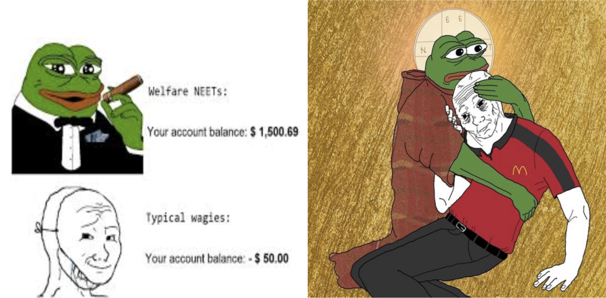

 

The figure of the NEET is culturally derived from the Japanese term
Hikikomori, which refers to people who live a hermit-esque lifestyle,
isolating themselves and generally behaving anti-socially. It should
also be mentioned that NEET’s, although generally associated with 4chan
due to the use of its visual language (pepe’s, wojaks, etc.), actually
also operate outside of 4chan's usual ideological frameworks. On the
NEET subreddit, members recount feelings of failure and hopelessness,
mental health struggles, difficult family situations, and other
systematic issues as reasons for their NEETdom. Whereas the subreddit
also has its fair share of nihilist conspiracy theory, the latter
category of NEET should not be dismissed or automatically grouped
together with 4chan’s genre of pessimistic NEETs. Similarly to the
supposed adversaries of the hustlepreneur, the NEETs main adversary
seems to be ‘society’ or societal expectations, which essentially read
as internalized pressures to be productive—capitalism’s central
imperative. Most NEETs also see wage labor as exploitative and unfair
(rightfully so), and thereby gesture at a basic tenet of capitalist
critique. What I’m trying to say is that there seems to be a radical
politics nestled somewhere in NEETsphere. One only needs to scroll
through the NEET subreddit to realize this, as it contains a myriad of
posts about wage labor being exploitative, class consciousness,
internalized guilt for being unproductive, exhaustion after finally
getting a job, precariousness, etc. You can’t tell me that these posts
are not gesturing at radical, post-capitalist and post-scarcity
sentiments.

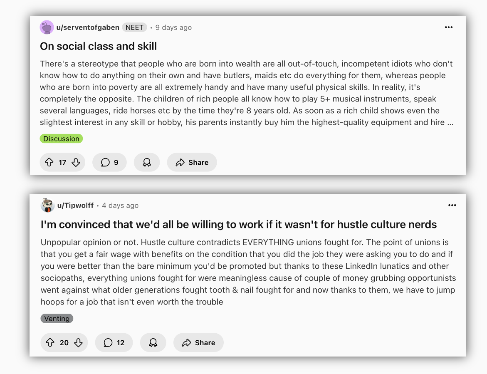

 

The incel wiki mentions the NEET army, described as:

> “a fictitious army of real-world NEETs. Some NEETs from these
> countries dress up in fake military gear and do parades or non-violent
> public stunts.
>
> N.E.E.T. = Not Employement Embattled Team
>
> It's an organization present worldwide... This army aims to fight
> against work and its exhausting tasks, they are there to rest and
> leave this active society where exhaustion is too present.
>
> Their common enemy, the "W.O.R.K organization", which is also present
> in many states, fights against them and aims to find people who do not
> work enough to force them to return to the world of exhaustion and
> fatigue.”

Similarly to the hustlepreneur, the NEET depends on networked
technology, but not to make money; rather, they use it to escape their
financial limitations and restricted lifestyle by becoming room-bound
hermits who spend all their time online, slipping into unrestricted
cyberspace. Whereas the hustlepreneur attempts to overcome precarity by
using their devices and the internet as productive tools, the NEET uses
these same devices to simply avoid and ignore precarity all together,
wallowing in naivety. The NEET subreddit explicitly lists “no
daytrading/crypto posting.” as one of its rules, for example. The NEET
is the anti-hero to the hustlepreneur; the anti-entrepreneur.

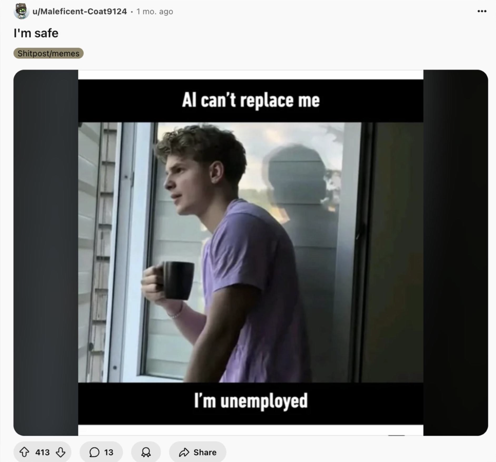

 

##Agential Panic

It should be mentioned that there are some NEETs who engage in online
ways of making money, namely stock or crypto trading, as well as NEETs
who live off inheritances and other forms of generational wealth (i.e.
their parents paying for their lives), but these NEETs are anomalies in
the overall community. Nonetheless, the hustlepreneurs and NEETs share a
common enemy—precarity—which they approach from different angles.
Precariousness, as a condition, engenders deep feelings of insecurity
and shakiness, a perceived loss of the agency and autonomy we feel
entitled to. The agency over an object or a space, such as through
ownership—of a home or otherwise—no longer feels feasible. Rather,
ownership is purposely prevented through models of rentiership,
proprietary softwares, and increasing prices, resulting in skewed
dynamics of agency and ownership. Alongside the absence of a welfare
state which previously would have guaranteed (collective) ownership or
at least fair rentiership, this has lead to an era where (young) people
feel as though they can never exercise full ownership or agency over
significant aspects of their material realities. Precariousness
therefore produces agential panic through the perceived or felt loss of
agency. If you can’t own a house, you might as well be in charge of the
one space which feels as though it truly belongs to you: your bedroom.

The feelings of lost agency aren’t only the result of neoliberal
economic policies, however, they also emerge from our computational
conditions. Jernej Markelej and Daniel de Zeeuw discuss this in their
paper on agency panic, where they attribute the concept, derived from
Timothy Melley, to have emerged from the “liberal-humanist conception of
the self as autonomous, self-determined, and \[as a\] rational
agent.”[^24chapter21_2] Markelej and de Zeeuw position this concept in our
contemporary computational landscape, wherein our lives are increasingly
governed by blackboxed computational systems while we, conversely, are
“interpellated as autonomous users.” This contradictory position is what
leads to feelings of anxiety and panic. It comes as no surprise, then,
that we seek narratives which re-stabilize our existence and affirm our
agency. In digital contexts, this is often in the form of conspiracy
theory; grand narratives in which we are being undermined and our
adversaries are concretely identified (meaning that we have scapegoats).
Whether it’s the neo-marxist elite, LGBTQ+ rights movements, or lizard
people, these forces are out to get us. When an enemy is concretized, so
are strategies of resistance, and these strategies often start with
individual autonomy. Whether it’s working out and eating raw meat,
trading and mining crypto, or making your bed and tidying your room,
these gestures attempt to reclaim individual agency (often framed as
escaping the Matrix by conspiracists). This is also why these individual
liberty gestures often emerge from the manosphere (most NEETs are men),
there is a mythologized 'masculine' ideal of self-governance and
personal liberty through individualized spaces. Take the subreddit
r/malelivingspace, for example; as the name implies, there is a *male*
way of occupying a living space. Ultimately, these are reactions to the
feelings of precarity and vulnerability; they are reductionist
strategies and frameworks which reject victimhood and embrace a form of
heroic agency. There’s something poetic about a person who feels like
the world is out to get them simply picks up their agency where they
have full control—their bedrooms and their bodies. These gestures also
reinforce the anthropocentric view of the world which we stubbornly
maintain even as we’re caught up in a complex technological assemblage
which increasingly undermines and negates the conception of ourselves as
autonomous, self-determined individuals. It would be more liberating to
embrace agency as something relational, but our understanding agency is
still largely grounded in a highly anthropocentric, individualized,
libertarian framework, an attitude which is exemplified by the
hustlepreneur, and subverted by the NEET.

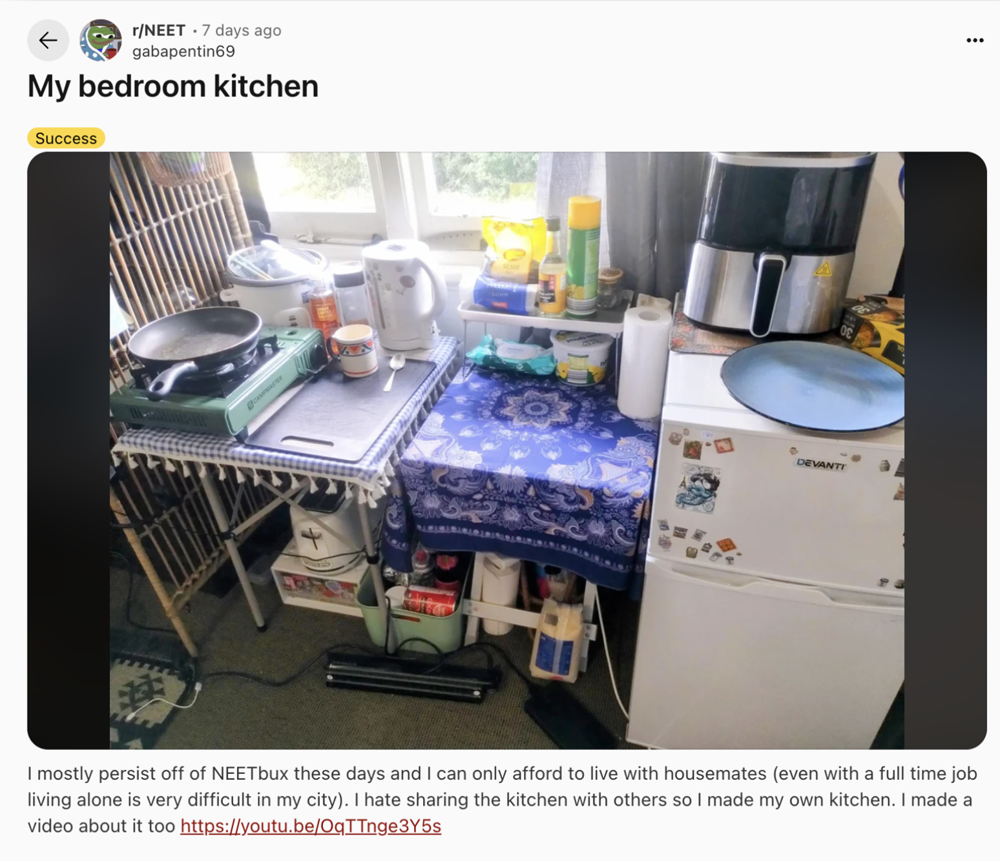

 

##The NEET and Hustlepreneur Dichotomy

There is a productive dichotomy which takes place in the bedroom: the
NEET and the hustlepreneur neatly fit into this framework of agential
panic, both figures address precarity in their respective attempts to
overcome it. The hustlepreneur exercises agency by transforming their
bedroom into an office or factory, rather than engaging in wage-labor,
they ‘escape the matrix’ by taking matters into their own hands; by
‘becoming their own boss’ and ‘financial freedom’. This leads to a cycle
of grifting the promise of autonomy and agency (repackaged as ‘financial
independence’ or ‘financial freedom’) to others in a sad cycle of
so-called entrepreneurship, usually operating out of their bedroom or
DIY office. If you look at finance grifters online, they often film
their promotional content out of their car or their home office;
individualized spaces which they have full control over. These spatial
contexts are not coincidental, rather, the car is often a central symbol
for libertarian idealism and their notion of ‘freedom’ (as well as a
status symbol, of course) and the home office demonstrates that they are
‘free’ to stay at home instead of being office-bound. The NEET, on the
other hand, accepts the perceived impossibility of financial
independence, choosing to wallow in their self-pity and embracing social
welfare as a source of income (also known as ‘NEETbux’). If they can’t
escape the matrix, they might as well be happy in it. This is also
observed by Franco ‘Bifo’ Berardi when discussing Japanese Hikikomori,
he states: “\[this\] behaviour might appear to many young people as an
effective way to avoid the effects of suffering, compulsion,
self-violence and humiliation that \[semiocapitalist\] competition
brings about” going on to state that, in his personal interactions with
Hikikomori in Japan, “they are acutely conscious that only by
extricating themselves from the routine of daily life could their
personal autonomy be preserved.”[^24chapter21_3]

Sticking with the hustlepreneur-NEET dichotomy a little longer, we can
also explore both the concepts of hopium and copium through these
figures. Both words are portmanteaus of the word ‘opium’, the former
using ‘hope’ and the latter using ‘cope’. To conflate a word with opium
implies that it sedates its user, that it soothes their qualms, and
eliminates pain. It most likely also references Marx’s seminal quote
“religion is the opiate of the masses” (already gesturing at the
metaphorical definition of ‘copium’, i.e. religion as something to help
the masses cope). According to Know Your Meme, hopium is a “fictional
drug to help one stay hopeful in stressful times” and is derived from
“stock market investors to describe market investors who hold on to
failing investments out of false hope, and more recently by Bitcoin
investors in a similar way.” The correlation between investors and
hopium is no coincidence, as their identity is underscored by hope: hope
in markets, financial freedom, hope in escaping.

Copium, on the other hand, is the drug of choice for the NEET, a
\[metaphorical\] substance that helps people deal with stress and other
negative emotions, specifically dealing with the soothing of loss. In
the NEETs case, loss of agency, of autonomy, and of respect. Let me
explain: as outlined, NEETs not only experience a loss of agency and
autonomy through their entanglement in planetary computational systems
and neoliberal-policy induced precarity, but they are also othered by
‘normies’. NEETdom is heavily associated with shame; being laughed at
when applying for jobs, feeling like parasites, often sharing qualities
with incels[^24chapter21_4]—such as being unable to take part in romantic
relationships or social life more broadly—the NEET entry on the incel
wiki states: “One would expect a large number of male NEETs to also be
incel (NEETcel), due to female economic and educational hypergamy and
the overlap between NEETdom and mental illnesses that generally hamper
male sexual success (such as social anxiety and autism).”[^24chapter21_5] NEETs feel
othered by society and simultaneously other ‘normies’ and position
themselves as enlightened, occupying an awkward position. But NEETs are
othered differently than incels: whereas incels feel othered due to
sexual/romantic inadequacies, NEETs are othered due to their inability
to be productive members of society (and often also due to feeling
socially/romantically/sexually inept, leading to the creation of the
term NEETcel). This oscillating attitude of NEETs, which moves from
confident and enlightened to insecure and ashamed, results in a craving
for copium, something which soothes this unstable position.

Although NEETs differ from the Japanese Hikikomori because NEETs are
technically capable of going outside and engaging with their hobbies
outside of their rooms (something Hikikomori’s are unable to do due to
mental health), they still predominantly occupy their bedroom (or
apartment if they’re lucky). They also rely largely on their access to
networked technologies for social contact and entertainment as they feel
othered by ‘normie’ society, hence banishing them to the spaces which
house their desktop setups. Staying inside on your computer all day is a
sort of meta-cope, and grants them access to other forms of copium. When
life becomes a cycle of disaster, crisis, decline, and doom, retracting
oneself into NEETdom is the ultimate coping mechanism. And so there’s an
acute awareness of being copium addicts, like terminal patients on
life-support, many NEETs simply exist, often describing feelings of doom
and anguish induced by their societal position. And their copium comes
in many forms, from cultural consumption (listening to music, reading
books, watching movies) to actual drugs, porn, and masturbation;
similarly to the gooner, the NEET embraces copium with open arms, using
it to persevere through their existence.

Their copium is also directly correlated to platform logics, as many
NEETs describe one of their main copes being the consumption of content,
ranging from porn to shortform vertical videos. Similarly to the gooner,
they attempt to achieve a numbing/euphoric/flow state through the
uninterrupted consumption of content, copium kills time. But the
emergence of NEETs can also be articulated through the financial
deterritorialization catalyzed by post-Fordism, wherein the relationship
between labor and value has been obscured beyond recognition. As Franco
‘Bifo’ Berardi puts it, post-Fordist, semiocapitalism is categorized by
“competition, \[which\] is all about subduing, cheating, predating.
Blaming the victims is part of the game: you are guilty of your
inability to subdue, to cheat and to plunder, therefore you will be
submitted to the blackmail of debt and to the tyranny of austerity.”[^24chapter21_6]
Financial capitalism profits from doom, and therefore incentivizes it—it
actively produces nihilism, and so NEETs naturally appear, sometimes as
hopeful postcapitalists, but mostly as doomer nihilists. When the world
is a sinking ship, the best thing to do is to get comfy in your room
while you’re hooked up to copium.

 

##Battlestations

For both the hustlepreneur and the NEET, bedrooms become headquarters
and desktops become battlestations; they rely on their bedrooms and
their desktop setups for feelings of agency and autonomy. Nick
Vyssotsky’s Display of Commodity Accessories (Zack’s Room) and Mining
Meaning (Quest for Validation) are artworks which cleverly explore the
feelings of agential panic through simulating the spaces in which both
the NEET or incel and the hustling crypto bro attempt to reclaim and
exercise their lost agency. New media, as opposed to legacy media,
allows for autonomy and agency to be exercised through usership.
Traditional forms of media have a unilateral dynamic with whoever is
interacting with them. You are simply viewing and consuming – you are a
spectator instead of a user. New media instead allows and encourages
responsiveness, and is fundamentally underpinned by a bilateral dynamic
between user and device. As Wendy Hui Kyong Chun cleverly put it,
networked devices mark the difference “between the empowered user and
the couch potato”[^24chapter21_7]. Users have responsibility, their interaction with
their device relies on their input, and responsibility is empowering
insofar as it hinges on the agency and autonomy of the responsible.
Furthermore, as users we can customize platforms, are under the
impression that we choose what we consume, we are supposedly in charge.
Particularly in the case of the NEET, who relinquishes all IRL (or AFK)
responsibilities, their onlineness most likely stabilizes the shakiness
induced by a complete lack of responsibility in the ‘real world’.

 

The word battlestation is therefore particularly revealing; referring to
expanded and elaborate desktop setups that often feature multiple
screens, a custom-built computer, an expensive keyboard, and a
comfortable desk chair, the term became heavily associated with
chronically online individuals. Taken from the concept of a centralized
space from which (semi-)remote warfare can be conducted, it implies
total control. The battlestation is the space where high ranking
military officials can strategize and assess the battlefield. It
provides oversight and the possibility for decision making so that the
enemy can be dominated from a tactical position. The overlap between the
term as it's used in warfare and to describe elaborate desk setups
uncovers that those who sit at the desk and operate the battlestation
similarly seek control and oversight, or in other words, a form of
agency. The aforementioned notions of exercising agency through new
media are therefore facilitated by the battlestation. New media requires
input and interaction which are mediated by devices, and these devices
become our agential tools. They require movement; typing, moving a
mouse, clicking and scrolling. There is a very concrete transmutation of
physical movement into digital action. The bedroom dweller has all their
controls at the tip of their fingers when positioned at the
battlestation, which is exactly why it's so empowering. If the internet
is a kingdom, the gamer chair becomes a throne.

Seasoned soldiers of onlinedom will often have two or more monitors,
signifying commitment to time spent in the digital. Similarly to the
term battlestation, the computer screen finds its origins in the
military, and so it also reproduces the same military gestures emerging
from desktop battlestations: oversight and control. The early radar
sweep technology, whose contemporary counterpart is found in software
offerings provided by companies like Palantir and Anduril, illustrates
this logic. The myriad of actions enabled by network technologies would
be useless if not for the screen, and it is through the screen that the
digital becomes interpretable and can be acted upon. Screens flatten and
condense things – originally space, now vast amounts of data – they are
essential in the transition from machine-legibility to human-legibility.
Human-legibility, in turn, leads to human-action; computer screens don’t
simply represent things, they present them in order to be acted upon or
to be acted with. The screen thereby facilitates the exercise of human
agency and control, something which is underscored by its military
origins. For the NEET or the hustlepreneur, screens and computers are
modes of empowerment and control. It’s no coincidence that the crypto
traders desk and the PC gamer setup resemble the control rooms of drone
operators.

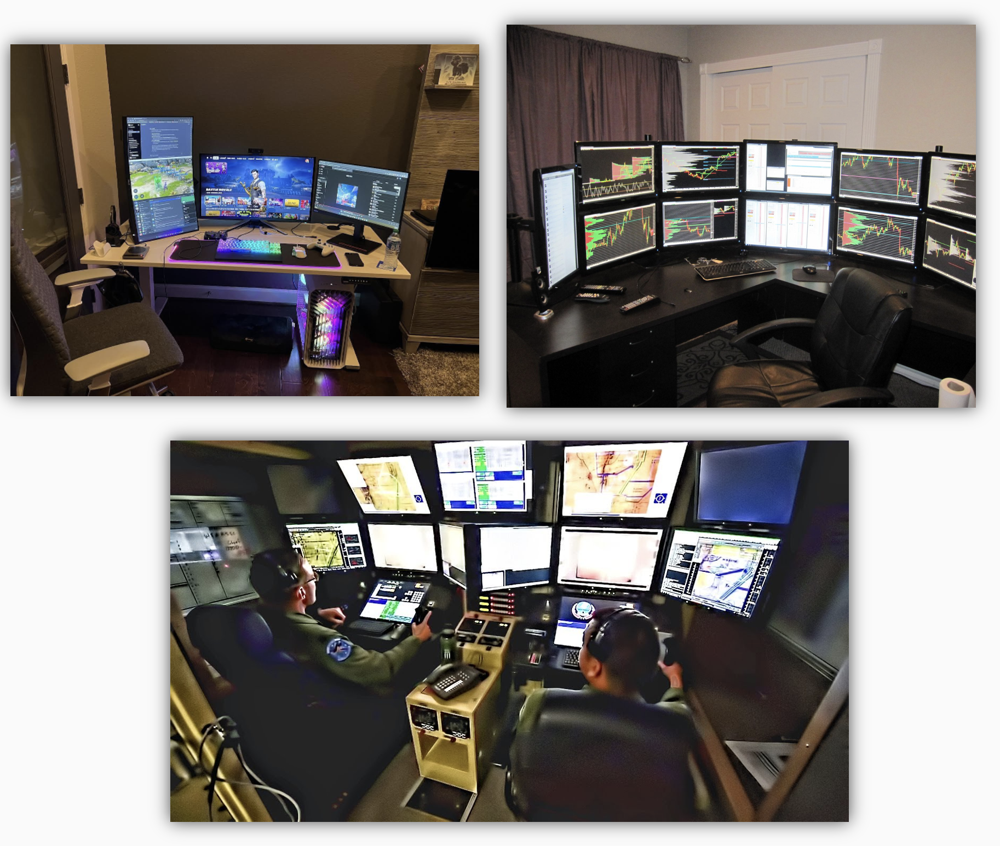

 

The desire for agency and autonomy which is achieved through a
battlestation can be expanded to the bedroom in general, which is most
likely where the battlestation is positioned anyway. In a way, we all
address our feelings of agential panic through careful curation of our
rooms and desks. Our bedroom becomes a battlestation in and of itself.
Reflected by the ubiquity of people accessorizing their bedrooms to the
point of becoming mini houses (think piss-bottles, mini fridges, desks,
couches, TV’s, etc.), we create mini-realities, our own little worlds in
which we decide and we have control. In doing so, our bedrooms begin to
resemble war-rooms, places of control, places to lock in.

***Ruben Stoffelen** is an Amsterdam based writer and independent
researcher who holds a research master degree in Cultural Analysis from
the University of Amsterdam and is working at the Institute of Network
Cultures. His research ranges from networked subcultures and visual
culture to infrastructure and the built environment, whilst underscoring
digital culture and agency.*

[^24chapter21_1]: The Dutch Central Bureau of Statistics (CBS) observed an increase
    in young adults (18 – 31 years old) moving back in with their
    parents between the period 2011 and 2021

[^24chapter21_2]: Jernej Markelj and Daniel de Zeeuw. “Caught in the Loops of
    Digital Agency Panic : On NPCs and Internet Addicts”.
    *NECSUS European Journal of Media Studies,* 2023.
    http://dx.doi.org/10.25969/mediarep/21712
    
[^24chapter21_3]: Franco 'Bifo' Berardi, *Heroes: Mass Murder and Suicide*, (London, 2015).

[^24chapter21_4]: See Kate Babin’s *Condemned to Rot Alone: The Incel Paradox of
    Collective Loneliness*, on page \[…\] in this book

[^24chapter21_5]: “NEET,” Incels Wiki, https://incels.wiki/w/NEET.

[^24chapter21_6]: Franco ‘Bifo’ Berardi, *Heroes: Mass Murder and Suicide*, London:
    Verso, 2015.

[^24chapter21_7]: Wendy Hui Kyong Chun, “Crisis, Crisis, Crisis, or Sovereignty and
    Networks.” *Theory, Culture & Society*, vol. 28, no. 6, 2011, pp.
    91–112, https://doi.org/10.1177/0263276411418490.

# Starnet: A History of Internet Cafes in Iași (Romania)

## Ruxandra Mărgineanu & Radu-Mihai Tănasă

### Originally Published June 21st, 2024

*It’s around 3 or 4 in the morning - and my priority right now is to
make sure I open, and then close the apartment door quietly enough so
that my parents won’t get woken up by my sudden appearance in the house.
Although it might seem like it, I didn’t go out with my friends in the
club or at the bar that night; I was coming back from a “Full Night” at
the most popular internet cafe chain in town. *

As common in post-communist countries, Western trends reach us 10 years
later. After the fall of the Iron Curtain and the brutal transition to
the free market, Romania was late with the 90’s trend of internet/cyber
cafes. Thus the 2000’s were its golden age.[^25chapter22_1] For a good decade, every
teenager had cheap and reliable access to the World Wide Web - and
especially to the beast that was Counter Strike 1.6. But after ten
strong years, almost overnight, internet cafes became extinct.
Redditors[^25chapter22_2] along with old[^25chapter22_3] and new[^25chapter22_4] bloggers alike are now
collectively grieving and reminiscing about the good old days of the
2000s, when the grass was greener and the internet cafes were the place
to be. Yet somehow, somewhere, in the north-east side of Romania, in the
city of Iași (where we grew up), bordering the Republic of Moldova, the
internet cafe became a living fossil - thriving and surviving, even
today.

Although the second city of Romania in terms of population, size and
development, Iași remains the embodiment of the underdog. While neither
as cool as the capital Bucharest nor as flashy as Cluj, Iași was blessed
with a constant growth in all its sectors - including internet cafes. At
its peak, Iași was home to three internet cafe franchises along with
smaller establishments when most cities in the country could only host
at most two or three locales. No one knows what the right ingredients
were for such a miracle to happen. But what’s known is that since 2003 a
new generation of internet cafes started popping up throughout the city.
Slowly but surely they became a catalyst for a subculture that would
eventually define entire generations of local millennial and Gen Z
gamers.

## What is an Internet Cafe?

Internet cafes are somewhat of a misnomer. The term is used in Romania
to refer to a place that houses a specific community of gamers.
According to Wikipedia, the term internet cafe refers to an
establishment whose main form of revenue is made through the provision
of affordable access to the World Wide Web, using high-speed internet
and dedicated hardware (usually gaming computers). As with any other
private endeavors, variants can pop up through mixing and matching
different businesses: some internet cafes offer food/beverages, others
might do some print jobs, and so on. The uniqueness of each internet
cafe is not limited to the novelty of the business idea, as much as its
associated community, which defines its unique purpose.

 

Internet cafes were originally called cyber cafes, after London’s own
Cyberia Cafe (according to the Brits), although early variants of it
have been documented ever since the 1980’s in Hong Kong.[^25chapter22_5] In the
early days these places were frequented by everyday people whose needs
and wants were to connect with others virtually using telnet, IRC, ftp
and to surf the Web. The writers cannot go into more detail about the
specifics and the vibes of that time as both of them were too young and
too much into gaming to relate to specific 1990s Internet experiences.

What we do know is that these normal people with their normal needs for
virtual communication would eventually be replaced by the gamers, whose
appetite for new hardware, newer games and ever-shrinking wallets made
these places the perfect middle, and perfect meeting ground. And
business owners were eager to welcome and adapt their locales for them.
Office chairs were replaced with gaming chairs, webcams became gaming
headphones, and light bulbs turned into gaming neons. Take Nexusclub:
anything to make a gamer feel at home.[^25chapter22_6]

The World Wide Web and its avatar, the personal computer, that laid the
foundation for what was to become the internet cafe. In June of 1991,
SFnet was the first entity to put together the exact building blocks for
one by installing 25 computer terminals throughout the San Francisco Bay
Area. It thus managed to establish a working coffeehouse network.
Following SFnet’s success, businesses around the area started to imitate
and improve upon the original recipe, creating cybercafes and finally,
the internet cafes. In the beginning, these establishments were marketed
as places that gave you access to web communication services for an
affordable price. It’s best to think of these places as an upgraded
version of the payphone.[^25chapter22_7] Users would typically frequent cybercafes
to send emails, browse IRC channels and do light research of current
news. This is what gamers typically call “normie” behavior.

As technology, and more specifically hardware, evolved in the 2000’s, so
did the scope and the clientele of some of these cybercafes. Personal
Computers could now reliably run not just offline single-player games,
but giants like Starcraft, Defense of the Ancients and World of Warcraft
quickly became virtual staples in many hard-drives around the globe. LAN
parties were just becoming popular, and innovative cybercafe owners
quickly realized that they could grow big by facilitating a dedicated
place for not just a LAN party, but LAN party-parties.

Why go through the trouble of creating a timetable, setting up a
dedicated server and cleaning your gamer cave, when someone else could
do that for you? And for cheap too. The shift from just offering access
to virtual communication to including gaming in their repertoire of
services is what transformed the then 'cyber cafes' into the 2000’s
'internet cafes'.

To understand how big the Internet Cafe craze became, one must look no
further than to Basshunter’s hit *DOTA*, released in 2006 - marking the
exact turning point of this mentality shift. The music video presents
three main environments considered, at the time, the three epicenters of
ideal Gamer life: the Bedroom, the Club and the Internet Cafe, with the
last being turned into a concert-tournament hybrid.

Viewers are presented in the beginning with the imagery of the classic
LAN party, with all its ups (girlfriends) and downs (moms); to be then
hit with a perplexing club scene, in which no computer is seen in sight,
as the focus is on the social interactions. The glue that binds it all
is eventually presented in the aforementioned Concert-Tournament
Internet Cafe Hybrid - the ideal marriage between the highs and lows of
competitive gaming and the social adrenaline of late-night clubbing. It
is the sea of computer screens, the jungle of jumbled cables and the
comfort within the concrete walls of this Mega LAN Party that many
gamers consider the great Internet Cafe Utopia. But how accurate was
this admittedly very idealistic depiction in different parts of the
world, especially in the land of Dracula? As we, the writers, were too
young to experience the birth and the early life of internet cafes in
Romania, we have to resort to second-hand reports. Luckily, we can get a
very small but relevant overview of internet cafes in Romania straight
out of 2004, in a study on Internet access in the country at the
time.[^25chapter22_8]

 

It seems that 2004 had quite the downer vibe, as the writers were not so
sure about the future prospects of the internet cafe. But even from
their language, we can gather that they are still using the word to
reference the business model as it was operating in the West. We can
therefore make an assumption that the iconic gamer identity of the
Romanian internet cafe came sometime later in the Y2Ks.

With the advent of the personal (home) computer, access to the World
Wide Web slowly started to democratize. While in the West this started
in the late 80’s, in Eastern Europe this happened in the new
millennium.[^25chapter22_9] Because of the abrupt  jump to capitalism, internet
infrastructure developed very quickly as there wasn’t much older tech to
replace it. At the same time, access was disproportionately
over-represented in urban centers. Even today on the countryside,
internet access is still almost exclusively done via smart phones.[^25chapter22_10]

Having a (recent) Communist past that has now transitioned to a
free-market democracy, Romania has seen a rapid increase in consumer
goods spending and in technological advancements. Unlike the
Netherlands, Romania only has had a few decades of experience to deal
with this mentality shift in creating subcultures around consumer
products. Yet, similar to China, Romania has a bigger sense of social
cohesion. Social activities are still a much bigger part of the everyday
person’s life than in NL (the weather helps a lot too). Hanging out on
the street is much more common in these countries than in the West,
where such behavior is more associated with (dangerous) teenagers and
their unsuccessful helicopter parents.

Comparing liberal Western countries (what Romania aspired to be since
2008) to still existing Communist countries such as China (what Romania
once was), democratic access to rapidly developing and affordable
technology seems to accelerate the shift to gaming as a more
individualistic hobby while on the other hand having a higher barrier of
entry to certain hardware and using a middleman (or middle-space) seems
to paradoxically create a stronger sense of community amongst
gamers.[^25chapter22_11] Using this axis we can better understand where Romania can
be placed with regards to internet cafe culture.

Internet cafes offered this unique situation where a private entity can
create the ideal third place for young people who are interested in
gaming to hang out through a relaxed barrier of entry, non-stop hours
and affordable pricing by using recently built reliable and high speed
internet infrastructure. As a newcomer to the capitalist game, Romania
has made numerous enthusiastic changes to laissez-faire economic
policies to contrast with its dictatorial past. Thus, the strategy of
running an internet cafe had to follow this new mentality. Combine it
with people’s generally more social predisposition and their love for
nightlife, and you got yourself the perfect business.

Everyone was welcome, regardless of social status, ethnicity, gender or
technical skill. The internet cafe was where competitive MOBA
girl-gamers met with casual FIFA-enjoyer highschoolers and
CS:GO-obsessed gang members. All internet cafes were populated not just
during the night, but more often than not, during school hours.[^25chapter22_12]

## Starnet

Let's focus on  internet cafes in Iași and zoom in on Starnet, which was
-and still is-the biggest internet cafe annex franchise in the city and
a general point of reference in terms of organization, pricing and
diversity of services. The choice for Starnet was made to honor our
shared community and lived experience, making sure that we speak as a
community member and not as a detached, cold observer. This comes with
certain disadvantages, mainly the difficulties we have faced in trying
to go deeper into the inner workings of Starnet as a private endeavor.
Business owners in Romania are notoriously paranoid and opaque about
their practices, not eager to collaborate or give details into how they
run their business or what their motivations are. We had to resort to
interviews with Starnet customers in an effort to still adhere to a
vague sense of objectivity or integrity. What Iași offered in terms of
quality, such as service, products and community, was indeed of higher
quality than the country’s average.

On their website Starnet proudly claims that in 2023 they celebrated
their twenty years anniversary. We were unable to find any relevant
information of Starnet’s inception or anything dating earlier than 2014
through unorthodox online archives such as browsing locale review sites.
And knowing how private the Owner is in regards to additional details
meant that it would be quite hard to assemble a complete timeline for
now. Business owners in Romania are in general quite reluctant to
sharing too much information, as they always risk either getting
questioned by the Government (which already eats up a lot of the profits
through high VAT, income taxes and much more); or they might
accidentally overshare unethical business practices, which is still
(unfortunately) the norm.

We estimate that the establishment indeed started in 2003 but the
registration name would have been different and the address might as
well just be someone’s apartment rather than something akin to a cafe.
We looked into Google Maps as a last resort concerning the localities.
Since the gaps in time are quite big, Maps only gave us only vague time
intervals of activity. Through this we can confirm that the oldest
Starnet was (already?) a thing by 2011, 3 years earlier than its other
digital footprints. But then again, 2011 was also the first year of the
Google car visiting Iași. Other online sources might point as far back
as to 2008 as a legitimate period of Starnet activity, but this can only
be implied by looking up Stargrill’s opening year, which was a
restaurant sharing both the location and the name with Starnet.

 

Beyond the respectable humble beginnings and perhaps some (possible)
loopholes at play, we suspect that it took quite the time to eventually
set up such a locale, as equipment was very expensive for the time, it
needed to be upgraded quite frequently - and not to mention the
egregious prices software companies demanded for commercial use. What
type of small business owner would be thrilled to pay for Windows,
Winrar and other such expensive expenses? For now, this is the amount of
gossip we are able to entertain.

For honesty’s sake, we have to admit that our introduction to internet
cafes was linked directly with high school, thus around 2015-2016.
Around this time is when it felt as if the internet cafe phenomena was
gaining rapid momentum. Their positioning and identity was also quite
clear: this was not your grandma’s internet cafe where you log in to
yahoo to check your business email or Nigerian prince scams. This was a
place for hip, *dank* gamers who no-scope everyday while listening to
Skrillex and 420 blazing it. Internet cafe owners knew what gamers, and
especially teenagers, wanted.

Looking at older 1990’s localities in Western Europe and the US such as
Easy Internet Cafe, we were shocked by the clean, corporate look that
these cafes sported. Starnet and it’s competitors could not be any more
different: rooms were dark, only lit by neon bands; the computers were
slim, edgy and dark; and the walls were all decorated in gamer
references, usually paintings of characters from different video games,
with different rooms inside of the cafe having very thematic names like
Gods, Gladiators, or Pirates.

If there was one thing that Starnet focused strongly on from the very
beginning, it was organization, structure and economy. The moment you
stepped in as a newcomer, you were required to sign in and join their
database. You were asked for your ID, fill in paperwork with basic
contact information and pose for a picture. Some might consider this
draconian measures, but this initiation ritual was spiritually meant to
show how intertwined the virtual and physical are. On a more practical
level though, knowing that every customer had a personal account, unique
username and an overview of recent activities inside the establishment
put a lot more weight on individual actions and responsibilities.

## The Starnet Business Model

If you behaved poorly, which was frequently the case in many internet
cafes, the staff could immediately intercept and penalize you. If you
were a good customer and a team player, the community or staff could
reward you with (sometimes under-the-hand) perks or discounts. Such
manners of dealing with gaming-based communities have been also
implemented in countries like Korea, where attaching limited personal
information to League of Legends accounts and/or internet cafe customers
has resulted in less overall toxicity and misbehavior - no wonder it
also worked in Iași..

But the initial screening wasn’t done just for security’s sake. If it
were just for that, Starnet would have been seen not as a successful
internet cafe, but as a prison. Instead, they coated this safety measure
with a UI and quality-of-life improvement virtual service. Every
computer in Starnet was locked behind a log-in screen. This meant that
unintended use by strangers was kept at a minimum. And more than that,
every Starnet computer had a custom navigation screen, slightly
different from a normal Windows configuration, so that anyone,
regardless of their IT skills or experience, could access whatever
virtual service they wanted at a moment’s notice. Users also had a whole
internal economy they could manage through this UI and that really
reinforced the idea that you are not using a regular computer, you are
using Starnet’s curated version of it.

 

After you logged in to your account, one last thing to do before playing
was to, of course, buy hours. Buying hours was the main Starnet product.
Customers had the option of buying different amounts of hours that
allowed them unrestricted access to the computers. You could either get
a standard fee of per hour spent in front of the screen, or you could
buy hours in bulk for a discount. One, three and five hour packages were
usually the standard, but for dedicated gamers, even 24 hours packages
could be bought.

Starnet had their own currency called “stars”. *Stars* could be obtained
either from unused purchased hours, or through codes that were usually
handed by starnet staff directly - or by simply buying them. *Stars*
acted as readymade discounts, every Starnet product had 2 prices: in
RON, or in RON + Stars, with the latter always costing less real-life
currency provided you collected enough *stars*. Starnets’ own user
interface also kept track of your money and stars through your own
dedicated wallet. Users could not just hoard or keep the spare change
for future sessions, but could also show some generosity by transferring
money or stars to other players, further fostering a sense of
beyond-virtual community.

Along with virtual products, Starnet offered real-life products in the
shape of drinks, food, and more recently, even shisha (for a good price
too). Bringing food from outside was considered against the rules,
although it was hard to reinforce, as even the employees themselves
would bring in or order food for their impossibly long 10/20 hrs shifts.
In its golden days, Starnet had a dedicated, non-stop, in-house
restaurant called Stargrill, a kind of gamer cantine. Customers would
usually ask Starnet staff for a Stargrill menu and after making up their
mind, would walk a few meters to the restaurant desk and kitchen, shout
their order and go back to their game. After 30 to 40 mins, Starnet
staff would graciously visit their computer desk with a freshly cooked
dish, and the customer would in turn quickly and carelessly toss the
money so as to not lose the focus on their match. Stargrill offered a
variety of finger foods perfectly crafted to be eaten in short,
seconds-long bursts, when you were either in a match lobby, going to
lane, or respawning.

*Everytime you bought something from Starnet, a small receipt would be
printed and handed to you. Each one started with a small message that
read: “The best Internet Cafe in Romania”*

 

## The "Full Night" Experience

Beginning with 2015, Starnet attempted to differentiate itself from the
other Internet cafes by creating a stronger community with its customer
base, those being mostly middle and high school teenagers. The in-house
UI always presented customers with different choices of products, like
the previously-mentioned bulk hours. But now they would upgrade to
contain dedicated packages based on the time of day most customers would
be most active.

One such product was the now-classic “Full Night” package. This item
single-handedly turned Starnet from a small local establishment to a
local business giant. For the very low price of approx. 30 RON (less
than 8 EUR at the time), you could sit in front of the computer for 8
uninterrupted hours starting anywhere from 20 to 2 o’clock. Internet
cafes in Romania were different from its Western counterparts for having
similar working hours, and being under similar jurisdiction to casinos,
which were open non-stop. With this “Full Night” product, Starnet was no
longer offering a better deal just compared to other internet cafes.
They were now directly competing with hostels for quick and cheap
overnight accommodation; and clubs for cheap and safe social
entertainment. This decision inevitably transformed the Internet Cafe
into the dominant alternative night scene in Iași.

Starnet employees never did background checks. Neither were they paid
enough to do that. The owner could not be bothered either. Contrary to a
(night) club, the bar for entry was nonexistent. This meant that for a
minor, the internet cafe was their first introduction to nightlife. The
laissez faire business strategy that Starnet pushed, of having a main
consumer-group composed of minors, should have been a PR disaster. That
was, if the authorities had been notified, or if parents were made aware
of this. Luckily, most parents had no idea what an internet cafe was.
The more helicopter types assumed that it was a casino, as the Romanian
term for games (jocuri) was usually associated more with gambling than
MOBAs.

Surprisingly, the mix of ages, backgrounds, and later on even genders,
made internet cafes both the most inclusive and one of the more toxic
spaces of Iași. The best way to picture oneself inside Starnet is to
think of a place like 4chan or perhaps more aptly, a League of Legends
/all chat, where everyone sits in the same room. Among the cacophony of
mouse and keyboard clicks, curses, slurs and broken English was the
norm. The occasional encouragement or sincere congratulations for
carrying a match felt ten times more rewarding in this sea of intensity.
Yet, no matter the frequency of f-, c-, g- and other one-letter slurs,
when it came time to have a siggy break, everyone came outside the
locale in good spirits, reminiscing about the crazy experience that was
the previous match, regardless if it was a loss or a win.

 

In its *golden days*, a Starnet establishment would usually be
frequented by high schoolers skipping class, young professionals who
could not afford either the Microsoft or Adobe Suite, unemployed people
that would use the Internet to apply for vacancies, and sometimes by the
rare homeless person who had nowhere else to stay during the long and
cold winter nights.

Similar to internet cafes in Japan, Starnet acted as a temporary shelter
solution for the jobless, homeless and in general, the less privileged.
For them, the internet cafe was everything a hotel could *actually*
provide in this new era of digitalization. Starnet graciously offered
not just a great selection of video games, but (questionably) legal
licenses for the MS and Adobe Suites, Yahoo Mail and Google Drive, food
through Stargrill, and even limited printing services in some cases.

*Overnight, thousands of nerdy teenagers now had to create the most
elaborate excuses to get to spend the night in what their parents
thought was an elaborate casino establishmen*

## Portrait of a Starnet “Operator”

Starnet seemed to have a very simple hierarchical structure. There was
the *Owner*, and immediately underneath him, the Starnet employee. The
heart and soul of every Starnet location was its *Operator*, a person
whose job was, on paper, to provide technical help when the PCs would
act up. But that was just the job title. In reality, the Operator would
do everything: helping people with IT problems, being a good host to the
newcomers, acting as a guard when unwelcome guests would show up, doing
the regular clean up, selling snacks and keeping the tab. And all of
this on a 10, to even 20-hour shift (counting ciggy breaks only btw) on
(less than) minimum wage. A Starnet location would usually have one to
maybe two *Operators* active at a time, and no one else.

Though the job prospects were awful, the *Operator* was perhaps the best
person you could befriend in a Starnet. The *Operator* was in many
regards just like you; either a nerdy League player, or a more
street-smarts guy who enjoyed his CS 1.6. Throughout your “Full Night”
set (and thus, during his shift), the *Operator* would be right next to
you, playing a round of CS:GO to slack off; bringing you a Cola while
talking about how to better play your jungle main; or telling you about
his break-up on a cigarette break. The *Operator’s* mix of slight sense
of authority and relatability made him the perfect pillar for the
internet cafe community, as many people likened him to the Bartender of
an RPG, who introduces you to all sorts of people, stories, gossip (and
quests).

To add to the persona, most of Starnet’s *Operators* were an important
part of the community even outside of their working hours as most of
them would finish their shift only to start playing as customers
themselves, in turn passing the authority to the next person in charge.
This shifting between employee and customer meant that every Starnet
locale was deeply in touch with the wants and needs of the community -
and though Starnet was a business at the end of the day, it managed to
organically create a sense of community that many enterprises today
could only dream of.

*The man next to the cash register always seemed bored or phased out.
But the moment I say the magic words: “Operator!” - his face switches
with either interest, or perplexion.*

Around 2016, Starnet started getting an influx of new visitors and
veteran customers constantly, regardless of season, month, week or time
of day. The previously mentioned laissez-faire mentality that the owner
pushed for had finally paid off. So much so that new Starnet locations
popped up almost overnight, in sync. The owner had also planned for each
location to have a certain specialization, or niche:

*Starnet Târgu Cucu* is by far the oldest and the most popular location,
situated in an old, slowly dilapidating building. If the outside of the
building gives off a slightly pessimistic atmosphere, the interior tells
another story: old interwar architecture fuses with neon lights and
slick gaming stations, painted walls depict different video game
characters and the same 2hr club gaming playlist plays nonstop.

The location has 3 rooms filled with computers, with the central room
providing an additional Playstation station, therefore it was seen as a
less casual-friendly location and more as the place where you go to
grind out ranked matches. This Starnet’s highlight was by far the
StarGrill business which was operating in the same building. Instead of
having to order and then wait up to two hours for some gamer grub,
customers only had to talk to Starnet personnel and they would get their
dish of choice within half an hour guaranteed.

The (previously) third in size and second in popularity, *Starnet
Iulius* was an instant hit with the local gamer community and eventually
proved itself to be a successful investment for the long run. Found on
the ground floor of Iulius Mall, a symbolic location where the
first-ever Mall was constructed in Iași after the 1989 Revolution.
Spanning over a few different rooms and even having its own entrance,
outside of the Mall’s working hours, Starnet Iulius Mall was especially
a hit with younger audiences. As overworked parents came to the Mall for
their weekly grocery shopping, leaving their kid/ teenager sitting for 2
hours in front of a computer or a PlayStation console for the low price
of 10 RON (approx. 3 Euros) seemed like the logical and safest choice.
Perhaps this choice is what ultimately led to the closing of KidsLand,
the Mall’s own playground, which was itself on the brink of celebrating
ten years of activity.

A more successful out of the new generation of franchises, the *Starnet
Podu Roș* branch proved to be extremely profitable with its
unconventional yet somehow intimate location. Hiding in plain sight
right in front of one of the main city roads, Starnet Podu Roș boasted a
giant “PUBG or Fortnite” banner in its glory days, no doubt an ingenious
trick to get people’s attention and thus, new customers.

Perhaps this was also the reason why all Fortnite and PUBG competitions
started happening there almost exclusively. Unfortunately the unorthodox
location that was neighboring a very popular casino in the area would
eventually prophesize its demise. As teenagers would begin their gaming
journey by buying CS:GO skins, the allure of gambling inherent in loot
boxes translated perfectly to slot machines.

The smallest branch, *Starnet Unirii*, was strategically placed right in
the middle of the bustling city center. Although at first it seemed like
it was the main player, and the one to hopefully bring the most revenue,
Starnet Unirii was the first branch to close permanently. Being known
for its polarizing effect, customers thought prices were exorbitant for
the high-end machines while cheaper tickets gave you access to subpar
computers. These days Starnet Unirii is remembered to have managed to
pull in the casual market, with the main money makers being the
Playstation and Xbox consoles. That money, however, was not enough to
keep the establishment afloat.

The notorious one of the bunch, *Starnet Hala Centrală,* was an example
in resilience, managing to outlive its Unirii counterpart despite its
drawbacks. Not being known either for high-performing tech or memorable
staff, and being placed in an awkward location on the first floor of
Hala Centrală commercial center, this location felt more like an
afterthought rather than a focused, strategic business decision. Sharing
a location with a mall or commercial center can be both a blessing and a
curse; Starnet Iulius Mall, with its ground-floor entrance, proved to be
the first option. But Starnet Hala Centrală’s position on the first
floor in an establishment with a 12 hr opening hours schedule made it
challenging to access the nonstop Internet Cafe inside; especially in
the weekend, and at night, when most people were most eager to gather.

## The Dark Ages (Covid)

The rise of Starnet seemed more and more exponential, but during 2019,
things seemed to mellow - locations got closed permanently and fewer
people were coming. You could feel it in the prices that were growing,
and in the avalanche of spur-of-the-moment limited offers, discounts and
packages Starnet would send on your phone. The breaking point however
proved to be March of 2020 and the worldwide lockdowns that followed
afterwards. Every business got hit, but Internet Cafes were hit the
hardest, as the bulk of their customers saw themselves locked inside the
house for almost three consecutive months - only to be followed by more
random week-long interdictions sprinkled in throughout the whole year.

To curb the huge amount of losses the business had suffered, the Owner
had resorted to some drastic measures. Firstly, Starnet started
operating according to casino regulations during 2021 (and 2022). This
meant that the Internet Cafe was allowed to operate from morning until
midnight on non-lockdown weeks and to be fully closed on lockdown weeks.
This rule gave both casinos and Internet Cafes an edge against other
establishments like museums, clubs or restaurants, which had very strict
opening schedules, with exact visiting days being planned and announced
weeks or even months ahead of time; whereas the former would just open
immediately after a lockdown - at least that is what the documents said.

 

According to official documents and the vigilant eyes of the police,
Starnet was conducting business as usual. Within an old historical
building, Tg. Cucu Starnet was as lively as ever, although customers and
staff alike were more vigilant than ever before. Some precautions had to
be taken, in order for the money to come in: gamers had to sit one chair
apart from each other, effectively cutting the maximum capacity in half;
masks were encouraged, but not mandatory; smoking either inside or
outside was strictly prohibited, so as to not draw the attention of the
police; and exiting the building during a “Full Night” was the worst
crime one could commit.

But by far the most interesting addition was the voice alerts that every
computer now possessed: when staff learned that planned police
inspections would take place throughout the lockdown months, they
installed a customized voice announcement in each computer to alert the
customers of incoming government checks. A few hours or minutes
preceding the inspection, a gamer would hear mid-match a voice that
would recommend customers engage in mask-wearing and social distancing
while being outside their homes. The previous quick briefing by the
Operator made the gamer understand that this was not a kind request by
Starnet staff to conform to basic lockdown rules, but a warning call
that police inspections might happen in as little as 5 minutes. They
knew that by the moment they heard that voice, they had to either leave
the location immediately or to wear a mask for the next few hours.

This is how Starnet managed to not only stay afloat during the worst of
times, but to be more successful than even casinos, Romania’s most
thriving industry; subtly managing to evade the watchful eye of the Law.
Subtlety was the way to go when the government called for drastic
measures.

## Starnet Today

As of 2023, the wave of bad luck continues to hit Starnet. The inflation
that followed the pandemic made regular customers think twice about
whether or not to spend the night in Tg. Cucu or the Iulius Mall. Prices
kept rising, to the unbelievable 13 RON/hr (approx. 2.5 Euros) compared
to the 5 RON/hr (approx. 1 Euro) that used to be the golden standard.

Even so, Starnet is proving time and again that resilience is what wins
the fight. Even with higher prices, fewer locations and a diminished
customer base, the internet cafe chain still seems to stay afloat.
Locations appear to be continuously populated at a third or quarter of
their capacity. While the era of Starnet championships is gone, they
still proudly sponsor up-and-coming pro teams to hold their title of
“Best Internet Cafe in Romania”. To prove that 2023 is nothing like
2015, they have adapted to the times and are now giving extra discounts
and offers to female customers to combat sexism and to hopefully reach a
previously untapped demographic. Their recent acquisition of a brand new
PS5 also suggests that perhaps casual players are slowly coming back
too.

The second half of 2023 proved to be of help to Starnet, as Iași was
nominated almost overnight as the Esports Capital of the World.
Thousands of esports fans, streamers and even professional teams all met
up to battle it out on the territory that Starnet called home. For a few
weeks, Starnet was no longer just a successful albeit small local
attraction, it was a worldwide superstar enjoying its short but
well-deserved 15 minutes of fame.

Perhaps a new Golden Age era will arise for Starnet? In a few decades or
centuries, Iași will be known not only for being the city of linden
trees, great ideas and seven hills but for being Starnet City, an
evergreen protector and living museum of the Romanian Internet Cafe
Spirit. However, during a recent trip to photographically document the
location, the writers were informed by the photographer that the Starnet
Iulius Mall was no longer active. In its place, a VR-focused
establishment was built, perhaps signaling to us the beginning of an
entirely new era.

During August 2023 Iași was designated International Esports Capital.
Our (not so) small city was finally put on the international map of
gamers. Teams of competitive players from all around the world played
their finals in Romania’s City of Culture, and, of course, Best Internet
Cafes. Behind the multitude of events like championships and celebrity
concerts, news of the darker motivations behind this event appeared in
the public discourse.[^25chapter22_13] According to some of his colleagues, the
mayor had been planning the Esports publicity stunt intending of
laundering money for his (alleged) real estate mafia deals. As the
gossip goes, the Mayor tried to cash in the 1 million Euro funds that
were allocated to the event production by transferring the money to a
(fictitious) foreign third-party entity responsible for event
management. As is the case with European Union funds, a lot of
politicians use loopholes such as third-party government companies as
“partners” in production projects, and the latter’s offers and services
are always mysteriously charging two to even ten times the usual market
rate.

Not only was the mayor thus accused of fraud through public funds - but
it seems that the third party itself, which ended up being registered
under one Macedonian individual, was able to get all of the money it was
transferred without a trace and suffering no consequences. A classic
story of a thief being out-thieved. We were interested in recent
developments of this drama and how the public at large perceives gamer
culture. The decision to organize mass public events catered around
gaming marks a shift in mainstream society’s now more accepting view of
gamer culture and its branches, like the Internet Cafe Will the memory
of Iași as 2023 World Esport Capital help propagate an active community
for its internet cafes? Or will the behind-the-scenes politics tarnish
their reputation and make the public skeptical as to the validity of
such a subculture?

***Ruxandra Mărgineanu & Radu-Mihai Tănasă ****are both members of
the Iași-based artistic collective Apartament 6 (AP.6). The Startnet
project is done as part of AP.6’s overarching artistic research on
authentic Balkan spaces. On a local level, AP.6 is one of Iași’s only
professionally active artistic collective, developing community-based
projects and organizing public exhibitions aimed at questioning the
status quo of the local art scene. AP.6 has been hosting so-called
“Living Room Exhibitions” meant to challenge the inherent power
structures of the local art scene while still adhering to its personal
roots of sincerity, childhood and private community. On an international
level, AP.6 has been making concentrated efforts into building an online
community/ network of fellow (migrant) artists predominately with a
Eastern European or Balkan background. To this end, we have been, and
continue to organize online events (exhibitions/ screenings) where we
collectively explore our commonalities and differences as a geographical
region that historically has had a very complicated and often overlooked
history both with itself, and its neighbors.*

[^25chapter22_1]: *Afacerea Internet-cafe Buna Ziua Iasi.* 2001.
    <https://arhiva.bzi.ro/afacerea-internet-cafe-21902>

[^25chapter22_2]: ablkholewlksintoabar. *Va mai aduceti aminte de Internet
    Cafe-urile anilor 90?.* 2019. Reddit.
    <https://www.reddit.com/r/Romania/comments/3exiba/va_mai_aduceti_aminte_de_internet_cafeurile/>

[^25chapter22_3]: Dumitru, Radu. “Mai functioneaza Internet Cafe-urile?” 2011.
    Nwradu Blog.
    <https://www.nwradu.ro/2011/12/mai-functioneaza-internet-cafe-urile/>

[^25chapter22_4]: Arhi. “Mai există internet cafeuri?” Blogul lui Arhi. 2023.
    https://arhiblog.ro/exista-internet-cafeuri/

[^25chapter22_5]: Sonia Liff and Anne Sofie Laegran. “Cybercafés: Debating the
    Meaning and Significance of Internet Access in a Café Environment.”
    New Media & Society 5, no. 3 (2003):
    307–312.<https://journals.sagepub.com/doi/pdf/10.1177/14614448030053001>

[^25chapter22_6]: Nexus Club. (n.d.). \#1 Internet Cafe Bucuresti Non Stop | Nexus
    Club | Gamers Pub – \#1 Internet Cafe Din Bucuresti . Retrieved May
    13, 2024, from https://nexusclub.ro/

[^25chapter22_7]: Reuters. “New York’s Latest Virtual Trend: Hip Cybercafés on the
    Infobahn.” Los Angeles Times, June 29, 1995.
    https://www.latimes.com/archives/la-xpm-1995-06-29-fi-18601-story.html.

[^25chapter22_8]: Sorin Gudea and Terry Ryan. “Internet Access in Romania.” January
    2005.
    https://www.researchgate.net/publication/237341632\_INTERNET\_ACCESS\_IN\_ROMANIA.

[^25chapter22_9]: Ofer Malamud and Cristian Pop-Elecheș. “Home Computer Use and the
    Development of Human Capital.” June 18, 2011.
    https://www.ncbi.nlm.nih.gov/pmc/articles/PMC3377478/.

[^25chapter22_10]: E. Beserman et al., *Digital Inclusion and Exclusion in Romania
    2022: A National Study*, Institutul de Cercetare Făgăraș,
    December 13, 2022,
    https://icf‑fri.org/digital‑inclusion‑and‑exclusion‑in‑romania‑2022‑a‑national‑study/

[^25chapter22_11]: Junhao Hong and Li Huang, “A Split and Swaying Approach to
    Building Information Society: The Case of Internet Cafes in China,”
    *Telematics and Informatics* (March 7, 2005),
    <https://www.sciencedirect.com/science/article/abs/pii/S0736585305000201>

[^25chapter22_12]: Iasi, Z. *Elevi de primară, găsiţi de poliţişti prin Internet
    Cafe-uri*. 2013. <https://www.youtube.com/watch?v=xRwdXKzwJSo>

[^25chapter22_13]: C. Moraru, “Campionatul mondial de ESports de la Iași: datorii de
    2,6 milioane de euro și suspiciuni uriașe legate de cheltuirea
    banilor,” *ReporterIS*, 2024,
    https://reporteris.ro/exclusiv/anchete/item/129862‑campionatul‑mondial‑de‑esports‑de‑la‑iasi‑datorii‑de‑2‑6‑milioane‑de‑euro‑si‑suspiciuni‑uriase‑legate‑de‑cheltuirea‑banilor.html

thanks

